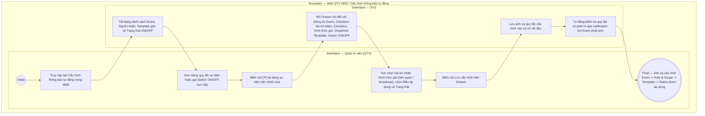

# QTV-W09-US01 - Cấu hình thông báo tự động

## Preconditions
- Quản trị viên (QTV) đã đăng nhập vào hệ thống Web QTV với quyền quản lý cấu hình thông báo.
- Hệ thống đã định nghĩa sẵn danh mục các Sự kiện nghiệp vụ (Events) có kích hoạt phát thông báo in-app tự động.

## Trigger
- QTV truy cập menu **W09 · Quản lý thông báo** và chọn tab **Cấu hình thông báo tự động**.
- Màn hình liên quan: Web QTV — Tab `W09 · Cấu hình thông báo tự động`.

## Main Flow

1. QTV truy cập màn hình **W09 · Quản lý thông báo** $\rightarrow$ chọn tab **Cấu hình thông báo tự động**.
2. SYS nạp và hiển thị **Danh sách cấu hình sự kiện (Datagridview)** bao gồm các sự kiện nghiệp vụ hệ thống:
   - **Sự kiện (Event)**: Mã và tên sự kiện nghiệp vụ (ví dụ: `PAYMENT_CONFIRMED - Thanh toán thành công`, `BOOKING_CREATED - Đặt lịch PT`, `PACKAGE_EXPIRING - Gói tập sắp hết hạn`).
   - **Người nhận (Recipient)**: Danh sách đối tượng nhận đã cấu hình (ví dụ: `Hội viên liên quan`, `HLV phụ trách`, `Toàn bộ hội viên`).
   - **Mẫu áp dụng (Template)**: Tên mẫu thông báo in-app đang gán cho sự kiện (ví dụ: *"Thông báo thanh toán thành công"*).
   - **Kênh gửi**: Kênh phát hành cố định: `IN_APP`.
   - **Trạng thái tự động**: Công tắc Bật/Tắt nhanh (`Toggle Switch: ON / OFF`). Khi bấm chuyển trực tiếp trên bảng, SYS lưu ngay trạng thái mới.
   - **Thao tác**: Nút **`[ ✎ ]`** (Mở Drawer cấu hình chi tiết sự kiện).
3. Khi QTV bấm nút **`[ ✎ ]`** tại một dòng sự kiện:
   - SYS mở Drawer cấu hình chi tiết từ cạnh phải màn hình.
   - SYS hiển thị Mã & Tên sự kiện và Kênh gửi ở trạng thái chỉ đọc (`READONLY`).
   - QTV tick chọn **Vai trò nhận (Role)** (HV, PT, LT, QTV) và tick chọn **Hình thức gửi (Scope / Mode)** (Người liên quan trực tiếp / Broadcast chi nhánh).
   - QTV chọn Mẫu thông báo áp dụng từ dropdown các Template khả dụng (`US02`).
   - QTV gạt công tắc Bật/Tắt (`ON` / `OFF`) và bấm nút Lưu cấu hình trên Drawer.
4. SYS kiểm tra và lưu lại ánh xạ cấu hình (Event $\rightarrow$ Role & Scope $\rightarrow$ Template $\rightarrow$ Enabled/Disabled).
5. Khi một sự kiện nghiệp vụ xảy ra trong hệ thống:
   - Nếu `Trạng thái = ON`: SYS tự động tra cứu và xác định người nhận theo tổ hợp Role & Scope đã cấu hình (phát cho cá nhân liên quan trực tiếp từ context sự kiện hoặc gửi broadcast cho toàn bộ tài khoản active thuộc vai trò tại chi nhánh), nạp dữ liệu vào Template đã chọn, render nội dung thực tế và tự động phát In-app notification.
   - Nếu `Trạng thái = OFF`: SYS bỏ qua, không phát In-app notification.

### Field-level specification — Danh sách cấu hình sự kiện (Datagridview)
| Field / control | Loại UI Control | State | Required | Conditional / dynamic | Source / validation |
| :--- | :--- | :--- | :--- | :--- | :--- |
| Cột Sự kiện (Event) | `Readonly Text` | `READONLY` | required | Không | Mã và tên sự kiện nghiệp vụ hệ thống (ví dụ: `PAYMENT_CONFIRMED - Thanh toán thành công`) |
| Cột Người nhận (Recipient) | `Status Badge` | `READONLY` | required | `DYNAMIC` | Đối tượng nhận thông báo cố định theo nghiệp vụ backend (ví dụ: `Hội viên`, `Hội viên & PT`, `PT`) |
| Cột Mẫu áp dụng (Template) | `Readonly Text` | `READONLY` | required | `DYNAMIC` | Tên mẫu thông báo in-app đang được gán cho sự kiện từ danh mục Template |
| Cột Kênh gửi | `Status Badge` | `READONLY` | required | Không | Kênh phát hành cố định: `IN_APP` |
| Cột Trạng thái tự động | `Toggle Switch` | `USER-INPUT (PREFILL)` | required | `DYNAMIC` | Công tắc bật/tắt trực tiếp tại dòng. Giá trị: `ON` (Cho phép tự động gửi) hoặc `OFF` (Tắt tự động gửi) |
| Nút Sửa cấu hình `[ ✎ ]` | `Icon Button` | `USER-INPUT` | optional | Không | Nút icon cây bút; click mở Drawer cấu hình chi tiết sự kiện từ cạnh phải màn hình |

### Field-level specification — Drawer Cấu hình chi tiết sự kiện
| Field / control | Loại UI Control | State | Required | Conditional / dynamic | Source / validation |
| :--- | :--- | :--- | :--- | :--- | :--- |
| Mã & Tên sự kiện | `Readonly Text` | `READONLY` | required | `DYNAMIC` | Hiển thị mã và tên sự kiện được chọn (ví dụ: `PAYMENT_CONFIRMED - Thanh toán thành công`); chỉ đọc |
| Vai trò nhận (Role) | `Checkbox Group` | `USER-INPUT (PREFILL)` | required | `DYNAMIC` | Danh sách checkbox các vai trò nhận thông báo. Cho phép chọn 1 hoặc nhiều vai trò: • `[ ] Hội viên (HV)` • `[ ] Huấn luyện viên (PT)` • `[ ] Lễ tân (LT)` • `[ ] Quản trị viên / Quản lý (QTV)` *(Bắt buộc tick chọn tối thiểu 1 vai trò)* |
| Hình thức gửi (Scope / Mode) | `Checkbox Group` | `USER-INPUT (PREFILL)` | required | `DYNAMIC` | Danh sách checkbox phạm vi / hình thức phát hành thông báo. Cho phép chọn 1 hoặc cả 2: • `[ ] Người liên quan trực tiếp` (Chỉ gửi cho cá nhân phát sinh sự kiện: HV thanh toán/đặt lịch, PT phụ trách ca, LT tạo giao dịch) • `[ ] Gửi toàn bộ (Broadcast chi nhánh)` (Gửi đồng loạt cho toàn bộ người dùng thuộc các vai trò đã chọn tại chi nhánh) *(Bắt buộc tick chọn tối thiểu 1 hình thức)* |
| Kênh thông báo (Channel) | `Readonly Text` | `READONLY` | required | Không | Hiển thị mặc định `IN_APP`; chỉ đọc |
| Mẫu thông báo áp dụng | `Select Dropdown` | `USER-INPUT (PREFILL)` | required | `DYNAMIC` | Danh sách các Template in-app khả dụng tương ứng với sự kiện từ `US02` |
| Trạng thái kích hoạt | `Switch Toggle` | `USER-INPUT (PREFILL)` | required | `DYNAMIC` | Tùy chọn: `ON` (Bật tự động gửi) hoặc `OFF` (Tắt tự động gửi) |

- **Business rules / logic:**
  - **Cơ chế phân giải Người nhận kết hợp giữa Vai trò & Hình thức gửi:**
    - Khi sự kiện phát sinh và `Trạng thái = ON`, SYS tổ hợp các lựa chọn giữa **Vai trò nhận (Role)** và **Hình thức gửi (Scope / Mode)**:
      - **Nếu chọn `Người liên quan trực tiếp`:** Với mỗi vai trò được tick chọn, SYS trích xuất chính xác User ID tương ứng từ ngữ cảnh sự kiện (ví dụ: `member_id` của người thanh toán/đặt lịch nếu tick HV; `pt_id` của HLV phụ trách ca tập nếu tick PT; `staff_id` của lễ tân lập phiếu nếu tick LT) và chỉ phát thông báo riêng cho cá nhân đó.
      - **Nếu chọn `Gửi toàn bộ (Broadcast chi nhánh)`:** Với mỗi vai trò được tick chọn, SYS quét danh sách tất cả tài khoản đang hoạt động (`ACTIVE`) thuộc vai trò đó trong phạm vi chi nhánh phát sinh sự kiện để gửi In-app notification hàng loạt.
  - **Ví dụ cấu hình mẫu cho các sự kiện tiêu biểu:**
    - *Thanh toán thành công (`PAYMENT_CONFIRMED`):*
      - Vai trò: `[x] Hội viên (HV)`, `[x] Lễ tân (LT)`
      - Hình thức: `[x] Người liên quan trực tiếp`
      *(Kết quả: Gửi biên lai cho Hội viên thanh toán và gửi thông báo xác nhận cho Lễ tân vừa tạo phiếu).*
    - *Đặt / Hủy lịch PT (`BOOKING_CREATED`, `BOOKING_CANCELLED`):*
      - Vai trò: `[x] Hội viên (HV)`, `[x] Huấn luyện viên (PT)`
      - Hình thức: `[x] Người liên quan trực tiếp`
      *(Kết quả: Gửi xác nhận cho Hội viên đặt lịch và HLV được chọn dạy).*
    - *Gói tập sắp hết hạn (`PACKAGE_EXPIRING`):*
      - Vai trò: `[x] Hội viên (HV)`, `[x] Lễ tân (LT)`
      - Hình thức: `[x] Người liên quan trực tiếp` (cho HV sở hữu gói) VÀ `[x] Gửi toàn bộ (Broadcast chi nhánh)` (cho toàn bộ Lễ tân để telesale/tư vấn).
    - *Thông báo bảo trì / Sự kiện chi nhánh (`FACILITY_NOTICE`):*
      - Vai trò: `[x] Hội viên (HV)`, `[x] Huấn luyện viên (PT)`, `[x] Lễ tân (LT)`
      - Hình thức: `[x] Gửi toàn bộ (Broadcast chi nhánh)`

## Exception Flows
- Lỗi kết nối mạng: SYS hiển thị thông báo lỗi lưu cấu hình và giữ nguyên giá trị cũ.

## Activity Diagram — Swimlane
**Trigger:** QTV truy cập Tab Cấu hình thông báo tự động trong W09.

