# QTV-W09-US02 - Quản lý mẫu thông báo in-app

## Preconditions
- Quản trị viên (QTV) đã đăng nhập vào hệ thống Web QTV với quyền quản lý mẫu thông báo.
- Hệ thống đã định nghĩa sẵn danh mục Sự kiện nghiệp vụ kèm theo **Từ điển biến động chuẩn (System Event Schema / Parameter Dictionary)** gắn liền với payload của từng sự kiện từ backend.

## Trigger
- QTV chọn tab **Mẫu thông báo** tại menu `W09 · Quản lý thông báo`.
- Màn hình liên quan: Web QTV — Tab `W09 · Mẫu thông báo` / Modal `Thêm / Sửa Mẫu thông báo`.

## Main Flow

1. QTV truy cập menu **W09 · Quản lý thông báo** $\rightarrow$ chọn tab **Mẫu thông báo**.
2. SYS nạp và hiển thị **Bảng Danh sách Mẫu thông báo in-app (Datagridview)**:
   - **Mã mẫu**: Mã định danh tự sinh duy nhất (ví dụ: `TMP-2026-001`).
   - **Tên mẫu**: Tên gọi quản trị (ví dụ: *"Thông báo thanh toán thành công"*).
   - **Sự kiện áp dụng**: Badge sự kiện liên kết (ví dụ: `PAYMENT_CONFIRMED`, `BOOKING_CREATED`).
   - **Tiêu đề mẫu**: Tiêu đề hiển thị trên app (ví dụ: *"Thanh toán thành công gói tập {{package_name}}"*).
   - **Trạng thái**: Badge `Đang sử dụng` (màu xanh lá) hoặc `Ngừng sử dụng` (màu xám).
   - **Thao tác**: Nút **`[ 👁 Chi tiết ]`** (xem chi tiết và preview theo `US04`), nút **`[ ✎ Sửa ]`** và nút **`[ ⊘ Ngừng dùng ]`**.
3. QTV có thể sử dụng các thao tác trên Header:
   - Nút **`[ + Thêm mẫu thông báo ]`**: Mở modal tạo mẫu thông báo mới.
   - Ô tìm kiếm: Tìm kiếm theo tên mẫu hoặc mã mẫu.
   - Bộ lọc Sự kiện: Dropdown lọc theo sự kiện áp dụng (`Tất cả`, `Thanh toán`, `Đặt lịch`, `Gói sắp hết hạn`...).
4. Khi QTV bấm **`[ + Thêm mẫu thông báo ]`** (hoặc bấm `[ ✎ Sửa ]`):
   - SYS mở modal **Thêm / Sửa Mẫu thông báo**.
   - QTV nhập Tên mẫu thông báo.
   - QTV chọn **Sự kiện áp dụng (Event)** từ dropdown danh mục sự kiện hệ thống.
   - Ngay khi chọn Sự kiện, SYS tự động nạp **Bộ nút biến tiếng Việt ngữ cảnh** tương ứng:
     + Với `PAYMENT_CONFIRMED`: Nạp các nút `[Họ tên hội viên]`, `[Tên gói]`, `[Số tiền]`, `[Thời gian thanh toán]`.
     + Với `BOOKING_CREATED`: Nạp các nút `[Họ tên hội viên]`, `[Tên PT]`, `[Ngày tập]`, `[Khung giờ]`, `[Chi nhánh]`.
   - QTV nhập Tiêu đề thông báo.
   - QTV soạn thảo Nội dung thông báo. Khi cần chèn thông tin động, QTV đặt con trỏ chuột tại vị trí mong muốn trong ô soạn thảo và click vào nút biến tiếng Việt tương ứng. SYS tự động chèn mã khóa kỹ thuật `{{variable_key}}` vào đúng vị trí con trỏ.
   - QTV bấm nút lưu trên modal.
5. SYS kiểm tra tính hợp lệ và lưu lại bản ghi Mẫu thông báo cùng bảng ánh xạ biến động.

### Field-level specification — Bảng Danh sách Mẫu thông báo (Màn hình chính Tab 2)
| Field / control | Loại UI Control | State | Required | Conditional / dynamic | Source / validation |
| :--- | :--- | :--- | :--- | :--- | :--- |
| Nút Thêm mẫu `[ + Thêm mẫu thông báo ]` | `Button (Primary Green)` | `USER-INPUT` | optional | Không | Nút màu xanh lá trên Header; click mở modal Thêm mẫu thông báo mới |
| Ô tìm kiếm mẫu | `Text Input (Search)` | `USER-INPUT` | optional | Không | Ô tìm kiếm theo Tên mẫu hoặc Mã mẫu thông báo |
| Bộ lọc Sự kiện | `Select Dropdown` | `USER-INPUT` | optional | Không | Mặc định `Tất cả`; tùy chọn các sự kiện: `PAYMENT_CONFIRMED`, `BOOKING_CREATED`, `PACKAGE_EXPIRING`... |
| Cột Mã mẫu | `Readonly Text` | `READONLY` | required | Không | Mã định danh duy nhất của mẫu thông báo (ví dụ: `TMP-2026-001`) |
| Cột Tên mẫu | `Readonly Text` | `READONLY` | required | Không | Tên gợi nhớ quản trị của mẫu thông báo (chữ đậm) |
| Cột Sự kiện áp dụng | `Status Badge` | `READONLY` | required | `DYNAMIC` | Tên mã sự kiện nghiệp vụ liên kết (ví dụ: `PAYMENT_CONFIRMED`) |
| Cột Tiêu đề mẫu | `Readonly Text` | `READONLY` | required | Không | Tiêu đề hiển thị của thông báo gửi tới app người dùng |
| Cột Trạng thái | `Status Badge` | `READONLY` | required | `DYNAMIC` | Trạng thái mẫu: `Đang sử dụng` (badge xanh lá) hoặc `Ngừng sử dụng` (badge xám) |
| Nút Xem chi tiết `[ 👁 ]` | `Icon Button` | `USER-INPUT` | optional | Không | Nút icon con mắt trên từng dòng; click mở Drawer Xem chi tiết mẫu và Preview hiển thị trên mobile (`QTV-W09-US04`) |
| Nút Sửa mẫu `[ ✎ ]` | `Icon Button` | `USER-INPUT` | optional | Không | Nút icon cây bút trên từng dòng; click mở modal chỉnh sửa nội dung mẫu |
| Nút Đổi trạng thái `[ ⊘ ]` | `Icon Button` | `USER-INPUT` | optional | Không | Nút icon cấm/ngừng dùng; click chuyển nhanh trạng thái mẫu giữa Đang dùng / Ngừng dùng |

### Field-level specification — Modal Thêm / Sửa Mẫu thông báo
| Field / control | Loại UI Control | State | Required | Conditional / dynamic | Source / validation |
| :--- | :--- | :--- | :--- | :--- | :--- |
| Tên mẫu thông báo | `Text Input` | `USER-INPUT` | required | Không | Nhập tên quản trị gợi nhớ (tối đa 100 ký tự) |
| Sự kiện áp dụng (Event) | `Select Dropdown` | `USER-INPUT (PREFILL)` | required | `TRIGGER` | Chọn Sự kiện nghiệp vụ hệ thống. Khi chọn, kích hoạt tự động nạp bộ nút biến tiếng Việt tương ứng bên dưới |
| Bộ nút biến tiếng Việt ngữ cảnh | `Button Tags Container` | `USER-INPUT` | optional | `DYNAMIC` | Lấy từ **Từ điển biến sự kiện chuẩn (System Event Schema)** của backend gắn liền với Sự kiện được chọn. Mỗi biến gồm `Mã kỹ thuật` (backend) và `Nhãn tiếng Việt` (hiển thị trên nút). Click nút để tự động chèn mã `{{key}}` tại vị trí con trỏ trong ô nội dung |
| Tiêu đề thông báo | `Text Input` | `USER-INPUT` | required | Không | Nhập tiêu đề hiển thị trên thông báo app di động (tối đa 150 ký tự) |
| Nội dung thông báo | `Text Area (Rich Editor)` | `USER-INPUT` | required | Không | Ô soạn thảo văn bản tự do, nhận văn bản và nhận mã chèn tự động khi click các nút biến (tối đa 1.000 ký tự) |

- **Business rules / logic:**
  - **Nguồn gốc và cơ chế quản lý Bộ nút biến động (System Event Variable Schema):**
    - Bộ nút biến động không do người dùng tự gõ hay tự tạo thủ công ngoài giao diện, mà được Hệ thống (SYS) định nghĩa sẵn gắn liền 1-1 với cấu trúc dữ liệu (Event Payload Schema) do backend phát sinh khi sự kiện nghiệp vụ xảy ra.
    - **Từ điển biến chuẩn hệ thống theo từng Sự kiện nghiệp vụ:**
      | Mã sự kiện nghiệp vụ | Nhãn tiếng Việt trên nút bấm | Mã kỹ thuật chèn vào văn bản | Nguồn dữ liệu backend |
      | :--- | :--- | :--- | :--- |
      | `PAYMENT_CONFIRMED` *(Thanh toán thành công)* | `[Họ tên hội viên]` `[Tên gói]` `[Số tiền]` `[Thời gian thanh toán]` `[Chi nhánh]` | `{{member_name}}` `{{package_name}}` `{{amount}}` `{{payment_time}}` `{{branch_name}}` | Module Thu tiền & thanh toán (`W08`) |
      | `BOOKING_CREATED` `BOOKING_CANCELLED` *(Đặt / Hủy lịch PT)* | `[Họ tên hội viên]` `[Tên PT]` `[Ngày tập]` `[Khung giờ]` `[Chi nhánh]` `[Lý do hủy]` | `{{member_name}}` `{{pt_name}}` `{{booking_date}}` `{{time_slot}}` `{{branch_name}}` `{{cancel_reason}}` | Module Lịch tập & PT (`W06`) |
      | `PT_REQUEST_ACCEPTED` *(Phân công PT)* | `[Họ tên hội viên]` `[Tên PT]` `[Tên gói PT]` `[Chi nhánh]` | `{{member_name}}` `{{pt_name}}` `{{package_name}}` `{{branch_name}}` | Module Huấn luyện viên (`W05`) |
      | `PACKAGE_EXPIRING` *(Gói tập sắp hết hạn)* | `[Họ tên hội viên]` `[Tên gói]` `[Ngày hết hạn]` `[Số ngày còn lại]` | `{{member_name}}` `{{package_name}}` `{{expiry_date}}` `{{days_left}}` | Module Đăng ký & gia hạn (`W04`) |
      | `FACILITY_NOTICE` *(Thông báo chi nhánh)* | `[Chi nhánh]` `[Ngày áp dụng]` | `{{branch_name}}` `{{effective_date}}` | Module Chi nhánh (`W11`) |
  - QTV thao tác hoàn toàn bằng nhãn tiếng Việt dễ hiểu trên UI; khi click, SYS tự động chèn mã khóa kỹ thuật tương ứng vào nội dung để backend render dữ liệu khi sự kiện phát sinh.
  - QTV không được tự ý nhập các biến không có trong từ điển vì backend sẽ không có dữ liệu để thay thế.
  - Mẫu đang được gán cho một sự kiện đang Bật (`ON`) tại Tab 1 (`US01`) không được phép xóa cứng, chỉ được phép sửa nội dung hoặc chuyển sang trạng thái Ngừng sử dụng.

## Exception Flows
- Chưa nhập đủ Tiêu đề hoặc Nội dung thông báo: SYS hiển thị thông báo lỗi "Vui lòng nhập đầy đủ Tiêu đề và Nội dung thông báo".

## Activity Diagram — Swimlane
**Trigger:** QTV chọn Thêm mới hoặc Sửa mẫu thông báo trong W09.

```mermaid
flowchart TB
  subgraph B["Boundary — Web QTV W09 / Mẫu thông báo in-app"]
    subgraph L0["Swimlane — Quản trị viên (QTV)"]
      I01(("Initial"))
      A01["Truy cập tab Mẫu thông báo trong W09"]
      A02["Xem danh sách mẫu hoặc lọc theo Sự kiện/tìm kiếm"]
      A03{"Chọn hành động"}
      A04["Bấm [ + Thêm mẫu thông báo ] hoặc bấm [ ✎ Sửa ]"]
      A05["Chọn Sự kiện áp dụng để kích hoạt nạp bộ nút biến tiếng Việt"]
      A06["Nhập Tiêu đề, Nội dung và click các nút biến để chèn thông tin động"]
      A07["Bấm nút Lưu trên modal"]
      F01((("Final — Mẫu thông báo được lưu thành công")))

      I01 --> A01
      A01 --> A02
      A02 --> A03
      A03 -->|Tạo mới hoặc Sửa| A04
      A04 --> A05
      A05 --> A06
      A06 --> A07
    end

    subgraph L1["Swimlane — SYS"]
      S01["Tải danh sách các Template mẫu thông báo in-app"]
      S02["Mở modal Thêm/Sửa mẫu thông báo"]
      S03["Nạp bộ nút biến tiếng Việt tương ứng theo ngữ cảnh sự kiện"]
      S04["Tự động chèn mã khóa {{variable_key}} tại vị trí con trỏ khi click nút biến"]
      S05["Lưu bản ghi Template và ánh xạ biến động vào cơ sở dữ liệu"]

      A01 --> S01 --> A02
      A04 --> S02 --> A05
      A05 --> S03 --> A06
      A06 --> S04 --> A06
      A07 --> S05 --> F01
    end
  end
```

