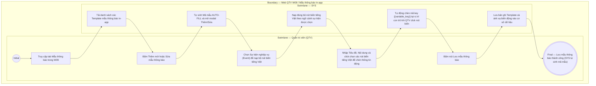

# QTV-W09-US02 - Quản lý mẫu thông báo in-app

## Preconditions
- QTV đã đăng nhập vào hệ thống Web QTV với quyền quản lý mẫu thông báo.

## Trigger
- QTV chọn tab **Mẫu thông báo** tại menu `W09 · Quản lý thông báo`.
- Màn hình liên quan: Web QTV — Tab `W09 · Mẫu thông báo` / Modal `Thêm/Sửa Mẫu thông báo`.

## Main Flow

1. QTV truy cập tab **Mẫu thông báo** trong menu `W09 · Quản lý thông báo`.
2. Hệ thống hiển thị danh sách các Mẫu thông báo in-app (Template) hiện có: Mã mẫu tự sinh, Tên mẫu, Sự kiện áp dụng, Tiêu đề mẫu, Nội dung xem trước và Trạng thái (`Đang sử dụng` / `Ngừng sử dụng`).
3. QTV thực hiện thao tác CRUD mẫu thông báo:
   - **Tạo mẫu mới:** QTV bấm `[ + Thêm mẫu thông báo ]`.
   - **Chỉnh sửa mẫu:** QTV bấm biểu tượng `[ Sửa ]` tại dòng mẫu cần cập nhật.
4. Hệ thống mở modal `Thêm / Sửa Mẫu thông báo`:
   - **Mã mẫu (Template Code):** `AUTO-FILL` (Hệ thống tự động sinh mã duy nhất, ví dụ: `TMP-2026-001`, QTV không cần và không được nhập thủ công).
   - **Tên mẫu thông báo:** QTV nhập tên gợi nhớ (ví dụ: *Mẫu thông báo thanh toán thành công*).
   - **Sự kiện áp dụng (Event):** QTV chọn Sự kiện nghiệp vụ tương ứng (ví dụ: `PAYMENT_CONFIRMED`, `BOOKING_CREATED`, `PT_REQUEST_ACCEPTED`).
   - **Bộ nút biến động tiếng Việt theo ngữ cảnh (Context-Aware Variable Buttons):** Ngay khi chọn Sự kiện, Hệ thống tự động nạp các nút bấm tiếng Việt đại diện cho biến dữ liệu khả dụng của sự kiện đó:
     - Với `PAYMENT_CONFIRMED`: Hiển thị các nút `[Họ tên hội viên]`, `[Tên gói]`, `[Số tiền]`, `[Thời gian thanh toán]`.
     - Với `BOOKING_CREATED`: Hiển thị các nút `[Họ tên hội viên]`, `[Tên PT]`, `[Ngày tập]`, `[Khung giờ]`, `[Chi nhánh]`. *(Không hiển thị nút [Số tiền]).*
   - **Tiêu đề thông báo:** QTV nhập tiêu đề hiển thị trên App.
   - **Nội dung thông báo:** QTV nhập văn bản tự do. Khi cần chèn thông tin động, QTV chỉ cần đặt con trỏ tại vị trí mong muốn trong ô Editor và click vào nút biến tiếng Việt tương ứng.
5. Khi QTV click nút tiếng Việt (ví dụ `[Họ tên hội viên]`), Hệ thống tự động chèn mã khóa tương ứng (ví dụ `{{member_name}}`) vào vị trí con trỏ trong ô Editor và hiển thị nhãn tiếng Việt trực quan cho QTV. QTV không cần phải tự nhớ hay nhập thủ công cú pháp `{{...}}`.
6. QTV bấm `[ Lưu mẫu thông báo ]`.
7. Hệ thống lưu lại Mẫu thông báo cùng bảng ánh xạ biến động theo đúng sự kiện.

### Field-level specification — Modal Thêm/Sửa Mẫu thông báo
| Field / control | State | Required | Conditional / dynamic | Source / validation |
|---|---|---|---|---|
| Mã mẫu (Template Code) | `AUTO-FILL` | required | `DYNAMIC`: Hệ thống tự động sinh mã duy nhất (ví dụ `TMP-2026-001`) | System auto-generator |
| Tên mẫu thông báo | `USER-INPUT` | required | `DYNAMIC`: nhập tên quản trị | Văn bản tự do |
| Sự kiện áp dụng (Event) | `USER-INPUT` + `PREFILL` | required | `DYNAMIC`: chọn sự kiện nghiệp vụ để nạp bộ nút biến tương ứng | Danh mục Event hệ thống |
| Tiêu đề thông báo | `USER-INPUT` | required | `DYNAMIC`: nhập tiêu đề hiển thị | Văn bản tự do |
| Ô nhập Nội dung thông báo | `USER-INPUT` | required | `DYNAMIC`: ô soạn thảo văn bản nhận văn bản tự do và nhận mã chèn tự động khi click nút biến | Rich Editor |
| Bộ nút biến tiếng Việt ngữ cảnh | `USER-INPUT` | optional | `DYNAMIC`: hiển thị các nút biến theo sự kiện được chọn (click nút để chèn mã `{{key}}` tại vị trí con trỏ) | Event Variable Catalog |
| Nút `[ Lưu mẫu thông báo ]` | `USER-INPUT` | required | `CONDITIONAL`: bấm để lưu template | Thao tác lưu form |

- **Business rules / logic:**
  - QTV thao tác hoàn toàn bằng nhãn tiếng Việt dễ hiểu (`[Họ tên hội viên]`, `[Tên gói]`, `[Số tiền]`), Hệ thống tự động chuyển đổi thành mã khóa kỹ thuật (`{{member_name}}`, `{{package_name}}`, `{{amount}}`) sau hậu trường.
  - Mỗi Sự kiện nghiệp vụ có một tập hợp biến khả dụng riêng biệt. Hệ thống chỉ hiển thị đúng các nút biến có trong dữ liệu của sự kiện đó.
  - Mẫu đang được gán cho một loại thông báo active (`US01`) sẽ không được xóa, chỉ được phép sửa nội dung hoặc chuyển sang trạng thái Ngừng sử dụng.

## Alternate Flows

### AF-01 — Ngừng sử dụng mẫu thông báo
1. QTV chuyển trạng thái mẫu sang `Ngừng sử dụng`.
2. SYS ghi nhận trạng thái và cảnh báo nếu mẫu đang được áp dụng tại `US01`.

## Exception Flows

- Thiếu thông tin Tiêu đề hoặc Nội dung: SYS thông báo "Vui lòng nhập đầy đủ Tiêu đề và Nội dung thông báo".

## Activity Diagram — Swimlane
**Trigger:** QTV chọn Thêm mới hoặc Sửa mẫu thông báo trong W09.

