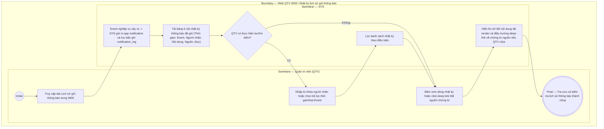

# QTV-W09-US03 - Tra cứu lịch sử gửi thông báo

## Preconditions
- QTV đã đăng nhập vào hệ thống Web QTV với quyền tra cứu lịch sử thông báo.
- Hệ thống đã tự động ghi nhận nhật ký (notification log) khi các sự kiện nghiệp vụ phát sinh thông báo in-app.

## Trigger
- QTV chọn tab **Lịch sử gửi thông báo** tại menu `W09 · Quản lý thông báo`.
- Màn hình liên quan: Web QTV — Tab `W09 · Lịch sử gửi thông báo`.

## Main Flow

1. Khi các sự kiện nghiệp vụ xảy ra (Thanh toán thành công, Đặt lịch PT, Hủy lịch, Phân công PT...), Hệ thống (SYS) tự động gửi in-app notification và lưu bản ghi nhật ký thông báo (`notification_log`).
2. QTV truy cập tab **Lịch sử gửi thông báo** trong menu `W09 · Quản lý thông báo`.
3. Hệ thống tải và hiển thị bảng danh sách nhật ký lịch sử thông báo in-app bao gồm 6 cột thông tin chính:
   - **Thời gian:** Ngày và giờ phát thông báo (ví dụ: `13/09 10:30`).
   - **Event:** Mã sự kiện phát sinh (ví dụ: `PAYMENT_CONFIRMED`, `BOOKING_CREATED`).
   - **Người nhận:** Mã và Họ tên tài khoản nhận thông báo (ví dụ: `HV001 - Nguyễn Văn A`).
   - **Nội dung:** Tiêu đề & Nội dung thực tế người nhận đã nhận được (sau khi SYS đã render thay thế các biến động thành dữ liệu thực).
   - **Nguồn:** Mã chứng từ / Event nguồn tham chiếu (ví dụ: `PAY001`, `BK001`), hỗ trợ bấm deep-link để điều hướng đến chi tiết giao dịch hoặc lịch tập tương ứng.
   - **Đọc:** Trạng thái đọc thông báo (`Chưa đọc` / `Đã đọc`).
4. QTV sử dụng các bộ lọc để kiểm tra dữ liệu:
   - Lọc theo khoảng thời gian (Từ ngày - Đến ngày).
   - Lọc theo Mã Event (`PAYMENT_CONFIRMED`, `BOOKING_CREATED`, ...).
   - Tìm kiếm theo Tên / SĐT người nhận.
5. QTV bấm vào một dòng nhật ký hoặc mã nguồn chứng từ để xem chi tiết thông báo đầy đủ đã phát và điều hướng deep-link nếu cần.
6. **Mục tiêu nghiệp vụ:**
   - Giúp QTV **tra cứu và kiểm tra lịch sử thông báo** để trả lời chính xác 6 câu hỏi:
     1. Hệ thống đã gửi thông báo gì?
     2. Gửi lúc nào?
     3. Gửi cho ai?
     4. Do event nào phát sinh?
     5. Nội dung thực tế mà người đó nhận là gì?
     6. Người nhận đã đọc hay chưa?
   - Màn hình lịch sử phục vụ mục đích **Tra cứu và Kiểm tra nhật ký (Read-only)**. QTV không có quyền chỉnh sửa, thu hồi hoặc xóa log thông báo đã gửi.

### Field-level specification — Màn hình Tra cứu lịch sử gửi thông báo
| Field / control | State | Required | Conditional / dynamic | Source / validation |
|---|---|---|---|---|
| Ô tìm kiếm người nhận | `USER-INPUT` | optional | `DYNAMIC`: tìm theo tên hoặc SĐT tài khoản nhận | Văn bản tự do |
| Bộ lọc khoảng thời gian | `USER-INPUT` | optional | `DYNAMIC`: chọn Từ ngày - Đến ngày | Date range picker |
| Bộ lọc loại Event | `USER-INPUT` | optional | `DYNAMIC`: lọc theo event code | Danh mục loại thông báo |
| Bảng nhật ký lịch sử gửi | `READONLY` | required | `DYNAMIC`: 6 cột (Thời gian, Event, Người nhận, Nội dung, Nguồn, Đọc) | Database notification_log |
| Deep-link Mã Nguồn chứng từ | `USER-INPUT` | optional | `DYNAMIC`: bấm mã nguồn (ví dụ `PAY001`, `BK001`) để điều hướng về giao dịch/booking tương ứng | Deep-link navigation |

## Alternate Flows

### AF-01 — Không có nhật ký trong khoảng thời gian lọc
1. QTV chọn khoảng thời gian không có thông báo nào được gửi.
2. SYS hiển thị trạng thái bảng rỗng "Không tìm thấy lịch sử gửi thông báo nào".

## Exception Flows

- Lỗi kết nối mạng: SYS hiển thị thông báo lỗi tra cứu dữ liệu.

## Activity Diagram — Swimlane
**Trigger:** QTV truy cập tab Lịch sử gửi thông báo trong W09.

