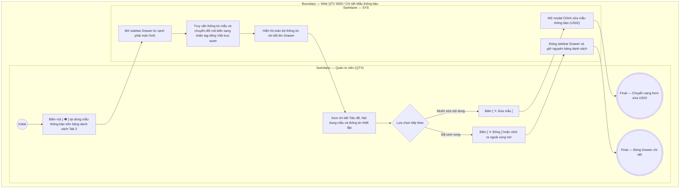

# QTV-W09-US04 - Xem chi tiết mẫu thông báo

## Preconditions
- Quản trị viên (QTV) đã đăng nhập vào hệ thống Web QTV với quyền quản lý mẫu thông báo.
- Mẫu thông báo in-app đã tồn tại trên hệ thống và đang hiển thị trên Bảng danh sách mẫu thông báo (Tab 2).

## Trigger
- QTV bấm nút **Xem chi tiết `[ 👁 ]`** tại một dòng mẫu thông báo trên Bảng danh sách mẫu thông báo của Tab 2 (W09).
- Màn hình liên quan: Web QTV — Tab `W09 · Mẫu thông báo`, sidebar Drawer **Chi tiết Mẫu thông báo in-app**.

## Main Flow

1. QTV truy cập Tab **Mẫu thông báo** tại menu `W09 · Quản lý thông báo`.
2. QTV bấm nút **`[ 👁 ]`** tại dòng mẫu thông báo cần xem chi tiết.
3. SYS mở sidebar Drawer **Chi tiết Mẫu thông báo in-app** trượt từ cạnh phải màn hình.
4. SYS truy vấn và hiển thị đầy đủ thông tin mẫu thông báo được chọn:
   - **Mã mẫu & Tên mẫu:** Mã định danh (`TMP-2026-001`) và Tên quản trị gợi nhớ.
   - **Sự kiện áp dụng:** Badge sự kiện nghiệp vụ liên kết (ví dụ: `PAYMENT_CONFIRMED`).
   - **Trạng thái sử dụng:** Badge `Đang sử dụng` (xanh lá) hoặc `Ngừng sử dụng` (xám).
   - **Kênh phát hành:** Kênh cố định `IN_APP`.
   - **Ngày tạo & Người tạo:** Ngày giờ tạo mẫu và tên tài khoản thực hiện.
   - **Tiêu đề thông báo:** Tiêu đề hiển thị trên ứng dụng di động của người nhận.
   - **Nội dung thông báo:** Toàn văn nội dung mẫu; các biến động được hiển thị nổi bật dưới dạng thẻ tag tiếng Việt thân thiện (ví dụ: `[Họ tên hội viên]`, `[Số tiền]`, `[Tên gói]`).
5. QTV xem toàn bộ nội dung văn bản thông báo.
6. QTV có thể bấm nút **`[ ✎ Sửa mẫu ]`** để mở modal chỉnh sửa nội dung hoặc bấm nút **`[ ✕ Đóng ]`** (hoặc click vùng mờ bên ngoài) để đóng Drawer.

### Field-level specification — Drawer Chi tiết Mẫu thông báo in-app
| Field / control | Loại UI Control | State | Required | Conditional / dynamic | Source / validation |
| :--- | :--- | :--- | :--- | :--- | :--- |
| Mã mẫu | `Readonly Text` | `READONLY` | required | Không | Mã định danh duy nhất của mẫu thông báo do backend tự sinh (ví dụ: `TMP-2026-001`); hiển thị nổi bật trên header |
| Tên mẫu thông báo | `Readonly Text` | `READONLY` | required | Không | Tên quản trị gợi nhớ của mẫu thông báo (ví dụ: *"Thông báo thanh toán thành công"*); in đậm |
| Sự kiện áp dụng | `Status Badge` | `READONLY` | required | `DYNAMIC` | Tên mã sự kiện nghiệp vụ liên kết (ví dụ: `PAYMENT_CONFIRMED`, `BOOKING_CREATED`) |
| Trạng thái sử dụng | `Status Badge` | `READONLY` | required | `DYNAMIC` | Badge màu trực quan: `Đang sử dụng` (badge xanh lá) hoặc `Ngừng sử dụng` (badge xám) |
| Kênh thông báo | `Status Badge` | `READONLY` | required | Không | Kênh phát hành cố định: `IN_APP` |
| Ngày tạo & Người tạo | `Readonly Text / Date` | `READONLY` | required | Không | Định dạng: `DD/MM/YYYY HH:mm · {creator_name}` (ví dụ: "10/09/2026 14:30 · QTV Nguyễn Văn Admin") |
| Tiêu đề thông báo | `Readonly Text` | `READONLY` | required | Không | Tiêu đề thông báo in-app đầy đủ gửi tới người dùng |
| Nội dung thông báo | `Readonly Text Block` | `READONLY` | required | Không | Toàn bộ văn bản thông báo chi tiết; các trường biến động được bọc trong thẻ tag nổi bật (ví dụ: `Chào [Họ tên hội viên], bạn đã thanh toán thành công [Số tiền] cho gói [Tên gói]...`) giúp đọc liền mạch và dễ hiểu |

- **Business rules / logic:**
  - Toàn bộ các trường dữ liệu trên Drawer là chỉ đọc (`READONLY`), phục vụ tra cứu chi tiết nội dung mẫu.
  - Các mã kỹ thuật `{{key}}` được tự động chuyển đổi sang dạng thẻ tag tiếng Việt thân thiện (`[Họ tên hội viên]`, `[Số tiền]`) để quản lý phòng Gym đọc hiểu trực quan mà không bị vướng mã code.
  - Từ Drawer Chi tiết, QTV có thể bấm nút thao tác nhanh **`[ ✎ Sửa mẫu ]`** để chuyển thẳng sang modal Chỉnh sửa nội dung (`US02`).

## Alternate Flows

### AF-01 - Chuyển sang chỉnh sửa mẫu từ Drawer
1. Tại Drawer Chi tiết mẫu, QTV bấm nút **`[ ✎ Sửa mẫu ]`**.
2. SYS đóng Drawer Chi tiết và mở modal **Thêm / Sửa Mẫu thông báo** (`US02`) với toàn bộ dữ liệu mẫu hiện tại để QTV thực hiện chỉnh sửa.

### AF-02 - Đóng Drawer Chi tiết
1. QTV bấm nút **`[ ✕ Đóng ]`** hoặc click chuột vào vùng nền mờ bên ngoài Drawer.
2. SYS đóng Drawer và giữ nguyên vị trí dòng dữ liệu trên bảng danh sách của Tab 2.

## Exception Flows
- Không tải được chi tiết mẫu do lỗi kết nối: SYS hiển thị thông báo "Không thể nạp dữ liệu chi tiết mẫu thông báo. Vui lòng thử lại".

## Activity Diagram — Swimlane
**Trigger:** QTV bấm nút Xem chi tiết [ 👁 ] tại một dòng mẫu thông báo trong Tab 2 (W09).

