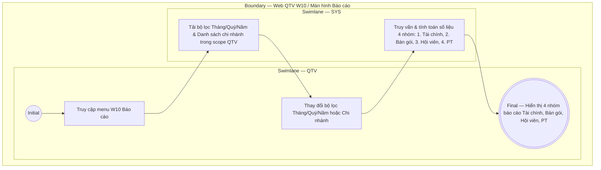

# QTV-W10-US01 - Xem báo cáo tổng hợp

## Preconditions
- QTV đã đăng nhập vào Web QTV, có quyền xem báo cáo báo cáo quản trị vận hành và tài chính.
- Hệ thống đã có dữ liệu giao dịch thu tiền, đăng ký gói, lượt check-in và lịch học PT.

## Trigger
- QTV chọn menu **W10 · Báo cáo** trên thanh điều hướng chính.
- Màn hình liên quan: Web QTV — W10 Báo cáo.

## Main Flow

1. QTV truy cập menu **W10 Báo cáo**.
2. SYS hiển thị bộ lọc thời gian và phạm vi chi nhánh phía trên cùng:
   - **Bộ lọc thời gian**: Chọn theo `[Tháng]`, `[Quý]`, hoặc `[Năm]`.
   - **Bộ lọc chi nhánh**: Combobox `[Chi nhánh ▼]` (cho phép chọn từng chi nhánh cụ thể trong phạm vi phân quyền hoặc `Tất cả chi nhánh`).
3. SYS tổng hợp và hiển thị dữ liệu báo cáo phân chia thành 4 nhóm chỉ số quản trị chính:

   ### 1. TÀI CHÍNH
   - **Tổng tiền đã thu**: Tổng số tiền thực thu 100% qua tất cả các giao dịch thanh toán trong kỳ chọn.
   - **Số giao dịch thanh toán**: Tổng số lượt giao dịch payment đã thu tiền thành công.
   - **Tiền mặt**: Tổng số tiền thu bằng phương thức tiền mặt.
   - **Chuyển khoản**: Tổng số tiền thu bằng phương thức chuyển khoản ngân hàng / QR.

   ### 2. BÁN GÓI
   - **Tổng số gói đã bán**: Số lượng các gói tập (Gym, PT, Combo) đã được đăng ký bán ra trong kỳ.
   - **Doanh số theo loại gói**: Bảng / Biểu đồ doanh số chi tiết theo từng loại gói:
     - Gói Gym
     - Gói PT
     - Gói Combo (Gym + PT)
   - **Gói bán chạy**: Danh sách xếp hạng (Top) các gói tập có số lượng đăng ký bán ra cao nhất.

   ### 3. HỘI VIÊN
   - **Hội viên mới**: Số lượng hội viên mới đăng ký tài khoản / đăng ký gói lần đầu trong kỳ.
   - **Hội viên đang hoạt động**: Số lượng hội viên hiện tại đang có ít nhất 1 gói tập còn hiệu lực (`ACTIVE`).
   - **Số lượt check-in**: Tổng số lượt hội viên ra / vào phòng tập được ghi nhận qua hệ thống check-in trong kỳ.

   ### 4. PT (HUẤN LUYỆN VIÊN)
   - **Tổng buổi PT hoàn thành**: Tổng số buổi học PT đã diễn ra và được đối soát xác nhận hoàn thành (2 bên).
   - **Buổi PT theo từng PT**: Bảng thống kê chi tiết số buổi dạy hoàn thành của từng Huấn luyện viên.
   - **Số hội viên đang có PT**: Tổng số hội viên đang có gói PT hoặc Combo active và đang được phân công HLV phụ trách.

4. QTV thay đổi các bộ lọc `[Tháng]`, `[Quý]`, `[Năm]` hoặc `[Chi nhánh ▼]`.
5. SYS tự động truy vấn lại cơ sở dữ liệu và làm mới chỉ số hiển thị trên cả 4 nhóm báo cáo.

### Field-level specification — Màn hình Báo cáo W10

| Field / control | State | Required | Conditional / dynamic | Source / validation |
|---|---|---|---|---|
| Bộ lọc kỳ báo cáo | `USER-INPUT` | required | `DYNAMIC`: Chọn xem theo `Tháng`, `Quý` hoặc `Năm` | Date period selector |
| Bộ lọc chi nhánh | `USER-INPUT` | optional | `DYNAMIC`: Danh sách chi nhánh thuộc phạm vi phân quyền của QTV; mặc định `Tất cả chi nhánh` | Branch catalog scope |
| Chỉ số Tài chính | `AUTO-FILL` | READONLY | `DYNAMIC`: Tổng tiền thực thu, số giao dịch, cơ cấu Tiền mặt & Chuyển khoản | Payment ledger |
| Chỉ số Bán gói | `AUTO-FILL` | READONLY | `DYNAMIC`: Tổng gói bán, doanh số Gym/PT/Combo, Top gói bán chạy | Registration ledger |
| Chỉ số Hội viên | `AUTO-FILL` | READONLY | `DYNAMIC`: Hội viên mới, Hội viên đang hoạt động, Tổng lượt check-in | Member & Check-in ledger |
| Chỉ số PT | `AUTO-FILL` | READONLY | `DYNAMIC`: Tổng buổi PT hoàn thành, Buổi dạy từng PT, Số hội viên có PT | PT session & assignment ledger |

- **Business rules / logic:**
  - Báo cáo tổng hợp W10 cung cấp bức tranh quản trị toàn diện 360 độ về Kinh doanh và Vận hành cho QTV.
  - Số liệu tài chính và bán gói phản ánh chính xác dòng tiền thực thu 100% (không có công nợ hay giảm giá).

## Activity Diagram — Swimlane
**Trigger:** QTV truy cập menu W10 Báo cáo.

