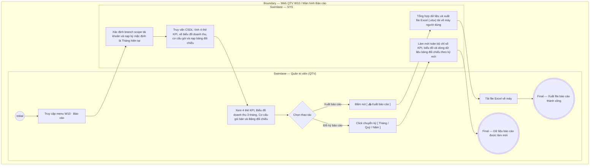

# QTV-W10-US01 - Xem báo cáo tổng hợp

## Preconditions
- Quản trị viên (QTV) đã đăng nhập vào Web QTV và được cấp quyền xem báo cáo quản trị vận hành và tài chính.
- Hệ thống đã có dữ liệu giao dịch thu tiền, đăng ký gói tập, buổi tập PT và lượt check-in ra vào trong phạm vi phân quyền chi nhánh (branch scope).

## Trigger
- QTV chọn menu **W10 · Báo cáo** trên thanh điều hướng chính.
- Màn hình liên quan: Web QTV — Màn hình `W10 · Báo cáo`.

## Main Flow

1. QTV truy cập menu **W10 · Báo cáo**.
2. SYS xác định phạm vi chi nhánh (branch scope) của tài khoản QTV và nạp kỳ báo cáo mặc định là **Tháng hiện tại (`Tháng`)**.
3. SYS truy vấn dữ liệu, tổng hợp và hiển thị giao diện báo cáo quản trị toàn diện gồm 3 tầng nghiệp vụ:
   - **Tầng 1: Cụm thanh điều khiển & Bộ lọc thời gian đa chiều:**
     + Bộ nút chọn kỳ: `[ Tháng ]` (đang kích hoạt), `[ Quý ]`, `[ Năm ]`.
     + Dropdown chọn Năm (`2025`, `2026`, `2027`) và Dropdown chọn Tháng (`Tháng 1` .. `12`) hoặc Quý (`Quý 1` .. `4`).
     + Badge thông tin phạm vi chi nhánh và khoảng thời gian: `Tiền thực thu · {Tên chi nhánh} ({Từ ngày} - {Đến ngày})`.
     + Nút thao tác **`[ 📥 Xuất báo cáo ]`** màu xanh lá.
   - **Tầng 2: Hàng 4 Thẻ KPI Chỉ số tổng hợp (Stat Cards):**
     + Thẻ 1 — `Tiền thực thu`: Tổng số tiền thực thu 100% trong kỳ (ví dụ: `12.800 đ`), ghi chú ngày chốt dữ liệu.
     + Thẻ 2 — `Giá trị gói đã bán`: Tổng giá trị gói tập niêm yết bán ra trong kỳ (ví dụ: `17.314.000 đ`).
     + Thẻ 3 — `Gói đã bán`: Tổng số lượng gói tập bán ra trong kỳ (ví dụ: `6 gói`).
     + Thẻ 4 — `Buổi PT đã dạy`: Tổng số buổi học PT hợp lệ đã hoàn thành và ghi nhận kết quả (ví dụ: `5 buổi`).
   - **Tầng 3: Hệ thống 3 Tab Phân Tích Chuyên Sâu (`dxTabs`):**
     + **Tab 1: Doanh thu & Dòng tiền:**
       * *Biểu đồ 1.1:* `Spline Area Chart` xu hướng tiền thực thu theo ngày/tháng với vùng phủ màu xanh rừng gradient mềm mại.
       * *Biểu đồ 1.2:* `Bar Chart` so sánh doanh thu 3 kỳ gần nhất (kỳ hiện tại highlight xanh thương hiệu).
       * *Bảng tổng hợp:* DataGrid gom dòng theo mốc thời gian, số gói bán, phân rã dịch vụ và cột Thực thu 100%.
     + **Tab 2: Cơ cấu Gói & Dịch vụ:**
       * *Biểu đồ 2.1:* `Doughnut Chart` (vành khăn) tỷ trọng gói tập bán chạy với tâm vòng tròn hiển thị tổng số gói bán ra.
       * *Biểu đồ 2.2:* `Stacked Bar Chart` phân rã sản lượng 3 nhóm dịch vụ (Gym vs PT vs Combo) theo từng mốc thời gian.
       * *Bảng chi tiết:* DataGrid thống kê từng gói: Tên gói, phân loại, số lượng bán, thanh tiến trình % và doanh thu thu về.
     + **Tab 3: Hiệu suất Đào tạo PT:**
       * *Biểu đồ 3.1:* `Bar Chart` bảng xếp hạng số buổi dạy hoàn thành của từng Huấn luyện viên.
       * *Cụm chỉ số mini:* Tổng buổi PT, số HLV tham gia dạy, số học viên phục vụ, năng suất trung bình.
       * *Bảng chi tiết:* DataGrid danh sách HLV: Avatar + Mã/Tên PT, số buổi dạy hoàn thành, học viên phục vụ, tỷ trọng đóng góp %.
4. QTV có thể click chuyển đổi giữa 3 Tab hoặc thay đổi bộ lọc Năm/Tháng/Quý.
5. SYS tự động truy vấn lại cơ sở dữ liệu và làm mới đồng bộ toàn bộ chỉ số, biểu đồ và bảng dữ liệu tương ứng.
6. Khi QTV bấm nút **`[ 📥 Xuất báo cáo ]`**, SYS tổng hợp toàn bộ dữ liệu chỉ số KPI, dòng tiền, cơ cấu gói và hiệu suất PT thành file bảng tính Excel (`.xlsx`) đa sheet tải về máy người dùng.

### Field-level specification — Màn hình Báo cáo tổng hợp (W10)
| Field / control | Loại UI Control | State | Required | Conditional / dynamic | Source / validation |
| :--- | :--- | :--- | :--- | :--- | :--- |
| Bộ nút chọn kỳ báo cáo | `Segmented Buttons` | `USER-INPUT (PREFILL)` | required | `TRIGGER` | `[ Tháng ]` (mặc định), `[ Quý ]`, `[ Năm ]`. Kích hoạt đổi chế độ xem kỳ |
| Ô chọn Năm | `dxSelectBox` | `USER-INPUT (PREFILL)` | required | `DYNAMIC` | Danh sách năm: `2025`, `2026`, `2027` |
| Ô chọn Tháng / Quý | `dxSelectBox` | `USER-INPUT (PREFILL)` | conditional | `CONDITIONAL` | **Hiện khi**: kỳ là Tháng hoặc Quý; **Ẩn khi**: kỳ là Năm. Lựa chọn tháng 1-12 hoặc quý 1-4 |
| Nút Xuất báo cáo `[ 📥 Xuất báo cáo ]` | `Action Button` | `USER-INPUT` | optional | `Không` | Xuất toàn bộ 4 sheet báo cáo sang file Excel (.xlsx) |
| Thẻ KPI Tiền thực thu | `Metric Card` | `READONLY` | required | `DYNAMIC` | Tổng tiền thực thu 100% trong kỳ |
| Thẻ KPI Giá trị gói đã bán | `Metric Card` | `READONLY` | required | `DYNAMIC` | Tổng giá trị hợp đồng niêm yết bán ra |
| Thẻ KPI Gói đã bán | `Metric Card` | `READONLY` | required | `DYNAMIC` | Tổng số lượng gói tập bán ra trong kỳ |
| Thẻ KPI Buổi PT đã dạy | `Metric Card` | `READONLY` | required | `DYNAMIC` | Tổng số buổi PT hoàn thành hợp lệ |
| Thanh điều hướng 3 Tab | `dxTabs` | `USER-INPUT` | required | `TRIGGER` | 3 tab: `Doanh thu & Dòng tiền`, `Cơ cấu Gói & Dịch vụ`, `Hiệu suất Đào tạo PT` |
| Biểu đồ Xu hướng thực thu | `dxChart (splineArea)` | `READONLY` | required | `DYNAMIC` | Đường cong diện tích thực thu theo ngày/tháng trong kỳ |
| Biểu đồ So sánh 3 kỳ | `dxChart (bar)` | `READONLY` | required | `DYNAMIC` | Biểu đồ cột so sánh thực thu 3 kỳ gần nhất |
| Biểu đồ Cơ cấu gói bán chạy | `dxPieChart (doughnut)` | `READONLY` | required | `DYNAMIC` | Biểu đồ vành khăn tỷ trọng gói bán kèm số lượng tại tâm tròn |
| Biểu đồ Phân rã dịch vụ | `dxChart (stackedBar)` | `READONLY` | required | `DYNAMIC` | Cột chồng 3 nhóm dịch vụ Gym, PT, Combo theo thời gian |
| Biểu đồ Xếp hạng HLV PT | `dxChart (bar)` | `READONLY` | required | `DYNAMIC` | Xếp hạng số buổi dạy hoàn thành theo từng HLV |
| Bảng tổng hợp dòng tiền | `dxDataGrid` | `READONLY` | required | `DYNAMIC` | Gom dòng theo mốc: Ngày/Tháng, Số gói, Phân rã, Thực thu |
| Bảng chi tiết cơ cấu gói | `dxDataGrid` | `READONLY` | required | `DYNAMIC` | Tên gói, Phân loại, Số lượng, Tỷ trọng %, Doanh thu |
| Bảng chi tiết hiệu suất HLV | `dxDataGrid` | `READONLY` | required | `DYNAMIC` | HLV, Số buổi hoàn thành, Học viên phục vụ, Tỷ trọng đóng góp |

- **Business rules / logic:**
  - **1. Cơ chế xác định khoảng thời gian (Từ ? $\rightarrow$ Đến ?):**
    + Khi chọn `[ Tháng ]`: Khoảng thời gian tính từ ngày 01 đầu tháng đến ngày cuối tháng (hoặc đến ngày hiện tại nếu tháng đang diễn ra chưa kết thúc, ví dụ ngày hiện tại là 07/09/2026 thì kỳ tính toán là `01/09/2026 → 07/09/2026`).
    + Khi chọn `[ Quý ]`: Tròn quý hiện tại (ví dụ Quý 3 tính từ `01/07/2026 → 30/09/2026`).
    + Khi chọn `[ Năm ]`: Tròn năm dương lịch hiện tại (từ `01/01/2026 → 31/12/2026`).
  - **2. Cơ chế gom nhóm dữ liệu theo cấp độ kỳ (Data Aggregation by Period):**
    + Khi xem theo `[ Tháng ]`: Bảng hiển thị chi tiết theo **từng Ngày** có phát sinh doanh thu trong tháng đó.
    + Khi xem theo `[ Quý ]` hoặc `[ Năm ]`: Bảng tự động gom dòng theo **từng Tháng** (ví dụ Quý 3 gom thành Tháng 7, Tháng 8, Tháng 9; Năm gom từ Tháng 1 đến Tháng 12) để tránh tình trạng bảng bị trải dài 365 dòng, giúp Quản lý dễ dàng đối chiếu và so sánh tốc độ tăng trưởng kinh doanh giữa các tháng.
  - **3. Giải pháp gom dòng cho 1 ngày bán nhiều loại gói (Mỗi mốc thời gian 1 dòng duy nhất):**
    + Hệ thống không xé lẻ 1 ngày thành nhiều dòng lặp lại cho từng gói hoặc từng dịch vụ.
    + Gom toàn bộ giao dịch của ngày thành **đúng 1 dòng duy nhất / ngày** (hoặc 1 dòng / tháng khi xem Quý/Năm):
      * `Mốc thời gian`: `07/09/2026`
      * `Tổng số gói bán`: `4 gói`
      * `Phân rã theo dịch vụ`: `2 Gói Gym · 1 Buổi PT · 1 Combo`
      * `Doanh thu thực thu`: `11.250.000 đ`
  - **4. Phân quyền và phạm vi chi nhánh (`branch scope`):**
    + QTV toàn chuỗi: Được quyền xem tổng hợp toàn bộ chi nhánh hoặc lọc theo từng chi nhánh cụ thể qua bộ chọn chi nhánh toàn cục.
    + Quản lý chi nhánh: Hệ thống cố định phạm vi tại chi nhánh được phân công phụ trách.
  - **5. Quy tắc đồng bộ dòng tiền thực thu 100%:**
    + `Tổng tiền thực thu trên Thẻ KPI` = Tổng cột Doanh thu thực thu (100%) của toàn bộ các dòng trên Bảng doanh thu trong kỳ.
    + Hệ thống áp dụng nguyên tắc **Thanh toán 100% 1 lần duy nhất để kích hoạt gói**; xóa bỏ hoàn toàn các chỉ số công nợ hay trả góp, đảm bảo dòng tiền báo cáo minh bạch và chuẩn xác tuyệt đối.

## Alternate Flows

### AF-01 - Xuất file báo cáo tổng hợp
1. Tại thanh điều khiển báo cáo, QTV bấm nút **`[ 📥 Xuất báo cáo ]`**.
2. SYS tổng hợp số liệu KPI, biểu đồ cơ cấu và bảng đối chiếu theo kỳ và chi nhánh hiện tại.
3. SYS khởi tạo file Excel với tên chuẩn: `BaoCao_TongHop_{Ky}_{ChiNhanh}_{YYYYMMDD}.xlsx`.
4. Trình duyệt tự động tải file về máy của QTV.

## Exception Flows
- Không có dữ liệu phát sinh trong kỳ: SYS hiển thị các thẻ KPI giá trị `0 đ`, biểu đồ hiển thị trạng thái chưa có số liệu và bảng đối chiếu thông báo danh sách trống.

## Activity Diagram — Swimlane
**Trigger:** QTV truy cập menu W10 Báo cáo trên thanh điều hướng chính.

