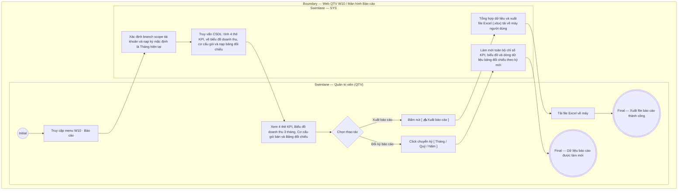

# QTV-W10-US01 - Xem báo cáo tổng hợp

## Preconditions
- Quản trị viên (QTV) đã đăng nhập vào Web QTV và được cấp quyền xem báo cáo quản trị vận hành và tài chính.
- Hệ thống đã có dữ liệu giao dịch thu tiền, đăng ký gói tập, buổi tập PT và lượt check-in ra vào trong phạm vi phân quyền chi nhánh (branch scope).

## Trigger
- QTV chọn menu **W10 · Báo cáo** trên thanh điều hướng chính.
- Màn hình liên quan: Web QTV — Màn hình `W10 · Báo cáo`.

## Main Flow

1. QTV truy cập menu **W10 · Báo cáo**.
2. SYS xác định phạm vi chi nhánh (branch scope) của tài khoản QTV và nạp kỳ báo cáo mặc định là **Tháng hiện tại (`Tháng`)**.
3. SYS truy vấn dữ liệu, tổng hợp và hiển thị giao diện báo cáo quản trị toàn diện gồm 4 phân khu:
   - **Cụm thanh điều khiển báo cáo:**
     + Bộ nút chọn kỳ: `[ Tháng ]` (đang kích hoạt), `[ Quý ]`, `[ Năm ]`.
     + Badge thông tin phạm vi chi nhánh: `Tiền thực thu · Toàn bộ chi nhánh được cấp` (hoặc tên chi nhánh cụ thể theo bộ chọn toàn cục).
     + Nút thao tác **`[ 📥 Xuất báo cáo ]`** màu xanh lá.
   - **Hàng 4 Thẻ KPI Chỉ số tổng hợp (Stat Cards):**
     + Thẻ 1 — `Tiền thực thu`: Tổng số tiền thực thu 100% trong kỳ (ví dụ: `18.200.000 đ`), ghi chú ngày chốt dữ liệu.
     + Thẻ 2 — `Giá trị gói đã bán`: Tổng giá trị gói tập niêm yết bán ra trong kỳ (ví dụ: `21.300.000 đ`).
     + Thẻ 3 — `Gói đã bán`: Tổng số lượng gói tập bán ra trong kỳ (ví dụ: `12`).
     + Thẻ 4 — `Buổi PT đã dạy`: Tổng số buổi học PT hợp lệ đã hoàn thành và ghi nhận kết quả (ví dụ: `64`).
   - **Khu vực Biểu đồ & Cơ cấu doanh số:**
     + Biểu đồ Doanh thu kỳ gần nhất: Biểu đồ cột so sánh doanh thu 3 kỳ liên tiếp (ví dụ Tháng 7: `39 Trđ`, Tháng 8: `42 Trđ`, Tháng 9: `18 Trđ`).
     + Khối Cơ cấu Gói tập đã bán: Thống kê số lượng, tỷ lệ phần trăm và thanh tiến trình (Progress bar màu) theo từng gói (Gói PT 20 buổi: `42%`, Gói 3 tháng: `33%`, Gói 1 tháng: `17%`, Gói khác: `8%`).
   - **Bảng tổng hợp doanh thu (Datagridview):**
     + Bảng hiển thị dữ liệu gom dòng duy nhất cho mỗi mốc thời gian (theo từng Ngày khi xem Tháng; theo từng Tháng khi xem Quý/Năm), gồm 4 cột:
       * Cột Mốc thời gian (`Ngày` hoặc `Tháng`).
       * Cột Tổng số gói bán (Tổng số lượng gói/dịch vụ hoàn tất thanh toán trong mốc thời gian đó, ví dụ: `4 gói`).
       * Cột Phân rã theo dịch vụ (Liệt kê số lượng phân rã theo loại dịch vụ: `2 Gói Gym · 1 Buổi PT · 1 Combo`).
       * Cột Doanh thu thực thu 100% (Tổng tiền thực thu thu về trong mốc thời gian đó, ví dụ: `11.250.000 đ`).
4. QTV có thể chuyển đổi kỳ xem báo cáo bằng cách click chọn nút `[ Quý ]` hoặc `[ Năm ]`.
5. SYS tự động truy vấn lại cơ sở dữ liệu, tự động chuyển đổi mức độ gom nhóm bảng doanh thu (từ từng ngày sang từng tháng) và làm mới đồng bộ toàn bộ 4 phân khu số liệu trên màn hình.
6. Khi QTV bấm nút **`[ 📥 Xuất báo cáo ]`**, SYS tổng hợp toàn bộ dữ liệu chỉ số KPI, cơ cấu gói và bảng doanh thu theo kỳ hiện tại thành file bảng tính Excel (`.xlsx`) và tải về máy người dùng.

### Field-level specification — Màn hình Báo cáo tổng hợp (W10)
| Field / control | Loại UI Control | State | Required | Conditional / dynamic | Source / validation |
| :--- | :--- | :--- | :--- | :--- | :--- |
| Bộ nút chọn kỳ báo cáo | `Segmented Buttons` | `USER-INPUT (PREFILL)` | required | `TRIGGER` | Nhóm nút chuyển kỳ: `[ Tháng ]` (mặc định), `[ Quý ]`, `[ Năm ]`. Khi click thay đổi, kích hoạt hệ thống làm mới toàn bộ số liệu báo cáo và điều chỉnh mức gom nhóm của Bảng doanh thu |
| Nhãn phạm vi chi nhánh | `Status Badge` | `READONLY` | required | `DYNAMIC` | Hiển thị phạm vi dữ liệu đang lọc: `Tiền thực thu · Toàn bộ chi nhánh được cấp` hoặc `Tiền thực thu · {Tên chi nhánh}` theo bộ chọn toàn cục |
| Nút Xuất báo cáo `[ 📥 Xuất báo cáo ]` | `Button (Primary Green)` | `USER-INPUT` | optional | Không | Nút màu xanh lá có icon tải xuống; click xuất toàn bộ dữ liệu báo cáo và bảng doanh thu thành file Excel (.xlsx) |
| Thẻ KPI Tiền thực thu | `Metric Card` | `READONLY` | required | `DYNAMIC` | Hiển thị tổng số tiền thực thu 100% trong kỳ (ví dụ: `18.200.000 đ`) kèm icon ví tiền và ghi chú `Tính đến {DD/MM/YYYY}` |
| Thẻ KPI Giá trị gói đã bán | `Metric Card` | `READONLY` | required | `DYNAMIC` | Hiển thị tổng giá trị hợp đồng/gói bán ra trong kỳ (ví dụ: `21.300.000 đ`) kèm icon gói tập và ghi chú `Tổng giá trị niêm yết` |
| Thẻ KPI Gói đã bán | `Metric Card` | `READONLY` | required | `DYNAMIC` | Hiển thị tổng số lượng gói tập đã bán trong kỳ (ví dụ: `12`) kèm icon danh sách và nhãn kỳ báo cáo |
| Thẻ KPI Buổi PT đã dạy | `Metric Card` | `READONLY` | required | `DYNAMIC` | Hiển thị tổng số buổi học PT hoàn thành hợp lệ (ví dụ: `64`) kèm icon HLV và nhãn `Đã ghi kết quả` |
| Biểu đồ Doanh thu kỳ gần nhất | `Bar Chart` | `READONLY` | required | `DYNAMIC` | Biểu đồ cột so sánh doanh thu 3 kỳ gần nhất (ví dụ: T7 `39 Trđ`, T8 `42 Trđ`, T9 `18 Trđ`); cột kỳ hiện tại tô màu xanh lá đậm |
| Cơ cấu Gói tập đã bán | `Distribution List + Progress Bar` | `READONLY` | required | `DYNAMIC` | Danh sách tên gói, số lượng bán, tỷ lệ % và thanh Progress Bar màu sắc trực quan (Gói PT 20 buổi, Gói 3 tháng, Gói 1 tháng, Gói khác) |
| Bảng doanh thu — Cột Mốc thời gian | `Readonly Text / Date` | `READONLY` | required | `DYNAMIC` | Hiển thị `Ngày` (`DD/MM/YYYY`, ví dụ `07/09/2026`) khi lọc theo `Tháng`; hiển thị `Tháng` (`Tháng MM/YYYY`, ví dụ `Tháng 09/2026`) khi lọc theo `Quý` hoặc `Năm` |
| Bảng doanh thu — Cột Tổng số gói bán | `Readonly Text (Number)` | `READONLY` | required | `DYNAMIC` | Tổng số lượng gói/dịch vụ hoàn tất giao dịch thanh toán thành công trong mốc thời gian đó (ví dụ: `4 gói`, `12 gói`) |
| Bảng doanh thu — Cột Phân rã theo dịch vụ | `Readonly Text / Badges` | `READONLY` | required | `DYNAMIC` | Tóm tắt cơ cấu dịch vụ phát sinh trong mốc thời gian: số lượng từng loại dịch vụ (ví dụ: `2 Gói Gym · 1 Buổi PT · 1 Combo`) |
| Bảng doanh thu — Cột Doanh thu thực thu (100%) | `Currency Text (VND)` | `READONLY` | required | `DYNAMIC` | Tổng số tiền thực thu 100% đã hoàn tất trong mốc thời gian đó (ví dụ: `11.250.000 đ`, `42.800.000 đ`) |

- **Business rules / logic:**
  - **1. Cơ chế xác định khoảng thời gian (Từ ? $\rightarrow$ Đến ?):**
    + Khi chọn `[ Tháng ]`: Khoảng thời gian tính từ ngày 01 đầu tháng đến ngày cuối tháng (hoặc đến ngày hiện tại nếu tháng đang diễn ra chưa kết thúc, ví dụ ngày hiện tại là 07/09/2026 thì kỳ tính toán là `01/09/2026 → 07/09/2026`).
    + Khi chọn `[ Quý ]`: Tròn quý hiện tại (ví dụ Quý 3 tính từ `01/07/2026 → 30/09/2026`).
    + Khi chọn `[ Năm ]`: Tròn năm dương lịch hiện tại (từ `01/01/2026 → 31/12/2026`).
  - **2. Cơ chế gom nhóm dữ liệu theo cấp độ kỳ (Data Aggregation by Period):**
    + Khi xem theo `[ Tháng ]`: Bảng hiển thị chi tiết theo **từng Ngày** có phát sinh doanh thu trong tháng đó.
    + Khi xem theo `[ Quý ]` hoặc `[ Năm ]`: Bảng tự động gom dòng theo **từng Tháng** (ví dụ Quý 3 gom thành Tháng 7, Tháng 8, Tháng 9; Năm gom từ Tháng 1 đến Tháng 12) để tránh tình trạng bảng bị trải dài 365 dòng, giúp Quản lý dễ dàng đối chiếu và so sánh tốc độ tăng trưởng kinh doanh giữa các tháng.
  - **3. Giải pháp gom dòng cho 1 ngày bán nhiều loại gói (Mỗi mốc thời gian 1 dòng duy nhất):**
    + Hệ thống không xé lẻ 1 ngày thành nhiều dòng lặp lại cho từng gói hoặc từng dịch vụ.
    + Gom toàn bộ giao dịch của ngày thành **đúng 1 dòng duy nhất / ngày** (hoặc 1 dòng / tháng khi xem Quý/Năm):
      * `Mốc thời gian`: `07/09/2026`
      * `Tổng số gói bán`: `4 gói`
      * `Phân rã theo dịch vụ`: `2 Gói Gym · 1 Buổi PT · 1 Combo`
      * `Doanh thu thực thu`: `11.250.000 đ`
  - **4. Phân quyền và phạm vi chi nhánh (`branch scope`):**
    + QTV toàn chuỗi: Được quyền xem tổng hợp toàn bộ chi nhánh hoặc lọc theo từng chi nhánh cụ thể qua bộ chọn chi nhánh toàn cục.
    + Quản lý chi nhánh: Hệ thống cố định phạm vi tại chi nhánh được phân công phụ trách.
  - **5. Quy tắc đồng bộ dòng tiền thực thu 100%:**
    + `Tổng tiền thực thu trên Thẻ KPI` = Tổng cột Doanh thu thực thu (100%) của toàn bộ các dòng trên Bảng doanh thu trong kỳ.
    + Hệ thống áp dụng nguyên tắc **Thanh toán 100% 1 lần duy nhất để kích hoạt gói**; xóa bỏ hoàn toàn các chỉ số công nợ hay trả góp, đảm bảo dòng tiền báo cáo minh bạch và chuẩn xác tuyệt đối.

## Alternate Flows

### AF-01 - Xuất file báo cáo tổng hợp
1. Tại thanh điều khiển báo cáo, QTV bấm nút **`[ 📥 Xuất báo cáo ]`**.
2. SYS tổng hợp số liệu KPI, biểu đồ cơ cấu và bảng đối chiếu theo kỳ và chi nhánh hiện tại.
3. SYS khởi tạo file Excel với tên chuẩn: `BaoCao_TongHop_{Ky}_{ChiNhanh}_{YYYYMMDD}.xlsx`.
4. Trình duyệt tự động tải file về máy của QTV.

## Exception Flows
- Không có dữ liệu phát sinh trong kỳ: SYS hiển thị các thẻ KPI giá trị `0 đ`, biểu đồ hiển thị trạng thái chưa có số liệu và bảng đối chiếu thông báo danh sách trống.

## Activity Diagram — Swimlane
**Trigger:** QTV truy cập menu W10 Báo cáo trên thanh điều hướng chính.

