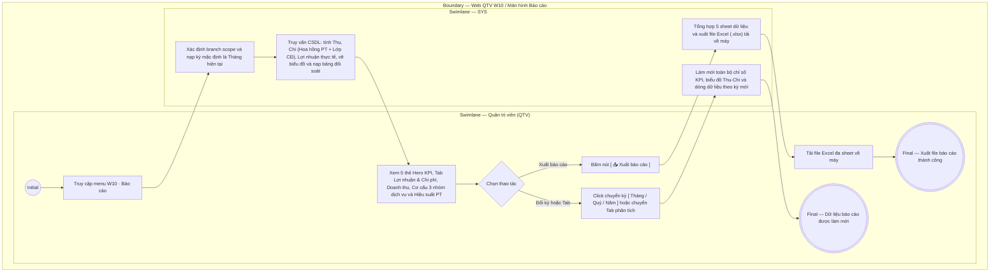

# QTV-W10-US01 - Xem báo cáo tổng hợp & Quản lý Chi phí, Lợi nhuận (BI)

## Preconditions
- Quản trị viên (QTV) đã đăng nhập vào Web QTV và được cấp quyền xem báo cáo quản trị tài chính và vận hành.
- Hệ thống đã có dữ liệu giao dịch thu tiền hợp đồng, chi trả hoa hồng PT, thù lao lớp cộng đồng, buổi tập PT và lượt check-in trong phạm vi phân quyền chi nhánh (branch scope).

## Trigger
- QTV chọn menu **W10 · Báo cáo** trên thanh điều hướng chính.
- Màn hình liên quan: Web QTV — Màn hình `W10 · Báo cáo`.

## Main Flow

1. QTV truy cập menu **W10 · Báo cáo**.
2. SYS xác định phạm vi chi nhánh (branch scope) của tài khoản QTV và nạp kỳ báo cáo mặc định là **Tháng hiện tại (`Tháng`)**.
3. SYS truy vấn dữ liệu, tổng hợp và hiển thị giao diện báo cáo quản trị tài chính & vận hành toàn diện gồm 3 tầng:
   - **Tầng 1: Cụm thanh điều khiển & Bộ lọc thời gian đa chiều:**
     + Bộ nút chọn kỳ: `[ Tháng ]` (đang kích hoạt), `[ Quý ]`, `[ Năm ]`.
     + Dropdown chọn Năm (`2025`, `2026`, `2027`) và Dropdown chọn Tháng (`Tháng 1` .. `12`) hoặc Quý (`Quý 1` .. `4`).
     + Badge thông tin phạm vi chi nhánh và khoảng thời gian: `Báo cáo tài chính & vận hành · {Tên chi nhánh} ({Từ ngày} - {Đến ngày})`.
     + Nút thao tác **`[ 📥 Xuất báo cáo ]`** màu xanh lá.
   - **Tầng 2: Hàng 5 Thẻ Hero Metric Cards:**
     + Thẻ 1 — `Tiền thực thu`: Tổng số tiền thực thu 100% trong kỳ (ví dụ: `51.311.100 đ`), ghi chú tổng thực thu hợp đồng.
     + Thẻ 2 — `Tổng chi phí`: Tổng chi phí hoạt động trong kỳ gồm Hoa hồng PT và Thù lao lớp cộng đồng (ví dụ: `5.818.750 đ`).
     + Thẻ 3 — `Lợi nhuận thực tế`: Lãi/Lỗ ròng của cơ sở phòng gym ($\text{Thực thu} - \text{Tổng chi}$) kèm tỷ suất lợi nhuận (ví dụ: `+45.492.350 đ`, `Tỷ suất: 88.66%`).
     + Thẻ 4 — `Gói đã bán`: Tổng số lượng gói tập/hợp đồng bán ra trong kỳ (ví dụ: `18 gói`).
     + Thẻ 5 — `Buổi PT & Lớp CĐ`: Tổng số buổi học PT hoàn thành và số buổi lớp cộng đồng đã tổ chức (ví dụ: `15 PT · 18 Lớp`).
   - **Tầng 3: Hệ thống 4 Tab Phân Tích Chuyên Sâu (`dxTabs`):**
      + **Tab 1: Lợi nhuận & Chi phí (Thu - Chi & Lãi/Lỗ):**
        * *Biểu đồ 1.1:* `Bar & Combo Chart` đối chiếu Thu - Chi & Lợi nhuận 3 kỳ gần nhất. Có nút chuyển đổi linh hoạt giữa 2 chế độ xem: `Cột phân kỳ` (mặc định) và `Cột & Đường` (Combo).
          - **Trường hợp Lãi ($\text{Lợi nhuận} \ge 0$):** Cột/Điểm lợi nhuận hướng lên trên vạch 0đ, mang màu xanh ngọc TEAL (`#0d9488`).
          - **Trường hợp Lỗ ($\text{Lợi nhuận} < 0$):** Cột lợi nhuận cắm thẳng xuống dưới vạch 0đ (hoặc đường xu hướng lượn xuống vùng âm) và tự động đổi sang màu ĐỎ rực (`#ef4444`) cảnh báo rủi ro thâm hụt tài chính.
          - **Vạch chuẩn hòa vốn:** Đường chuẩn nét liền màu xám bạc tại giá trị `0` với nhãn `0đ (Hòa vốn)` phân định ranh giới rõ ràng giữa vùng lãi (dương) và vùng lỗ (âm).
          - **Trục hoành cố định:** Trục thời gian ghim cố định ở đáy biểu đồ (`position: 'bottom'`), không bao giờ bị đè lấp khi có cột giá trị âm.
          - **Tooltip thông minh:** Tự động nhận diện và hiển thị tiền tố `Lợi nhuận ròng (LÃI): +X đ` (màu xanh) hoặc `Lợi nhuận ròng (LỖ): -X đ` (màu đỏ).
        * *Biểu đồ 1.2:* `Doughnut Chart` cơ cấu các khoản chi phí phòng gym (Chi hoa hồng PT vs Thù lao giáo viên lớp cộng đồng) kèm tổng chi tại tâm tròn.
        * *Bảng đối soát:* DataGrid đối soát Thu - Chi và Lợi nhuận theo từng mốc thời gian (Ngày/Tháng, Thực thu, Chi hoa hồng PT, Thù lao lớp CĐ, Tổng chi phí, Lợi nhuận thực tế Lãi/Lỗ, Tỷ suất LN %).
        * *Hai bảng phân rã chi tiết:* Bảng kê chi tiết chi trả hoa hồng từng HLV (số buổi dạy, doanh thu PT, hoa hồng, trạng thái) và Bảng kê thù lao từng lớp cộng đồng (bộ môn, giáo viên, thù lao cơ bản, thưởng thêm, tổng thù lao).
      + **Tab 2: Doanh thu & Dòng tiền:**
        * *Biểu đồ 2.1:* `Spline Area Chart` xu hướng tiền thực thu theo ngày/tháng với vùng phủ màu xanh rừng gradient.
        * *Biểu đồ 2.2:* `Bar Chart` so sánh doanh thu 3 kỳ gần nhất (kỳ hiện tại highlight xanh thương hiệu).
        * *Bảng tổng hợp:* DataGrid gom dòng theo mốc thời gian, số gói bán, phân rã dịch vụ và cột Thực thu 100%.
      + **Tab 3: Cơ cấu Gói & Dịch vụ:**
        * *Biểu đồ 3.1:* `Doughnut Chart` tỷ trọng gói tập bán chạy theo từng sản phẩm gói cụ thể (PT 30 buổi, PT Giảm mỡ 12 buổi, Gym Năng động 3 tháng, Gym Tiêu chuẩn 1 tháng, v.v.) với tổng số gói bán hiển thị tại tâm tròn.
        * *Biểu đồ 3.2:* `Stacked Bar Chart` phân rã sản lượng 3 nhóm dịch vụ (Gym vs PT vs Combo) theo từng mốc thời gian.
        * *Bảng chi tiết từng gói tập:* DataGrid thống kê chi tiết từng sản phẩm gói: Tên gói, Phân loại, Số lượng bán, Tỷ trọng (%) và Doanh thu thu về.
      + **Tab 4: Hiệu suất Đào tạo PT:**
        * *Biểu đồ 4.1:* `Bar Chart` bảng xếp hạng số buổi dạy hoàn thành của từng Huấn luyện viên.
        * *Cụm chỉ số mini:* Tổng buổi PT hoàn thành, số HLV tham gia dạy, số học viên phục vụ, năng suất trung bình.
        * *Bảng chi tiết:* DataGrid danh sách HLV: Avatar + Mã/Tên PT, số buổi dạy hoàn thành, học viên phục vụ, tỷ trọng đóng góp %.
4. QTV có thể click chuyển đổi giữa 4 Tab, chuyển chế độ biểu đồ hoặc thay đổi bộ lọc Năm/Tháng/Quý.
5. SYS tự động truy vấn lại cơ sở dữ liệu và làm mới đồng bộ toàn bộ chỉ số, biểu đồ và bảng dữ liệu tương ứng.
6. Khi QTV bấm nút **`[ 📥 Xuất báo cáo ]`**, SYS tổng hợp toàn bộ 5 nhóm dữ liệu: Chỉ số KPI & Lợi nhuận, Doanh thu dòng tiền, Quản lý chi phí chi tiết, Cơ cấu 3 nhóm dịch vụ & gói tập, và Hiệu suất đào tạo PT thành file bảng tính Excel (`.xlsx`) đa sheet tải về máy người dùng.

### Field-level specification — Màn hình Báo cáo tổng hợp (W10)
| Field / control | Loại UI Control | State | Required | Conditional / dynamic | Source / validation |
| :--- | :--- | :--- | :--- | :--- | :--- |
| Bộ nút chọn kỳ báo cáo | `Segmented Buttons` | `USER-INPUT (PREFILL)` | required | `TRIGGER` | `[ Tháng ]` (mặc định), `[ Quý ]`, `[ Năm ]`. Kích hoạt đổi chế độ xem kỳ |
| Ô chọn Năm | `dxSelectBox` | `USER-INPUT (PREFILL)` | required | `DYNAMIC` | Danh sách năm: `2025`, `2026`, `2027` |
| Ô chọn Tháng / Quý | `dxSelectBox` | `USER-INPUT (PREFILL)` | conditional | `CONDITIONAL` | **Hiện khi**: kỳ là Tháng hoặc Quý; **Ẩn khi**: kỳ là Năm. Lựa chọn tháng 1-12 hoặc quý 1-4 |
| Nút Xuất báo cáo `[ 📥 Xuất báo cáo ]` | `Action Button` | `USER-INPUT` | optional | `Không` | Xuất toàn bộ 5 sheet báo cáo sang file Excel (.xlsx) |
| Thẻ KPI Tiền thực thu | `Metric Card` | `READONLY` | required | `DYNAMIC` | Tổng tiền thực thu 100% trong kỳ từ các giao dịch thanh toán |
| Thẻ KPI Tổng chi phí | `Metric Card` | `READONLY` | required | `DYNAMIC` | Tổng chi phí hoa hồng PT và thù lao lớp cộng đồng trong kỳ |
| Thẻ KPI Lợi nhuận thực tế | `Metric Card` | `READONLY` | required | `DYNAMIC` | Lãi/Lỗ ròng ($\text{Thực thu} - \text{Tổng chi}$) kèm tỷ suất LN (%) |
| Thẻ KPI Gói đã bán | `Metric Card` | `READONLY` | required | `DYNAMIC` | Tổng số lượng hợp đồng/gói tập bán ra trong kỳ |
| Thẻ KPI Buổi PT & Lớp CĐ | `Metric Card` | `READONLY` | required | `DYNAMIC` | Tổng số buổi PT hoàn thành và lớp cộng đồng đã tổ chức |
| Thanh điều hướng 4 Tab | `dxTabs` | `USER-INPUT` | required | `TRIGGER` | 4 tab: `Lợi nhuận & Chi phí`, `Doanh thu & Dòng tiền`, `Cơ cấu Gói & Dịch vụ`, `Hiệu suất Đào tạo PT` |
| Bộ chuyển chế độ xem biểu đồ 1.1 | `dxButtonGroup` | `USER-INPUT (PREFILL)` | required | `TRIGGER` | 2 tùy chọn: `Cột phân kỳ` (mặc định) và `Cột & Đường`. Đổi kiểu trực quan hóa đối chiếu 3 kỳ |
| Biểu đồ Đối chiếu Thu - Chi 3 kỳ | `dxChart (bar/combo)` | `READONLY` | required | `DYNAMIC` | Đối chiếu Thực thu, Chi phí, Lợi nhuận ròng 3 kỳ. Hỗ trợ biểu diễn trực quan khi BỊ LỖ (cột/điểm đỏ âm dưới trục 0đ) |
| Biểu đồ Cơ cấu chi phí | `dxPieChart (doughnut)` | `READONLY` | required | `DYNAMIC` | Tỷ trọng Chi hoa hồng PT vs Thù lao giáo viên lớp cộng đồng |
| Bảng đối soát Thu - Chi & Lợi nhuận | `dxDataGrid` | `READONLY` | required | `DYNAMIC` | Mốc thời gian, Thực thu, Chi hoa hồng PT, Thù lao lớp CĐ, Tổng chi, Lợi nhuận, Tỷ suất |
| Bảng chi tiết hoa hồng PT | `dxDataGrid` | `READONLY` | required | `DYNAMIC` | HLV, Số buổi dạy, Doanh thu PT, Hoa hồng thực nhận, Trạng thái |
| Bảng chi tiết thù lao lớp CĐ | `dxDataGrid` | `READONLY` | required | `DYNAMIC` | Tên lớp, Bộ môn, Giáo viên, Ngày dạy, Thù lao gốc, Thưởng, Tổng thù lao |
| Biểu đồ Xu hướng thực thu | `dxChart (splineArea)` | `READONLY` | required | `DYNAMIC` | Đường cong diện tích thực thu theo ngày/tháng trong kỳ |
| Biểu đồ So sánh doanh thu 3 kỳ | `dxChart (bar)` | `READONLY` | required | `DYNAMIC` | Biểu đồ cột so sánh thực thu 3 kỳ gần nhất |
| Biểu đồ Cơ cấu gói bán chạy | `dxPieChart (doughnut)` | `READONLY` | required | `DYNAMIC` | Biểu đồ vành khăn tỷ trọng gói bán cụ thể kèm số lượng tại tâm tròn |
| Biểu đồ Phân rã dịch vụ | `dxChart (stackedBar)` | `READONLY` | required | `DYNAMIC` | Cột chồng 3 nhóm dịch vụ Gym, PT, Combo theo thời gian |
| Bảng chi tiết từng gói tập | `dxDataGrid` | `READONLY` | required | `DYNAMIC` | Tên gói, Phân loại, Số lượng, Tỷ trọng %, Doanh thu |
| Biểu đồ Xếp hạng HLV PT | `dxChart (bar)` | `READONLY` | required | `DYNAMIC` | Xếp hạng số buổi dạy hoàn thành theo từng HLV |
| Bảng chi tiết hiệu suất HLV | `dxDataGrid` | `READONLY` | required | `DYNAMIC` | HLV, Số buổi hoàn thành, Học viên phục vụ, Tỷ trọng đóng góp |

- **Business rules / logic:**
  - **1. Công thức tính toán Lợi nhuận thực tế (Lãi / Lỗ):**
    $$\text{Tổng Chi phí} = \text{Chi hoa hồng PT} + \text{Chi thù lao lớp cộng đồng}$$
    $$\text{Lợi nhuận thực tế} = \text{Tổng Thực thu} - \text{Tổng Chi phí}$$
    $$\text{Tỷ suất lợi nhuận ròng (\%)} = \frac{\text{Lợi nhuận thực tế}}{\text{Tổng Thực thu}} \times 100\%$$
  - **2. Nguyên tắc trực quan hóa Lợi nhuận ròng khi BỊ LỖ (Biểu đồ 1.1):**
    + Khi cơ sở kinh doanh có $\text{Tổng Chi phí} > \text{Tổng Thực thu}$, Lợi nhuận ròng nhận giá trị âm ($\text{Net Profit} < 0$).
    + Trên biểu đồ `Cột phân kỳ`: Cột Lợi nhuận ròng tự động đổi từ màu xanh ngọc sang màu đỏ rực (`#ef4444`) và phát triển hướng xuống dưới mốc `0`.
    + Trên biểu đồ `Cột & Đường`: Thực thu và Chi phí biểu diễn bằng cột độc lập; Lợi nhuận biểu diễn bằng đường Spline uốn lượn xuyên qua vạch hòa vốn 0đ, điểm rơi tại kỳ lỗ tự động chuyển sang màu đỏ viền trắng để cảnh báo.
    + Đường chuẩn hòa vốn `0đ (Hòa vốn)` luôn hiển thị cố định bằng nét xám bạc mảnh phân tách trực quan 2 nửa Lãi (dương) và Lỗ (âm).
    + Trục hoành (`argumentAxis`) được cố định ở `position: 'bottom'` để không bao giờ bị đè lấp nhãn thời gian bởi các cột số âm.
  - **3. Cơ cấu các khoản Chi phí ghi nhận:**
    + **Chi hoa hồng PT (`pt_commissions`):** Tính tổng số tiền hoa hồng của các bảng kê hoa hồng trong kỳ báo cáo (theo tháng/năm).
    + **Chi thù lao giáo viên lớp cộng đồng (`community_classes`):** Tính tổng `base_price` (sàn thù lao bộ môn) + `bonus_amount` (thưởng thêm của buổi dạy) cho tất cả các lớp có ngày diễn ra trong kỳ và trạng thái khác `CANCELLED`.
  - **4. Phân loại 3 nhóm dịch vụ chính:**
    + **Gói Gym:** Các gói tập tự do / hội viên thường (`package_type_snapshot LIKE 'GYM%'`).
    + **Gói PT:** Các gói tập có Huấn luyện viên kèm riêng (`package_type_snapshot LIKE 'PT%'`).
    + **Combo VIP:** Các gói tích hợp cả Gym và Huấn luyện viên (`package_type_snapshot = 'COMBO'`).
  - **5. Cơ chế gom nhóm dữ liệu theo cấp độ kỳ (Data Aggregation by Period):**
    + Khi xem theo `[ Tháng ]`: Bảng hiển thị chi tiết theo **từng Ngày** trong tháng (từ ngày 01 đến ngày cuối tháng).
    + Khi xem theo `[ Quý ]` hoặc `[ Năm ]`: Bảng tự động gom dòng theo **từng Tháng** để đối chiếu tăng trưởng kinh doanh và kiểm soát thu chi.
  - **6. Phân quyền và phạm vi chi nhánh (`branch scope`):**
    + QTV toàn chuỗi: Được quyền xem tổng hợp toàn bộ chi nhánh hoặc lọc theo từng chi nhánh cụ thể qua bộ chọn chi nhánh toàn cục.
    + Quản lý chi nhánh: Hệ thống cố định phạm vi tại chi nhánh được phân công phụ trách.

## Alternate Flows

### AF-01 - Xuất file báo cáo tài chính và vận hành (.xlsx)
1. Tại thanh điều khiển báo cáo, QTV bấm nút **`[ 📥 Xuất báo cáo ]`**.
2. SYS tổng hợp số liệu 5 sheet: Tổng hợp & Lợi nhuận, Doanh thu dòng tiền, Quản lý chi phí chi tiết, Cơ cấu 3 nhóm dịch vụ & gói tập, và Hiệu suất PT.
3. SYS khởi tạo file Excel với tên chuẩn: `BaoCao_BI_LoiNhuan_{Ky}_{ChiNhanh}_{YYYYMMDD}.xlsx`.
4. Trình duyệt tự động tải file về máy của QTV.

## Exception Flows
- Không có dữ liệu phát sinh trong kỳ: SYS hiển thị các thẻ KPI giá trị `0 đ`, biểu đồ hiển thị trạng thái chưa có số liệu và bảng đối chiếu thông báo danh sách trống.

## Activity Diagram — Swimlane
**Trigger:** QTV truy cập menu W10 Báo cáo trên thanh điều hướng chính.

