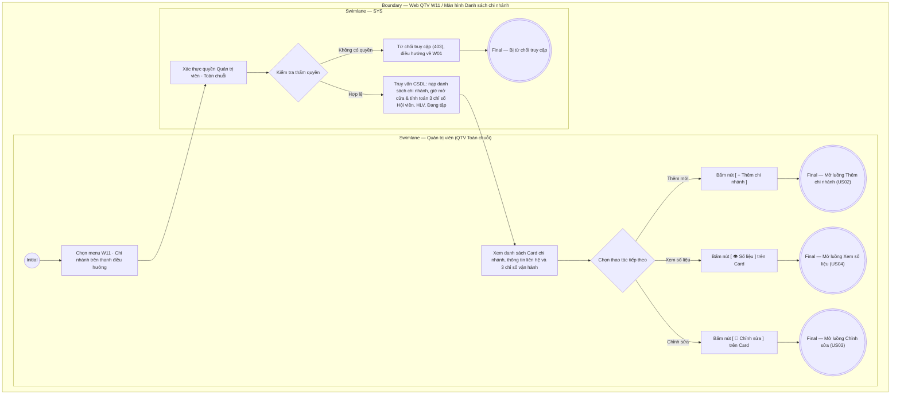

# QTV-W11-US01 - Xem danh sách chi nhánh

## Preconditions
- Quản trị viên (QTV) đã đăng nhập vào Web QTV bằng tài khoản có thẩm quyền cấp tối cao (Quản trị viên - Toàn chuỗi / cơ sở mẹ).
- Hệ thống đã có danh mục cơ sở chi nhánh và dữ liệu vận hành (hồ sơ hội viên, phân công PT, lịch sử check-in) liên kết tương ứng.

## Trigger
- QTV cấp tối cao chọn menu **W11 · Chi nhánh** trên thanh điều hướng chính.
- Màn hình liên quan: Web QTV — Màn hình `W11 · Chi nhánh`.

## Main Flow

1. QTV cấp tối cao truy cập menu **W11 · Chi nhánh**.
2. SYS xác thực quyền truy cập cấp tối cao (Quản trị viên - Toàn chuỗi).
3. SYS truy vấn cơ sở dữ liệu và hiển thị giao diện danh sách chi nhánh:
   - **Thanh tiêu đề trang:**
     + Tiêu đề lớn `Chi nhánh` kèm dòng mô tả phụ *Thông tin chi nhánh, phạm vi hoạt động và liên kết dữ liệu vận hành*.
     + Nút hành động **`[ + Thêm chi nhánh ]`** màu xanh lá góc trên bên phải (`QTV-W11-US02`).
   - **Khối 4 Thẻ Hero Metric Cards tổng quan toàn chuỗi:**
     + `Tổng số cơ sở`: Tổng số chi nhánh trong hệ thống kèm trạng thái đang hoạt động (ví dụ: `3 chi nhánh · 3 đang hoạt động`).
     + `Tổng hội viên toàn chuỗi`: Tổng số lượng hồ sơ hội viên đăng ký trên toàn bộ các cơ sở (ví dụ: `25 người`).
     + `Đội ngũ Huấn luyện viên`: Tổng số HLV đang được phân công công tác trên toàn hệ thống (ví dụ: `5 HLV`).
     + `Đang tập luyện lúc này`: Tổng số khách có mặt tập luyện theo thời gian thực (real-time check-in).
   - **Thanh công cụ lọc & tìm kiếm (Filter Bar):**
     + Cụm Tabs lọc trạng thái cơ sở: `Tất cả` | `Đang hoạt động` | `Tạm ngừng hoạt động`.
     + Ô tìm kiếm nhanh: Hỗ trợ tìm kiếm theo Tên chi nhánh, Mã cơ sở, Địa chỉ hoặc Số điện thoại hotline.
     + Cụm chuyển đổi chế độ xem (View Switcher): Nút chuyển giữa `Dạng lưới thẻ (Cards Grid)` và `Dạng bảng chi tiết (DataGrid)`.
     + Số lượng chi nhánh phù hợp và nút Làm mới `[ 🔄 ]`.
   - **Chế độ xem Lưới Thẻ Chi nhánh (Branch Cards Grid):** Mỗi cơ sở được thể hiện bằng 1 thẻ Card gồm:
     + Tên chi nhánh (ví dụ: `Chi nhánh Quận 1`, `Chi nhánh Bình Thạnh`).
     + Mã chi nhánh (ví dụ: `CN-Q01`, `CN-BT01`).
     + Badge trạng thái hoạt động: `Đang hoạt động` (badge xanh lá nhạt) hoặc `Tạm ngừng hoạt động` (badge cam/xám).
     + Địa chỉ chi tiết cơ sở (ví dụ: `123 Lê Lợi, P. Bến Thành, Q.1, TP.HCM`).
     + Số điện thoại liên hệ và khung giờ mở cửa (ví dụ: `028 3822 1111 · 05:30 - 22:00`).
     + Tỷ lệ hoa hồng PT mặc định: Hiển thị mức chiết khấu hoa hồng của chi nhánh (ví dụ: `Hoa hồng PT mặc định: 20%`).
     + Đường phân cách ngang và Khối 3 ô chỉ số thống kê nhanh (Mini KPI Stats Boxes):
       * `Hội viên`: Tổng số hội viên đăng ký tại cơ sở (ví dụ: `22`).
       * `Huấn luyện viên`: Tổng số HLV đang được phân công thuộc cơ sở (ví dụ: `2`).
       * `Đang tập`: Số hội viên đang có mặt tập luyện thực tế trong ngày (ví dụ: `0`).
     + Cụm nút hành động ở chân Card:
       * Nút **`[ 📍 Chọn cơ sở ]`** (hoặc badge `[ Đang làm việc ]` nếu đang là chi nhánh làm việc hiện tại): Bấm để chuyển ngay không gian làm việc toàn cục trên Topbar sang chi nhánh này.
       * Nút **`[ 📊 Số liệu ]`**: Bấm để tự động đồng bộ phạm vi chi nhánh và điều hướng trực tiếp sang màn hình Báo cáo BI tổng hợp của cơ sở đó (`W10 · Báo cáo`).
       * Nút **`[ ✏️ Chỉnh sửa ]`**: Bấm để mở modal chỉnh sửa thông tin chi nhánh (`QTV-W11-US03`).
   - **Chế độ xem Dạng Bảng Tổng Hợp (DataGrid View):** Bảng so sánh chỉ số giữa các chi nhánh:
     + Cột `Mã CN`, `Tên chi nhánh`, `Địa chỉ`, `Hotline`, `Giờ mở cửa`, `Hoa hồng PT`, `Hội viên`, `HLV`, `Đang tập`, `Trạng thái` và Cột `Thao tác` (`Chọn cơ sở`, `Số liệu` chuyển đến Báo cáo, `Chỉnh sửa`).
4. QTV xem danh sách các chi nhánh và có thể bấm nút **`[ + Thêm chi nhánh ]`**, **`[ 📍 Chọn cơ sở ]`**, **`[ 📊 Số liệu ]`** hoặc **`[ ✏️ Chỉnh sửa ]`** để thực hiện các thao tác quản trị tiếp theo.

### Field-level specification — Màn hình Danh sách chi nhánh (W11)
| Field / control | Loại UI Control | State | Required | Conditional / dynamic | Source / validation |
| :--- | :--- | :--- | :--- | :--- | :--- |
| Nút Thêm chi nhánh `[ + Thêm chi nhánh ]` | `Button (Primary Green)` | `USER-INPUT` | optional | Không | Nút màu xanh lá góc trên bên phải; click kích hoạt mở modal Thêm chi nhánh mới (US02) |
| Thẻ Hero — Tổng số cơ sở | `Metric Card` | `READONLY` | required | `DYNAMIC` | Tổng số lượng chi nhánh trong toàn chuỗi và số cơ sở đang hoạt động |
| Thẻ Hero — Tổng hội viên toàn chuỗi | `Metric Card` | `READONLY` | required | `DYNAMIC` | Tổng số hồ sơ hội viên đăng ký trên toàn bộ các cơ sở của hệ thống |
| Thẻ Hero — Đội ngũ Huấn luyện viên | `Metric Card` | `READONLY` | required | `DYNAMIC` | Tổng số nhân sự HLV đang được phân công công tác trên toàn chuỗi |
| Thẻ Hero — Đang tập luyện lúc này | `Metric Card` | `READONLY` | required | `DYNAMIC` | Tổng số khách hàng đang check-in tập luyện thực tế lúc này trên toàn hệ thống |
| Bộ lọc trạng thái | `Tabs (dxTabs)` | `USER-INPUT` | optional | `TRIGGER` | Tùy chọn lọc trạng thái cơ sở: `Tất cả` (mặc định), `Đang hoạt động`, `Tạm ngừng hoạt động` |
| Ô tìm kiếm chi nhánh | `Text Box (dxTextBox)` | `USER-INPUT` | optional | `DYNAMIC` | Tìm kiếm realtime theo Tên, Mã chi nhánh, Địa chỉ hoặc Số điện thoại |
| Chuyển đổi chế độ xem | `Button Group (dxButtonGroup)` | `USER-INPUT` | optional | `TRIGGER` | Chuyển đổi giữa `Dạng lưới thẻ` và `Dạng bảng chi tiết` |
| Nút Làm mới `[ 🔄 ]` | `Button (Icon Outlined)` | `USER-INPUT` | optional | Không | Làm mới danh sách chi nhánh và nạp lại số liệu thống kê |
| Card chi nhánh — Tên chi nhánh | `Card Heading` | `READONLY` | required | `DYNAMIC` | Tên cơ sở chi nhánh (ví dụ: `Paradise Gym Quận 1`, `Paradise Gym Bình Thạnh`) |
| Card chi nhánh — Mã chi nhánh | `Subtext` | `READONLY` | required | `DYNAMIC` | Mã định danh duy nhất của chi nhánh (ví dụ: `CN-Q01`, `CN-BT01`) |
| Card chi nhánh — Badge trạng thái | `Status Badge` | `READONLY` | required | `DYNAMIC` | Trạng thái hoạt động của cơ sở: `Đang hoạt động` (badge xanh lá) hoặc `Tạm ngừng hoạt động` (badge cam/xám) |
| Card chi nhánh — Địa chỉ | `Text` | `READONLY` | required | `DYNAMIC` | Địa chỉ cụ thể của cơ sở (số nhà, đường, phường, quận, tỉnh/thành phố) |
| Card chi nhánh — Số điện thoại & Giờ mở cửa | `Text` | `READONLY` | required | `DYNAMIC` | SĐT hotline và khung giờ mở cửa hàng ngày (ví dụ: `028 3822 1111 · 05:30 - 22:00`) |
| Card chi nhánh — Hoa hồng PT mặc định | `Text` | `READONLY` | required | `DYNAMIC` | Tỷ lệ hoa hồng PT mặc định áp dụng tại cơ sở (ví dụ: `20%`) |
| Card chi nhánh — Chỉ số Hội viên | `Mini Stat Box` | `READONLY` | required | `DYNAMIC` | Tổng số lượng hội viên đăng ký hồ sơ tại cơ sở chi nhánh này (ví dụ: `22`) |
| Card chi nhánh — Chỉ số Huấn luyện viên | `Mini Stat Box` | `READONLY` | required | `DYNAMIC` | Tổng số lượng HLV cá nhân đang được phân công thuộc chi nhánh (ví dụ: `2`) |
| Card chi nhánh — Chỉ số Đang tập | `Mini Stat Box` | `READONLY` | required | `DYNAMIC` | Số lượng hội viên đang có mặt tập luyện thực tế theo check-in hôm nay chưa check-out (ví dụ: `0`) |
| Card chi nhánh — Nút Chọn cơ sở `[ 📍 Chọn cơ sở ]` | `Button (Outlined)` | `USER-INPUT` | optional | `CONDITIONAL` | Hiện nút chọn khi chi nhánh chưa phải là chi nhánh đang chọn trên Topbar; ẩn và đổi thành nút disabled `[ Đang làm việc ]` khi là chi nhánh hiện tại |
| Card chi nhánh — Nút Số liệu `[ 📊 Số liệu ]` | `Button (Secondary Dark)` | `USER-INPUT` | optional | Không | Nút xem số liệu chi tiết; click tự động đồng bộ phạm vi chi nhánh và điều hướng trực tiếp sang màn hình Báo cáo tổng hợp (W10) |
| Card chi nhánh — Nút Chỉnh sửa `[ ✏️ Chỉnh sửa ]` | `Button (Secondary Dark)` | `USER-INPUT` | optional | Không | Nút chỉnh sửa; click mở modal Chỉnh sửa thông tin và trạng thái chi nhánh (US03) |
| DataGrid — Bảng danh sách chi nhánh | `DataGrid (dxDataGrid)` | `READONLY` | optional | `CONDITIONAL` | Hiển thị khi người dùng chọn chế độ xem `Dạng bảng chi tiết`; ẩn khi ở chế độ xem `Dạng lưới thẻ` |

- **Business rules / logic:**
  - Menu W11 là menu độc quyền bảo mật chỉ dành riêng cho QTV cấp tối cao (Quản trị viên - Toàn chuỗi). QTV chi nhánh, Lễ tân, PT, Hội viên không nhìn thấy menu này trên thanh điều hướng và bị chặn truy cập API (403 Forbidden).
  - Thống kê số lượng `Đang tập` được tính toán theo thời gian thực (real-time) dựa trên các lượt check-in ra/vào hợp lệ trong ngày mà chưa có lượt check-out tương ứng tại chi nhánh đó.
  - Các chỉ số `Hội viên` và `Huấn luyện viên` được tự động tổng hợp từ danh sách hội viên đăng ký tại cơ sở (W02) và phân công nhân sự PT (W05).
  - Khi QTV bấm `[ 📍 Chọn cơ sở ]`, hệ thống tự động đồng bộ giá trị vào bộ chọn chi nhánh toàn cục trên Topbar (`#globalBranchSelector`), lưu trữ vào `localStorage` và cập nhật phạm vi không gian làm việc (`#workspaceScope`).
  - Khi QTV bấm `[ 📊 Số liệu ]`, hệ thống tự động gán chi nhánh được chọn vào bộ chọn toàn cục trên Topbar và điều hướng người dùng tới màn hình Báo cáo (W10), hiển thị toàn bộ báo cáo doanh thu, cơ cấu gói và hiệu suất đào tạo riêng của cơ sở đó.

## Exception Flows
- Người dùng không có quyền QTV toàn chuỗi truy cập trực tiếp URL W11: SYS ẩn menu, từ chối quyền truy cập và chuyển hướng về màn hình Tổng quan W01 kèm thông báo từ chối quyền.
- Hệ thống chưa có chi nhánh nào: SYS hiển thị giao diện trạng thái trống (Empty State) kèm thông báo "Chưa có dữ liệu chi nhánh" và gợi ý bấm nút `[ + Thêm chi nhánh ]`.

## Activity Diagram — Swimlane
**Trigger:** QTV cấp tối cao chọn menu W11 Chi nhánh trên thanh điều hướng chính.

