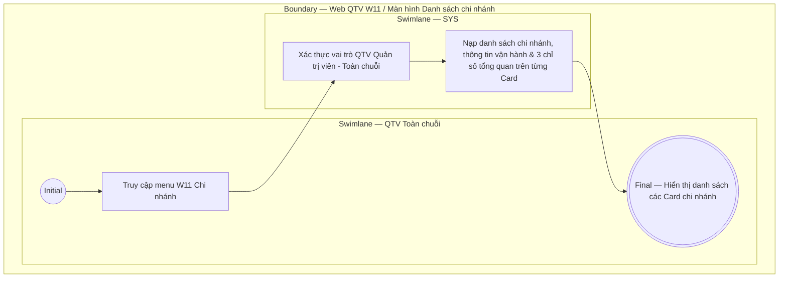

# QTV-W11-US01 - Xem danh sách chi nhánh

## Preconditions
- **Role / Platform / Scope:** Chỉ dành riêng cho **QTV cấp tối cao (Quản trị viên - Toàn chuỗi / cơ sở mẹ)** đăng nhập trên Web QTV. Các vai trò QTV chi nhánh, Lễ tân, PT, Hội viên không có quyền truy cập menu W11.
- QTV cấp tối cao mở menu **W11 · Chi nhánh** trên thanh điều hướng chính.

## Trigger
- QTV cấp tối cao chọn menu **W11 · Chi nhánh**.
- Màn hình liên quan: Web QTV — W11 Chi nhánh.

## Main Flow

1. QTV cấp tối cao truy cập menu W11 Chi nhánh.
2. SYS kiểm tra vai trò người dùng (chỉ cho phép Quản trị viên - Toàn chuỗi).
3. SYS nạp và hiển thị danh sách tất cả các chi nhánh dưới dạng các **Card chi nhánh**:
   - **Mã & Tên chi nhánh**: ví dụ `CN01 · Chi nhánh Quận 1`, `CN02 · Chi nhánh Bình Thạnh`.
   - **Nhãn trạng thái**: `Đang hoạt động` / `Tạm ngừng hoạt động`.
   - **Thông tin liên hệ & Vận hành**: Địa chỉ chi nhánh, Số điện thoại liên hệ, Giờ mở cửa (ví dụ: `123 Lê Lợi, P. Bến Thành, Q.1, TP.HCM`, `028 3911 2026`, `Giờ mở cửa: 06:00 - 22:00`).
   - **Thống kê nhanh trên Card**:
     - Số lượng **Hội viên** đăng ký tại chi nhánh.
     - Số lượng **Huấn luyện viên** phân công.
     - Số lượng **Đang tập** (hội viên check-in thực tế).
   - **Nút thao tác trên mỗi Card**:
     - Nút **Số liệu** (mở xem số liệu chi nhánh — `QTV-W11-US04`).
     - Nút **Chỉnh sửa** (mở modal sửa chi nhánh — `QTV-W11-US03`).
4. SYS hiển thị nút **+ Thêm chi nhánh** góc trên bên phải màn hình (mở modal thêm chi nhánh mới — `QTV-W11-US02`).

- **Business rules / logic:**
  - Menu W11 là menu độc quyền bảo mật chỉ dành cho QTV cấp tối cao (Quản trị viên - Toàn chuỗi).
  - Hiển thị đầy đủ danh sách các cơ sở/chi nhánh trong hệ thống kèm các chỉ số tổng quan trực quan trên từng Card chi nhánh.

## Exception Flows
- QTV chi nhánh cơ sở hoặc vai trò không đủ thẩm quyền truy cập W11: SYS ẩn menu W11 và từ chối truy cập.

## Activity Diagram — Swimlane
**Trigger:** QTV cấp tối cao chọn menu W11 Chi nhánh.

