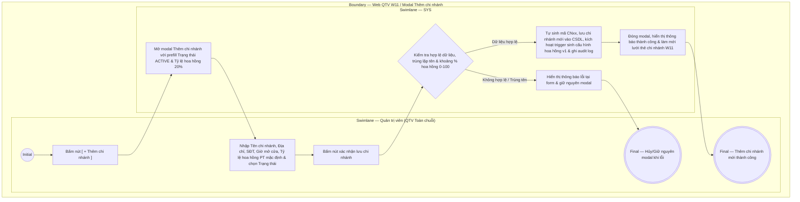

# QTV-W11-US02 - Thêm chi nhánh

## Preconditions
- Quản trị viên (QTV) đã đăng nhập vào Web QTV bằng tài khoản có thẩm quyền cấp tối cao (Quản trị viên - Toàn chuỗi / cơ sở mẹ).
- QTV đang ở màn hình danh sách chi nhánh W11 (`QTV-W11-US01`).

## Trigger
- QTV cấp tối cao bấm nút **`[ + Thêm chi nhánh ]`** góc trên bên phải màn hình W11.
- Màn hình liên quan: Web QTV — W11 Chi nhánh, modal **Thêm chi nhánh**.

## Main Flow

1. QTV bấm nút **`[ + Thêm chi nhánh ]`**.
2. SYS hiển thị modal **Thêm chi nhánh**.
3. QTV nhập thông tin vào form khởi tạo chi nhánh mới:
   - Nhập **Tên chi nhánh** (ví dụ: `Chi nhánh Tân Bình`).
   - Nhập **Địa chỉ** chi tiết cơ sở.
   - Nhập **Số điện thoại** liên hệ chi nhánh.
   - Nhập **Giờ mở cửa** hàng ngày (ví dụ: `06:00 - 22:00`).
   - Chọn **Trạng thái hoạt động** (mặc định chọn `Đang hoạt động`).
   - Nhập **Tỷ lệ hoa hồng PT mặc định (%)** (mặc định điền sẵn gợi ý `20.0%`, cho phép QTV tự do điều chỉnh từ 0% đến 100%).
4. QTV bấm nút xác nhận lưu trên modal.
5. SYS kiểm tra tính hợp lệ của dữ liệu nhập (các trường bắt buộc không được để trống, định dạng SĐT và khung giờ mở cửa chuẩn xác, tên chi nhánh không bị trùng lặp, tỷ lệ hoa hồng nằm trong khoảng từ 0% đến 100%).
6. SYS tự động sinh mã chi nhánh mới (`CNxx`), lưu bản ghi chi nhánh vào cơ sở dữ liệu kèm tỷ lệ hoa hồng ban đầu đã nhập, tự động kích hoạt trigger tạo bản ghi cấu hình hoa hồng mặc định chi nhánh phiên bản v1 trong bảng `pt_commission_configs` và `pt_commission_config_history`, tự động kết nối chi nhánh vào danh mục phân quyền toàn chuỗi (branch scope) và ghi audit log thao tác.
7. SYS đóng modal, hiển thị thông báo thành công `Thêm chi nhánh mới thành công` và làm mới danh sách hiển thị thẻ chi nhánh tại màn hình W11.

### Field-level specification — Modal Thêm chi nhánh
| Field / control | Loại UI Control | State | Required | Conditional / dynamic | Source / validation |
| :--- | :--- | :--- | :--- | :--- | :--- |
| Tên chi nhánh | `Text Input` | `USER-INPUT` | required | Không | Nhập tên cơ sở chi nhánh mới (ví dụ: `Chi nhánh Tân Bình`); độ dài 3-100 ký tự; kiểm tra không trùng lặp với tên chi nhánh đã có |
| Địa chỉ | `Text Input / Textarea` | `USER-INPUT` | required | Không | Nhập địa chỉ chi tiết của cơ sở (số nhà, tên đường, phường/xã, quận/huyện, tỉnh/thành phố); độ dài 5-255 ký tự |
| Số điện thoại | `Text Input (Tel)` | `USER-INPUT` | required | Không | Nhập số điện thoại liên hệ hotline/bàn của cơ sở; định dạng chuẩn SĐT Việt Nam (10 chữ số hoặc số máy bàn) |
| Giờ mở cửa | `Text Input` | `USER-INPUT` | required | Không | Nhập khung giờ hoạt động hàng ngày của chi nhánh (ví dụ: `06:00 - 22:00`); định dạng chuẩn `HH:mm - HH:mm` |
| Trạng thái hoạt động | `Select Dropdown` | `USER-INPUT (PREFILL)` | required | Không | Chọn trạng thái hoạt động ban đầu: `Đang hoạt động` (`ACTIVE`, mặc định được chọn) hoặc `Tạm ngừng hoạt động` (`INACTIVE`) |
| Tỷ lệ hoa hồng PT mặc định (%) | `Number Input` | `USER-INPUT (PREFILL)` | required | Không | Tỷ lệ hoa hồng PT mặc định (%) ban đầu cho toàn bộ HLV tại cơ sở này; định dạng số thập phân 0.0 - 100.0%, bước nhảy 0.5%; mặc định prefill 20.0%; hệ thống tự động sinh cấu hình phiên bản v1 tương ứng trong `pt_commission_configs` khi tạo chi nhánh |

- **Business rules / logic:**
  - QTV cấp tối cao là vai trò duy nhất có thẩm quyền khởi tạo chi nhánh mới cho chuỗi phòng tập.
  - Mã chi nhánh (`branch_code`) là trường hệ thống tự động sinh theo quy tắc tăng dần (`CN01`, `CN02`, `CN03`,...) đảm bảo duy nhất tuyệt đối trên toàn hệ thống (không hiển thị trên form thêm mới để tránh nhập sai sót).
  - Khi chi nhánh mới được tạo thành công, hệ thống tự động đưa chi nhánh này vào danh mục phân quyền chi nhánh (branch scope) để QTV có thể gán quyền quản lý và phân công nhân sự trong module Tài khoản & Phân quyền (W13).
  - **Khởi tạo hoa hồng PT chi nhánh v1 (Branch Default Guarantee):** Ngay khi chi nhánh được tạo, cơ sở dữ liệu kích hoạt trigger tự động chèn bản ghi cấu hình hoa hồng mặc định chi nhánh (`pt_id IS NULL`, `is_active = TRUE`, `version = 1`, `action = 'CREATE'`) với con số % chính xác do QTV nhập tại form (mặc định 20.0% nếu để nguyên), đảm bảo 100% chi nhánh luôn có mức hoa hồng cơ sở để tính toán doanh thu/buổi tập PT mà không xảy ra lỗi thiếu cấu hình.

## Exception Flows
- QTV bỏ trống trường thông tin bắt buộc hoặc định dạng không hợp lệ (hoặc % hoa hồng < 0 hoặc > 100): SYS hiển thị thông báo lỗi tương ứng dưới chân trường nhập liệu và giữ nguyên modal để người dùng bổ sung.
- Tên chi nhánh bị trùng lặp: SYS hiển thị thông báo lỗi "Tên chi nhánh đã tồn tại trong hệ thống, vui lòng chọn tên khác" và giữ nguyên modal.

## Activity Diagram — Swimlane
**Trigger:** QTV cấp tối cao bấm nút [ + Thêm chi nhánh ] trên màn hình W11.

