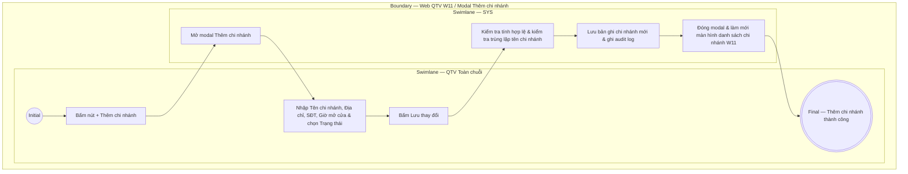

# QTV-W11-US02 - Thêm chi nhánh

## Preconditions
- **Role / Scope:** Chỉ dành riêng cho QTV cấp tối cao (Quản trị viên - Toàn chuỗi).
- QTV đang xem màn hình danh sách chi nhánh W11 (`QTV-W11-US01`).

## Trigger
- QTV bấm nút **+ Thêm chi nhánh** góc trên bên phải màn hình W11.
- Màn hình liên quan: Web QTV — W11 Chi nhánh, modal **Thêm chi nhánh**.

## Main Flow

1. QTV bấm nút **+ Thêm chi nhánh**.
2. SYS mở modal **Thêm chi nhánh**.
3. QTV nhập thông tin cấu hình chi nhánh mới:
   - Nhập **Tên chi nhánh** (ví dụ: `Chi nhánh Tân Bình`).
   - Nhập **Địa chỉ** chi nhánh.
   - Nhập **Số điện thoại** liên hệ chi nhánh.
   - Nhập **Giờ mở cửa** (ví dụ: `06:00 - 22:00`).
   - Chọn **Trạng thái hoạt động** (mặc định `Đang hoạt động`).
4. QTV bấm nút **Lưu thay đổi** / **Thêm chi nhánh**.
5. SYS kiểm tra tính hợp lệ của dữ liệu (Tên chi nhánh không được để trống, kiểm tra mã/tên không bị trùng lặp).
6. SYS khởi tạo bản ghi chi nhánh mới vào hệ thống và ghi audit log (thời gian, tài khoản QTV cấp tối cao thực hiện).
7. SYS đóng modal, hiển thị thông báo thành công và làm mới màn hình danh sách chi nhánh W11.

### Field-level specification — Modal Thêm chi nhánh

| Field / control | State | Required | Conditional / dynamic | Source / validation |
|---|---|---|---|---|
| Tên chi nhánh | `USER-INPUT` | required | `DYNAMIC`: Nhập tên chi nhánh mới; kiểm tra duy nhất trên toàn hệ thống | QTV nhập / SYS validate |
| Địa chỉ | `USER-INPUT` | required | `DYNAMIC`: Nhập địa chỉ chi nhánh chi tiết (số nhà, đường, phường, quận, TP) | QTV nhập |
| Số điện thoại | `USER-INPUT` | required | `DYNAMIC`: Nhập số điện thoại liên hệ chi nhánh | QTV nhập / SYS validate |
| Giờ mở cửa | `USER-INPUT` | required | `DYNAMIC`: Nhập khung giờ hoạt động hàng ngày (ví dụ: 06:00 - 22:00) | QTV nhập |
| Trạng thái hoạt động | `USER-INPUT` | required | `DYNAMIC`: Mặc định `Đang hoạt động` (`ACTIVE`) | Select dropdown trạng thái |

- **Business rules / logic:**
  - QTV cấp tối cao là vai trò duy nhất có quyền khởi tạo chi nhánh mới cho chuỗi phòng tập.
  - Tên và Mã chi nhánh tự sinh phải bảo đảm tính duy nhất trên toàn hệ thống.

## Exception Flows
- QTV bỏ trống thông tin bắt buộc hoặc tên chi nhánh trùng lặp: SYS hiển thị thông báo lỗi và giữ nguyên modal.

## Activity Diagram — Swimlane
**Trigger:** QTV cấp tối cao bấm nút + Thêm chi nhánh.

