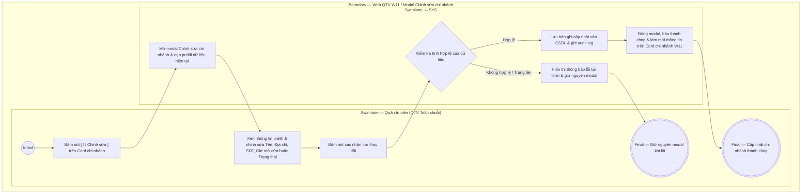

# QTV-W11-US03 - Chỉnh sửa chi nhánh

## Preconditions
- Quản trị viên (QTV) đã đăng nhập vào Web QTV bằng tài khoản có thẩm quyền cấp tối cao (Quản trị viên - Toàn chuỗi / cơ sở mẹ).
- QTV đang ở màn hình danh sách chi nhánh W11 (`QTV-W11-US01`).
- Chi nhánh cần chỉnh sửa đã tồn tại trên hệ thống.

## Trigger
- QTV cấp tối cao bấm nút **`[ 📝 Chỉnh sửa ]`** trên Card chi nhánh tương ứng.
- Màn hình liên quan: Web QTV — W11 Chi nhánh, modal **Chỉnh sửa chi nhánh**.

## Main Flow

1. QTV bấm nút **`[ 📝 Chỉnh sửa ]`** tại Card chi nhánh cần cập nhật.
2. SYS mở modal **Chỉnh sửa chi nhánh** và prefill toàn bộ dữ liệu hiện tại của chi nhánh đó.
3. QTV cập nhật các trường thông tin cần thiết:
   - Sửa **Tên chi nhánh**.
   - Cập nhật **Địa chỉ** chi tiết.
   - Cập nhật **Số điện thoại** liên hệ.
   - Cập nhật **Giờ mở cửa** hàng ngày.
   - Chuyển đổi **Trạng thái hoạt động** (`Đang hoạt động` hoặc `Tạm ngừng hoạt động`).
4. QTV bấm nút xác nhận lưu thay đổi trên modal.
5. SYS kiểm tra tính hợp lệ của dữ liệu nhập (không bỏ trống trường bắt buộc, định dạng SĐT/giờ mở cửa hợp lệ, tên chi nhánh không trùng lặp với chi nhánh khác).
6. SYS cập nhật các thay đổi vào cơ sở dữ liệu và ghi audit log (thời gian, tài khoản thực hiện, giá trị trước và sau chỉnh sửa).
7. SYS đóng modal, hiển thị thông báo thành công `Cập nhật thông tin chi nhánh thành công` và làm mới thông tin trên Card chi nhánh tại W11.

### Field-level specification — Modal Chỉnh sửa chi nhánh
| Field / control | Loại UI Control | State | Required | Conditional / dynamic | Source / validation |
| :--- | :--- | :--- | :--- | :--- | :--- |
| Mã chi nhánh | `Text Input / Display` | `READONLY` | required | Không | Hiển thị mã chi nhánh cố định (ví dụ: `CN01`); trường bị khóa chỉ đọc, không cho phép chỉnh sửa |
| Tên chi nhánh | `Text Input` | `USER-INPUT (PREFILL)` | required | Không | Prefill tên chi nhánh hiện tại, cho phép sửa đổi; độ dài 3-100 ký tự; kiểm tra không trùng lặp tên với chi nhánh khác |
| Địa chỉ | `Text Input / Textarea` | `USER-INPUT (PREFILL)` | required | Không | Prefill địa chỉ cơ sở hiện tại, cho phép sửa đổi; độ dài 5-255 ký tự |
| Số điện thoại | `Text Input (Tel)` | `USER-INPUT (PREFILL)` | required | Không | Prefill số điện thoại liên hệ hiện tại, cho phép sửa đổi; định dạng SĐT chuẩn Việt Nam |
| Giờ mở cửa | `Text Input` | `USER-INPUT (PREFILL)` | required | Không | Prefill khung giờ hoạt động hiện tại (ví dụ: `06:00 - 22:00`), cho phép sửa đổi; định dạng chuẩn `HH:mm - HH:mm` |
| Trạng thái hoạt động | `Select Dropdown` | `USER-INPUT (PREFILL)` | required | Không | Lựa chọn trạng thái hoạt động: `Đang hoạt động` (`ACTIVE`) hoặc `Tạm ngừng hoạt động` (`INACTIVE`) |

- **Business rules / logic:**
  - QTV cấp tối cao là vai trò duy nhất có quyền điều chỉnh thông tin hồ sơ và trạng thái hoạt động của các cơ sở chi nhánh trong chuỗi.
  - Mã chi nhánh (`branch_code`) là khóa cố định bất biến, luôn ở trạng thái `READONLY` nhằm đảm bảo tính toàn vẹn dữ liệu liên kết với hợp đồng gói tập, lịch sử giao dịch và phân công PT.
  - Khi chuyển trạng thái sang `Tạm ngừng hoạt động`:
    + Chi nhánh này sẽ tạm thời bị ẩn khỏi danh sách lựa chọn đăng ký gói tập mới áp dụng riêng cho cơ sở (W04).
    + Tạm khóa tính năng ghi nhận check-in ra/vào tại các cổng kiểm soát thuộc chi nhánh (W07, W12).
    + Các hội viên sở hữu gói tập toàn chuỗi vẫn được phép sử dụng quyền lợi tại các chi nhánh đang hoạt động khác.

## Exception Flows
- QTV xóa trống trường thông tin bắt buộc hoặc định dạng không hợp lệ: SYS hiển thị thông báo lỗi tại trường tương ứng và giữ nguyên modal.
- Tên chi nhánh bị trùng lặp với cơ sở khác: SYS báo lỗi "Tên chi nhánh đã tồn tại trong hệ thống, vui lòng chọn tên khác" và giữ nguyên modal.

## Activity Diagram — Swimlane
**Trigger:** QTV cấp tối cao bấm nút [ 📝 Chỉnh sửa ] tại Card chi nhánh.

