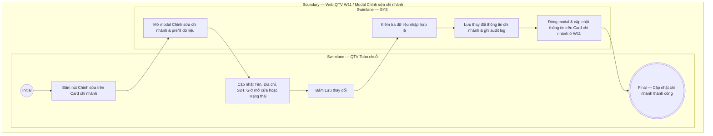

# QTV-W11-US03 - Chỉnh sửa chi nhánh

## Preconditions
- **Role / Scope:** Chỉ dành riêng cho QTV cấp tối cao (Quản trị viên - Toàn chuỗi).
- QTV đang ở màn hình danh sách chi nhánh W11 (`QTV-W11-US01`).

## Trigger
- QTV bấm nút **Chỉnh sửa** trên Card chi nhánh tương ứng.
- Màn hình liên quan: Web QTV — W11 Chi nhánh, modal **Chỉnh sửa chi nhánh**.

## Main Flow

1. QTV chọn bấm nút **Chỉnh sửa** tại Card chi nhánh cần cập nhật.
2. SYS mở modal **Chỉnh sửa chi nhánh** và prefill toàn bộ thông tin hiện tại của chi nhánh đó.
3. QTV cập nhật các trường thông tin cần thiết:
   - Chỉnh sửa **Tên chi nhánh**.
   - Cập nhật **Địa chỉ**.
   - Cập nhật **Số điện thoại** liên hệ.
   - Cập nhật **Giờ mở cửa**.
   - Thay đổi **Trạng thái hoạt động** (`Đang hoạt động` hoặc `Tạm ngừng hoạt động`).
4. QTV bấm nút **Lưu thay đổi**.
5. SYS kiểm tra tính hợp lệ của dữ liệu nhập.
6. SYS cập nhật thay đổi thông tin chi nhánh vào cơ sở dữ liệu và lưu vết audit log.
7. SYS đóng modal, hiển thị thông báo thành công và cập nhật lại thông tin trên Card chi nhánh ở W11.

### Field-level specification — Modal Chỉnh sửa chi nhánh

| Field / control | State | Required | Conditional / dynamic | Source / validation |
|---|---|---|---|---|
| Mã chi nhánh | `READONLY` | optional | `DYNAMIC`: Prefill mã chi nhánh duy nhất (ví dụ: CN01); không cho phép sửa | Dữ liệu chi nhánh được chọn |
| Tên chi nhánh | `USER-INPUT` | required | `DYNAMIC`: Prefill tên hiện tại, QTV có thể chỉnh sửa | QTV nhập / SYS validate |
| Địa chỉ | `USER-INPUT` | required | `DYNAMIC`: Prefill địa chỉ hiện tại, QTV có thể chỉnh sửa | QTV nhập |
| Số điện thoại | `USER-INPUT` | required | `DYNAMIC`: Prefill SĐT liên hệ hiện tại, QTV có thể chỉnh sửa | QTV nhập / SYS validate |
| Giờ mở cửa | `USER-INPUT` | required | `DYNAMIC`: Prefill giờ hoạt động hiện tại, QTV có thể chỉnh sửa | QTV nhập |
| Trạng thái hoạt động | `USER-INPUT` | required | `DYNAMIC`: Chọn `Đang hoạt động` hoặc `Tạm ngừng hoạt động` | Select dropdown trạng thái |

- **Business rules / logic:**
  - QTV cấp tối cao được quyền điều chỉnh thông tin hồ sơ và trạng thái hoạt động của mọi chi nhánh trong chuỗi.
  - Mã chi nhánh là cố định không được phép thay đổi (`READONLY`).

## Exception Flows
- QTV xóa trống trường bắt buộc: SYS hiển thị báo lỗi và giữ nguyên modal.

## Activity Diagram — Swimlane
**Trigger:** QTV cấp tối cao bấm nút Chỉnh sửa tại Card chi nhánh.

