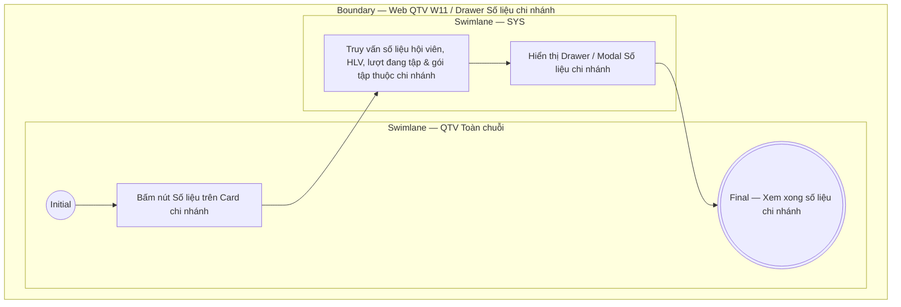

# QTV-W11-US04 - Xem số liệu chi nhánh

## Preconditions
- **Role / Scope:** Chỉ dành riêng cho QTV cấp tối cao (Quản trị viên - Toàn chuỗi).
- QTV đang ở màn hình danh sách chi nhánh W11 (`QTV-W11-US01`).

## Trigger
- QTV bấm nút **Số liệu** trên Card chi nhánh tương ứng.
- Màn hình liên quan: Web QTV — W11 Chi nhánh, Drawer / Modal **Số liệu chi nhánh**.

## Main Flow

1. QTV bấm nút **Số liệu** tại Card chi nhánh cần xem.
2. SYS nạp và hiển thị khung thông tin / Drawer **Số liệu chi nhánh**:
   - **Thống kê quy mô nhân sự & hội viên**:
     - Tổng số hội viên đăng ký tại chi nhánh.
     - Số lượng PT (Huấn luyện viên) phục vụ tại chi nhánh.
     - Số lượng hội viên đang có mặt tập luyện thực tế (Real-time Check-in).
   - **Thống kê gói & vận hành**:
     - Số lượng gói Gym & gói PT đang ở trạng thái `ACTIVE` thuộc phạm vi chi nhánh.
     - Thống kê tổng số lượt check-in và số buổi tập PT đã hoàn thành theo kỳ.
3. QTV xem các thông số vận hành tổng quan của chi nhánh.
4. QTV đóng khung số liệu khi xem xong để quay lại màn hình danh sách chi nhánh.

- **Business rules / logic:**
  - Cho phép QTV cấp tối cao truy cập nhanh các chỉ số vận hành và quy mô thực tế của từng cơ sở chi nhánh thuộc chuỗi mà không cần chuyển ngữ cảnh làm việc.

## Activity Diagram — Swimlane
**Trigger:** QTV cấp tối cao bấm nút Số liệu tại Card chi nhánh.

