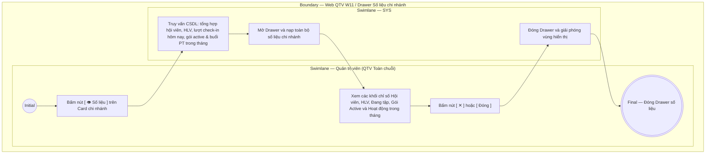

# QTV-W11-US04 - Xem số liệu chi nhánh

## Preconditions
- Quản trị viên (QTV) đã đăng nhập vào Web QTV bằng tài khoản có thẩm quyền cấp tối cao (Quản trị viên - Toàn chuỗi / cơ sở mẹ).
- QTV đang ở màn hình danh sách chi nhánh W11 (`QTV-W11-US01`).
- Chi nhánh cần xem số liệu đã tồn tại và hệ thống đã có dữ liệu vận hành liên quan.

## Trigger
- QTV cấp tối cao bấm nút **`[ 👁 Số liệu ]`** trên Card chi nhánh tương ứng.
- Màn hình liên quan: Web QTV — W11 Chi nhánh, Drawer **Số liệu chi nhánh**.

## Main Flow

1. QTV bấm nút **`[ 👁 Số liệu ]`** tại Card chi nhánh cần xem.
2. SYS truy vấn dữ liệu chi tiết của chi nhánh được chọn từ cơ sở dữ liệu.
3. SYS mở Drawer **Số liệu chi nhánh** trượt ra từ cạnh phải màn hình gồm:
   - **Phần đầu Drawer:**
     + Tiêu đề tên chi nhánh kèm mã định danh (ví dụ: `Chi nhánh Quận 1 · CN01`).
     + Badge trạng thái hoạt động: `Đang hoạt động` hoặc `Tạm ngừng hoạt động`.
     + Nút Đóng `[ ✕ ]` góc trên bên phải.
   - **Khối Thông tin vận hành chung:**
     + Địa chỉ cơ sở và số điện thoại liên hệ.
     + Khung giờ mở cửa hàng ngày (ví dụ: `06:00 - 22:00`).
   - **Khối Thống kê quy mô nhân sự & hội viên (3 Metric Boxes):**
     + Tổng số hội viên đăng ký hồ sơ tại cơ sở (ví dụ: `12 hội viên`).
     + Tổng số HLV đang được phân công thuộc chi nhánh (ví dụ: `2 HLV`).
     + Số lượng hội viên đang có mặt tập luyện thực tế (Real-time check-in, ví dụ: `4 đang tập`).
   - **Khối Thống kê dịch vụ & hoạt động trong tháng:**
     + Số lượng gói Gym, gói PT và Combo đang ở trạng thái `ACTIVE` của hội viên chi nhánh.
     + Tổng số lượt khách/hội viên check-in qua cổng tại chi nhánh trong tháng.
     + Tổng số buổi tập PT đã hoàn thành và được xác nhận kết quả trong tháng.
   - **Chân Drawer:**
     + Nút **`[ Đóng ]`** hỗ trợ thoát nhanh.
4. QTV xem các thông số vận hành tổng quan của cơ sở.
5. QTV bấm nút **`[ ✕ ]`** hoặc **`[ Đóng ]`** để đóng Drawer và quay lại màn hình danh sách thẻ chi nhánh W11.

### Field-level specification — Drawer Xem số liệu chi nhánh
| Field / control | Loại UI Control | State | Required | Conditional / dynamic | Source / validation |
| :--- | :--- | :--- | :--- | :--- | :--- |
| Nút Đóng `[ ✕ ]` | `Button (Icon Close)` | `USER-INPUT` | optional | Không | Nút icon chữ X ở góc trên bên phải Drawer; click đóng Drawer |
| Tiêu đề chi nhánh | `Drawer Heading` | `READONLY` | required | `DYNAMIC` | Tên cơ sở chi nhánh đang xem số liệu (ví dụ: `Chi nhánh Quận 1`) |
| Mã chi nhánh | `Subtext` | `READONLY` | required | `DYNAMIC` | Mã định danh duy nhất của chi nhánh (ví dụ: `CN01`) |
| Badge trạng thái | `Status Badge` | `READONLY` | required | `DYNAMIC` | Trạng thái hoạt động của cơ sở: `Đang hoạt động` (badge xanh lá) hoặc `Tạm ngừng hoạt động` (badge cam) |
| Địa chỉ cơ sở | `Text` | `READONLY` | required | `DYNAMIC` | Địa chỉ chi tiết của cơ sở chi nhánh |
| Số điện thoại & Giờ mở cửa | `Text` | `READONLY` | required | `DYNAMIC` | SĐT liên hệ và khung giờ mở cửa hàng ngày của chi nhánh |
| Chỉ số Tổng số hội viên | `Metric Box` | `READONLY` | required | `DYNAMIC` | Tổng số lượng hội viên đăng ký hồ sơ gốc tại chi nhánh này (ví dụ: `12 hội viên`) |
| Chỉ số Tổng số huấn luyện viên | `Metric Box` | `READONLY` | required | `DYNAMIC` | Tổng số HLV đang được phân công thuộc chi nhánh (ví dụ: `2 HLV`) |
| Chỉ số Hội viên đang tập thực tế | `Metric Box` | `READONLY` | required | `DYNAMIC` | Số lượng hội viên check-in có mặt tập luyện trong ngày chưa check-out (ví dụ: `4 đang tập`) |
| Gói tập đang hiệu lực | `Summary List / Badges` | `READONLY` | required | `DYNAMIC` | Thống kê số lượng gói tập đang ở trạng thái `ACTIVE` của hội viên chi nhánh (Gói Gym, Gói PT, Combo) |
| Lượt Check-in trong tháng | `Metric Text` | `READONLY` | required | `DYNAMIC` | Tổng số lượt khách/hội viên check-in qua thiết bị/quầy tại cơ sở trong tháng hiện tại |
| Buổi PT đã hoàn thành | `Metric Text` | `READONLY` | required | `DYNAMIC` | Tổng số buổi học PT đã dạy và hoàn tất xác nhận tại cơ sở trong tháng |
| Nút Đóng `[ Đóng ]` | `Button (Secondary)` | `USER-INPUT` | optional | Không | Nút bấm ở chân Drawer; click đóng Drawer quay lại danh sách W11 |

- **Business rules / logic:**
  - Drawer số liệu giúp QTV toàn chuỗi nắm bắt ngay tình hình hoạt động thực tế của từng cơ sở một cách nhanh chóng mà không cần chuyển đổi bộ chọn chi nhánh toàn cục hay rời khỏi trang quản lý.
  - Các số liệu được tổng hợp trực tiếp từ các module chuyên trách: Check-in (W07), Buổi PT (W06), Đăng ký gói (W04), Nhân sự HLV (W05).
  - Số liệu `Đang tập` phản ánh chính xác số lượng người đang hiện diện trong phòng tập tại thời điểm xem.

## Exception Flows
- Không thể tải số liệu chi nhánh: SYS hiển thị thông báo "Không thể nạp dữ liệu chi nhánh, vui lòng thử lại sau" và hiển thị các trường với giá trị mặc định `0` hoặc `-`.

## Activity Diagram — Swimlane
**Trigger:** QTV cấp tối cao bấm nút [ 👁 Số liệu ] tại Card chi nhánh.

