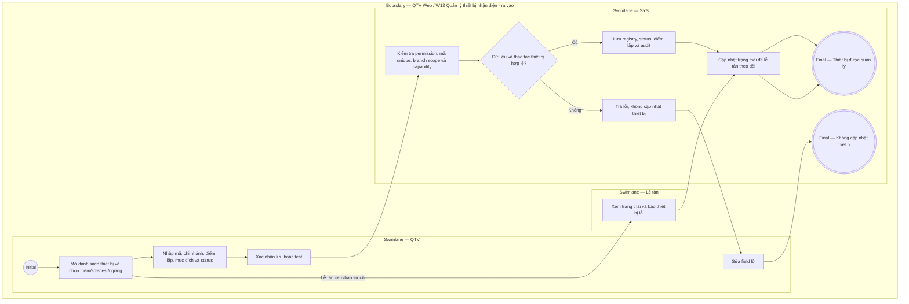

# QTV-W12-US01 - Quản lý thiết bị nhận diện - ra vào

## Preconditions
- QTV đã đăng nhập và được cấp permission quản lý thiết bị ra vào; chi nhánh lắp đặt thiết bị đã tồn tại trên hệ thống.
- QTV quản lý thiết bị theo phạm vi chi nhánh và permission; Lễ tân xem trạng thái và báo sự cố; Hội viên/PT không quản lý thiết bị.

## Trigger
- QTV thực hiện thêm mới, chỉnh sửa cấu hình, kiểm thử (test) hoặc ngừng hoạt động thiết bị nhận diện ra vào.
- Màn hình liên quan: Web QTV — W12 Hệ thống & thiết bị, modal thiết bị và kết nối.

## Main Flow
1. QTV mở màn hình W12 Hệ thống & thiết bị.
2. QTV chọn thêm mới hoặc chỉnh sửa thiết bị.
3. QTV nhập mã thiết bị, chi nhánh hiện hành, điểm lắp và mục đích IN/OUT/BOTH nếu hỗ trợ.
4. QTV cập nhật trạng thái hoặc thực hiện test thiết bị nếu cần.
5. Hệ thống kiểm tra quyền quản lý thiết bị.
6. QTV xác nhận lưu.
7. Hệ thống cập nhật danh sách thiết bị và trạng thái để lễ tân theo dõi sự cố.

### Field-level specification — Form quản lý thiết bị nhận diện
| Field / control | Loại UI Control | State | Required | Conditional / dynamic | Source / validation |
| :--- | :--- | :--- | :--- | :--- | :--- |
| Mã thiết bị | `dxTextBox` | `USER-INPUT`; `PREFILL`, `READONLY` khi sửa | required | Không: nhập khi tạo mới; không được đổi sau khi lưu | QTV nhập / Registry thiết bị; tối đa 50 ký tự, duy nhất (`UNIQUE`) |
| Tên thiết bị | `dxTextBox` | `USER-INPUT`; `PREFILL` khi sửa | required | Không | QTV nhập / Registry thiết bị; tối đa 150 ký tự |
| Loại thiết bị | `dxSelectBox` | `USER-INPUT`; `PREFILL` khi sửa | required | `TRIGGER`: điều khiển danh sách chiều ra/vào và các thông số kết nối hiện trên form | Catalog năng lực thiết bị từ API; camera, đầu đọc thẻ hoặc màn hình K01 |
| Chi nhánh | `dxSelectBox` | `USER-INPUT`; `PREFILL` từ chi nhánh đang làm việc hoặc registry khi sửa | required | `DYNAMIC`: luôn hiện, danh sách chỉ gồm chi nhánh trong branch scope của QTV | Danh mục chi nhánh / Phân quyền; phạm vi toàn chuỗi chưa chọn chi nhánh thì không tự chọn thay QTV |
| Điểm lắp | `dxTextBox` | `USER-INPUT`; `PREFILL` khi sửa | required | Không | QTV nhập / Registry thiết bị; tối đa 250 ký tự |
| Mục đích (IN / OUT / BOTH) | `dxRadioGroup` | `USER-INPUT` | required | `DYNAMIC`: phụ thuộc vào năng lực thiết bị hỗ trợ chiều ra/vào | Danh mục năng lực thiết bị |
| Trạng thái cấu hình | `dxSelectBox` | `USER-INPUT` | required | Không: chọn `Online`, `Offline`, `Error`, `Pending Sync` hoặc `Inactive`; chỉnh sửa được `PREFILL` từ giá trị cấu hình đã lưu | Catalog trạng thái thiết bị; lựa chọn của QTV được lưu vào registry và audit, không tạo heartbeat |
| Kết nối hiện tại | `Badge / Status indicator` | `READONLY` | conditional | `CONDITIONAL`: hiện khi chỉnh sửa thiết bị đã có trong registry; ẩn khi thêm mới | Kết nối do hệ thống xác định từ heartbeat, lỗi telemetry và trạng thái ngừng hoạt động; thiếu hoặc quá hạn heartbeat không được hiển thị `Online`; không thay thế trạng thái cấu hình đã lưu |
| Heartbeat gần nhất | `dxTextBox (Date/Time)` | `AUTO-FILL`, `READONLY` | conditional | `CONDITIONAL`: hiện khi API có heartbeat đã nhận; ẩn khi chưa có heartbeat | Telemetry thiết bị; ô ngày giờ chỉ đọc, không cập nhật khi chỉ lưu cấu hình |
| Kết quả test gần nhất | `Badge / Status indicator` | `AUTO-FILL`, `READONLY` | conditional | `CONDITIONAL`: hiện khi API có kết quả test thật; ẩn khi chưa có kết quả | Phản hồi adapter thiết bị; không sinh kết quả thành công giả |
| Địa chỉ IP | `dxTextBox` | `USER-INPUT`; `PREFILL` khi sửa | conditional | `CONDITIONAL`: hiện khi loại thiết bị có năng lực kết nối `ip_address`; ẩn khi chưa chọn loại hoặc loại không hỗ trợ; tùy chọn khi hiện | QTV nhập / Registry; IPv4 hoặc IPv6 hợp lệ; xóa giá trị thì lưu rỗng |
| Địa chỉ kết nối (Endpoint) | `dxTextBox` | `USER-INPUT`; `PREFILL` khi sửa | conditional | `CONDITIONAL`: hiện khi catalog loại thiết bị khai báo `endpoint`; ẩn khi chưa chọn loại hoặc không khai báo; tùy chọn khi hiện | Catalog adapter và registry; catalog hiện tại chưa bật trường này |
| Thông tin xác thực | `dxTextBox (Password)` | `USER-INPUT` | conditional | `CONDITIONAL`: hiện khi catalog loại thiết bị khai báo `credential`; ẩn khi chưa chọn loại hoặc không khai báo; tùy chọn khi hiện | QTV cung cấp qua ô mật khẩu, không tự điền bí mật đã lưu; catalog hiện tại chưa bật trường này |
| Cập nhật lúc | `dxTextBox (Date/Time)` | `AUTO-FILL`, `READONLY` | conditional | `CONDITIONAL`: hiện khi chỉnh sửa bản ghi có sẵn; ẩn khi tạo mới | Thời điểm cập nhật từ API; ô ngày giờ chỉ đọc |
| Người cập nhật | `dxTextBox` | `AUTO-FILL`, `READONLY` | conditional | `CONDITIONAL`: hiện khi chỉnh sửa bản ghi có sẵn; ẩn khi tạo mới | Tên tác nhân từ audit API; hiển thị `--` khi dữ liệu cũ chưa có, không suy đoán người thao tác |

- **Business rules / logic:**
  - Mỗi thiết bị sở hữu mã định danh duy nhất, gắn với một chi nhánh hiện hành, vị trí lắp đặt và mục đích chiều ra/vào.
  - Xóa vật lý thiết bị không áp dụng; sử dụng trạng thái ngừng hoạt động (`Inactive`) khi ngừng sử dụng.
  - Trạng thái thiết bị phản ánh trung thực kết quả đồng bộ và tín hiệu nhịp tim (heartbeat) gần nhất.
  - Lưu trạng thái cấu hình không đồng nghĩa thiết bị đã kết nối. Danh sách và màn hình theo dõi dùng trạng thái hiệu lực; form/chi tiết tách riêng cấu hình đã lưu và kết nối hiện tại.

## Alternate Flows
### AF-01 — Chuyển nơi lắp thiết bị
1. QTV mở thiết bị cần chuyển.
2. QTV chọn chi nhánh hoặc điểm lắp mới.
3. Hệ thống yêu cầu xác nhận thay đổi.
4. Hệ thống cập nhật nơi lắp hiện hành và giữ lịch sử bối cảnh cũ cho event đã phát sinh.

### AF-02 — Lễ tân báo sự cố thiết bị
1. Lễ tân mở trạng thái thiết bị trong chi nhánh.
2. Lễ tân thấy thiết bị Offline, Error hoặc Pending Sync.
3. Lễ tân ghi nhận hoặc báo sự cố cho QTV.

### AF-03 — Nhu cầu khóa/cổng xoay
1. QTV ghi nhận nhu cầu điều khiển khóa/cổng xoay thật.
2. Hệ thống xác định đây là phạm vi mở rộng chưa mặc định có.
3. Nhu cầu được đưa về Open Question trước khi triển khai.

## Exception Flows
- Thiết bị thiếu mã hoặc chi nhánh hiện hành thì không được lưu.
- Người không có permission thiết bị không được thêm/sửa/test/ngừng hoạt động.
- Không hiển thị dữ liệu cũ như realtime khi thiết bị đang offline hoặc pending sync.

- **Open Question:**
  - OPEN-07: Nếu muốn điều khiển khóa/cổng xoay thật, cần chốt phạm vi nghiệp vụ và trách nhiệm vận hành.

## Activity Diagram — Swimlane
**Trigger:** QTV chọn thêm mới, chỉnh sửa hoặc test thiết bị nhận diện ra vào.

