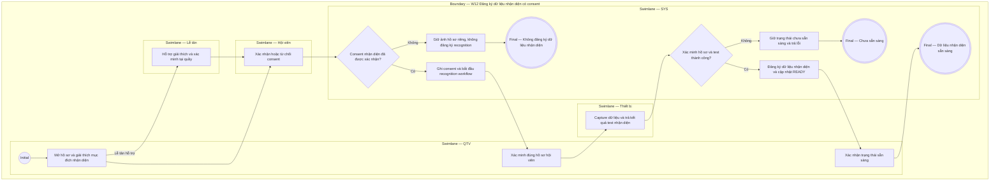

# QTV-W12-US02 - Đăng ký dữ liệu nhận diện có consent

## Preconditions
- Người thực hiện đã đăng nhập, hồ sơ hội viên hợp lệ đã tồn tại và người thực hiện có quyền quản lý dữ liệu nhận diện.
- QTV/Lễ tân thao tác đăng ký khi có sự đồng ý (consent) của Hội viên; Hội viên chỉ consent cho dữ liệu của chính mình.

## Trigger
- Hội viên đồng ý đăng ký dữ liệu nhận diện khuôn mặt / sinh trắc để phục vụ ra/vào phòng tập.
- Màn hình liên quan: Web QTV — W12 Hệ thống & thiết bị, modal thêm/sửa hồ sơ hội viên.

## Main Flow
1. Người thực hiện mở hồ sơ hội viên hoặc màn hình thiết bị/nhận diện.
2. Người thực hiện giải thích mục đích sử dụng dữ liệu nhận diện.
3. Hội viên xác nhận consent phù hợp.
4. Người thực hiện xác minh đúng hồ sơ hội viên.
5. Người thực hiện đăng ký dữ liệu nhận diện.
6. Hệ thống hỗ trợ thử nhận diện.
7. Người thực hiện xác nhận trạng thái sẵn sàng cho hội viên.

### Field-level specification — Quy trình đăng ký nhận diện có consent
| Field / control | Loại UI Control | State | Required | Conditional / dynamic | Source / validation |
| :--- | :--- | :--- | :--- | :--- | :--- |
| Hội viên / Mục đích sử dụng | `Card / Summary info` | `READONLY (PREFILL)` | required | `DYNAMIC`: nạp thông tin hội viên và mục đích sử dụng dữ liệu nhận diện | Hồ sơ hội viên / Cấu hình consent |
| Xác minh hồ sơ | `dxCheckBox` | `USER-INPUT` | required | `DYNAMIC`: người thực hiện đối chiếu thông tin định danh hội viên tại quầy | Người thực hiện xác minh |
| Tích chọn consent | `dxCheckBox` | `USER-INPUT` | required | `DYNAMIC`: bắt buộc hội viên xác nhận đồng ý trước khi capture dữ liệu | Hội viên đồng ý / Consent store |
| Thiết bị đăng ký | `dxSelectBox` | `USER-INPUT` | required | `DYNAMIC`: chọn thiết bị capture nhận diện đang kết nối | Danh mục thiết bị hoạt động |
| Kết quả capture / Test nhận diện | `Badge / Status indicator` | `AUTO-FILL` + `READONLY` | required | `DYNAMIC`: tự động hiển thị kết quả xử lý từ thiết bị | Thiết bị nhận diện trả về |
| Ảnh hồ sơ | `Avatar / Image display` | `READONLY` | optional | `DYNAMIC`: hiển thị ảnh đại diện hồ sơ nếu có (không tự ý dùng làm dữ liệu nhận diện) | Hồ sơ hội viên |
| Nhật ký consent & audit | `dxTextBox (Date/Time)` | `AUTO-FILL` + `READONLY` | required | `DYNAMIC`: hệ thống tự ghi phiên bản consent, thời điểm, người thực hiện | Hệ thống lưu audit trail |

- **Business rules / logic:**
  - Quy trình đăng ký nhận diện tuân thủ chặt chẽ các bước: giải thích mục đích, thu thập consent, đối chiếu hồ sơ, capture dữ liệu, test thử nghiệm, xác nhận trạng thái `READY`.
  - Ảnh hồ sơ thông thường không tự động trở thành dữ liệu nhận diện khuôn mặt sinh trắc.
  - Hệ thống tuyệt đối không lưu trữ dữ liệu sinh trắc học dạng thô trong nhật ký audit nghiệp vụ.

## Alternate Flows
### AF-01 — Hội viên từ chối consent
1. Người thực hiện giải thích mục đích nhận diện.
2. Hội viên từ chối consent.
3. Hệ thống không đăng ký dữ liệu nhận diện.
4. Nhân sự hướng dẫn phương án ra/vào khác nếu chi nhánh cho phép.

### AF-02 — Chỉ có ảnh hồ sơ
1. Hồ sơ hội viên có ảnh đại diện.
2. Người thực hiện chưa thực hiện quy trình đăng ký nhận diện.
3. Hệ thống giữ ảnh này là ảnh hồ sơ, không dùng như dữ liệu nhận diện.

## Exception Flows
- Không có consent thì không được sử dụng dữ liệu nhận diện.
- Xác minh sai hồ sơ thì phải dừng và xử lý lại.
- Có lỗi khi thử nhận diện: trạng thái sẵn sàng không được xác nhận cho tới khi xử lý xong.

- **Open Question:**
  - OPEN-05: Quy trình xóa dữ liệu cá nhân theo yêu cầu hội viên cần được chốt riêng.

## Activity Diagram — Swimlane
**Trigger:** Hội viên đồng ý đăng ký dữ liệu nhận diện ra vào.

