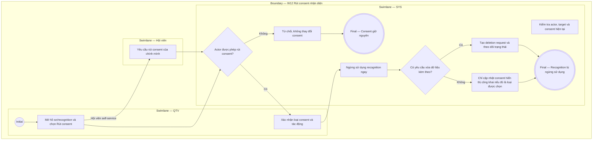

# QTV-W12-US03 - Rút consent nhận diện

## Preconditions
- Người thực hiện đã đăng nhập hoặc ở ngữ cảnh self-service của Hội viên; dữ liệu nhận diện hoặc consent nhận diện của Hội viên đã tồn tại.
- QTV có permission cập nhật consent xử lý yêu cầu của Hội viên; Hội viên có quyền tự quản lý rút consent đối với dữ liệu của chính mình.

## Trigger
- Hội viên yêu cầu rút lại sự đồng ý (consent) sử dụng dữ liệu nhận diện khuôn mặt / sinh trắc.
- Màn hình liên quan: Web QTV — W12 Hệ thống & thiết bị, modal thiết bị và kết nối.

## Main Flow
1. Người thực hiện mở hồ sơ hội viên hoặc phần nhận diện.
2. Người thực hiện chọn rút consent nhận diện.
3. Hệ thống hiển thị tác động: ngừng sử dụng nhận diện và theo dõi yêu cầu xóa nếu có.
4. Người thực hiện xác nhận yêu cầu.
5. Hệ thống ngừng sử dụng dữ liệu nhận diện của hội viên.
6. Hệ thống ghi nhận trạng thái yêu cầu xóa đến khi hoàn tất nếu có yêu cầu xóa.
7. Nhân sự hỗ trợ hội viên bằng phương án check-in khác trong phạm vi chi nhánh.

### Field-level specification — Form/Modal rút consent nhận diện
| Field / control | Loại UI Control | State | Required | Conditional / dynamic | Source / validation |
| :--- | :--- | :--- | :--- | :--- | :--- |
| Hội viên | `Card / Summary info` | `READONLY (PREFILL)` | required | `DYNAMIC`: nạp thông tin chủ thể consent từ hồ sơ hội viên | Hồ sơ hội viên |
| Loại consent cần rút | `dxSelectBox` | `USER-INPUT` | required | `DYNAMIC`: chọn loại consent nhận diện / hiển thị công khai từ danh mục | Danh mục consent |
| Cảnh báo tác động | `Alert banner` | `AUTO-FILL` + `READONLY` | required | `DYNAMIC`: hệ thống tự động hiển thị thông báo ngừng tính năng nhận diện tự động | Quy tắc consent & recognition |
| Yêu cầu xóa dữ liệu nhận diện | `dxCheckBox` | `USER-INPUT` | conditional | `CONDITIONAL`: **Hiện khi** hội viên đã có dữ liệu nhận diện được lưu trữ; **Ẩn khi** chưa từng đăng ký dữ liệu nhận diện | Hội viên / QTV chọn |
| Xác nhận rút consent | `dxCheckBox` | `USER-INPUT` | conditional | `CONDITIONAL`: **Hiện khi** người thực hiện có quyền quản trị hoặc đúng chính chủ; **Ẩn khi** không đủ thẩm quyền | Thao tác người thực hiện |
| Trạng thái consent & audit trail | `Badge / Status indicator` | `AUTO-FILL` + `READONLY` | required | `DYNAMIC`: hệ thống tự ghi nhận trạng thái `REVOKED`, người thực hiện và thời gian | Hệ thống lưu nhật ký audit |
| Lịch sử vào / ra định danh | `dxDataGrid (Readonly)` | `READONLY` | conditional | `CONDITIONAL`: **Hiện khi** tài khoản đã có lịch sử ra/vào lưu vết trong 12 tháng; **Ẩn khi** chưa có lượt check-in nào | Nhật ký sự kiện vào/ra |

- **Business rules / logic:**
  - Thao tác rút consent lập tức vô hiệu hóa tính năng nhận diện tự động của hội viên trên các thiết bị.
  - Phân định rõ consent nhận diện với consent nhận thông báo, chăm sóc, marketing hoặc hiển thị sinh nhật công khai.
  - Rút consent không tự động xóa dữ liệu nhật ký ra/vào lịch sử (retention policy 12 tháng) trừ khi có quy trình xóa được phê duyệt riêng.

## Alternate Flows
### AF-01 — Rút consent hiển thị công khai
1. Hội viên chỉ rút consent hiển thị công khai như tên, ảnh hoặc sinh nhật.
2. Hệ thống cập nhật consent hiển thị công khai.
3. Các consent khác như thông báo giao dịch vẫn giữ nguyên nếu còn phù hợp.

### AF-02 — QTV theo dõi yêu cầu cần hoàn tất
1. QTV mở danh sách yêu cầu liên quan đến dữ liệu nhận diện.
2. Hệ thống hiển thị trạng thái yêu cầu rút consent/xóa nếu có.
3. QTV xử lý hoặc theo dõi tới khi hoàn tất trong phạm vi được cấp.

## Exception Flows
- Người không có quyền không được rút consent thay hội viên.
- Nhận diện không được tiếp tục dùng sau khi consent đã rút.
- Có yêu cầu xóa dữ liệu cá nhân nhưng quy trình chưa được chốt: hệ thống ghi nhận nhu cầu và chuyển xử lý theo Open Question.

- **Open Question:**
  - OPEN-05: Quy trình xóa dữ liệu cá nhân theo yêu cầu hội viên cần được chốt riêng.

## Activity Diagram — Swimlane
**Trigger:** Hội viên hoặc QTV chọn thao tác rút consent nhận diện.

