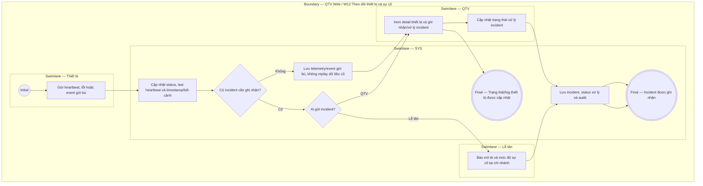

# QTV-W12-US04 - Theo dõi trạng thái và sự cố thiết bị

## Preconditions
- QTV đã đăng nhập, thiết bị đã được khai báo thuộc chi nhánh và QTV có permission theo dõi/quản lý thiết bị.
- QTV xem và quản lý thiết bị theo branch scope và permission được cấp; Lễ tân xem trạng thái và báo sự cố tại quầy; Hội viên không truy cập.

## Trigger
- QTV mở màn hình W12 để theo dõi trạng thái thiết bị hoặc chọn thao tác Ghi nhận sự cố; hoặc hệ thống tự động tiếp nhận tín hiệu sự cố từ thiết bị.
- Màn hình liên quan: Web QTV — W12 Hệ thống & thiết bị, modal thiết bị và kết nối.

## Main Flow
1. SYS cập nhật trạng thái thiết bị `Online`, `Offline`, `Error` hoặc `Pending Sync`.
2. QTV mở danh sách thiết bị và lọc theo branch/status.
3. QTV mở thiết bị để xem last heartbeat, lỗi và sự kiện liên quan.
4. Nếu có sự cố, QTV/lễ tân nhập thông tin theo bảng field-level specification và gửi ghi nhận.
5. SYS lưu incident, cập nhật trạng thái xử lý và giữ log kỹ thuật.
6. Khi thiết bị gửi bù event, SYS giữ timestamp/bối cảnh phát sinh và không phát lại trải nghiệm cũ trên K01.

### Field-level specification — Modal Ghi nhận & xử lý sự cố thiết bị
| Field / control | Loại UI Control | State | Required | Conditional / dynamic | Source / validation |
| :--- | :--- | :--- | :--- | :--- | :--- |
| Chọn thiết bị | `dxSelectBox` | `USER-INPUT` | required | `DYNAMIC`: chọn thiết bị bị sự cố từ danh sách đang kết nối | Registry thiết bị |
| Mô tả sự cố | `dxTextArea` | `USER-INPUT` | required | `DYNAMIC`: nhập mô tả chi tiết sự cố thiết bị | QTV / Lễ tân nhập |
| Mức độ sự cố | `dxSelectBox` | `USER-INPUT` | required | `DYNAMIC`: chọn mức độ ưu tiên xử lý (`Thấp`, `Trung bình`, `Cao`, `Nghiêm trọng`) | Catalog mức độ sự cố |
| Trạng thái xử lý sự cố | `dxSelectBox` | `USER-INPUT` | required | `DYNAMIC`: QTV cập nhật tiến độ (`Open`, `In progress`, `Resolved`) | Catalog trạng thái workflow |

- **Business rules / logic:**
  - Thiết bị lỗi không được là lý do để hội viên vượt rào qua cổng mà không đủ điều kiện gói; trường hợp sự cố chuyển sang xử lý thủ công tại W07.
  - Các sự kiện gửi bù phải bảo lưu đúng timestamp phát sinh ban đầu, không được phát lại như sự kiện thời gian thực (realtime) trên K01.
  - Log kỹ thuật thiết bị lưu trữ theo thời hạn retention; dữ liệu ra/vào lịch sử bảo lưu theo chính sách nghiệp vụ.

## Alternate Flows
### AF-01 — Lễ tân báo sự cố
1. Lễ tân chọn thiết bị lỗi/offline/pending sync.
2. Lễ tân nhập mô tả sự cố và gửi ghi nhận.
3. QTV xem incident trong branch scope để xử lý.

### AF-02 — QTV ngừng hoạt động thiết bị
1. QTV chọn thiết bị không còn sử dụng.
2. SYS yêu cầu xác nhận và kiểm tra permission.
3. SYS cập nhật trạng thái ngừng hoạt động nhưng giữ lịch sử event.

## Exception Flows
- Dữ liệu event gửi bù không được hiển thị như dữ liệu realtime.
- Thiết bị lỗi khi hội viên cần vào tập: nhân sự chuyển sang `QTV-W07-US02` và vẫn kiểm tra điều kiện gói.
- Người không có permission không được ngừng thiết bị hoặc xem log nhạy cảm.
- Không tìm thấy thiết bị trong branch scope: từ chối truy cập.

- **Open Question:**
  - OPEN-07: Điều khiển khóa/cổng xoay thật chưa thuộc phạm vi cơ sở.

## Activity Diagram — Swimlane
**Trigger:** QTV xem trạng thái thiết bị hoặc QTV/Lễ tân mở modal báo sự cố.

