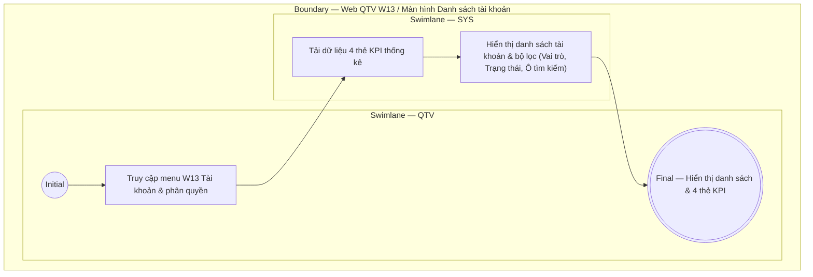

# QTV-W13-US01 - Xem danh sách tài khoản và thống kê KPI

## Preconditions
- QTV đã đăng nhập vào Web QTV và được cấp quyền truy cập menu W13 Tài khoản & phân quyền.

## Trigger
- QTV chọn menu **W13 · Tài khoản & phân quyền** trên thanh điều hướng chính.
- Màn hình liên quan: Web QTV — W13 Tài khoản & phân quyền.

## Main Flow

1. QTV truy cập vào menu W13.
2. SYS tải và hiển thị 4 thẻ KPI thống kê tổng quan ở phía trên:
   - **Tổng tài khoản hệ thống**: Số lượng tài khoản (Định danh SĐT duy nhất).
   - **Tài khoản đang Hoạt động**: Số tài khoản có thể đăng nhập hệ thống (`ACTIVE`).
   - **Tài khoản Chờ kích hoạt**: Số tài khoản chưa xác thực OTP/mật khẩu (`PENDING_ACTIVATION`).
   - **Tài khoản Đã khóa / Tạm dừng**: Số tài khoản bị khóa hoặc ngừng sử dụng (`LOCKED` / `INACTIVE`).
3. SYS hiển thị bộ công cụ tìm kiếm và lọc:
   - Ô tìm kiếm: Nhập SĐT đăng nhập hoặc Tên người dùng.
   - Bộ lọc Vai trò (Role pills): `Tất cả`, `QTV`, `Lễ tân`, `PT`, `Hội viên`.
   - Combobox lọc Trạng thái: `Trạng thái: Tất cả` (Hoạt động, Chờ kích hoạt, Đã khóa, Ngừng sử dụng).
4. SYS hiển thị danh sách tài khoản dưới dạng bảng gồm các cột:
   - **SĐT Đăng nhập**: Số điện thoại duy nhất dùng để đăng nhập.
   - **Người sử dụng**: Tên người dùng và mã hồ sơ liên kết bên dưới (ví dụ: `Nguyễn Văn An` / `Hồ sơ: HV001`).
   - **Vai trò (Role)**: Nhãn vai trò được cấp (`Hội viên`, `Lễ tân`, `PT (Huấn luyện viên)`, `QTV (Quản trị viên)`).
   - **Chi nhánh áp dụng**: Chi nhánh hoạt động được phân công (`Quận 1`, `Bình Thạnh`, `Toàn hệ thống`).
   - **Trạng thái**: Nhãn trạng thái tài khoản (`Hoạt động`, `Đã khóa`, `Chờ kích hoạt`, `Ngừng sử dụng`).
   - **Thao tác**: Nút **Sửa** (mở modal Sửa tài khoản).

- **Business rules / logic:**
  - Màn hình xem danh sách tài khoản là read-only, hỗ trợ tìm kiếm theo SĐT, tên người dùng và lọc theo vai trò / trạng thái.
  - Từ mỗi dòng tài khoản, QTV có thể nhấn nút **Sửa** để kích hoạt luồng `QTV-W13-US02 - Sửa tài khoản`.

## Exception Flows
- QTV không có quyền truy cập W13: SYS hiển thị thông báo từ chối truy cập.

## Activity Diagram — Swimlane
**Trigger:** QTV chọn menu W13 Tài khoản & phân quyền.

