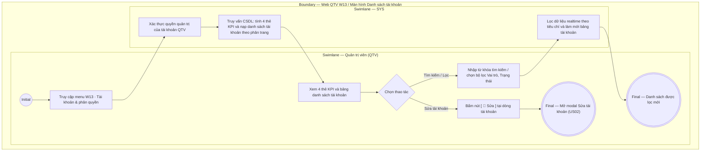

# QTV-W13-US01 - Xem danh sách tài khoản và thống kê KPI

## Preconditions
- Quản trị viên (QTV) đã đăng nhập vào Web QTV và được cấp quyền quản trị danh mục tài khoản và phân quyền.
- Hệ thống đã có danh sách tài khoản người dùng, phân vai trò và dữ liệu phân công chi nhánh tương ứng.

## Trigger
- QTV chọn menu **W13 · Tài khoản & phân quyền** trên thanh điều hướng chính.
- Màn hình liên quan: Web QTV — Màn hình `W13 · Tài khoản & phân quyền`.

## Main Flow

1. QTV truy cập vào menu **W13 · Tài khoản & phân quyền**.
2. SYS xác thực quyền truy cập của tài khoản QTV.
3. SYS truy vấn cơ sở dữ liệu và hiển thị giao diện quản trị tài khoản gồm:
   - **Hàng 4 Thẻ KPI Chỉ số tài khoản:**
     + `Tổng tài khoản`: Tổng số tài khoản đăng ký theo định danh SĐT duy nhất trên toàn hệ thống.
     + `Đang hoạt động`: Số tài khoản có trạng thái `ACTIVE` đã kích hoạt và được phép đăng nhập.
     + `Chờ kích hoạt`: Số tài khoản `PENDING_ACTIVATION` (đã có hồ sơ tại phòng tập nhưng người dùng chưa kích hoạt tài khoản App qua OTP/mật khẩu).
     + `Đã khóa`: Số tài khoản có trạng thái `LOCKED` bị tạm dừng hoặc ngừng sử dụng, không được phép đăng nhập.
   - **Thanh công cụ Tìm kiếm & Bộ lọc:**
     + Ô tìm kiếm: Nhập SĐT đăng nhập, Tên người dùng hoặc Mã hồ sơ liên kết.
     + Bộ lọc Vai trò: Các tab chọn nhanh `Tất cả`, `Quản trị viên`, `Lễ tân`, `Huấn luyện viên PT`, `Hội viên`.
     + Bộ lọc Trạng thái: Dropdown chọn `Tất cả`, `Hoạt động`, `Chờ kích hoạt`, `Đã khóa`.
     + Nút Đặt lại bộ lọc.
   - **Bảng dữ liệu danh sách Tài khoản (Data Table):**
     + Cột `SĐT Đăng nhập`: Số điện thoại duy nhất dùng đăng nhập.
     + Cột `Người sử dụng`: Tên người dùng in đậm kèm dòng phụ mã hồ sơ (ví dụ: `Lê Thị Thanh Hà` / `Hồ sơ: PT001`).
     + Cột `Vai trò`: Badge màu phân biệt vai trò (`QTV`, `Lễ tân`, `PT`, `Hội viên`).
     + Cột `Chi nhánh áp dụng`: Tên chi nhánh phân công (`Quận 1`, `Bình Thạnh`, `Toàn hệ thống`).
     + Cột `Trạng thái`: Badge trạng thái (`Hoạt động` - xanh lá, `Chờ kích hoạt` - vàng, `Đã khóa` - đỏ/xám).
     + Cột `Thao tác`: Nút **`[ 📝 Sửa ]`** trên từng dòng để mở modal phân quyền.
   - **Khối Phân trang (Pagination):** Dropdown số dòng/trang (`10`, `20`, `50`) và cụm nút chuyển trang.
4. QTV có thể nhập từ khóa tìm kiếm hoặc bấm chuyển đổi bộ lọc để tra cứu tài khoản cần quản trị.
5. Khi QTV bấm nút **`[ 📝 Sửa ]`** tại một dòng tài khoản, SYS kích hoạt mở modal Sửa tài khoản & Phân quyền (`QTV-W13-US02`).

### Field-level specification — Màn hình Danh sách tài khoản (W13)
| Field / control | Loại UI Control | State | Required | Conditional / dynamic | Source / validation |
| :--- | :--- | :--- | :--- | :--- | :--- |
| Thẻ KPI Tổng tài khoản | `Metric Card` | `READONLY` | required | `DYNAMIC` | Tổng số lượng tài khoản tồn tại trên hệ thống (định danh SĐT duy nhất) |
| Thẻ KPI Đang hoạt động | `Metric Card` | `READONLY` | required | `DYNAMIC` | Số lượng tài khoản có trạng thái `ACTIVE` |
| Thẻ KPI Chờ kích hoạt | `Metric Card` | `READONLY` | required | `DYNAMIC` | Số lượng tài khoản có trạng thái `PENDING_ACTIVATION` |
| Thẻ KPI Đã khóa | `Metric Card` | `READONLY` | required | `DYNAMIC` | Số lượng tài khoản có trạng thái `LOCKED` (tài khoản bị khóa do vi phạm hoặc ngừng sử dụng) |
| Ô tìm kiếm tài khoản | `Search Input` | `USER-INPUT` | optional | `TRIGGER` | Ô nhập từ khóa tìm kiếm theo SĐT, Họ tên hoặc Mã hồ sơ liên kết; nhấn Enter hoặc lọc realtime |
| Bộ lọc Vai trò | `Segmented Pills / Select` | `USER-INPUT (PREFILL)` | optional | `TRIGGER` | Tùy chọn lọc theo vai trò: `Tất cả` (mặc định), `QTV`, `Lễ tân`, `PT`, `Hội viên` |
| Bộ lọc Trạng thái | `Select Dropdown` | `USER-INPUT (PREFILL)` | optional | `TRIGGER` | Tùy chọn lọc theo 3 trạng thái tài khoản: `Tất cả` (mặc định), `Hoạt động`, `Chờ kích hoạt`, `Đã khóa` |
| Nút Đặt lại | `Button (Outline)` | `USER-INPUT` | optional | Không | Nút viền xám; click khôi phục toàn bộ tiêu chí tìm kiếm và bộ lọc về mặc định ban đầu |
| Bảng tài khoản — Cột SĐT Đăng nhập | `Text / Phone` | `READONLY` | required | `DYNAMIC` | Số điện thoại duy nhất đóng vai trò là tài khoản định danh đăng nhập |
| Bảng tài khoản — Cột Người sử dụng | `Text (Bold) + Subtext` | `READONLY` | required | `DYNAMIC` | Họ tên người sử dụng (chữ đậm) kèm mã hồ sơ liên kết dòng dưới (ví dụ: `Hồ sơ: HV001` hoặc `Hồ sơ: PT001`) |
| Bảng tài khoản — Cột Vai trò | `Status Badge` | `READONLY` | required | `DYNAMIC` | Vai trò được cấp: `Quản trị viên` (tím), `Lễ tân` (xanh dương), `PT` (cam), `Hội viên` (xanh lá) |
| Bảng tài khoản — Cột Chi nhánh áp dụng | `Text` | `READONLY` | required | `DYNAMIC` | Chi nhánh làm việc được phân công (ví dụ: `Quận 1`, `Bình Thạnh`, `Toàn hệ thống`) |
| Bảng tài khoản — Cột Trạng thái | `Status Badge` | `READONLY` | required | `DYNAMIC` | Trạng thái tài khoản: `Hoạt động` (xanh lá), `Chờ kích hoạt` (vàng), `Đã khóa` (đỏ/xám) |
| Bảng tài khoản — Nút Sửa `[ 📝 Sửa ]` | `Button (Secondary Dark)` | `USER-INPUT` | optional | Không | Nút chỉnh sửa tại từng dòng; click mở modal Sửa tài khoản & Phân quyền (US02) |
| Bộ chọn số dòng / trang | `Select Dropdown` | `USER-INPUT (PREFILL)` | optional | `TRIGGER` | Lựa chọn hiển thị `10`, `20`, `50` bản ghi trên một trang |
| Cụm nút chuyển trang | `Pagination Controls` | `USER-INPUT` | optional | `DYNAMIC` | Nút Trang trước (`<`), Trang sau (`>`), số trang hiện tại và tổng số trang |

- **Business rules / logic:**
  - **Quy chuẩn 3 trạng thái tài khoản:**
    + Hệ thống gom `Đã khóa` và `Ngừng sử dụng` thành một trạng thái duy nhất là **`Đã khóa` (`LOCKED`)** để tránh phân tán và nhập nhằng dữ liệu quản trị (đều mang ý nghĩa vô hiệu hóa, chặn hoàn toàn quyền đăng nhập).
    + Do đó hệ thống chỉ có đúng 3 trạng thái: `Hoạt động` (`ACTIVE`), `Chờ kích hoạt` (`PENDING_ACTIVATION`) và `Đã khóa` (`LOCKED`).
  - **Bản chất của trạng thái `Chờ kích hoạt` (`PENDING_ACTIVATION`):**
    + Khi Lễ tân hoặc QTV tạo một **Hồ sơ hội viên** (W02) hoặc **Hồ sơ PT** (W05) tại quầy, hệ thống tự động khởi tạo sẵn một bản ghi Tài khoản với định danh là Số điện thoại của người đó ở trạng thái `Chờ kích hoạt`.
    + Lúc này, hội viên/PT đó vẫn **chưa tải app, chưa nhận OTP xác thực số điện thoại và chưa đặt mật khẩu lần đầu**.
    + Khi người dùng tải App Mobile về, nhập SĐT $\rightarrow$ nhận OTP xác thực $\rightarrow$ đặt mật khẩu lần đầu thành công thì tài khoản mới chính thức chuyển sang trạng thái `Hoạt động` (`ACTIVE`).
    + Do đó, **Số lượng "Chờ kích hoạt" chính là: Số người ĐÃ CÓ HỒ SƠ tại phòng tập nhưng CHƯA TỪNG KÍCH HOẠT TÀI KHOẢN APP để sử dụng**.

## Exception Flows
- QTV không có quyền truy cập W13: SYS từ chối quyền truy cập, hiển thị thông báo lỗi 403 Forbidden và điều hướng về trang Tổng quan W01.
- Không tìm thấy tài khoản phù hợp với từ khóa/bộ lọc: Bảng hiển thị thông báo "Không tìm thấy tài khoản nào phù hợp" kèm nút Đặt lại bộ lọc.

## Activity Diagram — Swimlane
**Trigger:** QTV chọn menu W13 Tài khoản & phân quyền trên thanh điều hướng chính.

