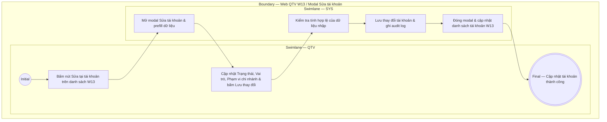

# QTV-W13-US02 - Sửa tài khoản

## Preconditions
- QTV đã đăng nhập vào Web QTV, có quyền quản lý tài khoản và đang xem danh sách tài khoản tại W13.

## Trigger
- QTV bấm nút **Sửa** tại dòng tài khoản tương ứng trên màn hình W13 Danh sách tài khoản.
- Màn hình liên quan: Web QTV — W13 Tài khoản & phân quyền, modal **Sửa tài khoản**.

## Main Flow

1. QTV chọn nút **Sửa** tại dòng tài khoản cần chỉnh sửa trên màn hình W13.
2. SYS mở modal **Sửa tài khoản** và prefill thông tin tài khoản được chọn.
3. QTV thực hiện cập nhật các thông tin tài khoản:
   - Thay đổi **Trạng thái tài khoản** (ví dụ: `ACTIVE`, `INACTIVE`, `LOCKED`, `PENDING_ACTIVATION`).
   - Cập nhật **Vai trò** (chọn 1 hoặc nhiều vai trò: `MEMBER`, `PT`, `RECEPTIONIST`, `QTV`).
   - Cập nhật **Phạm vi chi nhánh** (nếu tài khoản có vai trò nhân viên PT, Lễ tân, QTV).
4. QTV bấm nút **Lưu thay đổi**.
5. SYS kiểm tra tính hợp lệ của dữ liệu:
   - Trạng thái tài khoản và Vai trò là các trường bắt buộc.
   - Phạm vi chi nhánh được áp dụng phù hợp khi tài khoản có vai trò nhân viên.
6. SYS lưu thông tin cập nhật vào hệ thống và ghi nhận audit log (QTV thực hiện, thời gian, dữ liệu trước/sau).
7. SYS đóng modal, hiển thị thông báo thành công và làm mới danh sách tài khoản W13.

### Field-level specification — Modal Sửa tài khoản

| Field / control | State | Required | Conditional / dynamic | Source / validation |
|---|---|---|---|---|
| SĐT đăng nhập | `READONLY` | optional | `DYNAMIC`: Prefill SĐT đăng nhập duy nhất của tài khoản; không được chỉnh sửa trực tiếp | Dữ liệu tài khoản chọn sửa |
| Trạng thái tài khoản | `USER-INPUT` | required | `DYNAMIC`: Chọn từ danh sách trạng thái (`ACTIVE`, `INACTIVE`, `LOCKED`, `PENDING_ACTIVATION`) | Dropdown trạng thái tài khoản |
| Vai trò | `USER-INPUT` | required | `DYNAMIC`: Chọn một hoặc nhiều vai trò (`MEMBER`, `PT`, `RECEPTIONIST`, `QTV`) | Tags multi-select vai trò |
| Phạm vi chi nhánh | `USER-INPUT` | optional | `CONDITIONAL`: Chỉ áp dụng đối với các vai trò nhân viên (`PT`, `RECEPTIONIST`, `QTV`) | Select dropdown danh mục chi nhánh |

- **Business rules / logic:**
  - SĐT đăng nhập là duy nhất và không được chỉnh sửa trực tiếp tại modal này (`READONLY`).
  - Một tài khoản có thể được phân công nhiều vai trò cùng lúc (Multi-select tags). Quyền không tự cộng gộp ngoài phạm vi được cấp.
  - Phạm vi chi nhánh chỉ có hiệu lực áp dụng với các vai trò nhân viên (`PT`, `Lễ tân`, `QTV`).

## Exception Flows
- QTV bỏ trống trường bắt buộc (Trạng thái hoặc Vai trò): SYS hiển thị cảnh báo lỗi và giữ nguyên modal.

## Activity Diagram — Swimlane
**Trigger:** QTV bấm nút Sửa tại tài khoản trong danh sách W13.

