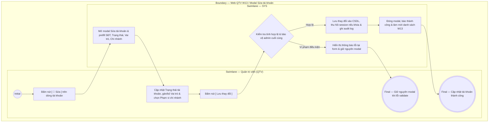

# QTV-W13-US02 - Sửa tài khoản

## Preconditions
- Quản trị viên (QTV) đã đăng nhập vào Web QTV và được cấp quyền quản lý tài khoản và phân quyền.
- QTV đang ở màn hình danh sách tài khoản W13 (`QTV-W13-US01`).
- Tài khoản người dùng cần chỉnh sửa đã tồn tại trong cơ sở dữ liệu.

## Trigger
- QTV bấm nút **`[ 📝 Sửa ]`** tại dòng tài khoản tương ứng trên màn hình W13 Danh sách tài khoản.
- Màn hình liên quan: Web QTV — W13 Tài khoản & phân quyền, modal **Sửa tài khoản**.

## Main Flow

1. QTV chọn nút **`[ 📝 Sửa ]`** tại dòng tài khoản cần cập nhật trên danh sách W13.
2. SYS mở modal **Sửa tài khoản** và prefill dữ liệu hiện tại của tài khoản:
   - **SĐT đăng nhập**: Hiển thị số điện thoại định danh duy nhất (khóa cố định chỉ đọc).
   - **Trạng thái tài khoản**: Dropdown chọn trạng thái (`ACTIVE`, `PENDING_ACTIVATION`, `LOCKED`).
   - **Vai trò**: Danh sách thẻ vai trò đa chọn (`MEMBER`, `PT`, `RECEPTIONIST`, `QTV`).
   - **Phạm vi chi nhánh**: Dropdown chọn chi nhánh phân công (áp dụng khi tài khoản có role nhân viên).
3. QTV thực hiện cập nhật các thông tin:
   - Thay đổi **Trạng thái tài khoản**.
   - Bấm thêm hoặc gỡ bỏ các **Vai trò** của tài khoản.
   - Chọn **Phạm vi chi nhánh** làm việc phù hợp cho nhân viên.
4. QTV bấm nút **Lưu thay đổi**.
5. SYS kiểm tra tính hợp lệ của dữ liệu:
   - Trạng thái tài khoản và Vai trò là các trường bắt buộc (phải có ít nhất 1 vai trò được gán).
   - Phạm vi chi nhánh được áp dụng hợp lệ khi tài khoản có vai trò nhân viên (`PT`, `RECEPTIONIST`, `QTV`).
   - Kiểm tra quy tắc bảo vệ: không cho phép khóa tài khoản Quản trị viên toàn chuỗi cuối cùng.
6. SYS lưu thông tin cập nhật vào hệ thống, hủy phiên đăng nhập nếu tài khoản bị chuyển sang `LOCKED` và ghi audit log chi tiết.
7. SYS đóng modal, hiển thị thông báo thành công `Cập nhật tài khoản thành công` và làm mới danh sách tài khoản W13.

### Field-level specification — Modal Sửa tài khoản
| Field / control | Loại UI Control | State | Required | Conditional / dynamic | Source / validation |
| :--- | :--- | :--- | :--- | :--- | :--- |
| SĐT đăng nhập | `Text Input` | `READONLY` | optional | Không | Hiển thị SĐT dùng đăng nhập duy nhất của tài khoản (ví dụ: `0909 123 456`); trường bị khóa, không cho phép đổi trực tiếp tại đây |
| Trạng thái tài khoản | `Select Dropdown` | `USER-INPUT (PREFILL)` | required | `DYNAMIC` | Chọn trạng thái tài khoản: `ACTIVE` (Hoạt động), `PENDING_ACTIVATION` (Chờ kích hoạt), `LOCKED` (Đã khóa) |
| Vai trò | `Multi-select Tags / Pills` | `USER-INPUT (PREFILL)` | required | `TRIGGER` | Chọn một hoặc nhiều vai trò được cấp: `MEMBER`, `PT`, `RECEPTIONIST`, `QTV`. Một tài khoản có thể có nhiều vai trò; quyền không tự cộng gộp ngoài phạm vi được cấp |
| Phạm vi chi nhánh | `Select Dropdown` | `USER-INPUT (PREFILL)` | conditional | `CONDITIONAL`: Hiện và áp dụng khi tài khoản có ít nhất 1 vai trò nhân viên (`PT`, `RECEPTIONIST`, `QTV`); Không áp dụng khi tài khoản chỉ có duy nhất vai trò `MEMBER` | Chọn chi nhánh làm việc được phân công (ví dụ: `Quận 1`, `Bình Thạnh`, `Toàn hệ thống`) |

- **Business rules / logic:**
  - SĐT đăng nhập là định danh duy nhất và không được phép chỉnh sửa trực tiếp tại modal này (`READONLY`).
  - Một tài khoản có thể được gán nhiều vai trò cùng lúc (`Multi-select tags`). Quyền hạn trong từng ngữ cảnh làm việc tuân thủ nghiêm ngặt vai trò đang kích hoạt, không tự ý cộng dồn ngoài phạm vi được cấp.
  - Phạm vi chi nhánh chỉ có hiệu lực áp dụng với các vai trò nhân viên (`PT`, `Lễ tân`, `QTV`). Nếu tài khoản chỉ là `MEMBER`, trường này không áp dụng.
  - Bảo vệ tài khoản quản trị tối cao: Hệ thống kiểm tra và ngăn chặn tuyệt đối hành vi khóa nhầm tài khoản Quản trị viên toàn chuỗi cuối cùng.
  - Khi tài khoản chuyển sang trạng thái `Đã khóa` (`LOCKED`), hệ thống lập tức thu hồi mọi token xác thực và chấm dứt phiên làm việc đang hoạt động của người dùng đó.

## Exception Flows
- QTV bỏ trống trường bắt buộc (không chọn trạng thái hoặc gỡ bỏ hết vai trò): SYS hiển thị thông báo lỗi yêu cầu chọn ít nhất 1 vai trò và giữ nguyên modal.
- Cố tình khóa tài khoản quản trị cuối cùng: SYS từ chối thao tác và báo lỗi "Không thể khóa tài khoản Quản trị viên cuối cùng của hệ thống".

## Activity Diagram — Swimlane
**Trigger:** QTV bấm nút [ 📝 Sửa ] tại một dòng tài khoản trong danh sách W13.

