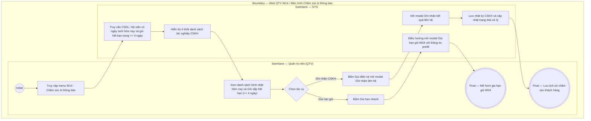

# QTV-W14-US01 - Quản lý tác nghiệp Chăm sóc khách hàng

## Preconditions
- QTV đã đăng nhập vào Web Portal và được cấp quyền quản lý Chăm sóc khách hàng.
- Hệ thống đã có dữ liệu hồ sơ hội viên và các gói đăng ký đang hoạt động.

## Trigger
- QTV chọn menu **W14 · Chăm sóc & thông báo** trên thanh điều hướng chính.
- Màn hình liên quan: Web QTV — Màn hình `W14 · Chăm sóc & thông báo`.

## Main Flow

1. QTV truy cập menu **W14 · Chăm sóc & thông báo**.
2. SYS nạp dữ liệu chăm sóc khách hàng tại chi nhánh theo 4 khối nghiệp vụ chính hiển thị qua Hàng 4 Thẻ KPI và 4 Tab tác nghiệp tương ứng 1-1:
   - **Thẻ 1 / Tab 1 — Sinh nhật hôm nay:** Đếm số hội viên có ngày sinh nhật trong ngày. Danh sách hiển thị: Họ tên, SĐT, Gói đang tập, ngày sinh nhật; kèm nút **`Chúc mừng`** (gửi thông báo in-app) và nút **`Gọi`** (mở popup ghi nhận CSKH).
   - **Thẻ 2 / Tab 2 — Nhắc sắp hết hạn (<= 4 ngày):** Đếm số gói tập cận hạn trong 4 ngày tới. Danh sách hiển thị: Mã HĐ, Họ tên, tên gói, ngày hết hạn, số ngày còn lại; kèm nút **`Nhắc hạn`** (gửi thông báo in-app) và nút **`Gia hạn`** (mở điều hướng W04 gia hạn nhanh).
   - **Thẻ 3 / Tab 3 — Chờ nhắc gia hạn (14 ngày qua):** Đếm số gói tập đã hết hạn trong 14 ngày gần nhất chưa mua tiếp (giai đoạn vàng Win-back / Retention). Danh sách hiển thị: Mã HĐ, Họ tên, gói đã tập, ngày hết hạn, số ngày quá hạn; kèm nút **`Tái ký gói`** và nút **`Gọi`**.
   - **Thẻ 4 / Tab 4 — Đăng ký mới hôm nay:** Đếm số hợp đồng phát sinh trong ngày. Danh sách hiển thị: Mã ĐK, Họ tên, gói đăng ký, giá trị gói, trạng thái thanh toán, nhân viên tạo và nút **`Xem`** chi tiết.
3. QTV click vào bất kỳ Thẻ KPI nào trên đầu; hệ thống tự động kích hoạt chuyển sang Tab danh sách tác nghiệp tương ứng.
4. QTV click nút **`Gọi`** tại dòng hội viên cần chăm sóc để mở modal ghi nhận kết quả chăm sóc:
   - Chọn Hình thức tương tác (`Gọi điện thoại`, `Nhắn tin Zalo / SMS`, `Gặp trao đổi trực tiếp tại quầy`).
   - Nhập Ghi chú nội dung trao đổi (phản hồi của khách, hẹn ngày tới, nhu cầu...).
5. QTV bấm **Lưu ghi chú CSKH**.
6. SYS lưu lịch sử chăm sóc vào hệ thống (`audit_logs`) và hiển thị thông báo thành công.

### Field-level specification — Màn hình Chăm sóc & thông báo (W14)
| Field / control | Loại UI Control | State | Required | Conditional / dynamic | Source / validation |
| :--- | :--- | :--- | :--- | :--- | :--- |
| Thẻ KPI Sinh nhật hôm nay | `Metric Card` | `READONLY` | required | `DYNAMIC` | Số lượng hội viên sinh nhật trong ngày; click chuyển sang Tab Sinh nhật |
| Thẻ KPI Sắp hết hạn (<= 4 ngày) | `Metric Card` | `READONLY` | required | `DYNAMIC` | Số gói cận hạn; click chuyển sang Tab Sắp hết hạn |
| Thẻ KPI Chờ nhắc gia hạn (14 ngày qua) | `Metric Card` | `READONLY` | required | `DYNAMIC` | Số gói hết hạn 1-14 ngày chưa mua tiếp; click chuyển sang Tab Chờ nhắc gia hạn |
| Thẻ KPI Đăng ký mới hôm nay | `Metric Card` | `READONLY` | required | `DYNAMIC` | Số hợp đồng đăng ký mới trong ngày; click chuyển sang Tab Đăng ký mới |
| Thanh điều hướng Tab | `Tab Bar (dxTabs)` | `USER-INPUT` | required | `TRIGGER` | 4 tab tác nghiệp: Sinh nhật, Sắp hết hạn, Chờ nhắc gia hạn, Đăng ký mới |
| Nút Chúc mừng / Nhắc hạn | `Action Button` | `USER-INPUT` | optional | `Không` | Bấm gửi thông báo in-app tự động cho hội viên |
| Nút Gọi / Ghi nhận CSKH | `Action Button` | `USER-INPUT` | optional | `Không` | Mở modal ghi nhận nhật ký tương tác CSKH |
| Nút Gia hạn / Tái ký gói | `Action Button` | `USER-INPUT` | optional | `Không` | Điều hướng sang phân hệ Đăng ký & Gia hạn (W04) |
| Modal — Hình thức tương tác | `Select Dropdown` | `USER-INPUT` | required | `Không` | `Gọi điện thoại`, `Nhắn tin Zalo / SMS`, `Gặp trao đổi trực tiếp tại quầy` |
| Modal — Ghi chú nội dung trao đổi | `Textarea` | `USER-INPUT` | required | `Không` | Nội dung phản hồi của khách hàng (tối đa 500 ký tự) |

## Alternate Flows

### AF-01 - Tạo đơn gia hạn nhanh từ danh sách sắp hết hạn
1. QTV bấm nút `Gia hạn nhanh` tại dòng hội viên có gói sắp hết hạn.
2. SYS tự động điều hướng sang modal Gia hạn gói (`W04`), tự động pre-fill thông tin hội viên và gói cũ để tạo đơn nối tiếp thời hạn.

## Exception Flows
- **Hội viên đã được liên hệ trong ngày:** SYS hiển thị badge `Đã liên hệ lúc [hh:mm]` để tránh nhân viên khác gọi điện trùng lặp làm phiền khách.

## Activity Diagram — Swimlane
**Trigger:** QTV truy cập menu W14 · Chăm sóc & thông báo.

