# QTV-W15-US01 - Cấu hình tỷ lệ hoa hồng PT

## Preconditions
- Người dùng đăng nhập tài khoản Quản trị viên (QTV) và được cấp quyền quản trị tỷ lệ hoa hồng (`commission_config = true`).
- QTV thuộc Main QTV (toàn hệ thống) hoặc QTV chi nhánh thao tác trong phạm vi chi nhánh được phân công (`branch_scope`).
- Hệ thống đã có danh mục chi nhánh (`branches`) và danh sách huấn luyện viên PT (`pt_profiles`).
- Mỗi chi nhánh đã có sẵn cấu hình mặc định (tự động khởi tạo 20.00% qua database trigger).

## Trigger
- QTV truy cập menu **W15 Quản lý hoa hồng PT**, chuyển sang tab **Cấu hình tỷ lệ hoa hồng** và bấm nút **[+ Thêm cấu hình riêng cho PT]** (hoặc bấm **[Sửa]** trên dòng cấu hình hiện có, hoặc bấm **[Kích hoạt]** trên cấu hình riêng đã gỡ).
- Màn hình liên quan: Web QTV — W15 Tab Cấu hình, modal **Cấu hình tỷ lệ hoa hồng PT**, modal **Lịch sử biến động tỷ lệ hoa hồng**.

## Main Flow

1. QTV truy cập menu W15, chọn tab **Cấu hình tỷ lệ hoa hồng**.
2. SYS truy vấn và hiển thị danh sách cấu hình tỷ lệ hoa hồng hiện hành đã khử trùng lặp (Uniqueness Identity):
   - Mỗi chi nhánh có duy nhất 1 dòng cấu hình mặc định (`Toàn bộ PT trong chi nhánh`).
   - Mỗi PT trong chi nhánh có tối đa 1 dòng cấu hình riêng (gắn nhãn trạng thái `Đang áp dụng` hoặc `Đã gỡ (Dùng mặc định)`).
3. QTV bấm nút **[+ Thêm cấu hình riêng cho PT]** (hoặc bấm **[Sửa]** trên một dòng cấu hình).
4. SYS mở modal **Cấu hình tỷ lệ hoa hồng PT**.
5. QTV chọn **Chi nhánh áp dụng** từ dropdown (mặc định chọn chi nhánh hiện tại của QTV; Main QTV được chọn chi nhánh bất kỳ).
6. QTV chọn **Phạm vi áp dụng**: `Tất cả PT trong chi nhánh (Mặc định)` hoặc `PT cụ thể`.
7. Khi chọn `PT cụ thể`, SYS hiển thị dropdown **Huấn luyện viên PT** để QTV chọn cá nhân HLV được hưởng tỷ lệ riêng.
   - Nếu PT đã có cấu hình riêng tồn tại trong chi nhánh, SYS tự động chuyển sang chế độ cập nhật/tái kích hoạt cho PT đó, không tạo thêm dòng mới.
8. QTV nhập **Tỷ lệ hoa hồng (%)** (giá trị từ 0.00% đến 100.00%).
9. QTV chọn **Kỳ tháng áp dụng hiệu lực**:
   - **Năm áp dụng**: Chọn từ danh sách các năm từ năm hiện tại trở đi (ví dụ: 2026 .. 2030).
   - **Tháng áp dụng**: Được lọc động theo năm được chọn. Nếu chọn năm hiện tại, hệ thống chỉ cho phép chọn các tháng lớn hơn kỳ tháng hiện tại (`> currentMonth`, ví dụ từ Tháng 10/2026 trở đi). Nếu chọn năm tương lai (2027 trở đi), cho phép chọn đủ 12 tháng.
   - SYS hiển thị thẻ chỉ dẫn trực quan: Cấu hình mới sẽ chính thức áp dụng từ ngày 01/{Tháng}/{Năm} (Kỳ hoa hồng Tháng {Tháng}/{Năm}); các buổi tập hoàn thành trong kỳ hiện tại vẫn áp dụng theo mức hoa hồng đang có hiệu lực.
10. QTV nhập **Ghi chú / Quyết định ban hành** (tùy chọn).
11. QTV bấm **Lưu cấu hình**.
12. SYS xác thực quyền thao tác (RBAC) và kiểm tra tính hợp lệ của dữ liệu: tỷ lệ từ 0% đến 100%, chọn đúng PT khi áp dụng riêng, kỳ áp dụng bắt buộc phải lớn hơn kỳ tháng hiện tại.
13. SYS thực hiện transaction ghi nhận phiên bản mới:
    - Nếu đã có phiên bản trước: Đóng khoảng thời gian hiệu lực của bản ghi lịch sử cũ bằng mốc thời gian hiệu lực mới (`effective_to = 01/{Tháng}/{Năm}`).
    - Cập nhật dòng cấu hình hiện hành trong `pt_commission_configs`: gán `commission_percentage`, tăng `version = version + 1`, `effective_from = 01/{Tháng}/{Năm}`, `is_active = true`, `updated_by_account_id`.
    - Ghi một snapshot phiên bản mới vào `pt_commission_config_history` với `action = 'UPDATE'` (hoặc `'CREATE'`/`'REACTIVATE'`), `effective_from = 01/{Tháng}/{Năm}`, `effective_to = NULL`.
14. SYS đóng modal, hiển thị thông báo lưu thành công và làm mới bảng danh sách cấu hình.

### Field-level specification — modal Cấu hình tỷ lệ hoa hồng PT
| Field / control | Loại UI Control | State | Required | Conditional / dynamic | Source / validation |
| :--- | :--- | :--- | :--- | :--- | :--- |
| Chi nhánh áp dụng | `Select Dropdown` | `USER-INPUT (PREFILL)` | required | `Không` | Nạp từ bảng `BRANCHES`. QTV chi nhánh chỉ được chọn trong phạm vi chi nhánh của mình |
| Phạm vi áp dụng | `Radio Group` | `USER-INPUT` | required | `TRIGGER` | Tùy chọn: `Tất cả PT trong chi nhánh (Mặc định)` / `PT cụ thể`. Kích hoạt ẩn/hiện trường "Huấn luyện viên PT" |
| Huấn luyện viên PT | `Select Dropdown (Searchable)` | `USER-INPUT` | conditional | `CONDITIONAL`: Hiện khi "Phạm vi áp dụng" = `PT cụ thể`, Ẩn khi "Phạm vi áp dụng" = `Tất cả PT trong chi nhánh (Mặc định)` | Bắt buộc khi hiện. Nạp danh sách HLV từ `PT_PROFILES` thuộc chi nhánh đã chọn |
| Tỷ lệ hoa hồng (%) | `Number Input` | `USER-INPUT` | required | `Không` | Giá trị số từ 0.00% đến 100.00% (bước nhảy 0.5%) |
| Năm áp dụng | `Select Dropdown` | `USER-INPUT (PREFILL)` | required | `TRIGGER` | Chọn năm áp dụng (từ năm hiện tại đến +4 năm). Kích hoạt lọc danh sách tháng khả dụng ở trường "Tháng áp dụng" |
| Tháng áp dụng | `Select Dropdown` | `USER-INPUT (PREFILL)` | required | `DYNAMIC` | Danh sách tháng thay đổi động theo "Năm áp dụng". Bắt buộc kỳ áp dụng phải lớn hơn kỳ tháng hiện tại (nếu chọn năm hiện tại thì chỉ hiển thị các tháng tương lai) |
| Chỉ dẫn hiệu lực kỳ áp dụng | `Display Card` | `READONLY` | optional | `DYNAMIC` | Hiển thị thông báo động: Ngày bắt đầu có hiệu lực (ngày 01 của tháng được chọn) và kỳ hoa hồng tương ứng; ghi rõ kỳ hiện tại vẫn áp dụng tỷ lệ cũ |
| Ghi chú / Quyết định | `Textarea` | `USER-INPUT` | optional | `Không` | QTV nhập số quyết định hoặc lý do điều chỉnh tỷ lệ hoa hồng |

- **Business rules / logic:**
  - **Quy tắc định danh duy nhất (Uniqueness Identity):** Mỗi chi nhánh luôn tồn tại đúng 1 cấu hình mặc định (`pt_id IS NULL`, `is_active = true`). Mỗi PT trong chi nhánh chỉ có tối đa 1 cấu hình riêng (`pt_id IS NOT NULL`). Hệ thống ngăn chặn hoàn toàn việc tạo nhiều dòng cấu hình trùng đối tượng.
  - **Thứ bậc ưu tiên giải quyết tỷ lệ (Rate Resolution):**
    1. Ưu tiên 1: Cấu hình riêng của PT đang có hiệu lực (`pt_id = booking.pt_id` và `is_active = true`).
    2. Ưu tiên 2: Cấu hình mặc định của chi nhánh (`pt_id IS NULL` và `branch_id = booking.branch_id`).
    3. Không tồn tại cấu hình chi nhánh: Ném lỗi hệ thống `BRANCH_DEFAULT_COMMISSION_NOT_CONFIGURED` (không fallback ngầm về 20% hệ thống).
  - **Giải quyết tỷ lệ theo thời điểm thực tế:** Tỷ lệ hoa hồng được xác định dựa trên `booking.branch_id` và thời điểm buổi tập được hoàn thành (`booking.completed_at`), đối chiếu với khoảng thời gian hiệu lực `[effective_from, effective_to)` trong `pt_commission_config_history`.
  - **Bảo toàn dữ liệu tài chính — Không xóa vật lý (Zero Hard Delete):** Tuyệt đối không xóa bản ghi cấu hình khi QTV gỡ bỏ cấu hình riêng của PT. Hệ thống cập nhật `is_active = false`, tăng `version = version + 1`, cập nhật `effective_from = NOW()`, ghi snapshot lịch sử với `action = 'REMOVE_OVERRIDE'`. HLV đó sẽ tự động chuyển sang áp dụng cấu hình mặc định của chi nhánh.
  - **Lưu vết lịch sử 100% (Version History):** Mọi thay đổi tỷ lệ đều được ghi nhận vào `pt_commission_config_history` kèm người thay đổi (`changed_by_account_id`), hành động (`CREATE`, `UPDATE`, `REMOVE_OVERRIDE`, `REACTIVATE`), tỷ lệ snapshot và thời điểm hiệu lực. Khóa ngoại có ràng buộc `ON DELETE RESTRICT` để đảm bảo dữ liệu không bị xóa ngoài ý muốn.
  - **Phân quyền nghiêm ngặt (Strict RBAC):** Chỉ Quản trị viên (QTV) có quyền `commission_config = true` và nằm trong phạm vi chi nhánh (`branch_scope`) mới được phép xem và cấu hình. Lễ tân, Huấn luyện viên, Hội viên hoàn toàn không có quyền thao tác.

## Alternate Flows

### AF-01 - Hủy Thao Tác
1. QTV chọn **Hủy** hoặc nút **X** trên modal cấu hình.
2. SYS đóng modal và giữ nguyên dữ liệu trên danh sách cấu hình.

### AF-02 - Bỏ Cấu Hình Riêng Cho PT (Zero Hard Delete)
1. Tại tab Cấu hình, QTV bấm nút **[Bỏ riêng]** trên dòng cấu hình của PT đang active (`is_active = true`).
2. SYS hiển thị hộp thoại xác nhận: *"Xác nhận bỏ cấu hình riêng cho Huấn luyện viên này? Sau khi bỏ, HLV sẽ áp dụng tỷ lệ mặc định của chi nhánh."*.
3. QTV xác nhận đồng ý (có thể nhập lý do/ghi chú gỡ bỏ).
4. SYS thực hiện transaction:
   - Đóng khoảng thời gian hiệu lực bản ghi lịch sử hiện tại (`effective_to = NOW()`).
   - Cập nhật dòng cấu hình: `is_active = false`, `version = version + 1`, `effective_from = NOW()`, `updated_by_account_id`, `updated_at = NOW()`.
   - Ghi bản ghi mới vào `pt_commission_config_history` với `action = 'REMOVE_OVERRIDE'`, `is_active = false`.
5. SYS cập nhật trạng thái dòng cấu hình thành `Đã gỡ (Dùng mặc định)`, hiển thị thông báo thành công.

### AF-03 - Xem Lịch Sử Biến Động Tỷ Lệ Hoa Hồng
1. Tại tab Cấu hình, QTV bấm nút **[Lịch sử]** trên bất kỳ dòng cấu hình nào (Mặc định chi nhánh hoặc PT riêng).
2. SYS mở modal **Lịch sử biến động tỷ lệ hoa hồng**.
3. SYS tải danh sách tất cả các phiên bản từ `pt_commission_config_history` theo thứ tự mới nhất xếp trên: Phiên bản (`v1`, `v2`,...), Hành động, Tỷ lệ hoa hồng (%), Trạng thái, Khoảng thời gian hiệu lực, Người điều chỉnh, Ghi chú ban hành.
4. QTV xem thông tin đối soát và bấm **Đóng**.

### AF-04 - Tái Kích Hoạt Cấu Hình Riêng Cho PT
1. Tại tab Cấu hình, QTV bấm nút **[Kích hoạt]** trên dòng cấu hình PT đang ở trạng thái `Đã gỡ (Dùng mặc định)`.
2. SYS mở modal cấu hình ở chế độ tái kích hoạt với thông tin PT đã chọn sẵn.
3. QTV nhập Tỷ lệ hoa hồng mới (%) và Ghi chú kích hoạt lại.
4. QTV bấm **Lưu cấu hình**.
5. SYS lưu cập nhật: `is_active = true`, `version = version + 1`, `effective_from = NOW()`, ghi history với `action = 'REACTIVATE'`.
6. SYS thông báo kích hoạt lại thành công và cập nhật badge trạng thái thành `Đang áp dụng`.

## Exception Flows
- **EF-01 - Không có quyền thao tác (RBAC):** Tài khoản không có vai trò QTV hoặc không có quyền `commission_config = true` hoặc chi nhánh không nằm trong `branch_scope`. SYS chặn thao tác và hiển thị thông báo: *"Bạn không có quyền cấu hình tỷ lệ hoa hồng PT tại chi nhánh này."*.
- **EF-02 - Tỷ lệ hoa hồng không hợp lệ:** QTV nhập tỷ lệ nhỏ hơn 0.00% hoặc lớn hơn 100.00%. SYS báo lỗi: *"Tỷ lệ hoa hồng phải nằm trong khoảng từ 0% đến 100%"*.
- **EF-03 - Chưa chọn Huấn luyện viên PT:** QTV chọn phạm vi `PT cụ thể` nhưng không chọn HLV từ dropdown. SYS báo lỗi: *"Vui lòng chọn Huấn luyện viên PT áp dụng cấu hình riêng"*.
- **EF-04 - Cấm gỡ bỏ cấu hình mặc định chi nhánh:** Người dùng tìm cách thao tác gỡ bỏ cấu hình mặc định của chi nhánh. SYS chặn hành động và hiển thị thông báo: *"Cấu hình mặc định của chi nhánh là bắt buộc, không thể gỡ bỏ"*.
- **EF-05 - Kỳ áp dụng không hợp lệ (không phải kỳ tương lai):** QTV chọn kỳ áp dụng nhỏ hơn hoặc bằng kỳ tháng hiện tại (ví dụ: đang ở tháng 9/2026 mà chọn tháng 9 hoặc tháng 8 trở về trước). SYS báo lỗi validation: *"Kỳ áp dụng hoa hồng phải lớn hơn kỳ tháng hiện tại (chỉ được thiết lập từ kỳ Tháng 10/2026 trở đi)"*.

## Activity Diagram — Swimlane
**Trigger:** QTV truy cập tab Cấu hình tỷ lệ hoa hồng trên Web QTV W15 và thực hiện thiết lập tỷ lệ.

```mermaid
flowchart TB
  subgraph B["Boundary — Web QTV W15 / Modal Cấu hình hoa hồng PT"]
    subgraph L0["Swimlane — Quản trị viên (QTV)"]
      I01(("Initial"))
      A01["Bấm [+ Thêm cấu hình riêng cho PT] hoặc [Sửa]"]
      A02["Chọn Chi nhánh, Phạm vi áp dụng và PT (nếu cấu hình riêng)"]
      A03["Nhập Tỷ lệ hoa hồng (%), chọn Năm và Tháng áp dụng (kỳ tương lai), nhập Ghi chú"]
      A04["Bấm [Lưu cấu hình]"]
      F01((("Final — Cấu hình hoa hồng được lưu thành công")))
      F02((("Final — Báo lỗi dữ liệu không hợp lệ")))
      F03((("Final — Chặn thao tác do không đủ quyền RBAC")))
    end

    subgraph L1["Swimlane — SYS"]
      S01["Mở modal cấu hình: nạp danh sách Năm/Tháng áp dụng và thẻ chỉ dẫn hiệu lực"]
      S02["Kiểm tra quyền RBAC commission_config và branch_scope"]
      D01{"Quyền RBAC hợp lệ?"}
      S03["Kiểm tra tính hợp lệ: tỷ lệ 0-100%, chọn đúng PT và kỳ áp dụng > kỳ hiện tại"]
      D02{"Dữ liệu hợp lệ?"}
      S04["Đóng effective_to phiên bản cũ bằng ngày 01 của kỳ áp dụng mới"]
      S05["Cập nhật pt_commission_configs: version+1, effective_from = ngày 01 kỳ mới, is_active=true"]
      S06["Ghi bản ghi phiên bản mới vào pt_commission_config_history"]
      S07["Làm mới danh sách cấu hình và thông báo thành công"]
      S08["Hiển thị thông báo lỗi validation"]
      S09["Hiển thị thông báo lỗi từ chối truy cập 403"]
    end
  end

  I01 --> A01
  A01 --> S01
  S01 --> A02
  A02 --> A03
  A03 --> A04
  A04 --> S02
  S02 --> D01
  D01 -->|Hợp lệ| S03
  D01 -->|Không có quyền| S09
  S09 --> F03
  S03 --> D02
  D02 -->|Hợp lệ| S04
  S04 --> S05
  S05 --> S06
  S06 --> S07
  S07 --> F01
  D02 -->|Không hợp lệ| S08
  S08 --> F02
```

