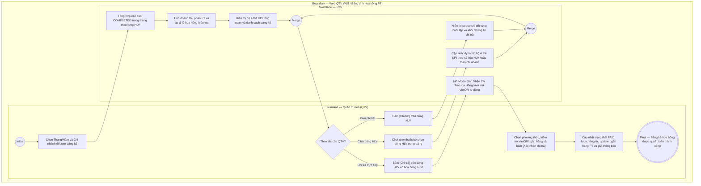

# QTV-W15-US02 - Tính và chi trả bảng kê hoa hồng PT theo tháng

## Preconditions
- Người dùng đăng nhập tài khoản Quản trị viên (QTV) và có quyền quản lý tài chính.
- Hệ thống đã có dữ liệu các buổi tập PT hoàn thành (`COMPLETED`) trong tháng kèm gói tập tương ứng và cấu hình hoa hồng PT (`pt_commission_configs`).

## Trigger
- QTV truy cập menu **W15 Quản lý hoa hồng PT**, xem tab **Bảng tính hoa hồng hàng tháng**.
- Màn hình liên quan: Web QTV — W15 Quản lý hoa hồng PT, tab **Bảng tính hoa hồng hàng tháng**.

## Main Flow

1. QTV truy cập menu W15, tab **Bảng tính hoa hồng hàng tháng**.
2. QTV chọn **Kỳ tính thù lao (Tháng / Năm)** (mặc định tháng hiện tại, ví dụ: `Tháng 09/2026`) và chọn **Chi nhánh** (hoặc Tất cả).
3. SYS tự động tổng hợp số liệu của tất cả HLV PT trong chi nhánh:
   - Đếm tổng số buổi tập PT có trạng thái `COMPLETED` trong tháng được chọn của từng HLV.
   - Với mỗi buổi hoàn thành, trích xuất giá trị phần gói PT tương ứng:
     * Giá trị 1 buổi PT = `pt_price_snapshot` / `total_pt_sessions`.
   - Tính tổng doanh thu phần PT thực dạy trong tháng của HLV (`pt_revenue_share`).
   - Nạp tỷ lệ hoa hồng (%) hiệu lực tại thời điểm tính thù lao của HLV (theo cấu hình cá nhân override hoặc mặc định chi nhánh).
   - Tính `Tổng hoa hồng thực nhận` = `Tổng doanh thu phần PT` $\times$ `Tỷ lệ hoa hồng (%)`.
4. SYS hiển thị bộ **4 thẻ KPI tổng quan** (`Tổng số buổi dạy`, `Tổng doanh số dạy PT`, `Tổng tiền hoa hồng tháng`, `Tiến độ chi trả`) kèm danh sách bảng kê hoa hồng tháng theo từng HLV với 2 trạng thái: `Chờ chi trả` (`PENDING`) hoặc `Đã chi trả` (`PAID`).
5. Khi QTV click chọn vào 1 dòng của một HLV cụ thể trong bảng kê:
   - SYS tự động cập nhật động (dynamic) toàn bộ bộ 4 thẻ KPI hiển thị số liệu cá nhân của riêng HLV đó (kèm tỷ lệ %, doanh số dạy, tiến độ chi trả của riêng HLV và thông báo click lại để bỏ lọc).
   - Khi QTV click lại vào chính dòng HLV đó (bỏ chọn): 4 thẻ KPI tự động hoàn tác về số liệu tổng hợp toàn bộ HLV trong chi nhánh.
6. QTV bấm nút **[Chi tiết]** trên một dòng HLV để kiểm tra danh sách từng buổi tập cụ thể (Học viên, Tên gói, Ngày dạy, Khung giờ, Giá trị buổi, Hoa hồng buổi). Nếu bản ghi đã ở trạng thái `PAID`, modal hiển thị thêm khối **Chứng từ chi trả** (Thời điểm, Phương thức, Mã giao dịch, Người chi trả, Ghi chú).
7. Đối với các HLV có số tiền hoa hồng $> 0$đ ở trạng thái `Chờ chi trả` (`PENDING`), hệ thống hiển thị trực tiếp nút **[Chi trả]** (quy trình tinh gọn 1 chạm, không yêu cầu qua bước duyệt trung gian). Nếu hoa hồng $= 0$đ, hệ thống ẩn nút Chi trả để tránh chi nhầm.
8. QTV bấm **[Chi trả]**: SYS mở **Modal Xác Nhận Chi Trả Hoa Hồng (Payout Modal)** hiển thị:
   - Thông tin HLV, số buổi hoàn thành, doanh số quy đổi và số tiền hoa hồng chi trả nổi bật.
   - Chọn phương thức: `Chuyển khoản (VietQR)` hoặc `Tiền mặt`.
   - Nếu chọn `Chuyển khoản`: Điền ngân hàng, số tài khoản, tên chủ thẻ và tự động hiển thị mã QR VietQR chuẩn ngân hàng để quét thanh toán nhanh.
   - Nhập mã giao dịch ngân hàng / Số phiếu chi và ghi chú chi trả.
9. QTV bấm **[Xác nhận hoàn tất chi trả]**: SYS cập nhật trạng thái sang `PAID`, lưu `paid_at`, `payout_method`, `payout_ref`, `payout_note`, `paid_by_account_id`, cập nhật thông tin ngân hàng vào hồ sơ HLV và tự động gửi thông báo in-app `COMMISSION_PAID` tới tài khoản PT.

---

### Field-level specification — Màn hình Bảng tính hoa hồng hàng tháng
| Field / control | Loại UI Control | State | Required | Conditional / dynamic | Source / validation |
| :--- | :--- | :--- | :--- | :--- | :--- |
| Bộ chọn Tháng/Năm | `Date Picker (Month view)` | `USER-INPUT (PREFILL)` | required | `TRIGGER` | Mặc định nạp tháng hiện tại (`MM/YYYY`). Khi thay đổi kích hoạt tính toán và nạp lại danh sách |
| Bộ lọc Chi nhánh | `Select Dropdown` | `USER-INPUT (PREFILL)` | required | `TRIGGER` | Nạp từ danh sách chi nhánh; khi thay đổi lọc lại bảng kê |
| Nút [+ Tính lại hoa hồng] | `Button (Secondary)` | `USER-INPUT` | optional | `Không` | Bấm để kích hoạt SYS quét lại toàn bộ booking hoàn thành mới nhất và tính toán lại |
| Thẻ KPI Tổng số buổi dạy | `Metric Card (W().metrics)` | `READONLY` | required | `DYNAMIC` | Hiển thị tổng số buổi dạy trong tháng của toàn bộ HLV (hoặc của riêng HLV được chọn khi click chọn dòng). Khi click lại dòng để bỏ chọn, thẻ tự động quay về tổng hợp toàn chi nhánh |
| Thẻ KPI Tổng doanh số dạy PT | `Metric Card (W().metrics)` | `READONLY` | required | `DYNAMIC` | Hiển thị tổng doanh số gói PT quy đổi từ các buổi đã dạy hoàn thành |
| Thẻ KPI Tổng tiền hoa hồng tháng | `Metric Card (W().metrics)` | `READONLY` | required | `DYNAMIC` | Hiển thị tổng tiền hoa hồng phát sinh trong tháng của toàn bộ HLV (hoặc của riêng HLV được chọn khi click chọn dòng) |
| Thẻ KPI Tiến độ chi trả | `Metric Card (W().metrics)` | `READONLY` | required | `DYNAMIC` | Tỷ lệ và số tiền hoa hồng đã chi trả (`PAID`) so với tổng hoa hồng tháng |
| Bảng kê hoa hồng tháng | `DataGrid (dxDataGrid)` | `READONLY` | required | `DYNAMIC` | Danh sách hiển thị: Huấn luyện viên (Họ tên, Mã, SĐT), Chi nhánh, Buổi đã dạy, Doanh số quy đổi, Tỷ lệ hoa hồng (%), Tiền hoa hồng, Trạng thái (`Chờ chi trả`, `Đã chi trả`). Hỗ trợ click chọn dòng để filter KPI dynamic (click lần 2 để bỏ chọn) |
| Nút [Chi tiết] | `Grid Action Button` | `USER-INPUT` | optional | `Không` | Mở popup xem danh sách chi tiết từng buổi tập cấu thành nên hoa hồng của HLV và khối chứng từ chi trả (nếu đã PAID) |
| Nút [Chi trả] | `Button (Success)` | `USER-INPUT` | optional | `CONDITIONAL`: Hiện khi trạng thái = `PENDING` và `total_commission_amount > 0`, Ẩn khi đã chi trả (`PAID`) hoặc tiền hoa hồng = 0đ | Mở Modal Xác Nhận Chi Trả Hoa Hồng trực tiếp |
| Nút [Xuất bảng kê / Excel] | `Button (Outline)` | `USER-INPUT` | optional | `Không` | Xuất file Excel bảng kê hoa hồng tháng cho toàn bộ chi nhánh |

---

### Field-level specification — Modal Xác Nhận Chi Trả Hoa Hồng (Payout Modal)
| Field / control | Loại UI Control | State | Required | Conditional / dynamic | Source / validation |
| :--- | :--- | :--- | :--- | :--- | :--- |
| Thông tin HLV thụ hưởng | `Display Banner` | `READONLY` | required | `Không` | Hiển thị Họ tên, Mã HLV, SĐT và Chi nhánh công tác |
| Số buổi hoàn thành | `Text Info` | `READONLY` | required | `Không` | Tổng số buổi dạy `COMPLETED` trong tháng |
| Doanh số dạy quy đổi | `Text Info` | `READONLY` | required | `Không` | Doanh thu quy đổi từ gói PT (`pt_revenue_share`) |
| Số tiền hoa hồng chi trả | `Stat Highlight Box` | `READONLY` | required | `Không` | Số tiền hoa hồng thực lĩnh được làm nổi bật (màu xanh dương đậm, cỡ chữ lớn) |
| Phương thức chi trả | `Radio Group / Switcher` | `USER-INPUT (PREFILL)` | required | `TRIGGER` | Tùy chọn: `BANK_TRANSFER` (Chuyển khoản ngân hàng - mặc định) hoặc `CASH` (Tiền mặt) |
| Tên ngân hàng thụ hưởng | `Select / Text Input` | `USER-INPUT (PREFILL)` | conditional | `CONDITIONAL`: Hiện khi Phương thức = `BANK_TRANSFER`, Ẩn khi Phương thức = `CASH`. Bắt buộc khi hiện | Tên ngân hàng (MB Bank, Vietcombank, Techcombank,...). Prefill từ hồ sơ HLV |
| Số tài khoản ngân hàng | `Text Input` | `USER-INPUT (PREFILL)` | conditional | `CONDITIONAL`: Hiện khi Phương thức = `BANK_TRANSFER`, Ẩn khi Phương thức = `CASH`. Bắt buộc khi hiện | Số tài khoản ngân hàng nhận tiền. Prefill từ hồ sơ HLV |
| Tên chủ tài khoản | `Text Input` | `USER-INPUT (PREFILL)` | conditional | `CONDITIONAL`: Hiện khi Phương thức = `BANK_TRANSFER`, Ẩn khi Phương thức = `CASH`. Bắt buộc khi hiện | Tên chủ tài khoản viết hoa không dấu |
| Mã VietQR động | `Image QR Code` | `READONLY` | optional | `CONDITIONAL`: Hiện khi Phương thức = `BANK_TRANSFER`, Ẩn khi Phương thức = `CASH` | Ảnh mã VietQR sinh động theo chuẩn Napas247 chứa đúng số tiền, số tài khoản và nội dung chuyển khoản để quét thanh toán tức thì |
| Mã giao dịch / Phiếu chi | `Text Input` | `USER-INPUT` | optional | `Không` | Mã tham chiếu FT ngân hàng hoặc số phiếu chi tiền mặt kế toán |
| Ngày thực hiện chi trả | `Date Picker` | `READONLY (PREFILL)` | required | `Không` | Mặc định ngày hôm nay (`DD/MM/YYYY`) |
| Ghi chú chi trả | `Text Area` | `USER-INPUT` | optional | `Không` | Ghi chú nội dung chuyển khoản hoặc lưu ý đối soát |

- **Business rules / logic:**
  - Hoa hồng PT chỉ được tính trên các buổi tập có trạng thái `COMPLETED` (đã qua xác nhận kép của PT và Hội viên).
  - Giá trị phần PT tính theo trường `pt_price` của gói tập (với gói Combo, chỉ lấy phần giá PT, không tính hoa hồng trên phần giá Gym).
  - Quy trình chi trả tinh gọn 1 chạm: Có số liệu hoa hồng $> 0$đ là hiển thị trực tiếp nút `[ Chi trả ]`, không cần qua bước duyệt trung gian.
  - Nghiêm cấm chi trả các khoản hoa hồng có giá trị bằng 0đ (nút Chi trả bị ẩn và backend từ chối với HTTP 400 `CANNOT_PAY_ZERO_COMMISSION`).
  - Khi bảng kê ở trạng thái `PAID`, không cho phép tự động tính toán đè dữ liệu để bảo toàn tính toàn vẹn chứng từ kế toán.
  - Sau khi chi trả thành công, hệ thống tự động sinh thông báo in-app `COMMISSION_PAID` tới tài khoản PT.

## Alternate Flows

### AF-01 - Xuất Bảng Kê Hoa Hồng Ra Excel
1. QTV chọn kỳ tháng/năm và chi nhánh, sau đó bấm **[Xuất bảng kê / Excel]**.
2. SYS kết xuất dữ liệu bảng kê hiện tại ra file Excel chứa đầy đủ thông tin từng HLV, số buổi, doanh số, tỷ lệ % và hoa hồng.
3. Trình duyệt tự động tải file về máy người dùng.

## Exception Flows
- **Chưa có cấu hình hoa hồng:** HLV chưa được cấu hình tỷ lệ hoa hồng riêng và chi nhánh cũng chưa có cấu hình mặc định. SYS hiển thị cảnh báo: *"Chưa có cấu hình tỷ lệ hoa hồng cho HLV [Tên HLV]. Tỷ lệ tạm tính là 0%"* và cung cấp đường dẫn nhanh đến tab Cấu hình.
- **Hoa hồng bằng 0đ:** Nếu HLV không dạy buổi nào trong tháng hoặc tổng hoa hồng bằng 0đ, hệ thống ẩn nút **[Chi trả]** trên bảng kê. Nếu có yêu cầu chi trả bất thường gửi lên API, backend từ chối với mã lỗi `400 CANNOT_PAY_ZERO_COMMISSION`.

## Activity Diagram — Swimlane
**Trigger:** QTV mở tab Bảng tính hoa hồng hàng tháng trên Web QTV W15.

