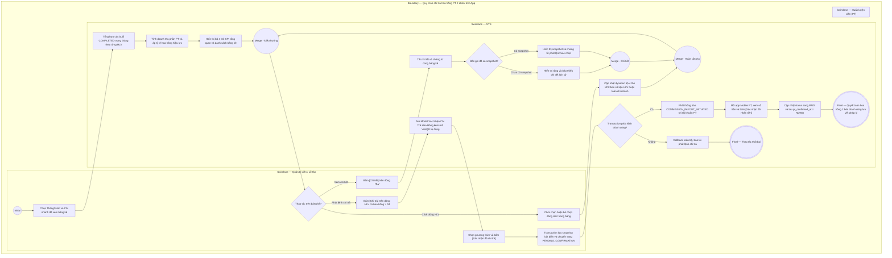

# QTV-W15-US02 - Tính và chi trả bảng kê hoa hồng PT theo tháng

## Preconditions
- Người dùng đăng nhập tài khoản Quản trị viên (QTV) và có quyền quản lý tài chính.
- Hệ thống đã có dữ liệu các buổi tập PT hoàn thành (`COMPLETED`) trong tháng kèm gói tập tương ứng và cấu hình hoa hồng PT (`pt_commission_configs`).

## Trigger
- QTV truy cập menu **W15 Quản lý hoa hồng PT**, xem tab **Bảng kê thu nhập tháng**.
- Màn hình liên quan: Web QTV — W15 Quản lý hoa hồng PT, tab **Bảng kê thu nhập tháng**.

## Main Flow

1. QTV truy cập menu W15, tab **Bảng kê thu nhập tháng**.
2. QTV chọn **Kỳ tính thù lao (Tháng / Năm)** (mặc định tháng hiện tại, ví dụ: `Tháng 09/2026`) và chọn **Chi nhánh** (hoặc Tất cả).
3. SYS tự động tổng hợp số liệu của tất cả HLV PT trong chi nhánh:
   - Đếm tổng số buổi tập PT có trạng thái `COMPLETED` trong tháng được chọn của từng HLV.
   - Với mỗi buổi hoàn thành, trích xuất giá trị phần gói PT tương ứng:
     * Giá trị 1 buổi PT = `pt_price_snapshot` / `total_pt_sessions`.
   - Tính tổng doanh thu phần PT thực dạy trong tháng của HLV (`pt_revenue_share`).
   - Nạp tỷ lệ hoa hồng (%) hiệu lực tại thời điểm tính thù lao của HLV (theo cấu hình cá nhân override hoặc mặc định chi nhánh).
   - Tính `Tổng hoa hồng thực nhận` = `Tổng doanh thu phần PT` $\times$ `Tỷ lệ hoa hồng (%)`.
4. SYS hiển thị bộ **4 thẻ KPI tổng quan** (`Tổng số buổi dạy`, `Tổng doanh số dạy PT`, `Tổng tiền hoa hồng tháng`, `Tiến độ chi trả`) kèm danh sách bảng kê hoa hồng tháng theo từng HLV với 2 trạng thái: `Chờ chi trả` (`PENDING`) hoặc `Đã chi trả` (`PAID`).
5. Khi QTV click chọn vào 1 dòng của một HLV cụ thể trong bảng kê:
   - SYS tự động cập nhật động (dynamic) toàn bộ bộ 4 thẻ KPI hiển thị số liệu cá nhân của riêng HLV đó (kèm tỷ lệ %, doanh số dạy, tiến độ chi trả của riêng HLV và thông báo click lại để bỏ lọc).
   - Khi QTV click lại vào chính dòng HLV đó (bỏ chọn): 4 thẻ KPI tự động hoàn tác về số liệu tổng hợp toàn bộ HLV trong chi nhánh.
6. QTV/Lễ tân bấm nút **[Chi tiết]** trên một dòng HLV để kiểm tra danh sách từng buổi tập cụ thể (Học viên, Tên gói, Ngày dạy, Khung giờ, Giá trị buổi, Hoa hồng buổi). Nếu bản ghi ở trạng thái `PENDING_CONFIRMATION` hoặc `PAID`, modal hiển thị thêm khối **Chứng từ chi trả** (Thời điểm phát lệnh, Phương thức, Người phát lệnh, Thời điểm PT xác nhận nhận tiền `pt_confirmed_at`, Ghi chú).
7. Đối với các HLV có số tiền hoa hồng $> 0$đ ở trạng thái `Chờ chi trả` (`PENDING`), hệ thống hiển thị trực tiếp nút **[Chi trả]** (quy trình tinh gọn, không yêu cầu qua bước duyệt trung gian). Nếu hoa hồng $= 0$đ, hệ thống ẩn nút Chi trả để tránh chi nhầm.
8. QTV/Lễ tân bấm **[Chi trả]**: SYS mở **Modal Xác Nhận Chi Trả Hoa Hồng (Payout Modal)** hiển thị:
   - Thông tin HLV, số buổi hoàn thành, doanh số quy đổi và số tiền hoa hồng chi trả nổi bật.
   - Chọn phương thức: `Chuyển khoản (VietQR)` hoặc `Tiền mặt tại quầy`.
   - Nếu chọn `Chuyển khoản`: Điền ngân hàng, số tài khoản, tên chủ thẻ và tự động hiển thị mã QR VietQR chuẩn ngân hàng để quét thanh toán nhanh.
   - Bỏ hoàn toàn việc nhập chứng từ giấy rắc rối (không còn trường "Số phiếu chi" tiền mặt và không còn trường "Mã giao dịch ngân hàng"). Thay vào đó áp dụng quy trình xác nhận 2 bên trên App để chống chối nhận tiền.
9. QTV/Lễ tân bấm **[Xác nhận đã chi trả]**: SYS chốt snapshot từng buổi cùng tổng trong một transaction nguyên tử, cập nhật trạng thái sang `PENDING_CONFIRMATION` ("Chờ PT xác nhận"), lưu `paid_at`, `payout_method`, `payout_note`, `paid_by_account_id`, cập nhật thông tin ngân hàng vào hồ sơ HLV và tự động gửi thông báo in-app `COMMISSION_PAYOUT_INITIATED` tới tài khoản PT: *"Lễ tân/Quản lý đã thực hiện lệnh chi trả hoa hồng tháng X/YYYY... Vui lòng kiểm tra và xác nhận đã nhận tiền trên app."*
10. PT mở ứng dụng Mobile PT, kiểm tra thông tin và bấm **[Xác nhận đã nhận tiền]**: SYS chuyển trạng thái sang `PAID` ("Đã chi trả"), ghi nhận `pt_confirmed_at = NOW()` lưu vết pháp lý vĩnh viễn và gửi thông báo phản hồi `COMMISSION_PT_CONFIRMED`.

---

### Field-level specification — Màn hình Bảng kê thu nhập tháng (Tab 1)
| Field / control | Loại UI Control | State | Required | Conditional / dynamic | Source / validation |
| :--- | :--- | :--- | :--- | :--- | :--- |
| Bộ chọn Tháng | `Select Dropdown` | `USER-INPUT (PREFILL)` | required | `TRIGGER` | Mặc định nạp tháng hiện tại (`1 - 12`). Khi thay đổi kích hoạt tính toán và nạp lại danh sách |
| Bộ chọn Năm | `Number Box` | `USER-INPUT (PREFILL)` | required | `TRIGGER` | Mặc định nạp năm hiện tại (`2025 - 2030`). Khi thay đổi kích hoạt nạp lại |
| Nút [+ Tính lại hoa hồng] | `Button (Secondary)` | `USER-INPUT` | optional | `Không` | Bấm để kích hoạt SYS quét lại toàn bộ booking hoàn thành mới nhất và tính toán lại |
| Thẻ KPI Tổng số buổi dạy | `Metric Card (W().metrics)` | `READONLY` | required | `DYNAMIC` | Hiển thị tổng số buổi dạy trong tháng của toàn bộ HLV (hoặc của riêng HLV được chọn khi click chọn dòng). Khi click lại dòng để bỏ chọn, thẻ tự động quay về tổng hợp toàn chi nhánh |
| Thẻ KPI Tổng doanh số dạy PT | `Metric Card (W().metrics)` | `READONLY` | required | `DYNAMIC` | Hiển thị tổng doanh số gói PT quy đổi từ các buổi đã dạy hoàn thành |
| Thẻ KPI Tổng tiền hoa hồng tháng | `Metric Card (W().metrics)` | `READONLY` | required | `DYNAMIC` | Hiển thị tổng tiền hoa hồng phát sinh trong tháng của toàn bộ HLV (hoặc của riêng HLV được chọn khi click chọn dòng) |
| Thẻ KPI Tiến độ chi trả | `Metric Card (W().metrics)` | `READONLY` | required | `DYNAMIC` | Tỷ lệ và số tiền hoa hồng đã chi trả (`PAID`) so với tổng hoa hồng tháng |
| Bảng kê thu nhập tháng | `DataGrid (dxDataGrid)` | `READONLY` | required | `DYNAMIC` | Danh sách hiển thị: Huấn luyện viên (Họ tên, Mã, SĐT), Chi nhánh, Dạy kèm PT (số buổi, doanh số quy đổi), Hoa hồng PT (tiền, tỷ lệ %), Lớp cộng đồng (số lớp, số học viên), Thù lao lớp CĐ, Tổng thu nhập tháng, Trạng thái (`Chờ chi trả`, `Chờ PT xác nhận`, `Đã chi trả`). Hỗ trợ click chọn dòng để filter KPI dynamic (click lần 2 để bỏ chọn) |
| Nút [Chi tiết] | `Grid Action Button` | `USER-INPUT` | optional | `Không` | Mở popup xem danh sách chi tiết từng buổi tập cấu thành nên hoa hồng của HLV và khối chứng từ chi trả / xác nhận nhận tiền |
| Nút [Chi trả] | `Button (Success)` | `USER-INPUT` | conditional | `CONDITIONAL`: Hiện khi trạng thái = `PENDING` và `total_monthly_income > 0`, Ẩn khi đã chi trả (`PAID`), đang chờ xác nhận (`PENDING_CONFIRMATION`) hoặc tổng thu nhập = 0đ | Mở Modal Xác Nhận Chi Trả Hoa Hồng trực tiếp |

---

### Field-level specification — Modal Xác Nhận Chi Trả Hoa Hồng (Payout Modal)
| Field / control | Loại UI Control | State | Required | Conditional / dynamic | Source / validation |
| :--- | :--- | :--- | :--- | :--- | :--- |
| Thông tin HLV thụ hưởng | `Display Banner` | `READONLY` | required | `Không` | Hiển thị Họ tên, Mã HLV, SĐT và Chi nhánh công tác |
| Số buổi hoàn thành | `Text Info` | `READONLY` | required | `Không` | Tổng số buổi dạy `COMPLETED` trong tháng |
| Doanh số dạy quy đổi | `Text Info` | `READONLY` | required | `Không` | Doanh thu quy đổi từ gói PT (`pt_revenue_share`) |
| Số tiền hoa hồng chi trả | `Stat Highlight Box` | `READONLY` | required | `Không` | Số tiền hoa hồng thực lĩnh được làm nổi bật (màu xanh dương đậm, cỡ chữ lớn) |
| Phương thức chi trả | `Radio Group / Switcher` | `USER-INPUT (PREFILL)` | required | `TRIGGER` | Tùy chọn: `BANK_TRANSFER` (Chuyển khoản ngân hàng - mặc định) hoặc `CASH` (Tiền mặt tại quầy) |
| Tên ngân hàng thụ hưởng | `Select / Text Input` | `USER-INPUT (PREFILL)` | conditional | `CONDITIONAL`: Hiện khi Phương thức = `BANK_TRANSFER`, Ẩn khi Phương thức = `CASH`. Bắt buộc khi hiện | Tên ngân hàng (MB Bank, Vietcombank, Techcombank,...). Prefill từ hồ sơ HLV |
| Số tài khoản ngân hàng | `Text Input` | `USER-INPUT (PREFILL)` | conditional | `CONDITIONAL`: Hiện khi Phương thức = `BANK_TRANSFER`, Ẩn khi Phương thức = `CASH`. Bắt buộc khi hiện | Số tài khoản ngân hàng nhận tiền. Prefill từ hồ sơ HLV |
| Tên chủ tài khoản | `Text Input` | `USER-INPUT (PREFILL)` | conditional | `CONDITIONAL`: Hiện khi Phương thức = `BANK_TRANSFER`, Ẩn khi Phương thức = `CASH`. Bắt buộc khi hiện | Tên chủ tài khoản viết hoa không dấu |
| Mã VietQR động | `Image QR Code` | `READONLY` | conditional | `CONDITIONAL`: Hiện khi Phương thức = `BANK_TRANSFER`, Ẩn khi Phương thức = `CASH` | Ảnh mã VietQR sinh động theo chuẩn Napas247 chứa đúng số tiền, số tài khoản và nội dung chuyển khoản để quét thanh toán tức thì |
| Ngày thực hiện chi trả | `Date Picker` | `READONLY (PREFILL)` | required | `Không` | Mặc định ngày hôm nay (`DD/MM/YYYY`) |
| Ghi chú chi trả | `Text Area` | `USER-INPUT` | optional | `Không` | Ghi chú nội dung chuyển khoản hoặc lưu ý đối soát |

- **Business rules / logic:**
  - Hoa hồng PT chỉ được tính trên các buổi tập có trạng thái `COMPLETED` (đã qua xác nhận kép của PT và Hội viên).
  - Giá trị phần PT tính theo trường `pt_price` của gói tập (với gói Combo, chỉ lấy phần giá PT, không tính hoa hồng trên phần giá Gym).
  - Quy trình chi trả tinh gọn 1 chạm: Có số liệu hoa hồng $> 0$đ là hiển thị trực tiếp nút `[ Chi trả ]`, không cần qua bước duyệt trung gian.
  - Nghiêm cấm chi trả các khoản hoa hồng có giá trị bằng 0đ (nút Chi trả bị ẩn và backend từ chối với HTTP 400 `CANNOT_PAY_ZERO_COMMISSION`).
  - Khi bảng kê ở trạng thái `PAID`, không cho phép tự động tính toán đè dữ liệu để bảo toàn tính toàn vẹn chứng từ kế toán.
  - Sau khi chi trả thành công, hệ thống tự động sinh thông báo in-app `COMMISSION_PAID` tới tài khoản PT.

### Đồng bộ snapshot PAID đã phê duyệt (20/09/2026)
- Chi trả mới lưu tổng, chứng từ và snapshot chi tiết từng buổi nguyên tử trong cùng transaction. Lỗi lưu snapshot phải rollback toàn bộ; không có PAID mới chỉ chứa tổng.
- PAID có snapshot: xem/xuất chi tiết từ snapshot bất biến, không tính lại từ booking, hồ sơ hoặc tỷ lệ hiện tại; tổng phải khớp toàn bộ chi tiết cùng bảng kê.
- PAID legacy không snapshot: API details_snapshot_available=false và sessions=[]; vẫn hiển thị tổng/chứng từ lịch sử và thông báo Không có chi tiết lịch sử cho kỳ đã chi trả này. Không coi [] là 0 buổi/0 đồng, không tái dựng từ dữ liệu sống.
- Giữ nguyên quyền QTV/branch scope. PT06-US02 chỉ đọc chính bảng kê PT; không mở quyền chi trả cho PT. Migration/ERD do backend owner cập nhật.

### Field-level specification — Trạng thái snapshot trong popup Chi tiết
| Field | UI | State | Required | Conditional / dynamic | Source / validation |
| --- | --- | --- | --- | --- | --- |
| Chi tiết từng buổi | Readonly list | READONLY | conditional | CONDITIONAL: hiện khi có snapshot PAID hoặc bảng kê chưa PAID có chi tiết tính hiện hành; ẩn khi PAID legacy thiếu snapshot | Học viên, gói, ngày/giờ, giá trị PT, hoa hồng từ nguồn cùng bảng kê; PAID chỉ dùng snapshot |
| Thông báo không có chi tiết lịch sử | Text | READONLY | conditional | CONDITIONAL: hiện khi PAID và details_snapshot_available=false; ẩn khi có snapshot hoặc chưa PAID | API flag; không dùng danh sách rỗng để ghi 0 |
| Tổng và chứng từ đã chi | Text | READONLY | required | Không | Tổng/chứng từ lịch sử, giữ nguyên kể cả thiếu snapshot |

### Field-level specification — Màn hình Doanh thu gói PT/COMBO (Tab 2)
| Field / control | Loại UI Control | State | Required | Conditional / dynamic | Source / validation |
| :--- | :--- | :--- | :--- | :--- | :--- |
| Bộ chọn Tháng | `Select Dropdown` | `USER-INPUT (PREFILL)` | required | `TRIGGER` | Mặc định nạp tháng hiện tại (`1 - 12`). Khi thay đổi kích hoạt nạp lại dữ liệu |
| Bộ chọn Năm | `Number Box` | `USER-INPUT (PREFILL)` | required | `TRIGGER` | Mặc định năm hiện tại (`2025 - 2030`). Khi thay đổi kích hoạt nạp lại dữ liệu |
| Bộ lọc Huấn luyện viên | `Select Dropdown` | `USER-INPUT (PREFILL)` | required | `TRIGGER` | Danh sách gồm "Tất cả huấn luyện viên" (`ALL`) và từng HLV thuộc chi nhánh. Khi thay đổi lọc lại tức thì toàn bộ 4 thẻ KPI và DataGrid |
| Nút [Tải lại] | `Button (Secondary)` | `USER-INPUT` | optional | `Không` | Tải lại dữ liệu doanh thu gói PT/Combo trong kỳ |
| Nút [Xuất CSV] | `Button (Outline)` | `USER-INPUT` | optional | `Không` | Xuất file CSV danh sách chi tiết các buổi dạy của HLV đang chọn (hoặc tất cả HLV) chuẩn UTF-8 BOM |
| Thẻ KPI Tổng số buổi dạy | `Metric Card (W().metrics)` | `READONLY` | required | `DYNAMIC` | Hiển thị tổng số buổi dạy PT `COMPLETED` trong kỳ. Cập nhật tức thì theo HLV được chọn |
| Thẻ KPI Doanh số dịch vụ PT | `Metric Card (W().metrics)` | `READONLY` | required | `DYNAMIC` | Hiển thị tổng doanh số quy đổi từ các buổi dạy hoàn thành (`session_pt_value`). Cập nhật tức thì theo HLV được chọn |
| Thẻ KPI Hoa hồng PT | `Metric Card (W().metrics)` | `READONLY` | required | `DYNAMIC` | Hiển thị tổng tiền hoa hồng phát sinh từ các buổi dạy kèm (`session_commission`). Cập nhật tức thì theo HLV được chọn |
| Thẻ KPI Gói tập phục vụ | `Metric Card (W().metrics)` | `READONLY` | required | `DYNAMIC` | Hiển thị số lượng gói tập và số học viên khác nhau mà HLV đã huấn luyện trong kỳ |
| Bảng dữ liệu chi tiết buổi dạy | `DataGrid (dxDataGrid)` | `READONLY` | required | `DYNAMIC` | Danh sách hiển thị: Ngày tập, Giờ, Huấn luyện viên, Chi nhánh, Học viên, Gói tập, Buổi số, Doanh số buổi quy đổi, Tỷ lệ hoa hồng (%), Hoa hồng buổi, Trạng thái (`Đã hoàn thành`). Hỗ trợ search panel, paging và footer summary tổng kết |

---

## Alternate Flows

### AF-01 - Xuất Bảng Kê Hoa Hồng Ra Excel
1. QTV chọn kỳ tháng/năm và chi nhánh, sau đó bấm **[Xuất bảng kê / Excel]**.
2. SYS kết xuất dữ liệu bảng kê hiện tại ra file Excel chứa đầy đủ thông tin từng HLV, số buổi, doanh số, tỷ lệ % và hoa hồng.
3. Trình duyệt tự động tải file về máy người dùng.

- AF-02: PAID legacy thiếu snapshot → hiển thị tổng/chứng từ cùng thông báo thiếu chi tiết; không mất giao dịch khỏi lịch sử.

### AF-03 - Tra Cứu Và Đối Soát Doanh Thu Gói PT/COMBO Theo Huấn Luyện Viên
1. Tại màn hình W15 Quản lý hoa hồng PT, QTV chuyển sang Tab 2 **"Doanh thu gói PT/COMBO"**.
2. QTV lọc theo **Tháng/Năm** và chọn **Huấn luyện viên** từ dropdown (chọn "Tất cả huấn luyện viên" hoặc một HLV cụ thể như PT001 Nguyễn Văn Thể, PT002 Lê Văn Hùng).
3. SYS cập nhật tức thì toàn bộ **4 thẻ KPI động**: Tổng số buổi dạy, Doanh số dịch vụ PT, Hoa hồng PT, Gói tập phục vụ tương ứng với HLV được chọn.
4. SYS hiển thị DataGrid chi tiết từng buổi dạy kèm gói: Ngày tập, Giờ dạy, Học viên, Gói tập, Buổi số, Doanh số quy đổi, Tỷ lệ hoa hồng (%), Hoa hồng buổi. Dòng chân bảng tính tổng số buổi, tổng doanh số và tổng hoa hồng.
5. QTV bấm **[Xuất CSV]**: SYS xuất file đối soát chuẩn UTF-8 BOM tên `Doanh_thu_goi_PT_COMBO_T{month}_{year}_{pt_name}.csv`.

### AF-04 - Quản Lý Và Đối Soát Thù Lao Lớp Cộng Đồng
1. Tại màn hình W15 Quản lý hoa hồng PT, QTV chuyển sang Tab 3 **"Thù lao lớp cộng đồng"**.
2. QTV lọc theo **Tháng/Năm**, **Chi nhánh** (chọn chi nhánh cụ thể hoặc Toàn bộ chi nhánh) và **Huấn luyện viên** (chọn HLV cụ thể hoặc Toàn bộ HLV).
3. SYS nạp danh sách các ca dạy lớp cộng đồng trong kỳ và hiển thị **Hệ thống 6 thẻ KPI cân đối (2 hàng x 3 cột)**:
   - **Thẻ 1 — Tổng số buổi lớp CĐ:** Tổng số ca dạy cộng đồng đã tổ chức trong tháng.
   - **Thẻ 2 — Tổng thù lao lớp CĐ:** Tổng chi phí thù lao cho tất cả ca dạy cộng đồng (= Thù lao cơ bản + Thưởng).
   - **Thẻ 3 — Tổng thù lao cơ bản (MỚI):** Tổng tiền thù lao định mức theo giá sàn các bộ môn (`base_price`).
   - **Thẻ 4 — Tổng thưởng (MỚI):** Tổng tiền thưởng thêm khích lệ HLV theo ca và sĩ số (`bonus_amount`).
   - **Thẻ 5 — Tổng lượt học viên:** Tổng số lượt học viên đã đăng ký tham gia các lớp cộng đồng trong kỳ.
   - **Thẻ 6 — Thù lao bình quân / buổi:** Mức chi phí thù lao trung bình của một ca dạy cộng đồng.
4. SYS hiển thị DataGrid chi tiết các ca dạy: Ngày & Giờ, Lớp học & Bộ môn, Huấn luyện viên, Chi nhánh, Sĩ số, Thù lao cơ bản, Thưởng sĩ số, Tổng thù lao và nút **[Học viên]** xem danh sách hội viên đăng ký.

## Exception Flows
- **Chưa có cấu hình hoa hồng:** HLV chưa được cấu hình tỷ lệ hoa hồng riêng và chi nhánh cũng chưa có cấu hình mặc định. SYS hiển thị cảnh báo: *"Chưa có cấu hình tỷ lệ hoa hồng cho HLV [Tên HLV]. Tỷ lệ tạm tính là 0%"* và cung cấp đường dẫn nhanh đến tab Cấu hình.
- **Hoa hồng bằng 0đ:** Nếu HLV không dạy buổi nào trong tháng hoặc tổng hoa hồng bằng 0đ, hệ thống ẩn nút **[Chi trả]** trên bảng kê. Nếu có yêu cầu chi trả bất thường gửi lên API, backend từ chối với mã lỗi `400 CANNOT_PAY_ZERO_COMMISSION`.

- Lỗi lưu snapshot/chứng từ: rollback transaction, không chuyển PAID hoặc báo chi trả hoàn tất; yêu cầu lặp không được chi trùng.

## Activity Diagram — Swimlane
**Trigger:** QTV mở tab Bảng kê thu nhập tháng trên Web QTV W15.

