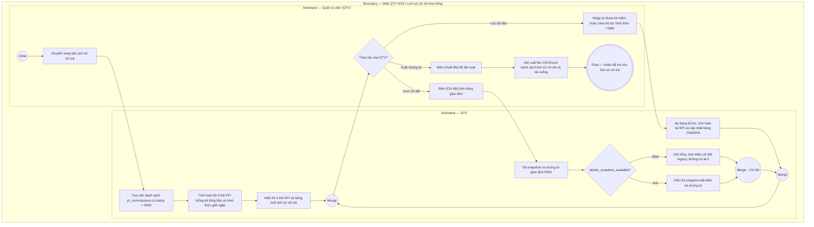

# QTV-W15-US03 - Tra cứu và đối soát lịch sử chi trả hoa hồng PT

## Preconditions
- Người dùng đăng nhập tài khoản Quản trị viên (QTV) và có quyền quản trị tài chính.
- Hệ thống đã có các khoản hoa hồng PT được chi trả thành công ở trạng thái `PAID` (kèm phương thức `BANK_TRANSFER` hoặc `CASH`, mã chứng từ `payout_ref` và ngày giờ chi trả `paid_at`).

## Trigger
- QTV truy cập menu **W15 Quản lý hoa hồng PT**, chuyển sang tab **Lịch sử chi trả**.
- Màn hình liên quan: Web QTV — W15 Quản lý hoa hồng PT, tab **Lịch sử chi trả**.

## Main Flow

1. QTV truy cập menu W15 và chọn tab **Lịch sử chi trả**.
2. SYS tự động nạp danh sách toàn bộ các giao dịch hoa hồng đã chi trả (`status = 'PAID'`) của các HLV trong phạm vi chi nhánh của QTV, sắp xếp theo thời gian chi trả mới nhất (`paid_at DESC`).
3. SYS tổng hợp và hiển thị bộ 4 thẻ KPI thống kê lịch sử giải ngân:
   - `Tổng lượt đã chi trả`: Tổng số giao dịch hoa hồng đã quyết toán thành công.
   - `Tổng tiền đã giải ngân`: Tổng số tiền hoa hồng thực tế phòng tập đã chi trả (VND).
   - `Chi qua VietQR / Ngân hàng`: Tổng số tiền và số giao dịch đã chuyển khoản qua VietQR.
   - `Chi tiền mặt tại quầy`: Tổng số tiền và số phiếu chi tiền mặt đã thanh toán trực tiếp tại quầy.
4. SYS hiển thị danh sách chi tiết các khoản chi trên bảng dữ liệu `dxDataGrid` (Kỳ hoa hồng, Họ tên & Mã HLV, Chi nhánh, Số buổi dạy, Doanh số quy đổi, Tỷ lệ %, Số tiền đã chi, Hình thức chi trả, Mã GD / Phiếu chi, Thời gian chi trả, Người thực hiện chi).
5. QTV sử dụng các bộ lọc tác nghiệp:
   - Nhập từ khóa vào ô tìm kiếm để lọc nhanh theo tên HLV, mã HLV hoặc mã giao dịch / số phiếu chi.
   - Chọn Tháng hoa hồng: *Tất cả tháng* (mặc định), hoặc chọn từ *Tháng 1* đến *Tháng 12*.
   - Chọn Năm hoa hồng: *2026* (mặc định, tùy chỉnh từ 2025 - 2030, có nút xóa để xem mọi năm).
   - Chọn lọc theo hình thức chi trả: *Tất cả*, *Chuyển khoản VietQR*, *Tiền mặt tại quầy*.
6. SYS tự động lọc danh sách và cập nhật lại bộ 4 thẻ KPI tương ứng với kết quả lọc.
7. QTV bấm nút **[Chi tiết]** trên một dòng giao dịch: SYS mở popup hiển thị snapshot bất biến các buổi cấu thành (legacy thiếu snapshot thì thông báo thiếu chi tiết, không dựng lại) kèm khối chứng từ chi trả (Thời gian chi trả, Hình thức, Mã giao dịch / Phiếu chi, Người duyệt chi, Ghi chú).
8. QTV bấm nút **[Xuất file]**: SYS xuất toàn bộ dữ liệu lịch sử chi trả ra file CSV/Excel để phục vụ lưu trữ sổ sách kế toán.

---

### Field-level specification — Màn hình Lịch sử chi trả hoa hồng PT
| Field / control | Loại UI Control | State | Required | Conditional / dynamic | Source / validation |
| :--- | :--- | :--- | :--- | :--- | :--- |
| Ô tìm kiếm lịch sử | `Text Box (dxTextBox)` | `USER-INPUT` | optional | `DYNAMIC` | Nhập từ khóa tìm kiếm theo tên HLV, mã HLV, mã giao dịch FT hoặc số phiếu chi. Tự động lọc real-time |
| Bộ lọc Tháng hoa hồng | `Select Dropdown (dxSelectBox)` | `USER-INPUT (PREFILL)` | required | `TRIGGER` | Tùy chọn: `ALL` (Tất cả tháng - mặc định) hoặc chọn `Tháng 1` .. `Tháng 12`. Đồng bộ giao diện với Tab Bảng kê |
| Bộ lọc Năm hoa hồng | `Number Box (dxNumberBox)` | `USER-INPUT (PREFILL)` | optional | `TRIGGER` | Mặc định năm hiện hành (2026), giới hạn 2025-2030, có nút xóa để bỏ lọc năm. Lọc theo `c.year` |
| Bộ lọc Hình thức chi trả | `Select Dropdown (dxSelectBox)` | `USER-INPUT (PREFILL)` | required | `TRIGGER` | Tùy chọn: `ALL` (Tất cả hình thức - mặc định), `BANK_TRANSFER` (Chuyển khoản VietQR), `CASH` (Tiền mặt tại quầy) |
| Nút [Làm mới] | `Button (Outlined)` | `USER-INPUT` | optional | `Không` | Tải lại danh sách lịch sử chi trả và tính toán lại 4 thẻ KPI |
| Nút [Xuất file] | `Button (Outlined)` | `USER-INPUT` | optional | `Không` | Xuất danh sách lịch sử chi trả hiện tại ra file CSV/Excel kèm dấu phân cách chuẩn UTF-8 |
| Thẻ KPI Tổng lượt đã chi trả | `Metric Card (W().metrics)` | `READONLY` | required | `DYNAMIC` | Hiển thị tổng số giao dịch hoa hồng đã quyết toán (`PAID`) theo bộ lọc hiện hành |
| Thẻ KPI Tổng tiền đã giải ngân | `Metric Card (W().metrics)` | `READONLY` | required | `DYNAMIC` | Hiển thị tổng số tiền hoa hồng thực tế đã giải ngân (VND) theo bộ lọc |
| Thẻ KPI Chi qua VietQR / Ngân hàng | `Metric Card (W().metrics)` | `READONLY` | required | `DYNAMIC` | Số tiền và số giao dịch đã thanh toán qua Chuyển khoản ngân hàng VietQR |
| Thẻ KPI Chi tiền mặt tại quầy | `Metric Card (W().metrics)` | `READONLY` | required | `DYNAMIC` | Số tiền và số phiếu chi tiền mặt tại quầy chi nhánh |
| Bảng dữ liệu Lịch sử chi trả | `DataGrid (dxDataGrid)` | `READONLY` | required | `DYNAMIC` | Bảng hiển thị các cột: Kỳ hoa hồng, Huấn luyện viên, Chi nhánh, Số buổi dạy, Doanh số quy đổi, Tỷ lệ %, Số tiền đã chi trả (nổi bật tabular), Hình thức (Badge), Mã GD / Phiếu chi, Thời gian chi trả, Người chi trả, Nút Chi tiết |
| Nút [Chi tiết] | `Grid Action Button` | `USER-INPUT` | optional | `Không` | Mở popup xem chi tiết các buổi dạy hoàn thành và khối thông tin chứng từ chi trả của giao dịch |

---

### Đồng bộ snapshot PAID đã phê duyệt (20/09/2026)
- Chi trả mới lưu tổng, chứng từ và snapshot chi tiết từng buổi nguyên tử trong cùng transaction. Lỗi lưu snapshot phải rollback toàn bộ; không có PAID mới chỉ chứa tổng.
- PAID có snapshot: xem/xuất chi tiết từ snapshot bất biến, không tính lại từ booking, hồ sơ hoặc tỷ lệ hiện tại; tổng phải khớp toàn bộ chi tiết cùng bảng kê.
- PAID legacy không snapshot: API details_snapshot_available=false và sessions=[]; vẫn hiển thị tổng/chứng từ lịch sử và thông báo Không có chi tiết lịch sử cho kỳ đã chi trả này. Không coi [] là 0 buổi/0 đồng, không tái dựng từ dữ liệu sống.
- Giữ nguyên quyền QTV/branch scope. PT06-US02 chỉ đọc chính bảng kê PT; không mở quyền chi trả cho PT. Migration/ERD do backend owner cập nhật.

### Field-level specification — Trạng thái snapshot trong popup Chi tiết
| Field | UI | State | Required | Conditional / dynamic | Source / validation |
| --- | --- | --- | --- | --- | --- |
| Chi tiết từng buổi | Readonly list | READONLY | conditional | CONDITIONAL: hiện khi có snapshot PAID hoặc bảng kê chưa PAID có chi tiết tính hiện hành; ẩn khi PAID legacy thiếu snapshot | Học viên, gói, ngày/giờ, giá trị PT, hoa hồng từ nguồn cùng bảng kê; PAID chỉ dùng snapshot |
| Thông báo không có chi tiết lịch sử | Text | READONLY | conditional | CONDITIONAL: hiện khi PAID và details_snapshot_available=false; ẩn khi có snapshot hoặc chưa PAID | API flag; không dùng danh sách rỗng để ghi 0 |
| Tổng và chứng từ đã chi | Text | READONLY | required | Không | Tổng/chứng từ lịch sử, giữ nguyên kể cả thiếu snapshot |

## Alternate Flows

### AF-01 - Xuất Dữ Liệu Đối Soát Sổ Sách
1. QTV thiết lập bộ lọc (ví dụ: lọc tất cả giao dịch `CASH` trong tháng vừa qua).
2. QTV bấm **[Xuất file]**.
3. SYS kết xuất file bảng tính CSV/Excel đầy đủ 12 cột thông tin chứng từ và trình duyệt tự động tải file về máy.

- AF-02: PAID legacy thiếu snapshot → hiển thị tổng/chứng từ cùng thông báo thiếu chi tiết; không mất giao dịch khỏi lịch sử.

## Exception Flows
- **Không có dữ liệu phù hợp:** Khi bộ lọc không tìm thấy giao dịch nào thỏa mãn, SYS hiển thị Empty State: *"Chưa có lịch sử chi trả nào phù hợp với bộ lọc."* và các thẻ KPI hiển thị về giá trị 0.

## Activity Diagram — Swimlane
**Trigger:** QTV mở tab Lịch sử chi trả trên Web QTV W15.

