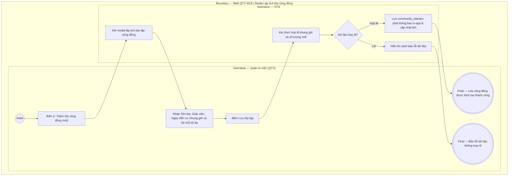

# QTV-W16-US01 - Lập lịch và quản lý lớp tập cộng đồng

## Preconditions
- Người dùng đăng nhập tài khoản Quản trị viên (QTV) và có quyền quản lý lịch tập - dịch vụ.
- Hệ thống đã có danh mục chi nhánh (`branches`) và phòng tập / khu vực tập nhóm.

## Trigger
- QTV truy cập menu **W16 Lớp tập cộng đồng** và bấm nút **[+ Thêm lớp cộng đồng mới]**.
- Màn hình liên quan: Web QTV — W16 Lớp tập cộng đồng, modal **Lập lịch lớp tập cộng đồng**.

## Main Flow

1. QTV truy cập menu W16, xem danh sách các lớp tập nhóm đã lập theo ngày/tuần.
2. QTV bấm nút **[+ Thêm lớp cộng đồng mới]**.
3. SYS mở modal **Lập lịch lớp tập cộng đồng**.
4. QTV chọn **Chi nhánh tổ chức** (TagBox đa lựa chọn: QTV toàn chuỗi có thể chọn nhiều chi nhánh cùng lúc để tạo lịch đồng loạt).
5. QTV nhập **Tên lớp tập** (ví dụ: `Cardio Đốt Mỡ Siêu Tốc`, `Aerobic Khỏe Đẹp`, `Yoga Hatha Buổi Sáng`).
6. QTV nhập **Giáo viên / HLV hướng dẫn** (ví dụ: `Cô Mai Anh`, `Thầy Alex`).
7. QTV chọn **Ngày diễn ra** (Date Picker).
8. QTV chọn **Giờ bắt đầu** và **Giờ kết thúc** từ danh sách khung giờ cách nhau 15 phút (`dxSelectBox`), hệ thống tự động gợi ý giờ kết thúc sau giờ bắt đầu 60 phút.
9. QTV nhập **Số lượng chỗ tối đa (Max Slots)** (ví dụ: `40`).
10. QTV nhập **Mô tả / Lưu ý chuẩn bị** (ví dụ: mang thảm tập cá nhân, trang phục thể thao thoải mái).
11. QTV bấm **Lưu lớp tập**.
12. SYS kiểm tra tính hợp lệ (giờ kết thúc > giờ bắt đầu, max slots > 0, ngày diễn ra >= ngày hiện tại), lưu vào bảng `community_classes` với trạng thái `OPEN` cho từng chi nhánh đã chọn, phát thông báo in-app cho hội viên và hiển thị lên lịch lớp cộng đồng.

### Field-level specification — modal Lập lịch lớp tập cộng đồng
| Field / control | Loại UI Control | State | Required | Conditional / dynamic | Source / validation |
| :--- | :--- | :--- | :--- | :--- | :--- |
| Chi nhánh tổ chức | `TagBox (Multi-select Dropdown)` | `USER-INPUT (PREFILL)` | required | `Không` | Nạp từ bảng `BRANCHES`. Hỗ trợ chọn 1 hoặc nhiều chi nhánh cùng lúc (có tính năng Chọn tất cả chi nhánh cho QTV toàn chuỗi) |
| Tên lớp học | `Text Input` | `USER-INPUT` | required | `Không` | Chuỗi ký tự từ 3 đến 100 ký tự (ví dụ: `Aerobic Giảm Cân`) |
| Huấn luyện viên / Giáo viên | `Text Input` | `USER-INPUT` | required | `Không` | Tên huấn luyện viên hoặc giáo viên thỉnh giảng đứng lớp |
| Ngày học | `Date Picker` | `USER-INPUT` | required | `Không` | Ngày tổ chức; phải từ ngày hiện tại trở đi |
| Giờ bắt đầu | `Select Dropdown (Time Select Box)` | `USER-INPUT` | required | `TRIGGER` | Danh sách các khung giờ 15 phút từ 06:00 đến 21:45; tự động kích hoạt tính toán và gợi ý giờ kết thúc (+60 phút) |
| Giờ kết thúc | `Select Dropdown (Time Select Box)` | `USER-INPUT` | required | `DYNAMIC` | Danh sách các khung giờ 15 phút; phải lớn hơn giờ bắt đầu |
| Số lượng chỗ tối đa | `Number Input` | `USER-INPUT` | required | `Không` | Số nguyên dương > 0 (ví dụ: `30`, `40`, `50`) |
| Mô tả lớp học & lưu ý | `Textarea` | `USER-INPUT` | optional | `Không` | Mô tả nội dung bài tập, dụng cụ cần chuẩn bị |

- **Business rules / logic:**
  - Lớp tập cộng đồng mở cho tất cả Hội viên có gói Gym còn hạn đăng ký tham gia miễn phí hoặc theo chính sách chi nhánh.
  - Số lượng hội viên đăng ký không được vượt quá `max_slots`. Khi đủ số chỗ, hệ thống tự động khóa đăng ký (`FULL`).
  - QTV có quyền xóa/hủy lớp tập cộng đồng. Khi xóa lớp, toàn bộ bản ghi đăng ký của học viên liên quan sẽ được tự động cập nhật trạng thái `CANCELLED` và lớp bị loại bỏ khỏi lịch.

## Alternate Flows

### AF-01 - Hủy Thao Tác
1. QTV chọn **Hủy** hoặc nút **X**.
2. SYS đóng modal và giữ nguyên danh sách lớp tập.

### AF-02 - Xóa / Hủy Buổi Tập Cộng Đồng
1. Tại danh sách lớp học ở màn hình chính, QTV chọn nút **Xóa lớp** tại cột Thao tác của lớp tập tương ứng.
2. SYS hiển thị hộp thoại xác nhận: *"Bạn có chắc chắn muốn xóa lớp tập... Toàn bộ học viên đã đăng ký sẽ bị hủy theo lớp này"*.
3. QTV bấm **Xác nhận**.
4. SYS gọi API xóa lớp, chuyển trạng thái đăng ký thành `CANCELLED`, loại bỏ lớp khỏi hệ thống và thông báo thành công.

## Exception Flows
- **Thời gian không hợp lệ:** Giờ kết thúc sớm hơn hoặc bằng giờ bắt đầu. SYS báo lỗi: *"Giờ kết thúc phải sau giờ bắt đầu ít nhất 30 phút"*.
- **Số lượng chỗ không hợp lệ:** Max slots $\le 0$. SYS báo lỗi: *"Số lượng chỗ tối đa phải lớn hơn 0"*.

## Activity Diagram — Swimlane
**Trigger:** QTV bấm [+ Thêm lớp cộng đồng mới] trên Web QTV W16.

