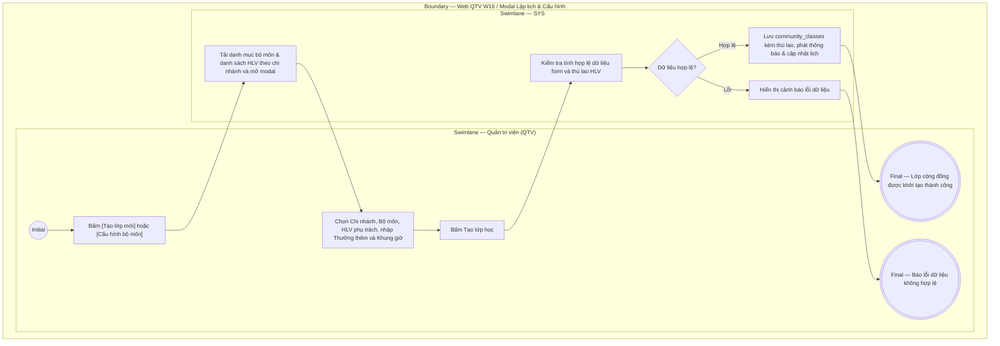

# QTV-W16-US01 - Lập lịch và quản lý lớp tập cộng đồng

## Preconditions
- Người dùng đăng nhập tài khoản Quản trị viên (QTV) và có quyền quản lý lịch tập - dịch vụ.
- Hệ thống đã có danh mục chi nhánh (`branches`), danh mục bộ môn tập luyện (`class_disciplines`) và danh sách huấn luyện viên (`pt_profiles`).

## Trigger
- QTV truy cập menu **W16 Lớp tập cộng đồng**, bấm nút **[Cấu hình bộ môn]** hoặc **[Tạo lớp mới]**.
- Màn hình liên quan: Web QTV — W16 Lớp tập cộng đồng, modal **Cấu hình danh mục bộ môn**, modal **Thêm lịch lớp tập cộng đồng**.

## Main Flow

1. QTV truy cập menu W16, chọn **Chi nhánh xem lịch** từ bộ lọc chi nhánh (`dxSelectBox` đơn chọn, không có tùy chọn 'Tất cả chi nhánh' nhằm đảm bảo tính độc lập dữ liệu giữa các cơ sở). Lịch tuần của chi nhánh được nạp và hiển thị độc lập với thanh cuộn trực quan và hỗ trợ lăn chuột trên toàn bộ khung giờ.
2. QTV bấm nút **[Tạo lớp mới]**.
3. SYS nạp danh sách bộ môn đang hoạt động (`class_disciplines?status=ACTIVE`) và danh sách huấn luyện viên (`pt_bookings/trainers`), mở modal **Thêm lịch lớp tập cộng đồng**.
4. QTV chọn **Chi nhánh tổ chức** (Dropdown `dxSelectBox` đơn chọn: bắt buộc chọn 1 chi nhánh cụ thể, loại bỏ tùy chọn 'Tất cả chi nhánh'; hệ thống tự động lọc danh sách HLV theo chi nhánh đã chọn).
5. QTV chọn **Tên lớp học (Bộ môn)** từ dropdown (`dxSelectBox`), hệ thống tự động nạp giá sàn bộ môn (`base_price`), thời lượng tối đa (`max_duration_minutes`), mô tả gợi ý và cập nhật thời gian kết thúc gợi ý.
6. QTV chọn **Huấn luyện viên / Giáo viên** phụ trách từ dropdown (`dxSelectBox` hiển thị các HLV khả dụng thuộc chi nhánh đã chọn).
7. QTV nhập **Thưởng thêm HLV** (VNĐ) nếu có để khích lệ giảng dạy chất lượng cao; hệ thống tự động tính toán và hiển thị **Tổng thù lao HLV** (= Giá sàn bộ môn + Thưởng thêm).
8. QTV có 2 phương thức chọn thời gian học:
   - **Cách 1 - Nhập form:** Chọn **Ngày học** (Date Picker), chọn **Giờ bắt đầu** và **Giờ kết thúc** từ dropdown khung giờ 15 phút (`dxSelectBox`).
   - **Cách 2 - Kéo thả trực quan trên Calendar:** Bấm nút **[Kéo chọn giờ trên Calendar]**, hệ thống đóng modal và tạo một thẻ dự kiến (`draft appointment`) trực tiếp trên lịch tuần với thời lượng mặc định bằng thời lượng tối đa của bộ môn. QTV kéo di chuyển hoặc kéo dãn kích thước thẻ để chọn khung giờ:
     * *Quy tắc Snap-back:* Nếu QTV kéo dãn chiều cao thẻ vượt quá thời lượng tối đa của bộ môn (`max_duration_minutes`), khi thả chuột ra thẻ sẽ tự động co về (snap back) độ cao chuẩn bằng đúng thời lượng tối đa của bộ môn, đảm bảo không thể tạo lớp vượt quá thời lượng cho phép.
     * Bấm **[Đặt lịch]** trên thẻ để xác nhận hoặc **[Hủy]** để hủy thẻ dự kiến.
9. QTV nhập **Số lượng chỗ tối đa (Max Slots)** (ví dụ: `40`).
10. QTV kiểm tra hoặc điều chỉnh **Mô tả lớp học & lưu ý** (ví dụ: mang thảm tập cá nhân, khăn lau).
11. QTV bấm **Tạo lớp học** (hoặc bấm [Đặt lịch] trên thẻ kéo thả).
12. SYS kiểm tra tính hợp lệ (giờ kết thúc > giờ bắt đầu, thời lượng <= thời lượng tối đa bộ môn, không trùng lịch HLV/phòng tập, max slots > 0, ngày diễn ra >= ngày hiện tại), lưu vào bảng `community_classes` (kèm `discipline_id`, `instructor_id`, `base_price`, `bonus_amount`) với trạng thái `OPEN` cho chi nhánh đã chọn, phát thông báo in-app và hiển thị lớp học lên lịch tuần.

### Field-level specification — modal Thêm lịch lớp tập cộng đồng
| Field / control | Loại UI Control | State | Required | Conditional / dynamic | Source / validation |
| :--- | :--- | :--- | :--- | :--- | :--- |
| Chi nhánh tổ chức | `Searchable SelectBox (Đơn chọn)` | `USER-INPUT (PREFILL)` | required | `TRIGGER` | Nạp từ bảng `branches` (chỉ gồm các chi nhánh cụ thể, loại bỏ hoàn toàn option 'Tất cả chi nhánh' ALL). Kích hoạt lọc danh sách HLV theo chi nhánh |
| Tên lớp học (Bộ môn) | `Searchable SelectBox` | `USER-INPUT` | required | `TRIGGER` | Nạp từ `class_disciplines`. Kích hoạt tự động nạp giá sàn bộ môn, thời lượng tối đa, gợi ý giờ kết thúc và tính tổng thù lao |
| Huấn luyện viên / Giáo viên | `Searchable SelectBox` | `USER-INPUT` | required | `DYNAMIC` | Nạp từ `pt_profiles`. Tự động lọc theo chi nhánh được chọn tại Chi nhánh tổ chức |
| Thưởng thêm HLV | `Number Input` | `USER-INPUT` | optional | `TRIGGER` | Số tiền thưởng thêm (VNĐ) khuyến khích HLV đứng lớp; tối thiểu 0 ₫. Kích hoạt cập nhật Tổng thù lao HLV |
| Tổng thù lao HLV | `Text Input` | `READONLY` | optional | `DYNAMIC` | Tự động tính toán = Giá sàn bộ môn + Thưởng thêm HLV. Hiển thị dạng tiền tệ (ví dụ: `250,000 ₫ (200,000 ₫ sàn + 50,000 ₫ thưởng)`) |
| Ngày học | `Date Picker` | `USER-INPUT` | required | `Không` | Ngày tổ chức lớp; định dạng `dd/MM/yyyy` |
| Giờ bắt đầu | `Select Dropdown (Time Select Box)` | `USER-INPUT` | required | `TRIGGER` | Danh sách khung giờ 15 phút từ 06:00 đến 21:45; tự động kích hoạt tính toán gợi ý giờ kết thúc theo thời lượng bộ môn |
| Giờ kết thúc | `Select Dropdown (Time Select Box)` | `USER-INPUT` | required | `DYNAMIC` | Danh sách khung giờ 15 phút; phải sau giờ bắt đầu và không vượt quá thời lượng tối đa bộ môn |
| Số lượng chỗ tối đa | `Number Input` | `USER-INPUT` | required | `Không` | Số nguyên dương từ 5 đến 100 chỗ (mặc định 40) |
| Mô tả lớp học & lưu ý | `Textarea` | `USER-INPUT (PREFILL)` | optional | `DYNAMIC` | Tự động prefill theo mô tả của bộ môn đã chọn nếu chưa nhập; có thể điều chỉnh tùy biến |

### Field-level specification — modal Chi tiết lớp tập
| Field / control | Loại UI Control | State | Required | Conditional / dynamic | Source / validation |
| :--- | :--- | :--- | :--- | :--- | :--- |
| Tiêu đề lớp học & Bộ môn, Chi nhánh | `Display Header` | `READONLY` | optional | `Không` | Hiển thị tên lớp, bộ môn và tên chi nhánh tổ chức |
| Badge trạng thái lớp | `Badge` | `READONLY` | optional | `DYNAMIC` | Hiển thị `ĐÃ HỦY` (nếu cancelled), `ĐÃ KẾT THÚC` (nếu session đã qua giờ kết thúc), `ĐÃ ĐỦ CHỖ` (nếu full chỗ), hoặc `ĐANG MỞ ĐĂNG KÝ` |
| Ngày học & Khung giờ | `Text Info` | `READONLY` | optional | `Không` | Thứ trong tuần, ngày tháng năm và giờ bắt đầu - kết thúc |
| HLV phụ trách & SĐT | `Text Info` | `READONLY` | optional | `Không` | Họ tên, mã HLV và số điện thoại liên hệ |
| Thù lao giảng dạy (Chỉ QTV) | `Text Info` | `READONLY` | optional | `Không` | Tổng thù lao = Giá sàn bộ môn + Thưởng thêm |
| Tiến độ chỗ trống | `Progress Bar` | `READONLY` | optional | `DYNAMIC` | Tỷ lệ số chỗ đã đăng ký / tổng số chỗ tối đa |
| Ghi chú lớp | `Display Text` | `READONLY` | optional | `CONDITIONAL` | Hiện khi lớp có mô tả/ghi chú, ẩn khi để trống |
| Nút [Xóa lớp] | `Action Button (Danger Outlined)` | `USER-INPUT` | optional | `CONDITIONAL` | Hiện cho QTV, ẩn đối với các vai trò không có quyền xóa |
| Nút [Gán lại PT] | `Action Button (Outlined)` | `USER-INPUT` | optional | `CONDITIONAL` | **Quy tắc hiển thị:** Chỉ hiển thị khi buổi tập **CHƯA QUA** thời gian kết thúc (`!isPassed`); tự động ẩn hoàn toàn khi buổi tập đã kết thúc (`ĐÃ KẾT THÚC`) để ngăn chặn can thiệp dữ liệu quá khứ |
| Nút [Danh sách học viên] | `Action Button (Outlined)` | `USER-INPUT` | optional | `Không` | Mở modal danh sách hội viên đã đăng ký kèm số lượng |
| Nút [Ghi danh hội viên] | `Action Button (Primary Contained)`| `USER-INPUT` | optional | `CONDITIONAL` | Hiện khi lớp chưa đầy (`!isFull`) và chưa qua thời gian (`!isPassed`); ẩn khi lớp đã đủ chỗ hoặc đã kết thúc |
| Nút [Đóng] | `Action Button (Outlined)` | `USER-INPUT` | optional | `Không` | Đóng modal chi tiết |

### Field-level specification — modal Gán lại HLV (Điều phối giáo viên)
| Field / control | Loại UI Control | State | Required | Conditional / dynamic | Source / validation |
| :--- | :--- | :--- | :--- | :--- | :--- |
| Thông tin tóm tắt lớp (Chi nhánh, Bộ môn, Thời gian, HLV hiện tại) | `Summary Card` | `READONLY` | optional | `Không` | Card hiển thị tóm tắt thông tin buổi tập cần điều chuyển HLV |
| Huấn luyện viên phụ trách mới | `Searchable SelectBox` | `USER-INPUT` | required | `DYNAMIC` | Nạp từ API `/community-classes/available-instructors`. Chỉ hiển thị danh sách các HLV thuộc cùng chi nhánh và rảnh lịch trong khung giờ buổi tập |
| Lý do gán lại / Ghi chú điều chuyển | `Textarea` | `USER-INPUT` | optional | `Không` | Tối đa 255 ký tự; nhập lý do đổi HLV (ví dụ: HLV bận việc cá nhân, đổi ca dạy thay...) |

- **Business rules / logic:**
  - Lịch tập cộng đồng được quản lý độc lập theo từng chi nhánh cụ thể, loại bỏ tùy chọn hiển thị gộp 'Tất cả chi nhánh' để tránh nhầm lẫn lịch và xung đột phòng tập/HLV giữa các cơ sở.
  - Khi điều chỉnh kích thước thẻ dự kiến trên giao diện kéo thả Calendar, hệ thống áp dụng cơ chế **Snap-back tự động**: chiều cao thẻ bị giới hạn trần bởi `max_duration_minutes` của bộ môn. Mọi thao tác kéo dãn quá giới hạn sẽ tự động co về thời lượng tối đa khi nhả chuột.
  - **Quy tắc Bất Biến Gán Lại HLV (Reassign PT):**
    * Chỉ cho phép gán lại PT khi thời gian kết thúc buổi tập chưa trôi qua (`(class_date + end_time) > NOW() AT TIME ZONE 'Asia/Ho_Chi_Minh'`).
    * Nếu buổi tập đã kết thúc trong quá khứ, nút **[Gán lại PT]** bị ẩn hoàn toàn trên giao diện và backend từ chối mọi yêu cầu thay đổi với mã lỗi `400 Bad Request`.
    * Huấn luyện viên mới được gán phải thuộc cùng chi nhánh với lớp tập và không bị trùng lịch (không có lịch dạy PT 1:1 hoặc lớp cộng đồng khác trùng giờ).
  - Lớp tập cộng đồng mở cho tất cả Hội viên có gói Gym còn hạn đăng ký tham gia miễn phí hoặc theo chính sách chi nhánh.
  - Tổng thù lao chi trả cho HLV = `base_price` (giá sàn bộ môn tại thời điểm tạo lớp) + `bonus_amount` (thưởng thêm).
  - Số lượng hội viên đăng ký không được vượt quá `max_slots`. Khi đủ số chỗ, hệ thống tự động khóa đăng ký (`FULL`).
  - QTV có quyền xóa/hủy lớp tập cộng đồng. Khi xóa lớp, toàn bộ bản ghi đăng ký của học viên liên quan sẽ được tự động cập nhật trạng thái `CANCELLED` và lớp bị loại bỏ khỏi lịch.

## Alternate Flows

### AF-01 - Hủy Thao Tác
1. QTV chọn **Hủy** hoặc nút **X**.
2. SYS đóng modal và giữ nguyên danh sách lớp tập.

### AF-02 - Xóa / Hủy Buổi Tập Cộng Đồng
1. Tại danh sách lớp học ở màn hình chính, QTV chọn nút **Xóa lớp** tại cột Thao tác của lớp tập tương ứng (hoặc trong modal Chi tiết lớp tập).
2. SYS hiển thị hộp thoại xác nhận: *"Bạn có chắc chắn muốn xóa lớp tập... Toàn bộ học viên đã đăng ký sẽ bị hủy theo lớp này"*.
3. QTV bấm **Xác nhận**.
4. SYS gọi API xóa lớp, chuyển trạng thái đăng ký thành `CANCELLED`, loại bỏ lớp khỏi hệ thống và thông báo thành công.

### AF-03 - Quản Lý Cấu Hình Danh Mục Bộ Môn
1. Tại thanh công cụ màn hình W16, QTV bấm nút **[Cấu hình bộ môn]**.
2. SYS mở modal **Cấu hình danh mục bộ môn** hiển thị DataGrid danh sách các bộ môn (Tên bộ môn, Mô tả, Giá sàn 1 buổi dạy, Thời lượng tối đa, Trạng thái hoạt động, Thao tác).
3. QTV bấm **[Thêm bộ môn]** (hoặc nút **Sửa** tại từng dòng) để mở form cấu hình bộ môn:
   - Tên bộ môn (`name`, bắt buộc)
   - Giá sàn 1 buổi dạy (`base_price`, bắt buộc, VNĐ)
   - Thời lượng 1 buổi (`max_duration_minutes`, bắt buộc, phút; QTV tự do cấu hình theo đặc thù bộ môn: 15 - 240 phút, mặc định 60 phút, chiều cao thẻ lớp học trên calendar dxScheduler sẽ tự động co giãn theo thời lượng này)
   - Trạng thái hoạt động (`status`: Hoạt động / Tạm dừng)
   - Mô tả bộ môn (`description`, tùy chọn)
4. QTV bấm **Lưu thay đổi** (hoặc **Thêm bộ môn**): SYS lưu vào bảng `class_disciplines` và làm mới danh sách.
5. QTV có thể bấm **Xóa** tại từng dòng: nếu bộ môn đã có lớp học liên kết, hệ thống tự động chuyển trạng thái sang `INACTIVE` để bảo toàn dữ liệu lịch sử.

### AF-04 - Điều Phối Và Gán Lại Huấn Luyện Viên Phụ Trách Lớp Cộng Đồng
1. Tại lịch tuần W16, QTV bấm vào thẻ lớp học để mở modal **Chi tiết lớp tập**.
2. SYS kiểm tra thời gian diễn ra:
   - Nếu lớp đã kết thúc (`isPassed === true`): Badge hiển thị `ĐÃ KẾT THÚC`, nút **[Gán lại PT]** tự động ẩn.
   - Nếu lớp chưa kết thúc (`isPassed === false`): Nút **[Gán lại PT]** hiển thị sẵn sàng thao tác.
3. QTV bấm **[Gán lại PT]**.
4. SYS mở modal **Gán lại HLV: [Tên lớp]**, tự động tải danh sách các HLV khả dụng cùng chi nhánh và không trùng lịch.
5. QTV chọn **Huấn luyện viên phụ trách mới** và nhập **Lý do gán lại / Ghi chú điều chuyển**.
6. QTV bấm **[Xác nhận gán lại PT]**.
7. SYS xác thực thời gian hợp lệ, kiểm tra xung đột lịch, cập nhật `instructor_id` trong `community_classes`, ghi audit log `COMMUNITY_CLASS_INSTRUCTOR_REASSIGNED`, thông báo thành công và cập nhật lại lịch tuần.

## Exception Flows
- **Thời gian không hợp lệ:** Giờ kết thúc sớm hơn hoặc bằng giờ bắt đầu. SYS báo lỗi: *"Giờ kết thúc phải sau giờ bắt đầu"*.
- **Thiếu thông tin bắt buộc:** Chưa chọn bộ môn hoặc chưa chọn HLV phụ trách. SYS hiển thị thông báo lỗi ngay dưới trường nhập liệu.
- **Số lượng chỗ không hợp lệ:** Max slots $\le 0$ hoặc ngoài khoảng 5 - 100. SYS báo lỗi: *"Nhập số chỗ tối đa hợp lệ"*.
- **Buổi tập đã qua thời gian:** Thao tác gán lại HLV cho lớp đã kết thúc bị backend chặn với lỗi: *"Không thể thay đổi HLV vì buổi tập đã qua thời gian diễn ra"*.
- **Xung đột lịch HLV:** HLV mới đã có lịch dạy 1:1 hoặc lớp cộng đồng khác trùng giờ. SYS báo lỗi: *"HLV đã có lịch dạy khác trong khung giờ này"*.

## Activity Diagram — Swimlane
**Trigger:** QTV mở W16 và lập lịch lớp tập cộng đồng hoặc cấu hình bộ môn.

