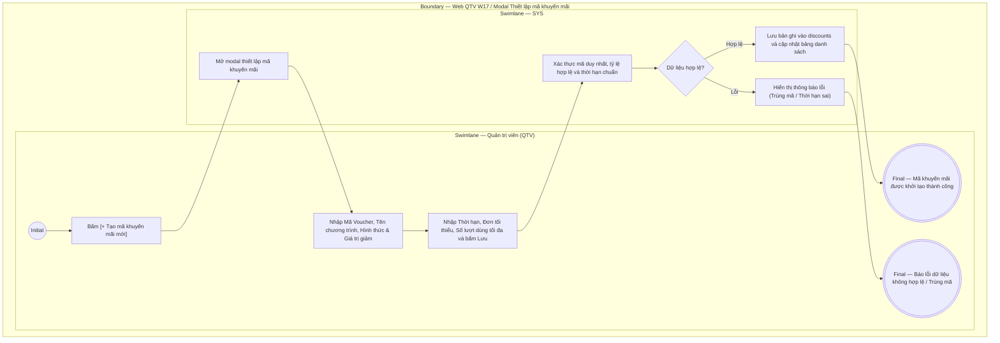

# QTV-W17-US01 - Quản lý chương trình khuyến mãi và mã giảm giá

## Preconditions
- Người dùng đăng nhập tài khoản Quản trị viên (QTV) và có quyền quản lý khuyến mãi - giá bán.
- Hệ thống đã có danh mục chi nhánh (`branches`).

## Trigger
- QTV truy cập menu **W17 Khuyến mãi & giảm giá** và bấm nút **[+ Tạo mã khuyến mãi mới]** (hoặc bấm biểu tượng Sửa trên một dòng mã).
- Màn hình liên quan: Web QTV — W17 Khuyến mãi & giảm giá, modal **Thiết lập mã khuyến mãi & giảm giá**.

## Main Flow

1. QTV truy cập menu W17, xem danh sách các mã khuyến mãi hiện có.
2. QTV bấm nút **[+ Tạo mã khuyến mãi mới]**.
3. SYS mở modal **Thiết lập mã khuyến mãi & giảm giá**.
4. QTV chọn **Chi nhánh áp dụng** (hoặc Tất cả chi nhánh).
5. QTV nhập **Mã Voucher** (tự động chuyển thành chữ in hoa, không dấu, ví dụ: `SUMMER2026`, `CHAOHE20`, `VIPFIT`).
6. QTV nhập **Tên chương trình khuyến mãi** (ví dụ: `Ưu đãi chào hè rực rỡ 2026`).
7. QTV chọn **Hình thức giảm giá**: `Theo phần trăm (%)` hoặc `Số tiền cố định (VNĐ)`.
8. QTV nhập **Giá trị giảm** (ví dụ: `15%` hoặc `200.000 đ`).
9. Nếu là `Theo phần trăm (%)`, QTV nhập thêm **Mức giảm tối đa (VNĐ)** (ví dụ: `500.000 đ`).
10. QTV nhập **Giá trị đơn hàng tối thiểu (VNĐ)** để được áp mã (ví dụ: `1.000.000 đ`).
11. QTV chọn **Thời gian áp dụng**: Từ ngày bắt đầu đến ngày kết thúc (Date Range).
12. QTV nhập **Giới hạn số lượt dùng tối đa** (ví dụ: `50` lượt).
13. QTV bấm **Lưu mã khuyến mãi**.
14. SYS xác thực dữ liệu (mã không trùng lặp, ngày kết thúc $\ge$ ngày bắt đầu, giá trị giảm $> 0$), lưu vào bảng `discounts`, thông báo thành công và hiển thị lên danh sách mã giảm giá.

### Field-level specification — Bảng danh sách Mã khuyến mãi & Voucher (DataGrid W17)
| Field / control | Loại UI Control | State | Required | Conditional / dynamic | Source / validation |
| :--- | :--- | :--- | :--- | :--- | :--- |
| Nút [+ Tạo mã khuyến mãi mới] | `Action Button (CTA)` | `USER-INPUT` | required | `Không` | Nút chính góc trên bên phải, mở modal Thiết lập mã khuyến mãi mới |
| Mã voucher | `Data Column (Monospace Text)` | `READONLY` | required | `Không` | Mã voucher viết hoa đậm không viền nét đứt (ví dụ: `SUMMER2026`, `VIPFIT`) |
| Tên chương trình | `Data Column (Text)` | `READONLY` | required | `Không` | Tên chương trình ưu đãi hiển thị chữ đậm |
| Chi nhánh áp dụng | `Data Column (Text)` | `READONLY` | required | `Không` | Hiển thị tên chi nhánh áp dụng dạng văn bản thường hoặc text `Toàn chuỗi` khi áp dụng cho tất cả chi nhánh |
| Mức giảm | `Data Column (Number / % / Currency)` | `READONLY` | required | `Không` | Hiển thị `Giảm X%` hoặc `Giảm X.XXX đ` |
| Giảm tối đa | `Data Column (Currency / Placeholder)` | `READONLY` | conditional | `CONDITIONAL`: Hiển thị số tiền tối đa khi giảm theo phần trăm, hiển thị `--` khi giảm theo tiền cố định | Giá trị trần giảm giá hoặc `--` |
| Đơn tối thiểu | `Data Column (Currency / Placeholder)` | `READONLY` | optional | `Không` | Giá trị đơn tối thiểu để áp mã (hoặc `--` nếu 0 đ) |
| Thời hạn áp dụng | `Data Column (Date Range)` | `READONLY` | required | `Không` | Định dạng `dd/MM/yyyy - dd/MM/yyyy` |
| Lượt sử dụng | `Data Column (Ratio)` | `READONLY` | required | `Không` | Tỷ lệ `Đã dùng / Giới hạn` (ví dụ: `12 / 100`) |
| Trạng thái | `Data Column (Status Badge)` | `READONLY` | required | `Không` | Badge trạng thái `Đang bật` (xanh lá) hoặc `Đã tắt` (xám) |
| Nút Bật / Tắt | `Action Button` | `USER-INPUT` | required | `DYNAMIC`: Hiển thị [Tắt] khi mã đang bật, hiển thị [Bật] khi mã đang tắt | Đổi trạng thái `is_active` của mã khuyến mãi |

### Field-level specification — modal Thiết lập mã khuyến mãi & giảm giá
| Field / control | Loại UI Control | State | Required | Conditional / dynamic | Source / validation |
| :--- | :--- | :--- | :--- | :--- | :--- |
| Chi nhánh áp dụng | `Multi-select TagBox (dxTagBox)` | `USER-INPUT (PREFILL)` | required | `TRIGGER` | Nạp từ bảng `BRANCHES`. Hỗ trợ chọn đồng thời nhiều chi nhánh. Tùy chọn "Tất cả chi nhánh" tự động tick chọn 100% tất cả chi nhánh khi bấm |
| Mã Voucher | `Text Input (Uppercase)` | `USER-INPUT` | required | `Không` | Ký tự chữ và số, viết hoa không dấu (ví dụ: `SUMMER2026`), độ dài 3-20 ký tự, UNIQUE |
| Tên chương trình | `Text Input` | `USER-INPUT` | required | `Không` | Tên chương trình (ví dụ: `Giảm giá ngày khai trương`) |
| Hình thức giảm giá | `Radio Group` | `USER-INPUT` | required | `TRIGGER` | Tùy chọn: `Theo phần trăm (%)` / `Số tiền cố định (VNĐ)`. Kích hoạt ẩn/hiện trường "Mức giảm tối đa" |
| Giá trị giảm | `Number Input` | `USER-INPUT` | required | `Không` | Nếu là %: từ 1 đến 100; nếu là tiền: số nguyên $> 0$ |
| Mức giảm tối đa (VNĐ) | `Number Input` | `USER-INPUT` | conditional | `CONDITIONAL`: Hiện khi "Hình thức giảm giá" = `Theo phần trăm (%)`, Ẩn khi = `Số tiền cố định (VNĐ)` | Tùy chọn số tiền trần tối đa được giảm |
| Giá trị đơn tối thiểu (VNĐ) | `Number Input` | `USER-INPUT` | optional | `Không` | Mặc định 0 đ. Đơn hàng đạt giá trị này mới được áp dụng |
| Ngày bắt đầu hiệu lực | `Date Picker` | `USER-INPUT` | required | `TRIGGER` | Ngày bắt đầu cho phép sử dụng mã |
| Ngày kết thúc hiệu lực | `Date Picker` | `USER-INPUT` | required | `DYNAMIC` | Ngày hết hạn mã; phải $\ge$ Ngày bắt đầu |
| Số lượt sử dụng tối đa | `Number Input` | `USER-INPUT` | required | `Không` | Số nguyên dương $> 0$ (ví dụ: `50`, `100`) |

- **Business rules / logic:**
  - Mã giảm giá chỉ được sử dụng khi còn trong thời hạn hiệu lực, chưa vượt quá số lượt dùng tối đa (`used_count < usage_limit`), và giá trị đơn hàng mua gói thỏa mãn `min_order_value`.
  - Khi tạo đơn đăng ký mua gói tại quầy (`LT-W04-US01` / `QTV-W04-US01`), Lễ tân/QTV nhập mã này để được trừ tiền trực tiếp vào phiếu thu.

## Alternate Flows

### AF-01 - Hủy Thao Tác
1. QTV chọn **Hủy** hoặc nút **X**.
2. SYS đóng modal và giữ nguyên danh sách.

## Exception Flows
- **Mã voucher đã tồn tại:** QTV nhập mã trùng với mã đang có trên hệ thống. SYS báo lỗi: *"Mã khuyến mãi này đã tồn tại trên hệ thống"*.
- **Thời hạn không hợp lệ:** Ngày kết thúc trước ngày bắt đầu. SYS báo lỗi: *"Ngày kết thúc hiệu lực phải sau hoặc bằng ngày bắt đầu"*.

## Activity Diagram — Swimlane
**Trigger:** QTV bấm [+ Tạo mã khuyến mãi mới] trên Web QTV W17.

