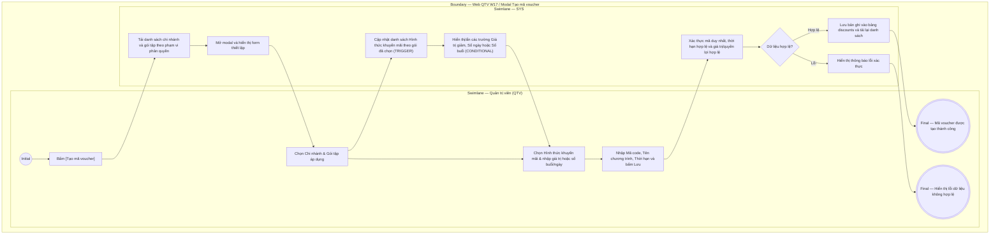

# QTV-W17-US01 - Quản lý chương trình khuyến mãi và mã giảm giá

## Preconditions
- Người dùng đăng nhập tài khoản Quản trị viên (QTV) và có quyền quản lý khuyến mãi - giá bán.
- Hệ thống đã có danh mục chi nhánh (`branches`) và gói tập (`packages`).

## Trigger
- QTV truy cập menu **W17 Khuyến mãi & giảm giá** và bấm nút **[Tạo mã voucher]** (hoặc bấm nút Bật/Tắt trên dòng mã).
- Màn hình liên quan: Web QTV — W17 Khuyến mãi & giảm giá, modal **Tạo mã voucher / khuyến mãi mới**.

## Main Flow

1. QTV truy cập menu W17, xem danh sách các mã khuyến mãi và voucher hiện có trên hệ thống.
2. QTV bấm nút **[Tạo mã voucher]**.
3. SYS mở modal **Tạo mã voucher / khuyến mãi mới**.
4. QTV chọn **Chi nhánh áp dụng** (mặc định chọn toàn chuỗi hoặc chi nhánh hoạt động của QTV).
5. QTV chọn **Gói tập áp dụng** (`applicable_package_id`): Chọn `Tất cả gói tập (Không giới hạn)` hoặc chọn 1 gói tập cụ thể trong phạm vi chi nhánh được chọn (Gói theo buổi, Gói theo ngày, hoặc Gói combo).
6. Tùy thuộc vào gói tập được chọn, SYS tự động cập nhật danh sách tùy chọn của trường **Hình thức khuyến mãi** (`discount_type`):
   - Nếu không chọn gói (Tất cả gói tập): Hiển thị `%` và `VNĐ`.
   - Nếu chọn gói theo buổi (`PT_SESSION` / `GYM_SESSION`): Bổ sung tùy chọn `Tặng số buổi tập (Buổi)`.
   - Nếu chọn gói theo ngày (`GYM_TIME`): Bổ sung tùy chọn `Tặng thời gian tập (Ngày)`.
   - Nếu chọn gói combo (`COMBO`): Cung cấp 3 tùy chọn gồm `Giảm theo tỷ lệ phần trăm (%)`, `Giảm số tiền cố định (VNĐ)`, và `Khuyến mãi theo buổi và ngày`.
7. QTV nhập **Mã khuyến mãi (Code)** (tự động chuyển thành chữ in hoa, không dấu, không khoảng trắng, ví dụ: `SUMMER2026`, `VIPFIT`).
8. QTV nhập **Tên chương trình khuyến mãi** (ví dụ: `Ưu đãi chào hè rực rỡ 2026`).
9. QTV thiết lập giá trị khuyến mãi tương ứng:
   - Với `%` hoặc `VNĐ`: Nhập **Giá trị giảm** và **Giảm tối đa (VNĐ)** (nếu là %).
   - Với `Buổi`: Nhập **Số buổi khuyến mãi** (ví dụ: `5` buổi).
   - Với `Ngày`: Nhập **Số ngày khuyến mãi** (ví dụ: `15` ngày).
   - Với `Khuyến mãi theo buổi và ngày` (Gói Combo): Nhập cả **Số ngày gym khuyến mãi** và **Số buổi PT khuyến mãi**.
10. QTV nhập **Đơn hàng tối thiểu (VNĐ)**, chọn **Ngày bắt đầu**, **Ngày kết thúc**, và **Số lượt sử dụng tối đa**.
11. QTV bấm **Tạo mã voucher**.
12. SYS xác thực dữ liệu (mã không trùng lặp, ngày kết thúc $\ge$ ngày bắt đầu, giá trị/quyền lợi khuyến mãi $> 0$, gói tập tương thích), lưu vào bảng `discounts`, thông báo thành công và cập nhật hiển thị lên danh sách mã giảm giá.

### Field-level specification — Bảng danh sách Mã khuyến mãi & Voucher (DataGrid W17)
| Field / control | Loại UI Control | State | Required | Conditional / dynamic | Source / validation |
| :--- | :--- | :--- | :--- | :--- | :--- |
| Nút [Tạo mã voucher] | `Action Button (CTA)` | `USER-INPUT` | required | `Không` | Nút chính góc trên bên phải, mở modal Tạo mã voucher mới |
| Nút [Làm mới] | `Action Button (Icon)` | `USER-INPUT` | required | `Không` | Tải lại danh sách voucher từ server |
| Mã voucher | `Data Column (Monospace Text)` | `READONLY` | required | `Không` | Mã voucher viết hoa đậm (ví dụ: `SUMMER2026`, `VIPFIT`) |
| Tên chương trình | `Data Column (Text)` | `READONLY` | required | `Không` | Tên chương trình ưu đãi hiển thị chữ đậm |
| Gói áp dụng | `Data Column (Text)` | `READONLY` | required | `Không` | Tên gói tập áp dụng cụ thể (màu xanh lá) hoặc text `Tất cả gói tập` nếu áp dụng chung |
| Chi nhánh áp dụng | `Data Column (Text)` | `READONLY` | required | `Không` | Tên chi nhánh hoặc text `Toàn chuỗi` |
| Mức giảm / Khuyến mãi | `Data Column (Number / Text)` | `READONLY` | required | `Không` | Hiển thị `Giảm X%`, `Giảm X.XXX đ`, `Tặng X buổi`, `Tặng X ngày`, hoặc `Tặng X ngày + Y buổi PT` |
| Giảm tối đa | `Data Column (Currency / Placeholder)` | `READONLY` | conditional | `CONDITIONAL`: Hiển thị số tiền tối đa khi giảm theo %, hiển thị `--` khi không áp dụng | Giá trị trần giảm giá hoặc `--` |
| Đơn tối thiểu | `Data Column (Currency / Placeholder)` | `READONLY` | optional | `Không` | Giá trị đơn tối thiểu để áp mã (hoặc `--` nếu 0 đ) |
| Thời hạn áp dụng | `Data Column (Date Range)` | `READONLY` | required | `Không` | Định dạng `dd/MM/yyyy - dd/MM/yyyy` |
| Lượt sử dụng | `Data Column (Ratio)` | `READONLY` | required | `Không` | Tỷ lệ `Đã dùng / Giới hạn` (ví dụ: `12 / 100`) |
| Trạng thái | `Data Column (Status Badge)` | `READONLY` | required | `Không` | Badge `Đang bật` (xanh lá) hoặc `Đã tắt` (xám) |
| Nút Bật / Tắt | `Action Button` | `USER-INPUT` | required | `DYNAMIC`: Hiển thị [Tắt] khi đang bật, hiển thị [Bật] khi đang tắt | Cập nhật trường `is_active` qua API `PUT /discounts/:id` |

### Field-level specification — Modal Tạo mã voucher / khuyến mãi mới
| Field / control | Loại UI Control | State | Required | Conditional / dynamic | Source / validation |
| :--- | :--- | :--- | :--- | :--- | :--- |
| Chi nhánh áp dụng | `Multi-select TagBox (dxTagBox)` | `USER-INPUT (PREFILL)` | required | `TRIGGER` | Nạp từ bảng `branches`. Hỗ trợ chọn nhiều chi nhánh hoặc tùy chọn "Áp dụng toàn chuỗi". Khi thay đổi, tự động lọc lại danh sách ở trường "Gói tập áp dụng" |
| Gói tập áp dụng | `SelectBox (dxSelectBox)` | `USER-INPUT` | optional | `TRIGGER` | Chọn 1 gói tập duy nhất hoặc để trống/chọn `Tất cả gói tập (Không giới hạn)`. Đóng vai trò TRIGGER điều khiển các tùy chọn ở trường "Hình thức khuyến mãi" và các trường quyền lợi tặng kèm |
| Mã khuyến mãi (Code) | `Text Input (Uppercase)` | `USER-INPUT` | required | `Không` | Ký tự chữ và số, tự động viết hoa không dấu, độ dài 3-50 ký tự, UNIQUE |
| Tên chương trình khuyến mãi | `Text Input` | `USER-INPUT` | required | `Không` | Tên chương trình ưu đãi, độ dài tối đa 200 ký tự |
| Hình thức khuyến mãi | `SelectBox (dxSelectBox)` | `USER-INPUT` | required | `DYNAMIC`, `TRIGGER` | Luôn hiển thị. Options thay đổi theo "Gói tập áp dụng": TH0 (Tất cả gói) gồm `%`, `VNĐ`; TH1 (Gói buổi) thêm `Buổi`; TH2 (Gói ngày) thêm `Ngày`; TH3 (Gói Combo) gồm 3 lựa chọn: `%`, `VNĐ`, và `Khuyến mãi theo buổi và ngày` (không khóa, cho phép QTV tự do chọn). Đồng thời là TRIGGER điều khiển ẩn/hiện các trường giá trị/quyền lợi |
| Giá trị giảm | `Number Input (dxNumberBox)` | `USER-INPUT` | conditional | `CONDITIONAL`: Hiện khi "Hình thức khuyến mãi" = `PERCENT` hoặc `FIXED_AMOUNT`; Ẩn khi = `SESSION`, `DAY`, hoặc `BOTH` | Nếu là %: từ 1 đến 100; nếu là tiền: số nguyên $> 0$ |
| Giảm tối đa (VNĐ) | `Number Input (dxNumberBox)` | `USER-INPUT` | conditional | `CONDITIONAL`: Hiện khi "Hình thức khuyến mãi" = `PERCENT`; Ẩn khi $\ne$ `PERCENT` | Tùy chọn số tiền trần tối đa được giảm |
| Số ngày khuyến mãi | `Number Input (dxNumberBox)` | `USER-INPUT` | conditional | `CONDITIONAL`: Hiện khi "Hình thức khuyến mãi" = `DAY` (nhãn "Số ngày khuyến mãi") hoặc = `BOTH` (nhãn "Số ngày gym khuyến mãi"); Ẩn khi = `PERCENT`, `FIXED_AMOUNT`, hoặc `SESSION` | Số nguyên $> 0$, cộng thêm vào thời hạn gói tập khi thanh toán |
| Số buổi khuyến mãi | `Number Input (dxNumberBox)` | `USER-INPUT` | conditional | `CONDITIONAL`: Hiện khi "Hình thức khuyến mãi" = `SESSION` (nhãn "Số buổi khuyến mãi") hoặc = `BOTH` (nhãn "Số buổi PT khuyến mãi"); Ẩn khi = `PERCENT`, `FIXED_AMOUNT`, hoặc `DAY` | Số nguyên $> 0$, cộng thêm vào số buổi tập còn lại khi thanh toán |
| Đơn hàng tối thiểu (VNĐ) | `Number Input (dxNumberBox)` | `USER-INPUT` | optional | `Không` | Mặc định 0 đ. Đơn hàng đạt giá trị này mới được áp dụng voucher |
| Ngày bắt đầu | `Date Picker (dxDateBox)` | `USER-INPUT (PREFILL)` | required | `TRIGGER` | Ngày bắt đầu hiệu lực (mặc định hôm nay) |
| Ngày kết thúc | `Date Picker (dxDateBox)` | `USER-INPUT (PREFILL)` | required | `DYNAMIC` | Ngày hết hạn hiệu lực; phải $\ge$ Ngày bắt đầu (mặc định +30 ngày) |
| Số lượt sử dụng tối đa | `Number Input (dxNumberBox)` | `USER-INPUT` | optional | `Không` | Số nguyên dương $> 0$ (mặc định 100) |

- **Business rules / logic:**
  - Voucher chỉ có hiệu lực khi `is_active = true`, trong khoảng `[start_date, end_date]`, `used_count < usage_limit`, đơn hàng $\ge min\_order\_value$, đúng chi nhánh và đúng gói tập chỉ định (`applicable_package_id`).
  - Khi áp dụng voucher tặng ngày (`DAY` / `BOTH`), sau khi thanh toán thành công, hệ thống tự động cộng dồn số ngày vào `end_date` và `duration_days_snapshot` của hợp đồng đăng ký (`registrations`).
  - Khi áp dụng voucher tặng buổi (`SESSION` / `BOTH`), sau khi thanh toán thành công, hệ thống tự động cộng dồn số buổi vào `remaining_pt_sessions` và `total_pt_sessions_snapshot` của hợp đồng.

## Alternate Flows

### AF-01 - Hủy Thao Tác
1. QTV bấm nút **Hủy** trên modal.
2. SYS đóng modal và giữ nguyên dữ liệu trên danh sách.

## Exception Flows
- **Mã voucher đã tồn tại:** QTV nhập mã code đã tồn tại trên hệ thống. SYS báo lỗi: *"Mã khuyến mãi này đã tồn tại trên hệ thống"*.
- **Thời hạn không hợp lệ:** Ngày kết thúc trước ngày bắt đầu. SYS báo lỗi: *"Ngày kết thúc phải lớn hơn hoặc bằng ngày bắt đầu"*.
- **Tỷ lệ phần trăm vượt quá 100%:** QTV nhập giá trị giảm $> 100\%$. SYS báo lỗi: *"Tỷ lệ giảm phần trăm không được vượt quá 100%"*.
- **Thiếu số buổi hoặc số ngày khuyến mãi:** QTV chọn hình thức khuyến mãi Buổi/Ngày/Cả 2 nhưng chưa điền số lượng hoặc điền $\le 0$. SYS báo lỗi yêu cầu nhập số nguyên dương $> 0$.

## Activity Diagram — Swimlane
**Trigger:** QTV bấm [Tạo mã voucher] trên Web QTV W17.

