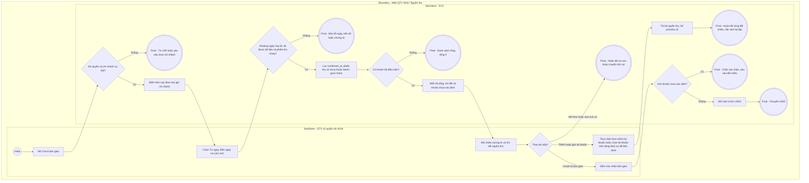
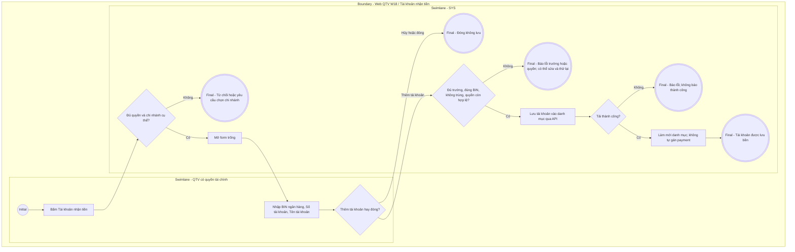
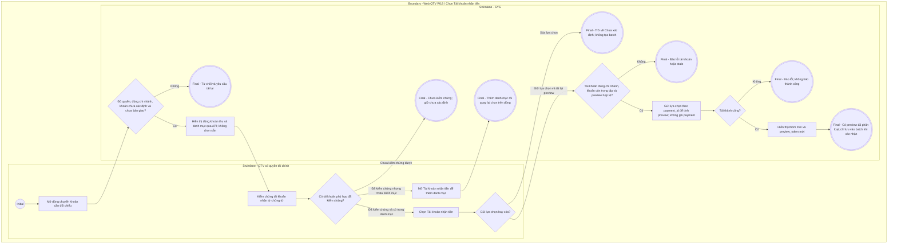

# QTV-W18-US01 - Xem và đối chiếu nguồn thu chưa bàn giao

Là QTV có quyền tài chính, tôi muốn đối chiếu khoản thực thu theo kỳ và tài khoản nhận để chuẩn bị bàn giao chính xác.

## Preconditions

- QTV đã đăng nhập, có quyền tài chính `view_financial` và branch scope hợp lệ.
- Xem trước để lập đợt mới, thêm tài khoản và phân loại khoản thu yêu cầu một chi nhánh cụ thể.
- Nguồn thu và danh mục tài khoản lấy từ API; không dùng dữ liệu frontend mẫu.

## Trigger

QTV mở W18 **Bàn giao & tất toán doanh thu**, tab **Chưa bàn giao**.

## Main Flow

1. SYS kiểm tra QTV + quyền tài chính và chi nhánh cụ thể. Phạm vi ALL hiển thị **Chọn một chi nhánh để xem giao dịch chưa bàn giao.**, không tạo preview.
2. SYS điền **Từ ngày**, **Đến ngày** mặc định hôm nay. QTV chọn khoảng ngày bất kỳ; thay đổi ngày tự tải lại và xóa các lựa chọn tài khoản của preview cũ. Nút biểu tượng **Làm mới** tải lại kỳ đang chọn.
3. SYS lọc `payments.confirmed_at` theo ngày địa phương của chi nhánh, bao gồm ngày đầu/cuối; chỉ lấy khoản thành công có phiếu thu khớp tiền, chưa thuộc batch. Hiển thị **Tổng tiền**, **Giao dịch**, **Chưa xác định**, bảng **Tổng hợp theo nơi nhận tiền** và **Giao dịch chưa bàn giao**.
4. QTV đối chiếu payment, phiếu thu, khách hàng, hợp đồng, ngày thu, số tiền và phương thức. CASH được gom **Tiền mặt**. BANK_TRANSFER chưa có chứng cứ phân loại trong preview được gom **Chưa xác định tài khoản**.
5. QTV kiểm chứng nơi nhận bằng chứng từ rồi chọn **Tài khoản nhận tiền** ngay trên dòng chuyển khoản. Danh sách lấy từ registry lưu bền của chi nhánh; không chọn sẵn. Mỗi payment chỉ có một tài khoản được chọn trong lần preview.
6. SYS gửi lựa chọn theo đúng payment_id để tính preview mới; cập nhật nhóm BIN + số tài khoản, tổng và fingerprint `preview_token`. Chọn/xóa tài khoản chỉ thay phân loại của preview, chưa ghi phân loại bền, chưa tạo batch và không sửa payment.
7. Khi `Chưa xác định = 0`, tập có ít nhất một khoản và preview hợp lệ, QTV có thể bấm **Xác nhận bàn giao** để sang US02.

### Field-level specification - Màn hình Chưa bàn giao

| Field / control | Loại UI Control | State | Required | Conditional / dynamic | Source / validation |
| --- | --- | --- | --- | --- | --- |
| Chưa bàn giao | Tab | USER-INPUT | required | Không | Tab hiện tại |
| Lịch sử bàn giao | Tab | USER-INPUT | optional | Không | Chuyển US03 |
| Từ ngày | DateBox | PREFILL | required | Không | Hôm nay mặc định; thay đổi tự tải preview và xóa lựa chọn tài khoản cũ; không sau Đến ngày |
| Đến ngày | DateBox | PREFILL | required | Không | Khoảng ngày/tuần bất kỳ; không trước Từ ngày; không giới hạn năm cố định |
| Tài khoản nhận tiền | Action Button | USER-INPUT | optional | Không | Mở popup danh mục và form thêm tài khoản; ALL chỉ đọc danh mục |
| Xác nhận bàn giao | Action Button | USER-INPUT | conditional | CONDITIONAL: hiện ở tab Chưa bàn giao; ẩn ở Lịch sử bàn giao | Vô hiệu khi thiếu chi nhánh, đang xử lý, không có preview_token, tập rỗng hoặc còn unresolved |
| Làm mới | Icon Button | USER-INPUT | optional | Không | Nhãn tooltip chính xác; tải lại API, loại preview cũ |
| Tổng tiền | Currency Display | READONLY | required | Không | Tổng toàn bộ preview kể cả khoản chưa xác định; VND |
| Giao dịch | Number Display | READONLY | required | Không | Số payment của toàn bộ preview |
| Chưa xác định | Number Display | READONLY | required | Không | Số khoản chưa có tài khoản nhận hợp lệ trong preview |
| Tiền mặt / tài khoản / chưa xác định | Grid Column | READONLY | required | Không | Bảng Tổng hợp theo nơi nhận tiền: Tiền mặt, BIN · số tài khoản · tên tài khoản hoặc Chưa xác định tài khoản |
| Giao dịch | Grid Column | READONLY | required | Không | Số khoản thuộc từng nhóm, không phải chỉ số dòng đang nhìn thấy |
| Số tiền | Grid Column | READONLY | required | Không | Tổng tiền của nhóm |
| Tìm khách hàng, mã... | Search Box | USER-INPUT | optional | Không | Placeholder chính xác trong grid chi tiết; tìm dữ liệu đã nạp; không thay tập bàn giao hoặc tổng preview |
| Mã thanh toán | Grid Column | READONLY | required | Không | payment_code từ API |
| Phiếu thu | Grid Column | READONLY | required | Không | receipt_code của khoản thu, phiếu thu khớp số tiền |
| Ngày thu | Grid Column | READONLY | required | Không | confirmed_at của payment; quy tắc kỳ theo múi giờ chi nhánh |
| Khách hàng | Grid Column | READONLY | required | Không | Tên, mã hội viên và số điện thoại của chính khoản thu |
| Hợp đồng | Grid Column | READONLY | required | Không | registration_code; thông tin gói có trong dữ liệu snapshot, không có cột Gói tập riêng trên UI hiện tại |
| Số tiền | Grid Column | READONLY | required | Không | Số tiền payment, không sửa được |
| Phương thức | Grid Column | READONLY | required | Không | Tiền mặt hoặc Chuyển khoản; tương thích mã BANK_TRANSFER_VIETQR cũ, không thêm trạng thái payment |
| Tài khoản nhận tiền | Select Dropdown / Text Display | USER-INPUT / READONLY | conditional | CONDITIONAL: dropdown hiện trên dòng BANK_TRANSFER cần phân loại hoặc đã có lựa chọn trong preview; ẩn với CASH hoặc dòng chỉ đọc. Bắt buộc chọn cho BANK_TRANSFER trước xác nhận; CASH không nhập | BIN · số tài khoản · tên tài khoản từ registry; placeholder Chưa xác định; cho tìm và xóa; CASH hiển thị Tiền mặt; lựa chọn chưa lưu bền |
| 15 / 30 / 50 | Page Size Selector | USER-INPUT | optional | Không | Control ký hiệu của pager grid; chỉ đổi số dòng hiển thị, không giới hạn tập xác nhận |
| Số trang | Numeric Pager | USER-INPUT | optional | Không | Nút số trang DevExtreme, không có nhãn văn bản riêng; chuyển trang hiển thị |
| Thử lại | Action Button | USER-INPUT | conditional | CONDITIONAL: hiện khi lỗi tải có thể thử lại; ẩn khi tải bình thường/thành công | Tải lại API, không sinh dữ liệu mẫu |

Các tiêu đề **Tổng hợp theo nơi nhận tiền** và **Giao dịch chưa bàn giao** chỉ định phạm vi hai bảng. Sắp xếp bằng tiêu đề cột hoặc tìm kiếm trong grid không chọn một phần nguồn thu để xác nhận.

### Field-level specification - Popup Tài khoản nhận tiền / Danh mục

| Field / control | Loại UI Control | State | Required | Conditional / dynamic | Source / validation |
| --- | --- | --- | --- | --- | --- |
| BIN ngân hàng | Grid Column | READONLY | required | Không | Danh mục lưu bền qua API trong scope |
| Số tài khoản | Grid Column | READONLY | required | Không | Chuỗi số tài khoản, giữ số 0 đầu |
| Tên tài khoản | Grid Column | READONLY | required | Không | Tên tài khoản trong registry, không suy từ ENV |
| 15 / 30 / 50 | Page Size Selector | USER-INPUT | optional | Không | Pager danh mục; không thay dữ liệu |
| Số trang | Numeric Pager | USER-INPUT | optional | Không | Nút số trang của grid |
| Thử lại | Action Button | USER-INPUT | conditional | CONDITIONAL: hiện khi tải danh mục lỗi; ẩn khi tải bình thường/thành công | Thử đọc lại registry |

### Field-level specification - Form thêm trong popup Tài khoản nhận tiền

| Field / control | Loại UI Control | State | Required | Conditional / dynamic | Source / validation |
| --- | --- | --- | --- | --- | --- |
| BIN ngân hàng | Textbox | USER-INPUT | conditional | CONDITIONAL: hiện và bắt buộc tại chi nhánh cụ thể; ẩn ở ALL | Đúng 6 chữ số; thông báo Nhập BIN ngân hàng. / BIN phải gồm đúng 6 chữ số. |
| Số tài khoản | Textbox | USER-INPUT | conditional | CONDITIONAL: hiện và bắt buộc tại chi nhánh cụ thể; ẩn ở ALL | Từ 1 đến 30 chữ số; giữ số 0 đầu; không trùng BIN + số tài khoản trong chi nhánh |
| Tên tài khoản | Textbox | USER-INPUT | conditional | CONDITIONAL: hiện và bắt buộc tại chi nhánh cụ thể; ẩn ở ALL | Không rỗng sau bỏ khoảng trắng đầu/cuối; tối đa 150 ký tự |

Hành động form: **Thêm tài khoản** gửi API để lưu bền registry; khóa form khi đang gửi. Thành công: thông báo **Đã thêm tài khoản nhận tiền.**, xóa các ô form và tải lại danh mục/preview. **Đóng** hoặc nút đóng popup kết thúc; không có form hay nút **Gán tài khoản nhận**, không có trường **Ngân hàng** riêng. ALL chỉ xem danh mục và đóng popup. Thêm registry chỉ phục vụ phân loại thủ công W18; không đổi VietQR global config, không tự ghi snapshot nhận tiền vào payment cũ/mới và không tự chọn tài khoản trên dòng.

## Alternate Flows

- AF01: Chọn khoảng ngày/tuần chồng kỳ cũ: chỉ khoản chưa thuộc batch xuất hiện; khoản ghi nhận muộn vẫn đủ điều kiện cho đợt sau.
- AF02: Chưa có tài khoản phù hợp: mở **Tài khoản nhận tiền**, điền ba trường, bấm **Thêm tài khoản**, đóng popup rồi chủ động chọn tài khoản trên chính dòng payment đã kiểm chứng.
- AF03: Đổi tài khoản trên dòng hoặc xóa lựa chọn: SYS tính preview mới; xóa trở về **Chưa xác định**, chặn xác nhận. Đổi ngày xóa mọi allocation cũ; lựa chọn không được coi là phân loại đã lưu vào payment.
- AF04: Không có nguồn thu: tổng/số khoản 0, grid **Không có dữ liệu phù hợp**, không xác nhận. QTV có thể tra cứu lịch sử hoặc kết thúc.
- AF05: Đóng popup khi chưa thêm thành công: không tạo tài khoản. Không xác nhận US02 thì chưa tạo batch; registry đã thêm thành công vẫn tồn tại độc lập.

## Exception Flows

- EF01: Thiếu QTV/quyền tài chính hoặc sai scope: từ chối. ALL chặn preview và thêm tài khoản; yêu cầu chọn chi nhánh cụ thể.
- EF02: Thiếu ngày: **Chọn đầy đủ Từ ngày và Đến ngày để lập bàn giao.**; thứ tự sai: **Đến ngày phải bằng hoặc sau Từ ngày.**. Kỳ có trên 10.000 khoản: yêu cầu khoảng ngắn hơn, không âm thầm cắt mất nguồn thu.
- EF03: BIN không đủ 6 chữ số, số tài khoản không phải 1-30 chữ số, tên trống/quá 150 ký tự hoặc trùng cặp BIN + số tài khoản: không tạo bản ghi; hiển thị lỗi, cho sửa và thử lại.
- EF04: Chưa có chứng từ đủ kiểm chứng tài khoản, bao gồm legacy còn chờ người dùng làm rõ: giữ unresolved và chặn batch chứa khoản đó. Không suy đoán từ ENV, tên người thu hoặc tài khoản duy nhất.
- EF05: Allocation trùng payment, tài khoản sai chi nhánh, khoản không phải chuyển khoản hoặc payment không còn trong tập: server từ chối preview. Tải lại và kiểm tra lựa chọn, không ghi đè payment.
- EF06: Lỗi API: hiển thị **Không thể tải dữ liệu**, có **Thử lại**; không coi lỗi là tổng 0 đã đối chiếu.
- EF07: Có khoản đã thu nhưng thiếu phiếu thu hoặc số tiền phiếu thu không khớp payment: server trả `RECEIPT_INCONSISTENT`, không tạo preview để chốt. Phải kiểm tra chứng từ; không âm thầm bỏ khoản lỗi khỏi tổng bàn giao.

## Activity Diagram — Swimlane

### Xem và chuẩn bị bàn giao

### Tài khoản nhận tiền

### Gán khoản chưa xác định vào tài khoản nhận

## Traceability

- [Epic QTV-W18](<../../../epic/qtv/QTV-W18-Bàn giao & tất toán doanh thu.md>): W18-BR01-BR07, BR09-BR10.
- [Product Spec W18](../../../product-spec.md#w18---bàn-giao--tất-toán-doanh-thu-21092026).
- Tiếp theo: [US02 - Xác nhận bàn giao](<QTV-W18-US02-Xác nhận bàn giao doanh thu.md>).
