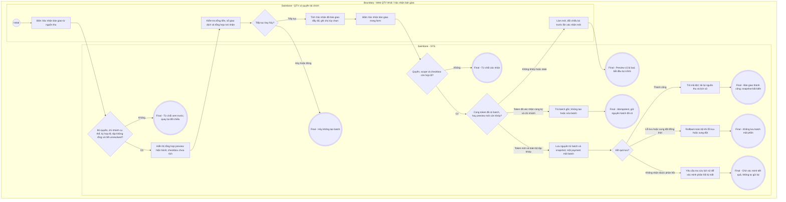

# QTV-W18-US02 - Xác nhận bàn giao doanh thu

Là QTV có quyền tài chính, tôi muốn xác nhận đầy đủ nguồn thu đã đối chiếu để lưu một đợt bàn giao bất biến.

## Preconditions

- QTV đã đăng nhập, có quyền tài chính và chi nhánh cụ thể trong phạm vi được cấp; không xác nhận ở ALL.
- Preview US01 có ít nhất một payment thành công với phiếu thu, chưa thuộc batch; mọi chuyển khoản đã được QTV chọn tài khoản đã kiểm chứng trong preview.
- Có fingerprint `preview_token` của đúng kỳ và các allocation đang xem.

## Trigger

QTV bấm **Xác nhận bàn giao** tại **Chưa bàn giao**.

## Main Flow

1. QTV hoàn tất kiểm tra kỳ, chi tiết từng payment và phân loại tài khoản ngay tại US01. SYS chỉ bật **Xác nhận bàn giao** khi preview có nguồn thu và `unresolved_count = 0`.
2. SYS mở popup **Xác nhận bàn giao doanh thu** từ preview hiện hành, hiển thị **Tổng tiền**, **Giao dịch**, **Chưa xác định** và bảng **Tổng hợp theo nơi nhận tiền**. Popup hiện tại không có grid payment chi tiết hay trường chi nhánh, kỳ ngày, múi giờ riêng; các thông tin này được giữ trong ngữ cảnh preview từ US01.
3. QTV có thể nhập **Ghi chú**, rồi chủ động tích **Xác nhận đã bàn giao đầy đủ**; mặc định checkbox chưa tích và ghi chú trống.
4. QTV bấm **Xác nhận bàn giao** trong popup. SYS khóa gửi lặp và gửi đúng kỳ, allocation, token, checkbox cùng ghi chú; không lấy tập con theo tìm kiếm/phân trang grid.
5. Server kiểm tra QTV + quyền tài chính, chi nhánh, ngày, token và checkbox. Cùng token đã xác nhận trong đúng kỳ/chi nhánh thì trả batch gốc (idempotent), không tạo đợt khác và không thay ghi chú/chi tiết đã lưu.
6. Với token chưa xác nhận, server tính lại tập và fingerprint. Nếu khớp toàn bộ, không rỗng, không unresolved và chưa payment nào thuộc batch khác, lưu nguyên tử batch và snapshot từng payment. Snapshot giữ khách hàng, gói, hợp đồng, phiếu thu, phương thức, tài khoản nhận, số tiền; batch giữ kỳ, múi giờ, tổng, người tạo và thời điểm xác nhận. Một payment chỉ thuộc một batch.
7. SYS trả **Mã bàn giao** canonical `handover_code`, đóng popup xác nhận, xóa allocation tạm, thông báo **Đã xác nhận bàn giao doanh thu.**, tải lại nguồn thu và mở **Chi tiết bàn giao** (US03). Payment gốc vẫn bất biến, không thêm payment.status.

### Field-level specification - Popup Xác nhận bàn giao doanh thu

| Field / control | Loại UI Control | State | Required | Conditional / dynamic | Source / validation |
| --- | --- | --- | --- | --- | --- |
| Tổng tiền | Currency Display | READONLY | required | Không | Tổng toàn bộ preview được xác nhận; VND |
| Giao dịch | Number Display | READONLY | required | Không | Số khoản trong preview, phải lớn hơn 0 |
| Chưa xác định | Number Display | READONLY | required | Không | Phải bằng 0 trước mở/xác nhận popup |
| Tiền mặt / tài khoản / chưa xác định | Grid Column | READONLY | required | Không | Bảng Tổng hợp theo nơi nhận tiền; Tiền mặt hoặc BIN · số tài khoản · tên tài khoản |
| Giao dịch | Grid Column | READONLY | required | Không | Số khoản của từng nhóm trong preview |
| Số tiền | Grid Column | READONLY | required | Không | Tổng tiền nhóm; tổng các nhóm khớp Tổng tiền |
| Ghi chú | Textarea | USER-INPUT | optional | Không | Tối đa 1000 ký tự; bỏ khoảng trắng đầu/cuối; trống vẫn hợp lệ |
| Xác nhận đã bàn giao đầy đủ | Checkbox | USER-INPUT | required | Không | Mặc định false; QTV phải chủ động tích true; server kiểm tra lại |

Hành động popup: **Xác nhận bàn giao** bị vô hiệu khi chưa tích checkbox/đang gửi/preview không còn hợp lệ; **Hủy** hoặc nút đóng kết thúc trước gửi mà không tạo batch. Khi gửi, checkbox, ghi chú và hành động bị khóa. Nếu lỗi không phải stale, popup hiển thị lỗi và nút **Đóng và tải lại**, không cho gửi tiếp token cũ. Nút form không đưa vào bảng field.

## Alternate Flows

- AF01: Hủy trước gửi: không tạo batch; allocation chỉ còn trong ngữ cảnh US01 hiện hành, không được ghi vào payment.
- AF02: Bỏ trống ghi chú: vẫn xác nhận nếu các điều kiện khác hợp lệ.
- AF03: Gửi lại cùng token đã thành công: trả đúng batch gốc và handover_code gốc, không sửa ghi chú theo request lặp; không tạo thêm lượt bàn giao.
- AF04: Khoản ghi nhận muộn sau xác nhận vẫn có thể thuộc đợt kế tiếp với khoảng ngày trùng/chồng; batch cũ không bổ sung khoản đó. Nếu khoản mới xuất hiện trước xác nhận và làm thay tập preview thì xử lý stale, không âm thầm thêm vào batch.

## Exception Flows

- EF01: Quyền bị thu hồi, thiếu QTV/tài chính, scope ALL hoặc chi nhánh ngoài quyền: từ chối, không tạo batch.
- EF02: Kỳ sai, tập rỗng, còn unresolved hoặc tập nguồn thu thay đổi: chặn xác nhận; không bỏ khoản lỗi để xác nhận một phần.
- EF03: Checkbox không true hoặc note quá 1000 ký tự: từ chối cả khi request bỏ qua UI. Ghi chú không thay checkbox.
- EF04: Token thiếu/sai, hoặc token mới không khớp tập/tổng/tài khoản hiện hành: server từ chối. Với stale/xung đột 409, UI đóng popup, xóa allocation tạm và thông báo **Dữ liệu đã thay đổi. Đang tải lại bản xem trước; vui lòng kiểm tra và xác nhận lại.** QTV phải kiểm chứng/chọn lại tài khoản và tích lại checkbox.
- EF05: Các lần xác nhận khác token tranh cùng payment: tối đa một batch chứa payment; lần còn lại bị stale/xung đột, không tạo batch một phần. Không nhầm trường hợp này với replay cùng token đã thành công.
- EF06: Lỗi lưu rollback toàn bộ batch/chi tiết. Nếu mất phản hồi, UI không khẳng định chưa lưu: vô hiệu token, cho **Đóng và tải lại**, tra cứu lịch sử trước thử lại. Replay cùng token hợp lệ trả batch gốc.
- EF07: Các khoản BANK_TRANSFER chưa xác minh, kể cả legacy đang chờ làm rõ, vẫn bị chặn. Danh mục ngân hàng không tự điền từ VietQR/ENV.

## Activity Diagram — Swimlane

## Traceability

- [Epic QTV-W18](<../../../epic/qtv/QTV-W18-Bàn giao & tất toán doanh thu.md>): W18-BR01-BR10.
- [US01 - Nguồn thu](<QTV-W18-US01-Xem và đối chiếu nguồn thu chưa bàn giao.md>), [US03 - Lịch sử](<QTV-W18-US03-Tra cứu lịch sử bàn giao.md>).
- Bàn giao nội bộ; không phải khóa sổ kế toán Nhà nước hoặc quyết toán thuế; không mở khóa payment trước bàn giao.
