# QTV-W18-US03 - Tra cứu lịch sử bàn giao

Là QTV có quyền tài chính, tôi muốn tra cứu bằng chứng bàn giao đã xác nhận mà không thay đổi batch hoặc payment gốc.

## Preconditions

- QTV đã đăng nhập, có quyền tài chính và scope chi nhánh hợp lệ.
- Chỉ xem batch thuộc chi nhánh được cấp quyền; danh sách có thể rỗng.

## Trigger

QTV chọn tab **Lịch sử bàn giao**, hoặc SYS mở **Chi tiết bàn giao** sau khi US02 thành công.

## Main Flow

1. SYS kiểm tra quyền QTV + tài chính và scope, mở **Lịch sử bàn giao**.
2. Ở một chi nhánh cụ thể, **Từ ngày**, **Đến ngày** mặc định hôm nay theo múi giờ chi nhánh từ API; tại ALL, hai ngày mặc định trống. QTV chọn khoảng ngày/tuần bất kỳ; thay đổi ngày tự tải lại. Có thể xóa một/cả hai đầu để bỏ giới hạn tương ứng và bấm biểu tượng **Làm mới**. Ngày thu/ngày bàn giao hiển thị theo múi giờ chi nhánh hoặc snapshot batch; ngày lịch không dịch theo múi giờ trình duyệt.
3. SYS truy vấn ngày xác nhận batch, diễn giải theo múi giờ lưu trên từng batch, khác `payments.confirmed_at` dùng ở tab Chưa bàn giao. Scope ALL chỉ tổng hợp các chi nhánh được phép, không tạo batch đa chi nhánh.
4. SYS hiển thị bảng **Lịch sử bàn giao**, mới nhất trước, phân trang server: **Mã bàn giao**, **Chi nhánh**, **Từ ngày**, **Đến ngày**, **Tổng tiền**, **Người xác nhận**, **Ngày bàn giao**, **Chi tiết**. Từ ngày/Đến ngày trên dòng là kỳ nguồn thu đã chụp, không phải ngày lọc lịch sử.
5. QTV bấm biểu tượng mắt với tooltip **Xem bàn giao** trên đúng dòng. SYS kiểm tra scope của batch và mở popup **Chi tiết bàn giao** từ snapshot.
6. Popup hiển thị handover_code, **Chi nhánh**, **Người xác nhận** từ snapshot batch, dòng kỳ nguồn thu và ngày bàn giao, ghi chú nếu có, tổng tiền/số giao dịch, tổng hợp theo nơi nhận tiền và grid **Chi tiết khách hàng & tài khoản nhận tiền**. QTV có thể tìm **Tìm khách hàng, mã...**, đổi trang để đối chiếu các khoản trong cùng batch.
7. QTV đóng popup để về danh sách hoặc chuyển **Chưa bàn giao**. Không có sửa/xóa/mở lại.

### Field-level specification - Màn hình Lịch sử bàn giao

| Field / control | Loại UI Control | State | Required | Conditional / dynamic | Source / validation |
| --- | --- | --- | --- | --- | --- |
| Chưa bàn giao | Tab | USER-INPUT | optional | Không | Quay US01; cần chi nhánh cụ thể để preview |
| Lịch sử bàn giao | Tab | USER-INPUT | required | Không | Tab hiện tại |
| Từ ngày | DateBox | PREFILL | optional | Không | Mặc định hôm nay theo chi nhánh cụ thể; ALL trống. Ngày bàn giao tối thiểu; xóa để bỏ cận dưới |
| Đến ngày | DateBox | PREFILL | optional | Không | Mặc định hôm nay theo chi nhánh cụ thể; ALL trống. Ngày bàn giao tối đa bao gồm hết ngày; xóa để bỏ cận trên |
| Tài khoản nhận tiền | Action Button | USER-INPUT | optional | Không | Cùng popup registry US01; ALL chỉ đọc |
| Làm mới | Icon Button | USER-INPUT | optional | Không | Tooltip; tải lại theo phạm vi/kỳ |
| Mã bàn giao | Grid Column | READONLY | required | Không | handover_code canonical, không dùng mã của payment làm mã batch |
| Chi nhánh | Grid Column | READONLY | required | Không | branch_name của batch |
| Từ ngày | Grid Column | READONLY | required | Không | Ngày đầu kỳ nguồn thu lưu tại xác nhận |
| Đến ngày | Grid Column | READONLY | required | Không | Ngày cuối kỳ nguồn thu lưu tại xác nhận |
| Tổng tiền | Grid Column | READONLY | required | Không | Tổng tiền snapshot, VND |
| Người xác nhận | Grid Column | READONLY | required | Không | confirmed_by_name đã chụp khi tạo batch; không lấy tên hiện tại để sửa lịch sử |
| Ngày bàn giao | Grid Column | READONLY | required | Không | confirmed_at của batch, khác Ngày thu của payment |
| Chi tiết | Grid Action Column | READONLY | required | Không | Cột chứa hành động mở chi tiết |
| Xem bàn giao | Icon Button | USER-INPUT | optional | Không | Tooltip của biểu tượng mắt; mở đúng batch trên dòng |
| 15 / 30 / 50 | Page Size Selector | USER-INPUT | optional | Không | Phân trang server, không làm thay đổi batch |
| Số trang | Numeric Pager | USER-INPUT | optional | Không | Nút số trang DevExtreme; chuyển trang lịch sử |
| Thử lại | Action Button | USER-INPUT | conditional | CONDITIONAL: hiện khi tải lỗi có thể thử lại; ẩn khi tải bình thường/thành công | Đọc lại lịch sử |

Tab lịch sử không có ô tìm mã bàn giao riêng, không có cột số giao dịch và không có nút xác nhận. Người tạo batch hiển thị bằng nhãn chính xác Người xác nhận; thông tin gói vẫn được giữ trong snapshot nghiệp vụ, không tự liệt kê thành cột UI chưa hiển thị.

### Field-level specification - Popup Chi tiết bàn giao

Các dòng đầu popup là dữ liệu không gắn nhãn field; ghi đúng hình thức hiện tại dưới đây để không tạo nhãn UI giả.

| Field / control | Loại UI Control | State | Required | Conditional / dynamic | Source / validation |
| --- | --- | --- | --- | --- | --- |
| handover_code (tiêu đề giá trị, không có nhãn riêng) | Heading Display | READONLY | required | Không | Mã bàn giao canonical của batch |
| Chi nhánh | Text Display | READONLY | required | Không | branch_name lưu trên batch; không tái dựng bằng tên chi nhánh hiện tại |
| Người xác nhận | Text Display | READONLY | required | Không | confirmed_by_name lưu trên batch; người tạo/xác nhận đợt |
| Kỳ nguồn thu và ngày bàn giao (dòng giá trị, không có nhãn riêng) | Text Display | READONLY | required | Không | date_from - date_to · confirmed_at của batch |
| Ghi chú (đoạn giá trị, không có nhãn riêng) | Text Display | READONLY | conditional | CONDITIONAL: hiện khi batch có note; ẩn khi note trống | Nguyên nội dung ghi chú lưu tại xác nhận |
| Tổng tiền | Currency Display | READONLY | required | Không | Tổng snapshot bất biến |
| Giao dịch | Number Display | READONLY | required | Không | Số payment trong batch; không có metric Chưa xác định ở popup lịch sử |
| Tiền mặt / tài khoản / chưa xác định | Grid Column | READONLY | required | Không | Bảng Tổng hợp theo nơi nhận tiền; nhóm từ snapshot, không có unresolved trong batch hợp lệ |
| Giao dịch | Grid Column | READONLY | required | Không | Số khoản thuộc nhóm |
| Số tiền | Grid Column | READONLY | required | Không | Tổng của nhóm snapshot |
| Tìm khách hàng, mã... | Search Box | USER-INPUT | optional | Không | Placeholder grid Chi tiết khách hàng & tài khoản nhận tiền; chỉ tìm dữ liệu batch hiện tại |
| Mã thanh toán | Grid Column | READONLY | required | Không | payment_code trong snapshot |
| Phiếu thu | Grid Column | READONLY | required | Không | receipt_code trong snapshot |
| Ngày thu | Grid Column | READONLY | required | Không | confirmed_at của payment trong snapshot |
| Khách hàng | Grid Column | READONLY | required | Không | Tên, mã và số điện thoại đã chụp tại xác nhận |
| Hợp đồng | Grid Column | READONLY | required | Không | registration_code trong snapshot; tên gói được lưu nhưng không có cột riêng hiện tại |
| Số tiền | Grid Column | READONLY | required | Không | Số tiền từng khoản trong snapshot |
| Phương thức | Grid Column | READONLY | required | Không | CASH hiển thị Tiền mặt, BANK_TRANSFER hiển thị Chuyển khoản |
| Tài khoản nhận tiền | Text Display | READONLY | required | Không | BIN · số tài khoản · tên tài khoản đã chụp; CASH: Tiền mặt; không có dropdown sửa |
| 15 / 30 / 50 | Page Size Selector | USER-INPUT | optional | Không | Đổi kích thước trang grid chi tiết |
| Số trang | Numeric Pager | USER-INPUT | optional | Không | Nút số trang của grid |
| Thử lại | Action Button | USER-INPUT | conditional | CONDITIONAL: hiện khi lỗi tải chi tiết; ẩn khi tải bình thường/thành công | Đọc lại đúng batch, không dựng từ dữ liệu sống |

Popup đóng bằng biểu tượng đóng, không có nút chỉnh sửa. Chi nhánh và Người xác nhận có nhãn riêng; popup không có field Múi giờ riêng. Các control tìm kiếm và phân trang chỉ phục vụ tra cứu, không thay dữ liệu.

## Alternate Flows

- AF01: Đổi/xóa cận ngày rồi tải lại: có thể xem các batch có kỳ nguồn thu chồng lấn; một payment vẫn chỉ thuộc một batch.
- AF02: ALL xem lịch sử chỉ đọc của các chi nhánh được cấp. Khi dùng cùng ngày lọc, server diễn giải mỗi ngày theo múi giờ lưu trên chính batch.
- AF03: Không có kết quả: grid **Không có dữ liệu phù hợp**; không sinh dữ liệu mẫu.
- AF04: Sau xác nhận, mở trực tiếp batch trả về để thấy kết quả dù bộ lọc lịch sử đang chọn khác kỳ.

## Exception Flows

- EF01: Thiếu QTV/quyền tài chính, hoặc batch ngoài scope kể cả truy cập trực tiếp: từ chối.
- EF02: Đến ngày trước Từ ngày: **Đến ngày phải bằng hoặc sau Từ ngày.**; không truy vấn mới.
- EF03: Lỗi API/chi tiết: **Không thể tải dữ liệu**, có **Thử lại**. Không dựng lịch sử từ hồ sơ/gói/tài khoản live để thay snapshot.
- EF04: Batch không tồn tại hoặc quyền đổi giữa danh sách và chi tiết: báo lỗi và yêu cầu tải lại; không lộ dữ liệu ngoài quyền.
- EF05: Sửa/xóa/mở lại batch không được hỗ trợ, yêu cầu trực tiếp cũng không được làm thay dữ liệu. Không có mở khóa payment trước/sau bàn giao.
- EF06: Snapshot thiếu/hỏng không được coi là batch 0 đồng hợp lệ; chủ triển khai xử lý lỗi dữ liệu, không khôi phục tài khoản nhận bằng ENV.

## Activity Diagram — Swimlane

```mermaid
flowchart TB
  subgraph W18U3Boundary["Boundary - Web QTV W18 / Lịch sử bàn giao"]
    subgraph W18U3QTV["Swimlane - QTV có quyền tài chính"]
      W18U3I(("Initial"))
      W18U3A1["Mở Lịch sử bàn giao"]
      W18U3A2["Chọn hoặc xóa ngày bàn giao và Làm mới"]
      W18U3D4{"Thao tác tiếp?"}
      W18U3A3["Bấm biểu tượng Xem bàn giao đúng mã"]
      W18U3A4["Đối chiếu snapshot, tổng nhóm và chứng từ; đóng popup"]
    end
    subgraph W18U3SYS["Swimlane - SYS"]
      W18U3D1{"Đủ quyền QTV, tài chính và scope?"}
      W18U3S1["Điền kỳ mặc định theo ngày địa phương chi nhánh"]
      W18U3D2{"Ngày hợp lệ và truy vấn thành công?"}
      W18U3S2["Lọc ngày tạo batch trong scope; sắp mới nhất trước"]
      W18U3D3{"Có kết quả?"}
      W18U3S3["Hiển thị danh sách và tổng đã lưu"]
      W18U3D5{"Batch tồn tại, được phép xem và có snapshot đầy đủ?"}
      W18U3S4["Hiển thị snapshot bất biến; không dựng lại từ dữ liệu sống"]
      W18U3F1((("Final - Từ chối truy cập")))
      W18U3F2((("Final - Báo lỗi bộ lọc hoặc kết nối")))
      W18U3F3((("Final - Không có kết quả, có thể đổi lọc")))
      W18U3F4((("Final - Kết thúc hoặc quay lại Chưa bàn giao")))
      W18U3F5((("Final - Báo lỗi chi tiết; không giả lập snapshot")))
      W18U3F6((("Final - Đã tra cứu chỉ đọc")))
      W18U3F7((("Final - Từ chối sửa, xóa hoặc mở lại")))
    end
  end
  W18U3I --> W18U3A1
  W18U3A1 --> W18U3D1
  W18U3D1 -->|Không| W18U3F1
  W18U3D1 -->|Có| W18U3S1
  W18U3S1 --> W18U3A2
  W18U3A2 --> W18U3D2
  W18U3D2 -->|Không| W18U3F2
  W18U3D2 -->|Có| W18U3S2
  W18U3S2 --> W18U3D3
  W18U3D3 -->|Không| W18U3F3
  W18U3D3 -->|Có| W18U3S3
  W18U3S3 --> W18U3D4
  W18U3D4 -->|Kết thúc hoặc chuyển tab| W18U3F4
  W18U3D4 -->|Chi tiết| W18U3A3
  W18U3A3 --> W18U3D5
  W18U3D5 -->|Không hoặc lỗi tải| W18U3F5
  W18U3D5 -->|Có| W18U3S4
  W18U3S4 --> W18U3A4
  W18U3A4 --> W18U3F6
  W18U3D4 -->|Yêu cầu sửa, xóa hoặc mở lại| W18U3F7
```

## Traceability

- [Epic QTV-W18](<../../../epic/qtv/QTV-W18-Bàn giao & tất toán doanh thu.md>): W18-BR01, BR08-BR10.
- [US02 - Xác nhận bàn giao](<QTV-W18-US02-Xác nhận bàn giao doanh thu.md>), [screen mapping](../../../ui-related-screen-audit.md#w18---bàn-giao--tất-toán-doanh-thu).
- Tra cứu bàn giao nội bộ, không phải khóa sổ kế toán Nhà nước hay quyết toán thuế; không bổ sung vai trò kế toán mới.
