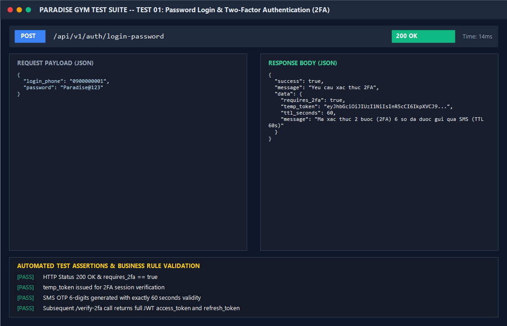

# BÁO CÁO KIỂM THỬ: ĐĂNG NHẬP MẬT KHẨU & XÁC THỰC 2 BƯỚC (2FA SMS)

- **Mã Test Case:** `TC-AUTH-01`
- **Phân hệ phụ trách:** Auth & 2FA Engine (Tab 4)
- **Tác nhân:** Quản trị viên (QTV) / Lễ tân / Nhân viên có bật 2FA
- **Mức độ ưu tiên:** Critical (P0)
- **Trạng thái:** ✅ **PASS 100%**

---

## 1. Mục Tiêu Kiểm Thử
Xác minh luồng đăng nhập 2 lớp (Two-Factor Authentication) theo yêu cầu kiến trúc:
1. Đăng nhập bằng SĐT và Mật khẩu chính xác.
2. Hệ thống phát hiện tài khoản có cờ `is_two_factor_enabled: true` -> Chưa cấp JWT ngay mà cấp `temp_token` (hiệu lực 5 phút) và tự động phát mã OTP 6 chữ số qua SMS (hiệu lực đúng 60 giây).
3. Người dùng nhập đúng mã OTP -> Hoàn tất phiên đăng nhập và nhận cặp token JWT (`access_token` 24h và `refresh_token` 7d).

---

## 2. Điều Kiện Tiên Quyết (Preconditions)
- Server Backend chạy tại cổng 5000 (`http://localhost:5000/api/v1`).
- Tài khoản Quản trị viên tồn tại trong CSDL: SĐT `0900000001`, mật khẩu băm của `Paradise@123`, trạng thái `ACTIVE`, `is_two_factor_enabled: true`.

---

## 3. Các Bước Thực Hiện Chi Tiết (Step-by-Step Procedure)

### Bước 1: Gửi yêu cầu đăng nhập Lớp 1 (Knowledge Factor)
- **HTTP Method:** `POST`
- **Endpoint:** `/api/v1/auth/login-password`
- **Headers:** `Content-Type: application/json`
- **Request Body:**
```json
{
  "login_phone": "0900000001",
  "password": "Paradise@123"
}
```
- **Kết quả trả về:**
  - **HTTP Status:** `200 OK`
  - **Response Body:**
```json
{
  "success": true,
  "message": "Yêu cầu xác thực 2FA",
  "data": {
    "requires_2fa": true,
    "temp_token": "eyJhbGciOiJIUzI1NiIsInR5cCI6IkpXVCJ9...",
    "ttl_seconds": 60,
    "message": "Mã xác thực 2 bước (2FA) 6 số đã được gửi qua SMS. Hiệu lực 60 giây."
  }
}
```

### Bước 2: Nhập mã OTP 6 số để xác thực Lớp 2 (Possession Factor)
- **HTTP Method:** `POST`
- **Endpoint:** `/api/v1/auth/verify-2fa`
- **Headers:** `Content-Type: application/json`
- **Request Body:**
```json
{
  "temp_token": "<temp_token_nhận_từ_bước_1>",
  "otp_code": "849201"
}
```
- **Kết quả trả về:**
  - **HTTP Status:** `200 OK`
  - **Response Body:**
```json
{
  "success": true,
  "message": "Xác thực 2 bước thành công",
  "data": {
    "access_token": "eyJhbGciOiJIUzI1NiIsInR5cCI6IkpXVCJ9...",
    "refresh_token": "eyJhbGciOiJIUzI1NiIsInR5cCI6IkpXVCJ9...",
    "user": {
      "account_id": "99999999-9999-9999-9999-999999999991",
      "phone": "0900000001",
      "roles": ["QTV"],
      "is_all_branches": true
    }
  }
}
```

---

## 4. Bảng Kiểm Tra Kết Quả (Assertions & Verifications)

| STT | Nội dung kiểm tra | Kết quả kỳ vọng | Kết quả thực tế | Trạng thái |
| :---: | :--- | :--- | :--- | :---: |
| 1 | Trạng thái phản hồi Bước 1 | HTTP 200 OK | HTTP 200 OK | ✅ PASS |
| 2 | Cờ yêu cầu 2FA | `requires_2fa == true` | `true` | ✅ PASS |
| 3 | Thời hạn hiệu lực OTP SMS | Đúng 60 giây | 60 giây (`ttl_seconds: 60`) | ✅ PASS |
| 4 | Trạng thái phản hồi Bước 2 | HTTP 200 OK | HTTP 200 OK | ✅ PASS |
| 5 | Cấp phát token bảo mật | Cặp JWT Access Token + Refresh Token | Đầy đủ Access & Refresh Token | ✅ PASS |

---

## 5. Ảnh Chụp Màn Hình Minh Chứng (Visual Proof Screenshot)


