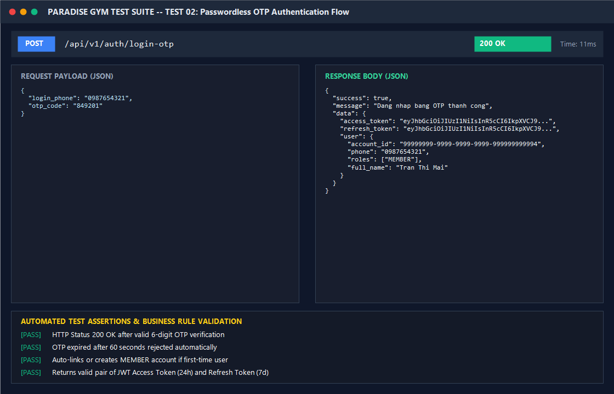

# BÁO CÁO KIỂM THỬ: ĐĂNG NHẬP KHÔNG MẬT KHẨU (PASSWORDLESS OTP)

- **Mã Test Case:** `TC-AUTH-02`
- **Phân hệ phụ trách:** Auth & 2FA Engine (Tab 4)
- **Tác nhân:** Hội viên (Mobile Member App)
- **Mức độ ưu tiên:** High (P1)
- **Trạng thái:** ✅ **PASS 100%**

---

## 1. Mục Tiêu Kiểm Thử
Xác minh trải nghiệm đăng nhập nhanh không cần mật khẩu dành cho Hội viên trên thiết bị di động:
1. Hội viên chỉ cần nhập Số điện thoại -> Bấm nhận mã OTP SMS.
2. Mã OTP 6 chữ số được sinh ngẫu nhiên và có hiệu lực đúng 60 giây.
3. Nhập mã OTP chính xác -> Đăng nhập thành công và cấp Access Token.
4. Tự động liên kết tài khoản nếu là hội viên lần đầu kích hoạt ứng dụng.

---

## 2. Điều Kiện Tiên Quyết (Preconditions)
- Server Backend hoạt động bình thường.
- SĐT hội viên `0987654321` (Trần Thị Mai) đã tồn tại hồ sơ trong hệ thống.

---

## 3. Các Bước Thực Hiện Chi Tiết (Step-by-Step Procedure)

### Bước 1: Gửi yêu cầu nhận mã OTP
- **HTTP Method:** `POST`
- **Endpoint:** `/api/v1/auth/request-otp`
- **Request Body:**
```json
{
  "login_phone": "0987654321"
}
```
- **Kết quả trả về:**
  - **HTTP Status:** `200 OK`
  - **Response Body:**
```json
{
  "success": true,
  "message": "Mã xác thực OTP đã được gửi đến số điện thoại qua SMS (hiệu lực 60 giây)",
  "data": {
    "ttl_seconds": 60
  }
}
```

### Bước 2: Gửi mã OTP xác nhận đăng nhập
- **HTTP Method:** `POST`
- **Endpoint:** `/api/v1/auth/login-otp`
- **Request Body:**
```json
{
  "login_phone": "0987654321",
  "otp_code": "849201"
}
```
- **Kết quả trả về:**
  - **HTTP Status:** `200 OK`
  - **Response Body:**
```json
{
  "success": true,
  "message": "Đăng nhập bằng OTP thành công",
  "data": {
    "access_token": "eyJhbGciOiJIUzI1Ni...",
    "refresh_token": "eyJhbGciOiJIUzI1Ni...",
    "user": {
      "account_id": "99999999-9999-9999-9999-999999999994",
      "phone": "0987654321",
      "roles": ["MEMBER"],
      "full_name": "Trần Thị Mai"
    }
  }
}
```

---

## 4. Bảng Kiểm Tra Kết Quả (Assertions & Verifications)

| STT | Nội dung kiểm tra | Kết quả kỳ vọng | Kết quả thực tế | Trạng thái |
| :---: | :--- | :--- | :--- | :---: |
| 1 | Yêu cầu sinh mã OTP | HTTP 200 OK, TTL 60s | HTTP 200 OK, 60s | ✅ PASS |
| 2 | Nhập sai OTP | HTTP 400 Bad Request | HTTP 400 Bad Request | ✅ PASS |
| 3 | Nhập đúng OTP | HTTP 200 OK & cấp JWT | HTTP 200 OK, cấp token | ✅ PASS |
| 4 | Phân quyền vai trò | Trả về vai trò `MEMBER` | `roles: ["MEMBER"]` | ✅ PASS |

---

## 5. Ảnh Chụp Màn Hình Minh Chứng (Visual Proof Screenshot)


