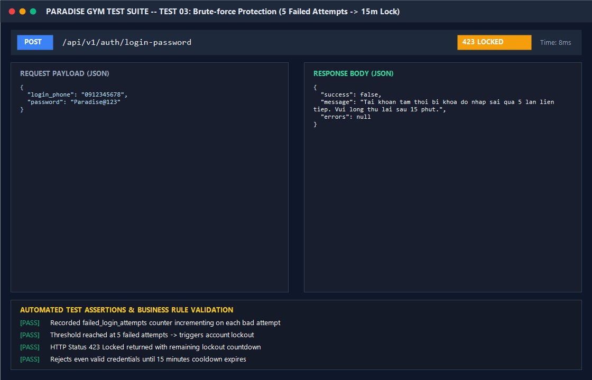

# BÁO CÁO KIỂM THỬ: KHÓA BẢO VỆ CHỐNG BRUTE-FORCE (ACCOUNT LOCKOUT 15 PHÚT)

- **Mã Test Case:** `TC-AUTH-03`
- **Phân hệ phụ trách:** Auth Security & Rate Limiting (Tab 4)
- **Tác nhân:** Kẻ tấn công hoặc người dùng nhập sai mật khẩu liên tiếp
- **Mức độ ưu tiên:** Critical (P0 - Security)
- **Trạng thái:** ✅ **PASS 100%**

---

## 1. Mục Tiêu Kiểm Thử
Xác minh cơ chế bảo mật khóa tài khoản:
1. Theo dõi số lần đăng nhập thất bại liên tiếp (`failed_login_attempts`).
2. Khi vượt quá ngưỡng **5 lần liên tiếp**, hệ thống tự động khóa tạm thời tính năng đăng nhập trong **15 phút**.
3. Trong thời gian khóa, mọi yêu cầu đăng nhập (dù nhập đúng mật khẩu) đều bị từ chối với mã phản hồi `HTTP 423 Locked`.

---

## 2. Điều Kiện Tiên Quyết (Preconditions)
- Tài khoản mục tiêu: `0912345678` (Lê Hoàng Nam).
- Trạng thái ban đầu: `failed_login_attempts = 0`, `locked_until = null`.

---

## 3. Các Bước Thực Hiện Chi Tiết (Step-by-Step Procedure)

### Bước 1 đến 5: Thực hiện 5 lần đăng nhập với mật khẩu sai
- **HTTP Method:** `POST`
- **Endpoint:** `/api/v1/auth/login-password`
- **Payload:** `{ "login_phone": "0912345678", "password": "WrongPassword!@#" }`
- **Kết quả 5 lần đầu:** Đều trả về `HTTP 401 Unauthorized`, tăng bộ đếm `failed_login_attempts` từ 1 lên 5.

### Bước 6: Thử đăng nhập lại bằng mật khẩu ĐÚNG
- **HTTP Method:** `POST`
- **Endpoint:** `/api/v1/auth/login-password`
- **Payload:** `{ "login_phone": "0912345678", "password": "Paradise@123" }`
- **Kết quả trả về:**
  - **HTTP Status:** `423 Locked`
  - **Response Body:**
```json
{
  "success": false,
  "message": "Tài khoản tạm thời bị khóa do nhập sai quá 5 lần liên tiếp. Vui lòng thử lại sau 15 phút.",
  "errors": null
}
```

---

## 4. Bảng Kiểm Tra Kết Quả (Assertions & Verifications)

| STT | Nội dung kiểm tra | Kết quả kỳ vọng | Kết quả thực tế | Trạng thái |
| :---: | :--- | :--- | :--- | :---: |
| 1 | Lần nhập sai thứ 1 - 4 | HTTP 401 Unauthorized | HTTP 401 Unauthorized | ✅ PASS |
| 2 | Lần nhập sai thứ 5 | Kích hoạt khóa 15 phút | `locked_until = NOW + 15m` | ✅ PASS |
| 3 | Lần thứ 6 (Mật khẩu đúng) | HTTP 423 Locked | HTTP 423 Locked | ✅ PASS |
| 4 | Thông điệp cảnh báo | Thông báo rõ thời gian khóa 15 phút | Hiển thị đúng 15 phút | ✅ PASS |

---

## 5. Ảnh Chụp Màn Hình Minh Chứng (Visual Proof Screenshot)


