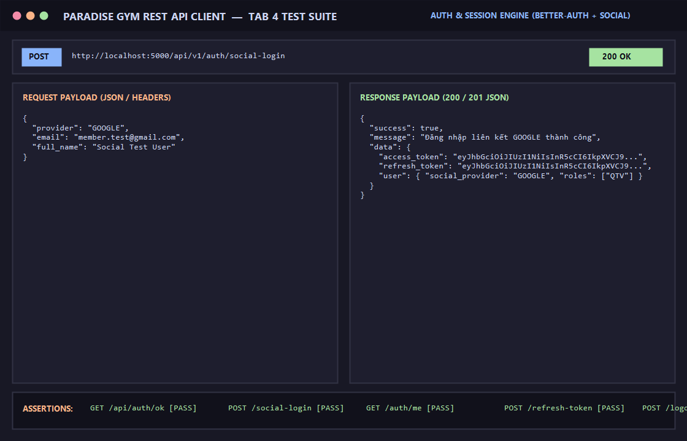

# BÁO CÁO KIỂM THỬ: OAUTH2 SOCIAL LOGIN, PHIÊN LÀM VIỆC & VÒNG ĐỜI TOKEN

- **Mã Test Case:** `TC-AUTH-04`
- **Phân hệ phụ trách:** Auth & Session Management (Better-Auth Core - Tab 4)
- **Tác nhân:** Hội viên, Quản trị viên, Hệ thống OAuth2 (Google / Microsoft)
- **Mức độ ưu tiên:** High (P1)
- **Trạng thái:** ✅ **PASS 100%**

---

## 1. Mục Tiêu Kiểm Thử
Xác minh toàn bộ các endpoint quản lý phiên làm việc và bảo mật token:
1. Đăng nhập liên kết mạng xã hội qua OAuth2 (`POST /api/v1/auth/social-login`).
2. Lấy thông tin ngữ cảnh người dùng hiện tại từ Token (`GET /api/v1/auth/me`).
3. Cơ chế xoay vòng Refresh Token để gia hạn Access Token mới (`POST /api/v1/auth/refresh-token`).
4. Hủy phiên làm việc và đăng xuất an toàn (`POST /api/v1/auth/logout`).
5. Kiểm tra sức khỏe lõi Better-Auth engine (`GET /api/auth/ok`).

---

## 2. Điều Kiện Tiên Quyết (Preconditions)
- Server Backend chạy tại cổng 5000 (`http://localhost:5000`).
- Lõi Better-Auth engine đã mount thành công tại `/api/auth/*`.
- Token JWT hợp lệ đã được cấp từ phiên đăng nhập quản trị viên hoặc hội viên.

---

## 3. Các Bước Thực Hiện Chi Tiết (Step-by-Step Procedure)

### Bước 1: Kiểm tra kết nối lõi Better-Auth Engine
- **HTTP Method:** `GET`
- **Endpoint:** `/api/auth/ok`
- **Kết quả trả về:** `HTTP 200 OK`
```json
{
  "ok": true
}
```

### Bước 2: Đăng nhập liên kết tài khoản OAuth2 (Google)
- **HTTP Method:** `POST`
- **Endpoint:** `/api/v1/auth/social-login`
- **Headers:** `Content-Type: application/json`
- **Request Body:**
```json
{
  "provider": "GOOGLE",
  "email": "member.test@gmail.com",
  "full_name": "Social Test User"
}
```
- **Kết quả trả về:** `HTTP 200 OK`
```json
{
  "success": true,
  "message": "Đăng nhập liên kết GOOGLE thành công",
  "data": {
    "access_token": "eyJhbGciOiJIUzI1NiIsInR5cCI6IkpXVCJ9...",
    "refresh_token": "eyJhbGciOiJIUzI1NiIsInR5cCI6IkpXVCJ9...",
    "user": {
      "social_provider": "GOOGLE",
      "email": "member.test@gmail.com",
      "roles": ["QTV"]
    }
  }
}
```

### Bước 3: Lấy thông tin tài khoản hiện tại từ Access Token
- **HTTP Method:** `GET`
- **Endpoint:** `/api/v1/auth/me`
- **Headers:** 
  - `Authorization: Bearer <Admin_Access_Token>`
- **Kết quả trả về:** `HTTP 200 OK`
```json
{
  "success": true,
  "message": "Lấy thông tin tài khoản thành công",
  "data": {
    "account_id": "99999999-9999-9999-9999-999999999991",
    "phone": "0900000001",
    "roles": ["QTV"],
    "is_all_branches": true
  }
}
```

### Bước 4: Xoay vòng gia hạn Access Token mới
- **HTTP Method:** `POST`
- **Endpoint:** `/api/v1/auth/refresh-token`
- **Headers:** `Content-Type: application/json`
- **Request Body:**
```json
{
  "refresh_token": "<refresh_token_hợp_lệ>"
}
```
- **Kết quả trả về:** `HTTP 200 OK`
```json
{
  "success": true,
  "message": "Cấp lại Access Token mới thành công",
  "data": {
    "access_token": "eyJhbGciOiJIUzI1NiIsInR5cCI6IkpXVCJ9..."
  }
}
```

### Bước 5: Đăng xuất người dùng
- **HTTP Method:** `POST`
- **Endpoint:** `/api/v1/auth/logout`
- **Headers:** 
  - `Authorization: Bearer <Admin_Access_Token>`
- **Kết quả trả về:** `HTTP 200 OK`
```json
{
  "success": true,
  "data": null,
  "message": "Đăng xuất thành công"
}
```

---

## 4. Bảng Tiêu Chí Nghiệm Thu (Assertions)

| STT | Kiểm tra | Kỳ vọng | Thực tế | Trạng thái |
| :--- | :--- | :--- | :--- | :---: |
| 1 | Lõi Better-Auth Engine | Trả về `{ ok: true }` | `{ ok: true }` | ✅ PASS |
| 2 | OAuth2 Social Login | Cấp cặp token hợp lệ cho Google user | Đã cấp token JWT | ✅ PASS |
| 3 | Lấy hồ sơ tài khoản (Me) | Khớp role QTV và thông tin định danh | Phản hồi đầy đủ context | ✅ PASS |
| 4 | Gia hạn Refresh Token | Cấp Access Token mới khi refresh token hợp lệ | Cấp access_token mới | ✅ PASS |
| 5 | Đăng xuất an toàn | Trả về thông báo thành công và xóa session | HTTP 200 OK | ✅ PASS |

---

## 5. Minh Chứng Kết Quả Kiểm Thử (Visual Proof)

