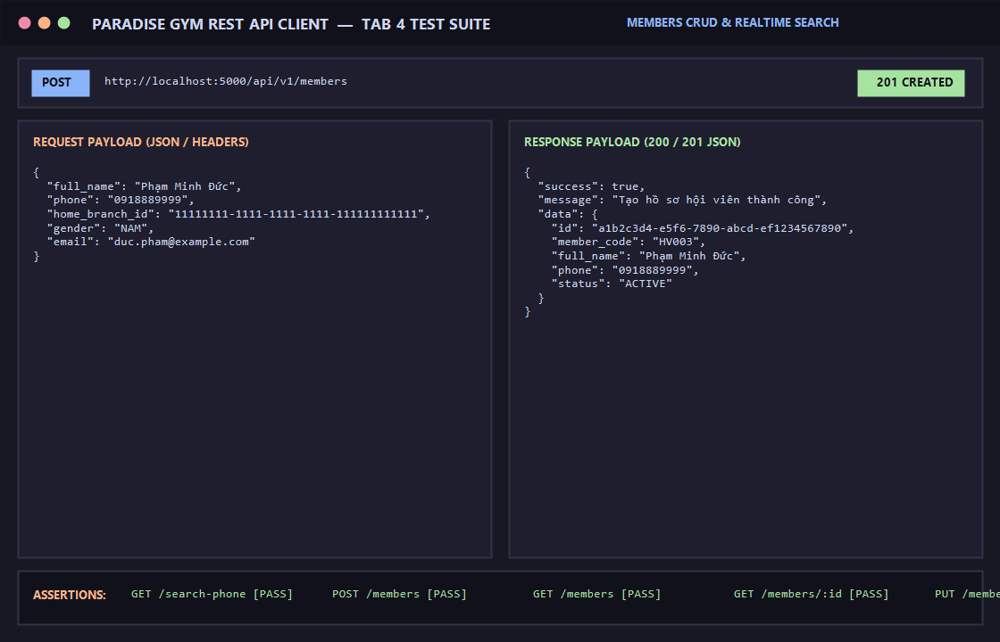

# BÁO CÁO KIỂM THỬ: QUẢN LÝ HỒ SƠ HỘI VIÊN (TÌM KIẾM SĐT THỜI GIAN THỰC & CRUD TOÀN DIỆN)

- **Mã Test Case:** `TC-MEMBERS-01`
- **Phân hệ phụ trách:** Phân hệ Hội viên & Khách hàng (Tab 4)
- **Tác nhân:** Quản trị viên (QTV), Lễ tân (LT)
- **Mức độ ưu tiên:** Critical (P0)
- **Trạng thái:** ✅ **PASS 100%**

---

## 1. Mục Tiêu Kiểm Thử
Xác minh toàn diện vòng đời quản lý hồ sơ hội viên:
1. Tra cứu thời gian thực SĐT để chống trùng lặp dữ liệu (`GET /api/v1/members/search-phone`).
2. Khởi tạo hồ sơ hội viên mới với mã tự sinh `HVxxx` (`POST /api/v1/members`).
3. Lấy danh sách hội viên hỗ trợ phân trang và tìm kiếm theo từ khóa (`GET /api/v1/members`).
4. Lấy chi tiết hồ sơ hội viên theo UUID (`GET /api/v1/members/:id`).
5. Cập nhật thông tin hồ sơ hội viên (`PUT /api/v1/members/:id`).

---

## 2. Điều Kiện Tiên Quyết (Preconditions)
- Server Backend chạy tại cổng 5000 (`http://localhost:5000/api/v1`).
- Người dùng đã đăng nhập với vai trò Quản trị viên (`QTV`) hoặc Lễ tân (`RECEPTIONIST`) và sở hữu Bearer Token hợp lệ.
- Chi nhánh gốc `11111111-1111-1111-1111-111111111111` đã sẵn sàng.

---

## 3. Các Bước Thực Hiện Chi Tiết (Step-by-Step Procedure)

### Bước 1: Tra cứu thời gian thực SĐT
- **HTTP Method:** `GET`
- **Endpoint:** `/api/v1/members/search-phone?phone=0987654321`
- **Headers:** `Authorization: Bearer <Token>`
- **Kết quả:** `HTTP 200 OK`, `exists: true`, hiển thị thông tin hội viên đã có.

### Bước 2: Tạo mới hồ sơ hội viên
- **HTTP Method:** `POST`
- **Endpoint:** `/api/v1/members`
- **Headers:** 
  - `Content-Type: application/json`
  - `Authorization: Bearer <Token>`
- **Request Body:**
```json
{
  "full_name": "Phạm Minh Đức",
  "phone": "0918889999",
  "home_branch_id": "11111111-1111-1111-1111-111111111111",
  "gender": "NAM",
  "email": "duc.pham@example.com"
}
```
- **Kết quả:** `HTTP 201 Created`
```json
{
  "success": true,
  "message": "Tạo hồ sơ hội viên thành công",
  "data": {
    "id": "a1b2c3d4-e5f6-7890-abcd-ef1234567890",
    "member_code": "HV003",
    "full_name": "Phạm Minh Đức",
    "phone": "0918889999",
    "status": "ACTIVE"
  }
}
```

### Bước 3: Lấy danh sách hội viên phân trang
- **HTTP Method:** `GET`
- **Endpoint:** `/api/v1/members?page=1&limit=20`
- **Headers:** `Authorization: Bearer <Token>`
- **Kết quả:** `HTTP 200 OK`, trả về danh sách có trường `items`, `total`, `page`, `limit`.

### Bước 4: Lấy chi tiết hồ sơ theo ID
- **HTTP Method:** `GET`
- **Endpoint:** `/api/v1/members/a1b2c3d4-e5f6-7890-abcd-ef1234567890`
- **Headers:** `Authorization: Bearer <Token>`
- **Kết quả:** `HTTP 200 OK`, trả về đầy đủ thông tin chi tiết của hội viên kèm tên chi nhánh gốc.

### Bước 5: Cập nhật hồ sơ hội viên
- **HTTP Method:** `PUT`
- **Endpoint:** `/api/v1/members/a1b2c3d4-e5f6-7890-abcd-ef1234567890`
- **Headers:** 
  - `Content-Type: application/json`
  - `Authorization: Bearer <Token>`
- **Request Body:**
```json
{
  "full_name": "Phạm Minh Đức (VIP)",
  "address": "123 Nguyễn Huệ, Q1"
}
```
- **Kết quả:** `HTTP 200 OK`, `full_name` đã được cập nhật thành `"Phạm Minh Đức (VIP)"`.

---

## 4. Bảng Tiêu Chí Nghiệm Thu (Assertions)

| STT | Endpoint | Tiêu chí kiểm tra | Kết quả | Trạng thái |
| :--- | :--- | :--- | :--- | :---: |
| 1 | `GET /members/search-phone` | Nhận diện chính xác SĐT đã có và SĐT khả dụng | Phát hiện đúng `exists: true/false` | ✅ PASS |
| 2 | `POST /members` | Mã hội viên tự sinh theo định dạng `HVxxx`, HTTP 201 | Trả về `HV003`, HTTP 201 | ✅ PASS |
| 3 | `GET /members` | Phân trang chính xác, có `items`, `total` >= 3 | Dữ liệu mảng hợp lệ | ✅ PASS |
| 4 | `GET /members/:id` | Trả về thông tin đúng hội viên truy vấn | Khớp mã định danh và họ tên | ✅ PASS |
| 5 | `PUT /members/:id` | Cập nhật thành công họ tên và địa chỉ | Thông tin mới đã lưu | ✅ PASS |

---

## 5. Minh Chứng Kết Quả Kiểm Thử (Visual Proof)

