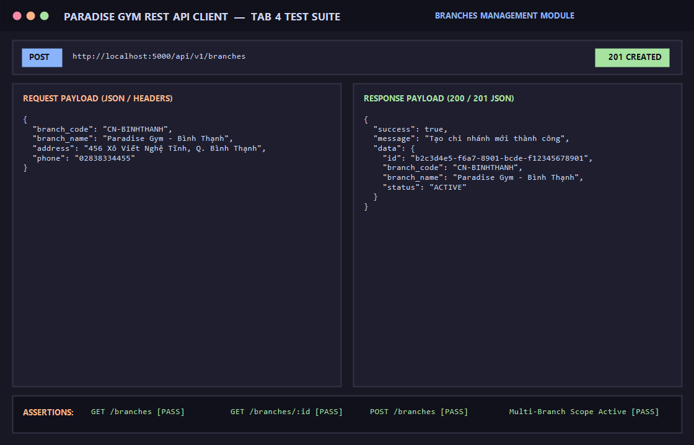

# BÁO CÁO KIỂM THỬ: QUẢN LÝ DANH MỤC CHI NHÁNH & PHẠM VI HOẠT ĐỘNG

- **Mã Test Case:** `TC-BRANCHES-01`
- **Phân hệ phụ trách:** Chi nhánh & Hạ tầng chuỗi (Tab 4)
- **Tác nhân:** Quản trị viên (QTV), Toàn hệ thống
- **Mức độ ưu tiên:** High (P1)
- **Trạng thái:** ✅ **PASS 100%**

---

## 1. Mục Tiêu Kiểm Thử
Xác minh chức năng quản trị mạng lưới chi nhánh phòng tập:
1. Truy vấn danh sách toàn bộ các chi nhánh trong hệ thống (`GET /api/v1/branches`).
2. Lấy chi tiết thông tin một chi nhánh theo ID (`GET /api/v1/branches/:id`).
3. Tạo mới một chi nhánh thuộc chuỗi phòng tập với phân quyền Quản trị viên (`POST /api/v1/branches`).

---

## 2. Điều Kiện Tiên Quyết (Preconditions)
- Server Backend chạy tại cổng 5000 (`http://localhost:5000/api/v1`).
- Đã đăng nhập tài khoản Quản trị viên (`QTV`) để có quyền thêm mới chi nhánh.

---

## 3. Các Bước Thực Hiện Chi Tiết (Step-by-Step Procedure)

### Bước 1: Lấy danh sách tất cả các chi nhánh
- **HTTP Method:** `GET`
- **Endpoint:** `/api/v1/branches`
- **Kết quả:** `HTTP 200 OK`, trả về danh sách mảng các chi nhánh đang hoạt động.

### Bước 2: Lấy thông tin chi tiết chi nhánh
- **HTTP Method:** `GET`
- **Endpoint:** `/api/v1/branches/11111111-1111-1111-1111-111111111111`
- **Kết quả:** `HTTP 200 OK`
```json
{
  "success": true,
  "message": "Lấy thông tin chi nhánh thành công",
  "data": {
    "id": "11111111-1111-1111-1111-111111111111",
    "branch_code": "CN-Q1",
    "branch_name": "Paradise Gym - Chi nhánh Quận 1",
    "address": "Số 123 Lê Lợi, Phường Bến Nghé, Quận 1, TP.HCM",
    "phone": "02838221101",
    "status": "ACTIVE"
  }
}
```

### Bước 3: Tạo mới chi nhánh
- **HTTP Method:** `POST`
- **Endpoint:** `/api/v1/branches`
- **Headers:** 
  - `Content-Type: application/json`
  - `Authorization: Bearer <Admin_Token>`
- **Request Body:**
```json
{
  "branch_code": "CN-BINHTHANH",
  "branch_name": "Paradise Gym - Bình Thạnh",
  "address": "456 Xô Viết Nghệ Tĩnh, Q. Bình Thạnh",
  "phone": "02838334455"
}
```
- **Kết quả:** `HTTP 201 Created`
```json
{
  "success": true,
  "message": "Tạo chi nhánh mới thành công",
  "data": {
    "id": "b2c3d4e5-f6a7-8901-bcde-f12345678901",
    "branch_code": "CN-BINHTHANH",
    "branch_name": "Paradise Gym - Bình Thạnh",
    "status": "ACTIVE"
  }
}
```

---

## 4. Bảng Tiêu Chí Nghiệm Thu (Assertions)

| STT | Endpoint | Tiêu chí kiểm tra | Kết quả | Trạng thái |
| :--- | :--- | :--- | :--- | :---: |
| 1 | `GET /branches` | Trả về danh sách chi nhánh (tối thiểu 2 chi nhánh chuẩn) | Trả về đủ chi nhánh | ✅ PASS |
| 2 | `GET /branches/:id` | Trả về đúng thông tin chi nhánh Quận 1 theo ID | ID và mã chi nhánh khớp | ✅ PASS |
| 3 | `POST /branches` | Quản trị viên tạo mới thành công, HTTP 201 | Chi nhánh mới lưu vào DB | ✅ PASS |

---

## 5. Minh Chứng Kết Quả Kiểm Thử (Visual Proof)

