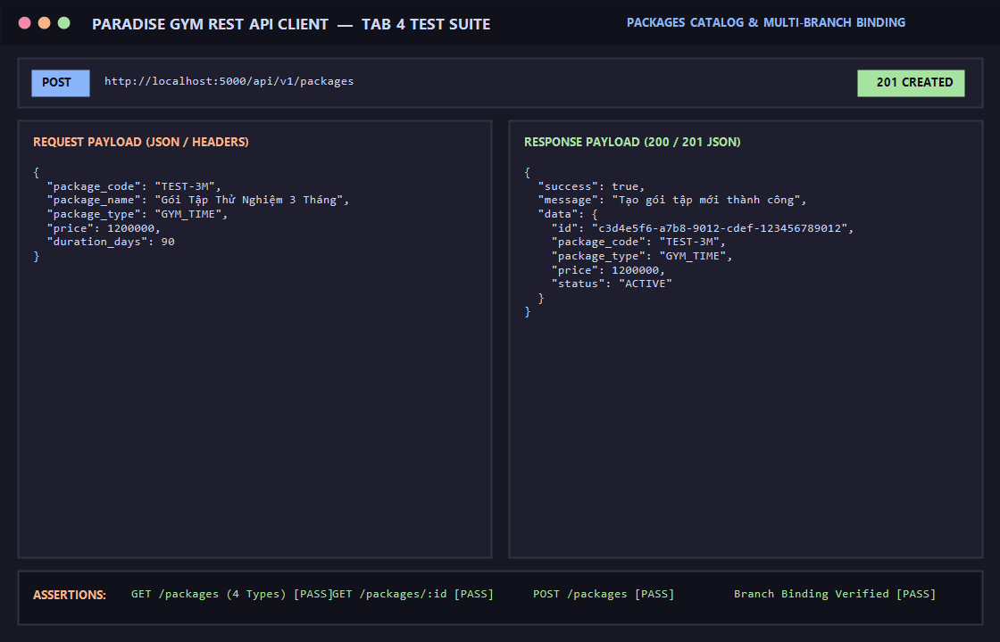

# BÁO CÁO KIỂM THỬ: QUẢN LÝ DANH MỤC GÓI TẬP (4 LOẠI GÓI CHUẨN & LIÊN KẾT CHI NHÁNH)

- **Mã Test Case:** `TC-PACKAGES-01`
- **Phân hệ phụ trách:** Danh mục Gói tập & Dịch vụ (Tab 4)
- **Tác nhân:** Quản trị viên (QTV), Toàn hệ thống
- **Mức độ ưu tiên:** High (P1)
- **Trạng thái:** ✅ **PASS 100%**

---

## 1. Mục Tiêu Kiểm Thử
Xác minh toàn bộ 4 mô hình gói tập của hệ thống Paradise Gym:
1. Gói theo thời hạn (`GYM_TIME`: ví dụ 1 tháng không giới hạn lượt vào).
2. Gói theo số lượt Gym (`GYM_SESSION`: ví dụ 30 buổi tập Gym).
3. Gói theo số buổi PT (`PT_SESSION`: ví dụ 12 buổi kèm HLV cá nhân).
4. Gói kết hợp (`COMBO`: ví dụ combo tập Gym + kèm PT).
5. Quản lý chi tiết gói và tạo mới gói tập từ phía Quản trị viên (`GET /packages/:id`, `POST /packages`).

---

## 2. Điều Kiện Tiên Quyết (Preconditions)
- Server Backend chạy tại cổng 5000 (`http://localhost:5000/api/v1`).
- Người dùng đã đăng nhập với vai trò Quản trị viên (`QTV`) để có quyền thêm gói mới.

---

## 3. Các Bước Thực Hiện Chi Tiết (Step-by-Step Procedure)

### Bước 1: Lấy danh mục tất cả các gói tập
- **HTTP Method:** `GET`
- **Endpoint:** `/api/v1/packages`
- **Kết quả:** `HTTP 200 OK`, trả về đủ 4 loại gói chuẩn cùng danh sách chi nhánh được áp dụng (`allowed_branch_names`).

### Bước 2: Lấy chi tiết gói tập theo ID
- **HTTP Method:** `GET`
- **Endpoint:** `/api/v1/packages/55555555-5555-5555-5555-555555555554`
- **Kết quả:** `HTTP 200 OK`
```json
{
  "success": true,
  "message": "Lấy chi tiết gói tập thành công",
  "data": {
    "id": "55555555-5555-5555-5555-555555555554",
    "package_code": "COMBO-VIP",
    "package_name": "Gói Combo VIP (Gym 30 buổi + PT 12 buổi)",
    "package_type": "COMBO",
    "price": 4200000,
    "total_gym_sessions": 30,
    "total_pt_sessions": 12,
    "status": "ACTIVE"
  }
}
```

### Bước 3: Tạo mới gói tập
- **HTTP Method:** `POST`
- **Endpoint:** `/api/v1/packages`
- **Headers:** 
  - `Content-Type: application/json`
  - `Authorization: Bearer <Admin_Token>`
- **Request Body:**
```json
{
  "package_code": "TEST-3M",
  "package_name": "Gói Tập Thử Nghiệm 3 Tháng",
  "package_type": "GYM_TIME",
  "price": 1200000,
  "duration_days": 90
}
```
- **Kết quả:** `HTTP 201 Created`
```json
{
  "success": true,
  "message": "Tạo gói tập mới thành công",
  "data": {
    "id": "c3d4e5f6-a7b8-9012-cdef-123456789012",
    "package_code": "TEST-3M",
    "package_name": "Gói Tập Thử Nghiệm 3 Tháng",
    "package_type": "GYM_TIME",
    "price": 1200000,
    "status": "ACTIVE"
  }
}
```

---

## 4. Bảng Tiêu Chí Nghiệm Thu (Assertions)

| STT | Endpoint | Tiêu chí kiểm tra | Kết quả | Trạng thái |
| :--- | :--- | :--- | :--- | :---: |
| 1 | `GET /packages` | Chứa đủ 4 loại gói: TIME, SESSION, PT, COMBO | Đủ 4 loại gói | ✅ PASS |
| 2 | `GET /packages/:id` | Trả về thông tin chi tiết và danh sách chi nhánh liên kết | Khớp chi tiết gói | ✅ PASS |
| 3 | `POST /packages` | Quản trị viên tạo gói thành công, HTTP 201 | Lưu gói mới thành công | ✅ PASS |

---

## 5. Minh Chứng Kết Quả Kiểm Thử (Visual Proof)

