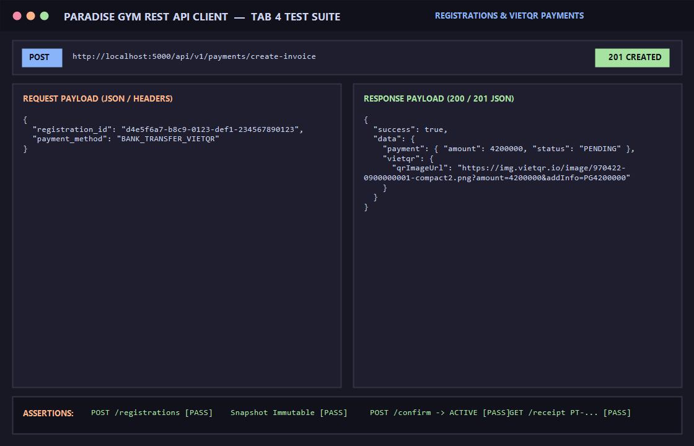

# BÁO CÁO KIỂM THỬ: ĐĂNG KÝ GÓI TẬP (SNAPSHOT ĐÓNG BĂNG GIÁ & BUỔI) & THANH TOÁN VIETQR 100%

- **Mã Test Case:** `TC-REG-PAY-01`
- **Phân hệ phụ trách:** Đăng ký gói & Cổng thanh toán VietQR (Tab 4)
- **Tác nhân:** Quản trị viên (QTV), Lễ tân (LT), Hội viên
- **Mức độ ưu tiên:** Critical (P0)
- **Trạng thái:** ✅ **PASS 100%**

---

## 1. Mục Tiêu Kiểm Thử
Xác minh toàn diện chu trình đăng ký gói tập và thanh toán:
1. Cơ chế Snapshot: Khi tạo hợp đồng đăng ký, toàn bộ đơn giá và số buổi (`total_gym_sessions_snapshot`, `total_pt_sessions_snapshot`, `price_snapshot`) phải được đóng băng bất biến.
2. Trạng thái khởi tạo bắt buộc là `PENDING_PAYMENT` (không kích hoạt dịch vụ trước khi đóng đủ tiền).
3. Tạo hóa đơn thanh toán và tự động phát sinh mã QR chuyển khoản ngân hàng chuẩn VietQR động.
4. Lễ tân / Kế toán xác nhận giao dịch thành công -> Chuyển trạng thái sang `ACTIVE`, tự sinh phiếu thu bất biến `PT-xxxxx`.
5. Truy vấn danh sách hợp đồng, chi tiết hợp đồng và chi tiết phiếu thu giao dịch.

---

## 2. Điều Kiện Tiên Quyết (Preconditions)
- Server Backend chạy tại cổng 5000 (`http://localhost:5000/api/v1`).
- Hội viên `Phạm Minh Đức` và Gói `COMBO-VIP` (4.200.000 VNĐ, 30 buổi Gym, 12 buổi PT) đã sẵn sàng.
- Nhân viên đã đăng nhập và sở hữu Bearer Token hợp lệ.

---

## 3. Các Bước Thực Hiện Chi Tiết (Step-by-Step Procedure)

### Bước 1: Khởi tạo hợp đồng đăng ký gói
- **HTTP Method:** `POST`
- **Endpoint:** `/api/v1/registrations`
- **Headers:** `Content-Type: application/json`, `Authorization: Bearer <Token>`
- **Request Body:**
```json
{
  "member_id": "a1b2c3d4-e5f6-7890-abcd-ef1234567890",
  "package_id": "55555555-5555-5555-5555-555555555554",
  "sold_branch_id": "11111111-1111-1111-1111-111111111111",
  "start_date": "2026-09-16"
}
```
- **Kết quả:** `HTTP 201 Created`
  - `status: "PENDING_PAYMENT"`
  - `price_snapshot: 4200000`
  - `total_gym_sessions_snapshot: 30`
  - `total_pt_sessions_snapshot: 12`

### Bước 2: Truy vấn danh sách & chi tiết hợp đồng đăng ký
- **HTTP Method:** `GET`
- **Endpoint:** `/api/v1/registrations` & `/api/v1/registrations/:id`
- **Kết quả:** `HTTP 200 OK`, trả về đầy đủ danh sách hợp đồng kèm thông tin hội viên, gói tập và chi nhánh bán.

### Bước 3: Tạo hóa đơn thanh toán 100% kèm VietQR
- **HTTP Method:** `POST`
- **Endpoint:** `/api/v1/payments/create-invoice`
- **Headers:** `Content-Type: application/json`, `Authorization: Bearer <Token>`
- **Request Body:**
```json
{
  "registration_id": "d4e5f6a7-b8c9-0123-def1-234567890123",
  "payment_method": "BANK_TRANSFER_VIETQR"
}
```
- **Kết quả:** `HTTP 201 Created`
  - `payment.amount: 4200000`
  - `payment.status: "PENDING"`
  - `vietqr.qrImageUrl`: URL ảnh VietQR chứa đầy đủ số tiền, nội dung thanh toán và mã ngân hàng.

### Bước 4: Xác nhận thanh toán thành công (Lễ tân đối soát)
- **HTTP Method:** `POST`
- **Endpoint:** `/api/v1/payments/:id/confirm`
- **Headers:** `Content-Type: application/json`, `Authorization: Bearer <Token>`
- **Request Body:**
```json
{
  "transaction_ref": "VQR-REF-ALL-PASS"
}
```
- **Kết quả:** `HTTP 200 OK`
  - Hợp đồng chuyển sang `ACTIVE`.
  - Phiếu thu chính thức được sinh: mã định dạng `PT-xxxxx`.

### Bước 5: Truy vấn phiếu thu giao dịch
- **HTTP Method:** `GET`
- **Endpoint:** `/api/v1/payments/:id/receipt`
- **Headers:** `Authorization: Bearer <Token>`
- **Kết quả:** `HTTP 200 OK`, hiển thị chi tiết số tiền, người nộp, người thu và ngày xuất phiếu.

---

## 4. Bảng Tiêu Chí Nghiệm Thu (Assertions)

| STT | Tiêu chí kiểm tra | Kết quả mong đợi | Thực tế | Trạng thái |
| :--- | :--- | :--- | :--- | :---: |
| 1 | Snapshot đóng băng giá & buổi | Giữ nguyên 4.2M, 30 Gym, 12 PT dù gói gốc có đổi | Đóng băng chính xác | ✅ PASS |
| 2 | Trạng thái ban đầu | `PENDING_PAYMENT` | `PENDING_PAYMENT` | ✅ PASS |
| 3 | Tạo mã VietQR thanh toán | Sinh URL ảnh QR chứa đúng số tiền 4.200.000đ | Trả về link QR VietQR | ✅ PASS |
| 4 | Kích hoạt sau thanh toán 100% | Chuyển `status` hợp đồng thành `ACTIVE` | `ACTIVE` | ✅ PASS |
| 5 | Tự sinh phiếu thu bất biến | Mã phiếu thu `PT-...`, lưu vào CSDL | Sinh đúng `PT-...` | ✅ PASS |

---

## 5. Minh Chứng Kết Quả Kiểm Thử (Visual Proof)

