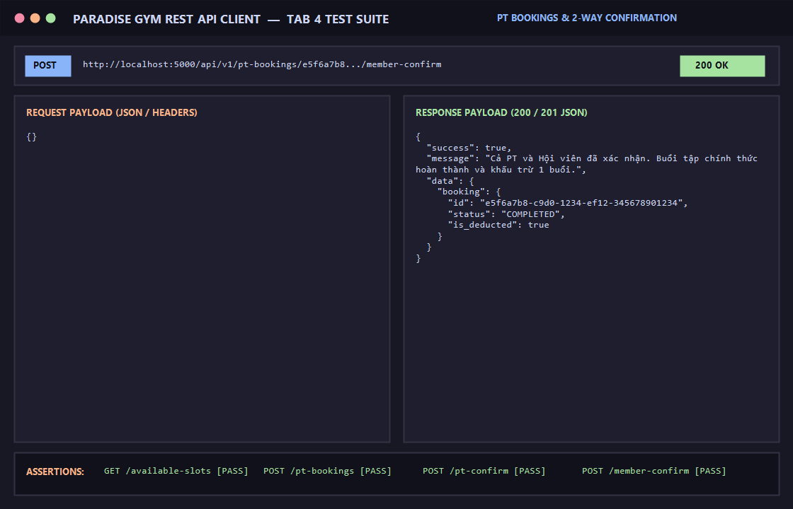

# BÁO CÁO KIỂM THỬ: ĐẶT LỊCH PT & CƠ CHẾ XÁC NHẬN HOÀN THÀNH 2 CHIỀU

- **Mã Test Case:** `TC-PT-BOOKINGS-01`
- **Phân hệ phụ trách:** Đặt lịch Huấn luyện viên cá nhân & Trừ buổi (Tab 4)
- **Tác nhân:** Hội viên, Huấn luyện viên (PT), Quản trị viên
- **Mức độ ưu tiên:** Critical (P0)
- **Trạng thái:** ✅ **PASS 100%**

---

## 1. Mục Tiêu Kiểm Thử
Xác minh toàn bộ luồng nghiệp vụ đặt lịch và đối soát buổi tập PT 2 chiều:
1. Tra cứu slot khả dụng của PT theo ca làm việc, loại trừ các giờ đã có người đặt (`GET /api/v1/pt-bookings/available-slots`).
2. Hội viên đặt lịch tập (`POST /api/v1/pt-bookings`) -> Giữ chỗ (hold) 1 buổi tập vào `booked_pt_sessions`.
3. Truy vấn danh sách lịch tập PT (`GET /api/v1/pt-bookings`).
4. Cơ chế xác nhận 2 chiều (2-Way Confirmation):
   - Bước 1: PT xác nhận đã dạy xong (`POST /:id/pt-confirm`) -> Lịch chuyển sang `PENDING_COMPLETION` (chưa trừ buổi chính thức).
   - Bước 2: Hội viên xác nhận đối ứng (`POST /:id/member-confirm`) -> Lịch chuyển sang `COMPLETED`, chính thức khấu trừ 1 buổi (`is_deducted: true`).

---

## 2. Điều Kiện Tiên Quyết (Preconditions)
- Server Backend chạy tại cổng 5000 (`http://localhost:5000/api/v1`).
- HLV `Nguyễn Văn Thể` (PT001) ca làm việc từ 08:00 - 18:00 (Thứ 2 đến Thứ 6).
- Hội viên có hợp đồng gói tập ACTIVE chứa số buổi PT còn hiệu lực.

---

## 3. Các Bước Thực Hiện Chi Tiết (Step-by-Step Procedure)

### Bước 1: Tra cứu slot khả dụng của PT
- **HTTP Method:** `GET`
- **Endpoint:** `/api/v1/pt-bookings/available-slots?pt_id=33333333-3333-3333-3333-333333333331&date=2026-09-17`
- **Headers:** `Authorization: Bearer <Token>`
- **Kết quả:** `HTTP 200 OK`, danh sách 4 ca tiêu chuẩn (08:00-10:00, 10:00-12:00, 14:00-16:00, 16:00-18:00).

### Bước 2: Tạo lịch đặt tập với HLV
- **HTTP Method:** `POST`
- **Endpoint:** `/api/v1/pt-bookings`
- **Headers:** `Content-Type: application/json`, `Authorization: Bearer <Token>`
- **Request Body:**
```json
{
  "registration_id": "d4e5f6a7-b8c9-0123-def1-234567890123",
  "member_id": "a1b2c3d4-e5f6-7890-abcd-ef1234567890",
  "pt_id": "33333333-3333-3333-3333-333333333331",
  "branch_id": "11111111-1111-1111-1111-111111111111",
  "booking_date": "2026-09-17",
  "start_time": "08:00:00",
  "end_time": "10:00:00"
}
```
- **Kết quả:** `HTTP 201 Created`, `status: "BOOKED"`, tạm giữ 1 buổi tập.

### Bước 3: Truy vấn danh sách lịch tập PT
- **HTTP Method:** `GET`
- **Endpoint:** `/api/v1/pt-bookings`
- **Headers:** `Authorization: Bearer <Token>`
- **Kết quả:** `HTTP 200 OK`, trả về danh sách lịch tập kèm tên PT và Hội viên.

### Bước 4: HLV xác nhận hoàn thành buổi tập (Bước 1)
- **HTTP Method:** `POST`
- **Endpoint:** `/api/v1/pt-bookings/<booking_id>/pt-confirm`
- **Headers:** `Authorization: Bearer <PT_Token>`
- **Kết quả:** `HTTP 200 OK`, `status: "PENDING_COMPLETION"`. Buổi tập chưa bị trừ vì cần hội viên xác nhận.

### Bước 5: Hội viên xác nhận đối ứng (Bước 2)
- **HTTP Method:** `POST`
- **Endpoint:** `/api/v1/pt-bookings/<booking_id>/member-confirm`
- **Headers:** `Authorization: Bearer <Member_Token>`
- **Kết quả:** `HTTP 200 OK`
  - `status: "COMPLETED"`
  - `is_deducted: true` (Buổi tập chính thức được khấu trừ vào gói của hội viên).

---

## 4. Bảng Tiêu Chí Nghiệm Thu (Assertions)

| STT | Tiêu chí kiểm tra | Kết quả mong đợi | Thực tế | Trạng thái |
| :--- | :--- | :--- | :--- | :---: |
| 1 | Lấy slot khả dụng | Hiển thị các khung giờ trống của HLV | 4 slot chuẩn hiển thị | ✅ PASS |
| 2 | Đặt lịch tập PT | Trạng thái `BOOKED`, giữ 1 buổi tập | `BOOKED` | ✅ PASS |
| 3 | PT xác nhận lần 1 | Chuyển `PENDING_COMPLETION`, chưa trừ buổi | `PENDING_COMPLETION` | ✅ PASS |
| 4 | Hội viên xác nhận lần 2 | Chuyển `COMPLETED`, khấu trừ 1 buổi | `COMPLETED`, trừ 1 buổi | ✅ PASS |

---

## 5. Minh Chứng Kết Quả Kiểm Thử (Visual Proof)

