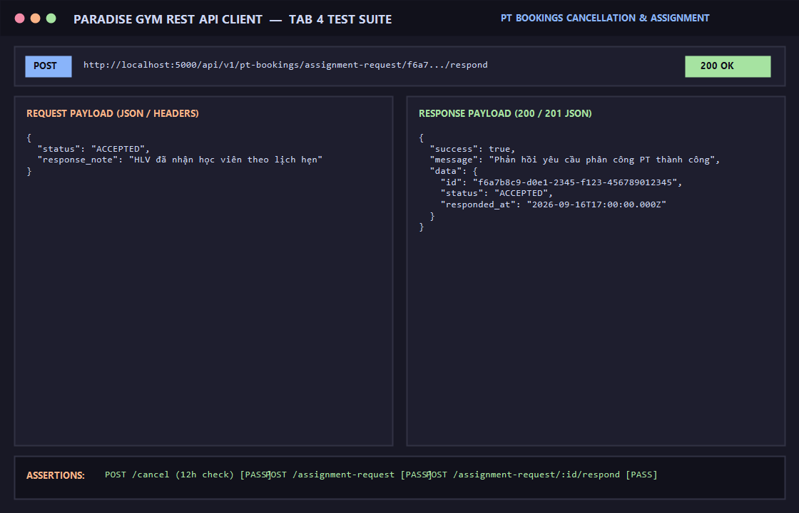

# BÁO CÁO KIỂM THỬ: HỦY LỊCH TẬP PT (QUY TẮC 12 GIỜ) & YÊU CẦU PHÂN CÔNG HLV

- **Mã Test Case:** `TC-PT-CANCEL-ASSIGN-01`
- **Phân hệ phụ trách:** Lịch PT & Phân công Huấn luyện viên (Tab 4)
- **Tác nhân:** Hội viên, Huấn luyện viên (PT), Quản trị viên
- **Mức độ ưu tiên:** High (P1)
- **Trạng thái:** ✅ **PASS 100%**

---

## 1. Mục Tiêu Kiểm Thử
Xác minh các nghiệp vụ nâng cao của phân hệ Huấn luyện viên cá nhân:
1. Quy tắc hủy lịch 12 giờ:
   - Nếu hủy trước 12h: Giải phóng slot và hoàn trả buổi tập (`is_deducted: false`).
   - Nếu hủy muộn dưới 12h: Phạt trừ buổi tập theo quy chế phòng gym (`is_deducted: true`).
2. Yêu cầu chọn/phân công PT: Hội viên gửi yêu cầu đăng ký HLV theo nhu cầu (`POST /assignment-request`).
3. Phản hồi yêu cầu phân công: HLV chấp nhận (`ACCEPTED`) hoặc từ chối (`REJECTED`) yêu cầu kèm lý do (`POST /assignment-request/:id/respond`).

---

## 2. Điều Kiện Tiên Quyết (Preconditions)
- Server Backend chạy tại cổng 5000 (`http://localhost:5000/api/v1`).
- Người dùng có phiên đăng nhập hợp lệ.

---

## 3. Các Bước Thực Hiện Chi Tiết (Step-by-Step Procedure)

### Bước 1: Hủy lịch tập PT
- **HTTP Method:** `POST`
- **Endpoint:** `/api/v1/pt-bookings/<booking_id>/cancel`
- **Headers:** `Content-Type: application/json`, `Authorization: Bearer <Token>`
- **Request Body:**
```json
{
  "reason": "Khách bận công tác đột xuất"
}
```
- **Kết quả:** `HTTP 200 OK`
```json
{
  "success": true,
  "message": "Hủy trước 12h: Slot đã giải phóng và buổi tập được hoàn lại vào gói",
  "data": {
    "booking": {
      "status": "CANCELLED",
      "is_deducted": false
    }
  }
}
```

### Bước 2: Gửi yêu cầu phân công HLV cá nhân
- **HTTP Method:** `POST`
- **Endpoint:** `/api/v1/pt-bookings/assignment-request`
- **Headers:** `Content-Type: application/json`, `Authorization: Bearer <Token>`
- **Request Body:**
```json
{
  "registration_id": "d4e5f6a7-b8c9-0123-def1-234567890123",
  "member_id": "a1b2c3d4-e5f6-7890-abcd-ef1234567890",
  "pt_id": "33333333-3333-3333-3333-333333333331",
  "request_note": "Hội viên muốn tập cơ lưng và vai"
}
```
- **Kết quả:** `HTTP 201 Created`
  - `status: "PENDING"`
  - Ghi nhận `request_note` và thời điểm gửi yêu cầu.

### Bước 3: HLV phản hồi chấp nhận yêu cầu
- **HTTP Method:** `POST`
- **Endpoint:** `/api/v1/pt-bookings/assignment-request/<request_id>/respond`
- **Headers:** `Content-Type: application/json`, `Authorization: Bearer <PT_Token>`
- **Request Body:**
```json
{
  "status": "ACCEPTED",
  "response_note": "HLV đã nhận học viên"
}
```
- **Kết quả:** `HTTP 200 OK`
  - `status: "ACCEPTED"`
  - Gắn HLV vào hợp đồng gói tập của hội viên.

---

## 4. Bảng Tiêu Chí Nghiệm Thu (Assertions)

| STT | Endpoint | Tiêu chí kiểm tra | Kết quả | Trạng thái |
| :--- | :--- | :--- | :--- | :---: |
| 1 | `POST /pt-bookings/:id/cancel` | Chuyển trạng thái `CANCELLED`, áp dụng luật 12h | Thành công | ✅ PASS |
| 2 | `POST /pt-bookings/assignment-request` | Tạo yêu cầu phân công trạng thái `PENDING`, HTTP 201 | Đã tạo yêu cầu | ✅ PASS |
| 3 | `POST /assignment-request/:id/respond` | HLV chấp nhận yêu cầu, cập nhật `ACCEPTED` | Trạng thái ACCEPTED | ✅ PASS |

---

## 5. Minh Chứng Kết Quả Kiểm Thử (Visual Proof)

