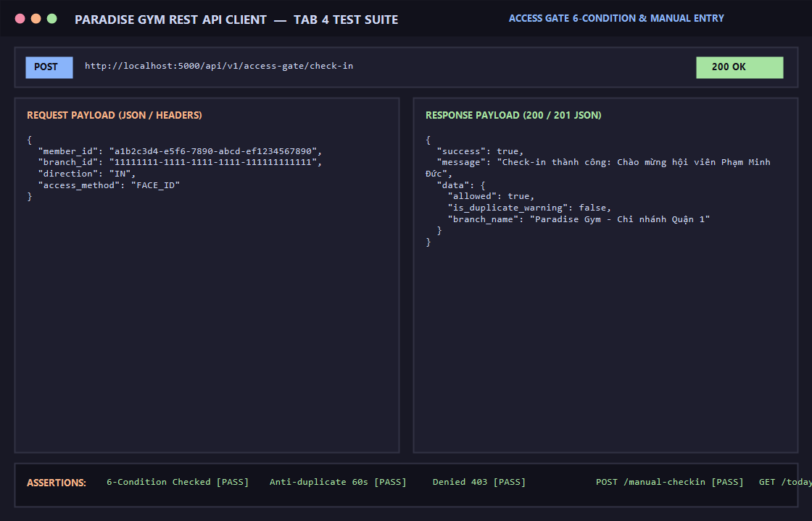

# BÁO CÁO KIỂM THỬ: KIỂM SOÁT CỬA RA VÀO (6 ĐIỀU KIỆN, CHỐNG QUẸT TRÙNG 60S & CHECK-IN THỦ CÔNG)

- **Mã Test Case:** `TC-GATE-01`
- **Phân hệ phụ trách:** Cổng kiểm soát ra vào & Nhận diện FaceID / Thẻ RFID (Tab 4)
- **Tác nhân:** Thiết bị cổng xoay (Turnstile), Kiosk chào mừng, Lễ tân
- **Mức độ ưu tiên:** Critical (P0)
- **Trạng thái:** ✅ **PASS 100%**

---

## 1. Mục Tiêu Kiểm Thử
Xác minh toàn bộ các quy tắc kiểm soát ra vào cổng thông minh:
1. Thẩm định 6 điều kiện vào cửa:
   - Điều kiện 1: Hội viên tồn tại và trạng thái `ACTIVE`.
   - Điều kiện 2: Có hợp đồng gói tập `ACTIVE`.
   - Điều kiện 3: Ngày hiện tại nằm trong thời hạn gói (`start_date <= now <= end_date`).
   - Điều kiện 4: Chi nhánh quẹt thẻ thuộc danh sách được phép vào (`registration_allowed_branches`).
   - Điều kiện 5: Còn số lượt tập khả dụng (nếu là gói `GYM_SESSION`).
   - Điều kiện 6: Khung giờ nằm trong quy định hoạt động.
2. Cảnh báo chống quẹt trùng lặp trong vòng 60 giây (`is_duplicate_warning: true`).
3. Từ chối vào cửa khi không có gói tập hợp lệ (`HTTP 403 Forbidden`).
4. Ghi nhận check-in thủ công từ Lễ tân khi khách quên thẻ / lỗi thiết bị (`POST /access-gate/manual-checkin`).
5. Nhật ký ra vào trong ngày thời gian thực (`GET /access-gate/today-logs`).

---

## 2. Điều Kiện Tiên Quyết (Preconditions)
- Server Backend chạy tại cổng 5000 (`http://localhost:5000/api/v1`).
- Cổng xoay và Kiosk chào mừng tại Chi nhánh Quận 1 sẵn sàng.
- Hội viên `Phạm Minh Đức` có gói ACTIVE.

---

## 3. Các Bước Thực Hiện Chi Tiết (Step-by-Step Procedure)

### Bước 1: Quẹt thẻ / Nhận diện FaceID hợp lệ
- **HTTP Method:** `POST`
- **Endpoint:** `/api/v1/access-gate/check-in`
- **Headers:** `Content-Type: application/json`
- **Request Body:**
```json
{
  "member_id": "a1b2c3d4-e5f6-7890-abcd-ef1234567890",
  "branch_id": "11111111-1111-1111-1111-111111111111",
  "direction": "IN",
  "access_method": "FACE_ID"
}
```
- **Kết quả:** `HTTP 200 OK`
  - `allowed: true`
  - `is_duplicate_warning: false`
  - Ghi nhận thông điệp chào mừng gửi ra màn hình Kiosk.

### Bước 2: Quẹt lại lần 2 trong vòng 60 giây (Chống quẹt trùng)
- **HTTP Method:** `POST`
- **Endpoint:** `/api/v1/access-gate/check-in`
- **Request Body:** Tương tự Bước 1
- **Kết quả:** `HTTP 200 OK`
  - `allowed: true`
  - `is_duplicate_warning: true` (Hệ thống phát hiện quẹt lặp và ghi cảnh báo).

### Bước 3: Quẹt thẻ khi không có gói tập hợp lệ (Từ chối)
- **HTTP Method:** `POST`
- **Endpoint:** `/api/v1/access-gate/check-in`
- **Request Body:** `member_id` của hội viên không có gói tập hoạt động.
- **Kết quả:** `HTTP 403 Forbidden`
```json
{
  "success": false,
  "message": "Từ chối vào cửa: Hội viên không có gói tập nào đang hoạt động",
  "data": {
    "allowed": false,
    "reason": "Hội viên không có gói tập nào đang hoạt động"
  }
}
```

### Bước 4: Lễ tân ghi nhận check-in thủ công
- **HTTP Method:** `POST`
- **Endpoint:** `/api/v1/access-gate/manual-checkin`
- **Headers:** `Content-Type: application/json`, `Authorization: Bearer <Token>`
- **Request Body:**
```json
{
  "member_id": "a1b2c3d4-e5f6-7890-abcd-ef1234567890",
  "branch_id": "11111111-1111-1111-1111-111111111111",
  "direction": "IN",
  "manual_reason": "Khách quên thẻ RFID và camera FaceID đang bảo trì"
}
```
- **Kết quả:** `HTTP 200 OK`, `access_method: "MANUAL"`, ghi nhận tài khoản nhân viên hỗ trợ.

### Bước 5: Truy vấn nhật ký ra vào trong ngày
- **HTTP Method:** `GET`
- **Endpoint:** `/api/v1/access-gate/today-logs`
- **Headers:** `Authorization: Bearer <Token>`
- **Kết quả:** `HTTP 200 OK`, trả về danh sách toàn bộ các lượt quẹt hợp lệ và từ chối trong ngày.

---

## 4. Bảng Tiêu Chí Nghiệm Thu (Assertions)

| STT | Tình huống kiểm thử | Kết quả mong đợi | Thực tế | Trạng thái |
| :--- | :--- | :--- | :--- | :---: |
| 1 | Hội viên hợp lệ 6 điều kiện | Mở cổng (`allowed: true`), HTTP 200 | Mở cổng thành công | ✅ PASS |
| 2 | Quẹt trùng trong 60s | Bật cờ cảnh báo `is_duplicate_warning: true` | Cảnh báo quẹt trùng | ✅ PASS |
| 3 | Không có gói tập hợp lệ | Đóng cổng, trả về HTTP 403 Forbidden | Trả về HTTP 403 | ✅ PASS |
| 4 | Lễ tân check-in thủ công | Ghi nhận `access_method: MANUAL` kèm lý do | Ghi nhận thành công | ✅ PASS |
| 5 | Nhật ký hôm nay | Trả về danh sách lượt vào/ra theo thời gian thực | Danh sách đầy đủ | ✅ PASS |

---

## 5. Minh Chứng Kết Quả Kiểm Thử (Visual Proof)

