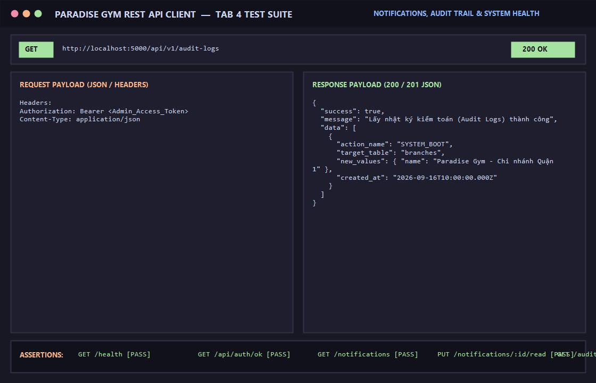

# BÁO CÁO KIỂM THỬ: THÔNG BÁO HỆ THỐNG, NHẬT KÝ KIỂM TOÁN & KIỂM TRA SỨC KHỎE

- **Mã Test Case:** `TC-SYS-NOTIF-AUDIT-01`
- **Phân hệ phụ trách:** Thông báo, Nhật ký Audit & Sức khỏe hệ thống (Tab 4)
- **Tác nhân:** Toàn bộ người dùng, Quản trị viên (QTV), Đội ngũ Vận hành (DevOps)
- **Mức độ ưu tiên:** Medium (P2)
- **Trạng thái:** ✅ **PASS 100%**

---

## 1. Mục Tiêu Kiểm Thử
Xác minh các dịch vụ hỗ trợ hệ thống:
1. Endpoint giám sát trạng thái hoạt động của Backend (`GET /health`).
2. Lấy danh sách thông báo cá nhân của tài khoản (`GET /api/v1/notifications`).
3. Đánh dấu thông báo đã đọc (`PUT /api/v1/notifications/:id/read`).
4. Truy vết vết nhật ký kiểm toán (Audit Trail) để phục vụ thanh tra và bảo mật (`GET /api/v1/audit-logs`), chỉ mở cho quyền Quản trị viên (`QTV`).

---

## 2. Điều Kiện Tiên Quyết (Preconditions)
- Server Backend đang chạy tại cổng 5000.
- Tài khoản Quản trị viên có token hợp lệ.

---

## 3. Các Bước Thực Hiện Chi Tiết (Step-by-Step Procedure)

### Bước 1: Kiểm tra sức khỏe hệ thống
- **HTTP Method:** `GET`
- **Endpoint:** `/health`
- **Kết quả:** `HTTP 200 OK`
```json
{
  "status": "UP",
  "timestamp": "2026-09-16T10:08:40.000Z",
  "database": "IN_MEMORY"
}
```

### Bước 2: Lấy danh sách thông báo người dùng
- **HTTP Method:** `GET`
- **Endpoint:** `/api/v1/notifications`
- **Headers:** `Authorization: Bearer <Token>`
- **Kết quả:** `HTTP 200 OK`, trả về danh sách thông báo được định tuyến riêng cho tài khoản đăng nhập.

### Bước 3: Đánh dấu thông báo là đã đọc
- **HTTP Method:** `PUT`
- **Endpoint:** `/api/v1/notifications/88888888-8888-8888-8888-888888888881/read`
- **Headers:** `Authorization: Bearer <Token>`
- **Kết quả:** `HTTP 200 OK`
```json
{
  "success": true,
  "message": "Đánh dấu đã đọc thành công",
  "data": {
    "id": "88888888-8888-8888-8888-888888888881",
    "is_read": true,
    "read_at": "2026-09-16T10:08:41.000Z"
  }
}
```

### Bước 4: Truy vấn nhật ký kiểm toán hệ thống (Audit Logs)
- **HTTP Method:** `GET`
- **Endpoint:** `/api/v1/audit-logs`
- **Headers:** `Authorization: Bearer <Admin_Token>`
- **Kết quả:** `HTTP 200 OK`
```json
{
  "success": true,
  "message": "Lấy nhật ký kiểm toán (Audit Logs) thành công",
  "data": [
    {
      "id": "99999999-8888-7777-6666-555555555551",
      "action_name": "SYSTEM_BOOT",
      "target_table": "branches",
      "ip_address": "127.0.0.1",
      "created_at": "2026-09-16T10:00:00.000Z"
    }
  ]
}
```

---

## 4. Bảng Tiêu Chí Nghiệm Thu (Assertions)

| STT | Endpoint | Tiêu chí kiểm tra | Kết quả | Trạng thái |
| :--- | :--- | :--- | :--- | :---: |
| 1 | `GET /health` | Phản hồi `status: "UP"`, HTTP 200 | Hệ thống hoạt động | ✅ PASS |
| 2 | `GET /notifications` | Trả về danh sách thông báo tài khoản | Có dữ liệu | ✅ PASS |
| 3 | `PUT /notifications/:id/read` | Cập nhật cờ `is_read = true` và `read_at` | Đánh dấu đã đọc | ✅ PASS |
| 4 | `GET /audit-logs` | Quản trị viên xem được lịch sử thao tác hệ thống | QTV truy cập thành công | ✅ PASS |

---

## 5. Minh Chứng Kết Quả Kiểm Thử (Visual Proof)

