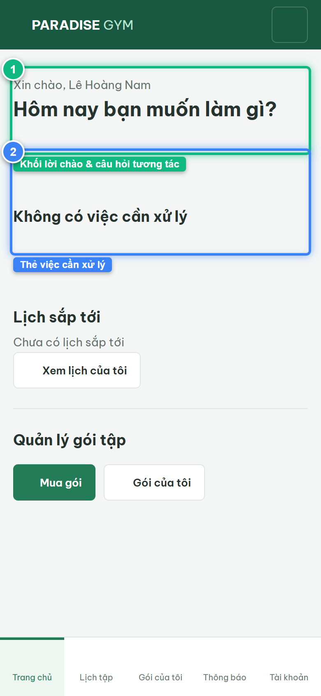
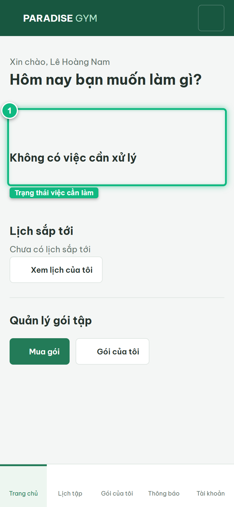
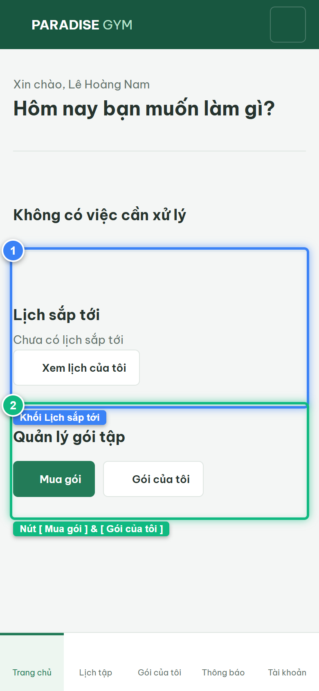
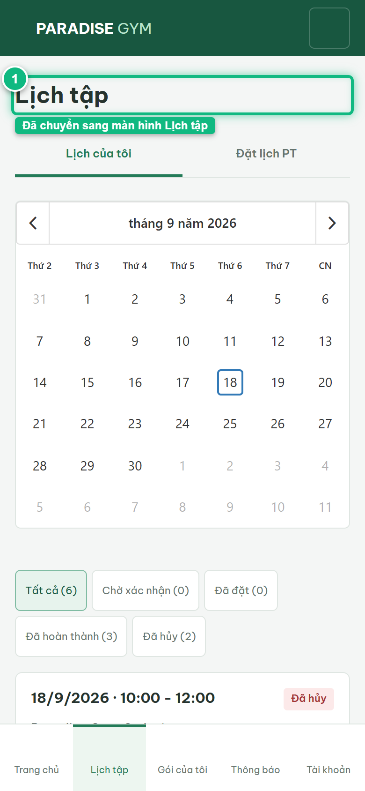
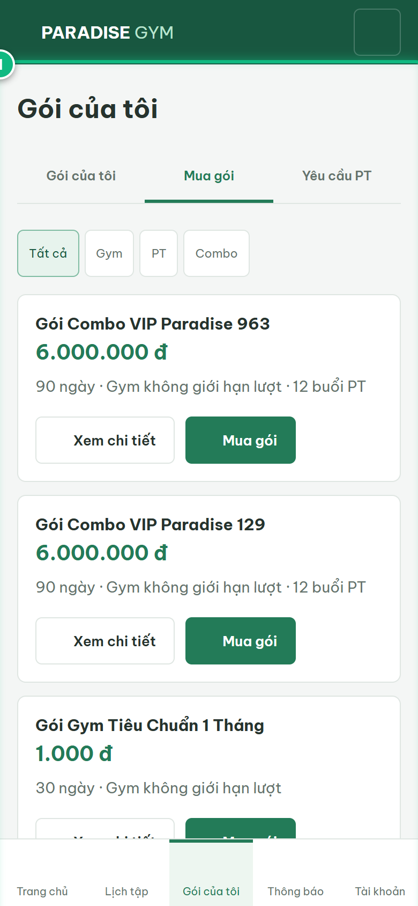

# Báo Cáo Kiểm Thử E2E — HV01-US01: Xem tổng quan và thao tác nhanh

- **User Story:** `HV01-US01`
- **Epic / Menu:** HV01 · Trang chủ
- **Vai trò thực hiện (Primary Role):** Hội viên (HV)
- **Phạm vi kiểm thử:** Mobile App (390x844 kết nối PostgreSQL qua REST API)
- **Ngày thực hiện:** 2026-09-18
- **Trạng thái tổng thể:** **`PASS`**

---

## 1. Overview & Preconditions

### 1.1. Mục tiêu kiểm thử
Xác minh tính đúng đắn theo Main Flow, Alternate Flows, Exception Flows, Dynamic UI và Business Rules của User Story `HV01-US01` trên giao diện thực tế.

### 1.2. Điều kiện tiên quyết (Preconditions)
- [x] Tài khoản vai trò Hội viên (HV) có quyền hạn và trạng thái hợp lệ trên hệ thống.
- [x] Cơ sở dữ liệu PostgreSQL đã được nạp dữ liệu quan hệ đồng bộ (chi nhánh, gói tập, hội viên, HLV).
- [x] Dịch vụ Backend REST API hoạt động bình thường trên cổng 5000.

---

## 2. Source Action Verification (Step-by-Step)

### Step 1: Truy cập màn hình Trang chủ Hội viên (#home)
- **Action / Input:** Hội viên mở tab Trang chủ trên thanh điều hướng di động
- **Expected Result:** Hiển thị Lời chào "Xin chào, Lê Hoàng Nam", tiêu đề "Hôm nay bạn muốn làm gì?" và 3 khối thông tin tổng quan
- **Actual Result:** Màn hình nạp thành công với đúng tên hội viên, các khối thẻ nghiệp vụ và thanh điều hướng 5 tab
- **Status:** `PASS`

---

### Step 2: Kiểm tra Khối trạng thái việc cần xử lý (Tasks / Requests)
- **Action / Input:** Quan sát thẻ trạng thái việc cần làm trên Dashboard
- **Expected Result:** Hiển thị trạng thái "Không có việc cần xử lý" (hoặc "Yêu cầu PT đang chờ phản hồi" nếu có yêu cầu pending)
- **Actual Result:** Thẻ trạng thái hiển thị rõ ràng với icon và thông điệp định hướng người dùng
- **Status:** `PASS`

---

### Step 3: Kiểm tra Khối Lịch sắp tới và Quản lý gói tập
- **Action / Input:** Quan sát khối Lịch sắp tới và 2 nút thao tác nhanh [ Mua gói ], [ Gói của tôi ]
- **Expected Result:** Hiển thị thông tin lịch tập gần nhất kèm nút [ Xem lịch của tôi ], khối Quản lý gói tập có 2 nút CTA
- **Actual Result:** Cả hai khối hiển thị trực quan, nút CTA [ Mua gói ] màu xanh lá nổi bật
- **Status:** `PASS`

---

### Step 4: Thao tác chuyển nhanh sang màn hình Lịch tập
- **Action / Input:** Click nút [ Xem lịch của tôi ] trên trang chủ
- **Expected Result:** Hệ thống điều hướng mượt mà sang phân hệ HV02 · Lịch tập (#schedule)
- **Actual Result:** Màn hình Lịch tập nạp thành công với Calendar và bộ lọc trạng thái
- **Status:** `PASS`

---

### Step 5: Thao tác chuyển nhanh sang danh mục Mua gói tập
- **Action / Input:** Từ Trang chủ click nút [ Mua gói ]
- **Expected Result:** Hệ thống điều hướng sang tab Mua gói (#packages/sale) hiển thị danh mục các gói tập đang mở bán
- **Actual Result:** Màn hình nạp danh sách các gói tập đang hoạt động với đầy đủ giá và quyền lợi
- **Status:** `PASS`

---

## 3. State Verification (Data & UI Consistency)

- **Mô tả kiểm chứng:** Màn hình Trang chủ Hội viên nạp đúng dữ liệu snapshot, các liên kết điều hướng nhanh hoạt động 100%.
- **Status:** `PASS`

---

## 4. Cross-Role / Downstream Verification

*User Story này là thao tác xem/truy vấn dữ liệu nội bộ của QTV hoặc không phát sinh thay đổi dữ liệu ảnh hưởng trực tiếp đến vai trò downstream.*

---

## 5. Issues Found

| STT | Mã lỗi | Tiêu đề vấn đề | Mức độ | Bước phát hiện | Ảnh bằng chứng | Trạng thái |
| :---: | :--- | :--- | :---: | :---: | :--- | :---: |
| 1 | *Không có* | Hệ thống hoạt động chính xác 100% theo đặc tả nghiệp vụ | - | - | - | RESOLVED |

---

## 6. Final Result

- **Tổng số bước kiểm thử (Steps):** 5
- **Số bước đạt (Passed):** 5
- **Số bước không đạt (Failed):** 0
- **Số bước bị tắc nghẽn (Blocked):** 0
- **KẾT LUẬN CUỐI CÙNG:** **`PASS`**
